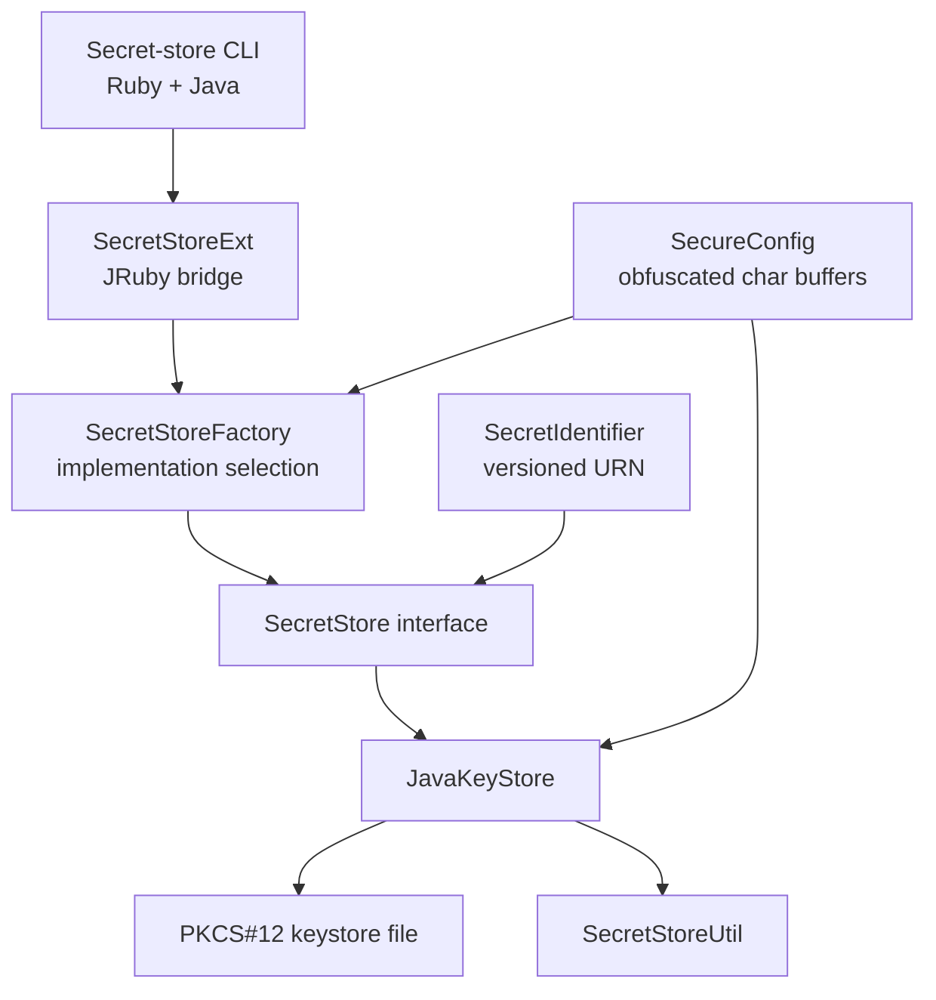
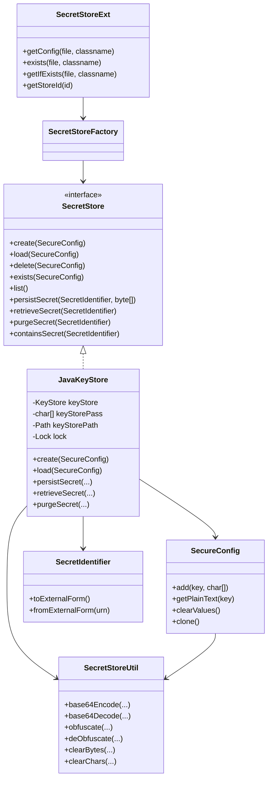
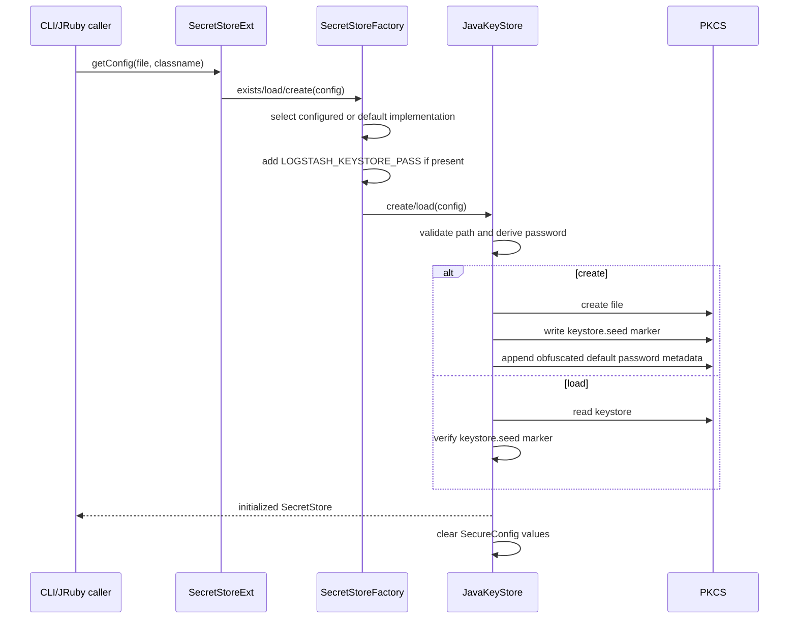

# Keystore Operations and Secure Data Handling

## Purpose

The `keystore_operations_and_secure_data_handling` module provides Logstash's file-backed secret-store implementation and the memory-handling helpers that support it. It lets the rest of Logstash create, load, inspect, update, retrieve, and delete secrets without exposing keystore credentials through ordinary Java `String` values where avoidable.

The module is the lowest-level backend beneath the broader [secret store module](secret_store.md). It is intentionally optimized for configuration secrets and administrative operations, not high-volume secret storage.

## Scope and architectural position

The factory supplies the default implementation, `org.logstash.secret.store.backend.JavaKeyStore`, unless a configured implementation class overrides it. `SecretStoreExt` is the small static bridge used by JRuby callers to build configuration and obtain a store.

## Sub-modules

| Sub-module | Responsibility | Documentation |
| --- | --- | --- |
| Keystore backend | Implements the SecretStore contract over a PKCS#12 file, including lifecycle, CRUD operations, password handling, validation, locking, and file persistence. | [keystore_backend.md](keystore_backend.md) |
| Secure-data utilities | Converts between bytes/chars and Base64, obfuscates transient values, and clears sensitive arrays after use. | [secure_data_utilities.md](secure_data_utilities.md) |

The detailed behavior of each sub-module is intentionally kept in its linked document.

## Core component relationships

## Data and lifecycle flows

### Store creation and loading

### Secret persistence and retrieval

```mermaid
flowchart LR
  IN["secret byte[]"] --> ENC["Base64 encode\nclear input bytes"]
  ENC --> PBE["PBEKeySpec / SecretKey"]
  PBE --> ENTRY["PKCS#12 alias\nSecretIdentifier URN"]
  ENTRY --> SAVE["saveKeyStore()\nprocess/file locking"]
  SAVE --> DISK["keystore.file"]

  DISK --> LOAD["loadKeyStore()"]
  LOAD --> ENTRY2["SecretKeyEntry"]
  ENTRY2 --> SPEC["PBEKeySpec password"]
  SPEC --> DEC["Base64 decode\nclear intermediate arrays"]
  DEC --> OUT["retrieved byte[]"]
```

## Security and correctness characteristics

- Secret identifiers are names, not secret values. They are normalized to lowercase and serialized as versioned URNs such as `urn:logstash:secret:v1:db.pass`.
- `SecureConfig` stores obfuscated character buffers and rejects reuse after `clearValues()`; lifecycle methods clear configuration values in their `finally` blocks.
- The backend avoids empty explicitly supplied keystore passwords. Non-ASCII explicit passwords are Base64-transformed to an ASCII-compatible representation.
- When no password is supplied for a new store, `JavaKeyStore` generates a random password and appends an obfuscated copy plus a one-byte length marker to the file. This is convenience obfuscation, not a substitute for filesystem access control.
- POSIX permissions are reapplied after creation using the backend's configured default (`rw-r--r--` in the provided source); deployments should therefore protect the keystore path and review platform-specific permissions.
- In-process operations use a reentrant lock. Writes additionally attempt a file lock on non-Windows systems; the keystore is reloaded before operations so external changes are observed.
- Persisted secret input arrays are cleared after saving. Callers should treat returned arrays from retrieval as sensitive and clear them when finished.
- The implementation is not intended for large datasets or high-frequency access.

## Error boundaries

The backend translates failures into typed `SecretStoreException` categories, allowing callers to distinguish creation, loading/access, persistence, retrieval, purge, list, and implementation errors. Typical operational causes include:

- missing or unwritable parent paths;
- an existing file that is not a Logstash keystore;
- wrong password or file permissions;
- malformed appended default-password metadata;
- another process holding the keystore file during a write;
- invalid or missing `keystore.file`.

## Integration with neighboring modules

- [secret_store.md](secret_store.md) owns the higher-level store API, factory selection, secure configuration, and CLI integration.
- [secret_store_cli.md](secret_store_cli.md) documents command-line orchestration and user-facing operations.
- [secret_store_passwords.md](secret_store_passwords.md) documents password parameter conversion and validation.
- [runtime_foundation_and_configuration.md](runtime_foundation_and_configuration.md) documents the broader runtime configuration context in which the keystore path and environment variables are supplied.

## Maintenance guidance

Changes to the backend should preserve the `SecretStore` contract, marker validation, password compatibility, array-clearing behavior, and locking semantics. Any change to the file trailer format must remain compatible with existing default-password keystores or include an explicit migration strategy. Changes to identifier serialization must consider all callers that persist aliases and reconstruct them via `SecretIdentifier.fromExternalForm`.
