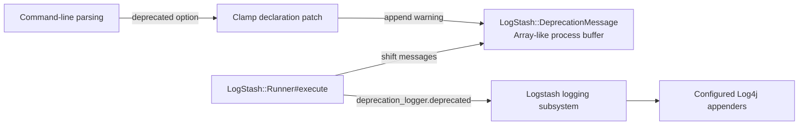
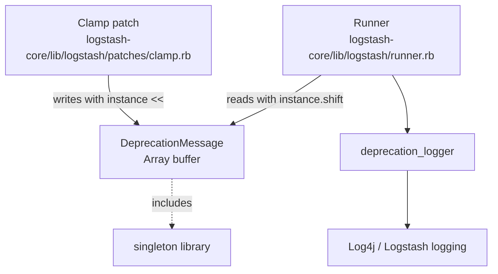
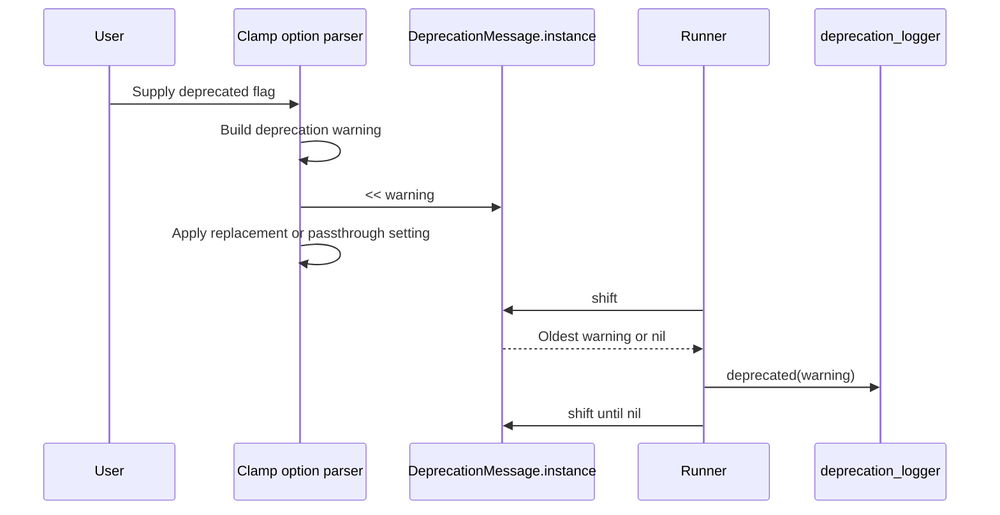
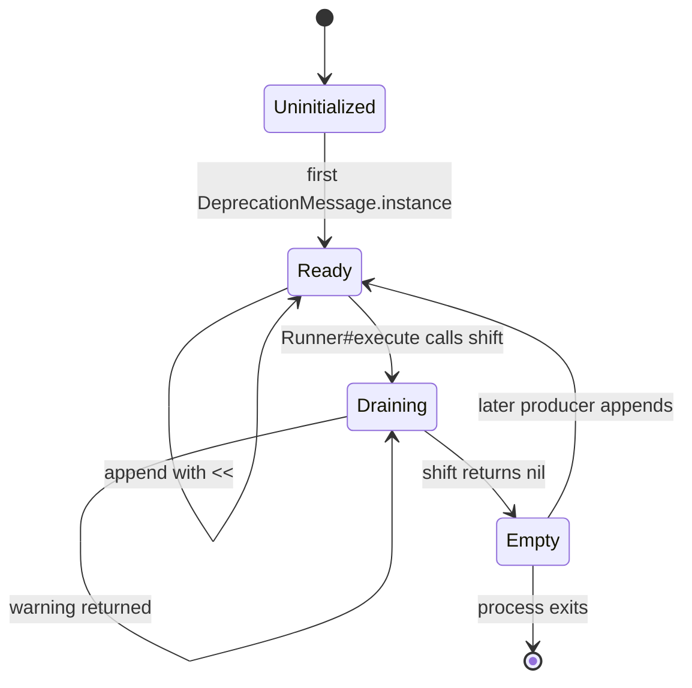
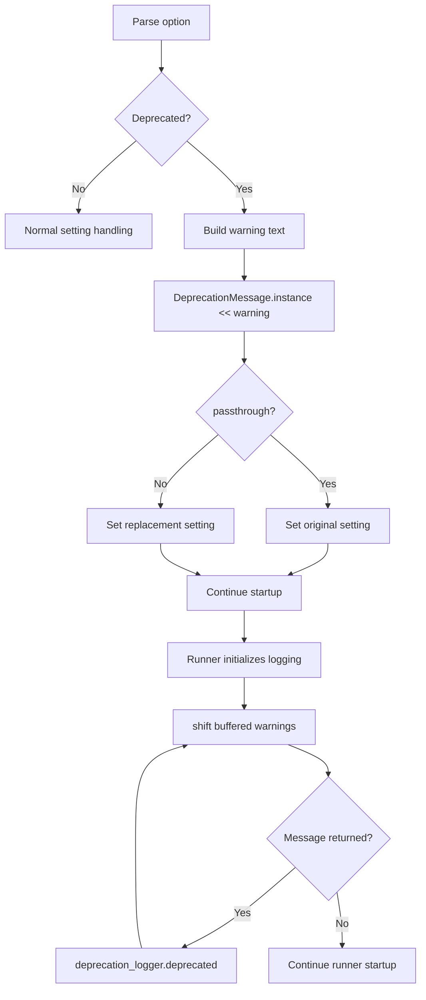

# Logging Deprecation Buffer

The `logging_deprecation_buffer` module provides a process-local holding area for deprecation warnings that are discovered before Log4j/Logstash logging is ready. Its only component, `LogStash::DeprecationMessage`, exposes an array-like queue through `DeprecationMessage.instance`; producers append messages during command-line option processing, and the application runner later removes and emits them through the deprecation logger.

This module is deliberately small. Logging configuration and logger behavior are documented in [logging.md](logging.md), while startup sequencing and command-line settings are covered by [application_bootstrap_and_settings.md](application_bootstrap_and_settings.md).

## Purpose and scope

Command-line parsing can detect deprecated flags very early in process startup. At that point, emitting a normal Log4j event is unsafe because the logging context may not yet have been initialized. The buffer separates those two phases:

1. A deprecated option is parsed and translated to its replacement setting.
2. A human-readable warning is appended to the shared buffer.
3. `LogStash::Runner#execute` initializes enough of the application to use the deprecation logger.
4. The runner drains the buffer in insertion order and emits each warning.

The class does not format log events, configure appenders, persist messages, deduplicate warnings, or provide severity controls. Those responsibilities belong to the logging and bootstrap modules referenced above.

## Architecture

`DeprecationMessage` is in the `LogStash` namespace and subclasses Ruby `Array`. The implementation requires Ruby's `singleton` library and includes `Singleton`, but its explicit class method returns a class-variable-backed `Array` (`@@instance ||= Array.new`). Therefore, callers interact with the returned array as the effective queue; they do not instantiate or call instance methods on `DeprecationMessage` directly.

## Components

### `LogStash::DeprecationMessage`

Source: `logstash-core/lib/logstash/deprecation_message.rb`

| Element | Behavior |
| --- | --- |
| Inheritance | Subclasses `Array`, so callers can use `<<`, `shift`, `empty?`, and other array operations. |
| Access | `self.instance` lazily creates and returns one process-local `Array`. |
| Lifetime | The buffer lives for the lifetime of the Ruby process or until its contents are removed. |
| Ordering | `<<` appends and `shift` removes from the front, producing FIFO behavior. |
| Concurrency | No synchronization is implemented by this class; callers should treat it as startup coordination state rather than a general multi-threaded queue. |
| Output | None. The class only stores messages; the runner performs logging. |

The `include Singleton` declaration communicates singleton intent, but the effective accessor is the custom `self.instance` method. The custom method returns an `Array`, not an instance of `DeprecationMessage`. This is an important implementation detail for maintainers changing the class or adding queue behavior.

## Dependency and ownership relationships

The direct repository dependencies are intentionally narrow:

- `logstash-core/lib/logstash/patches/clamp.rb` constructs the warning text for deprecated options and appends it to the buffer.
- `logstash-core/lib/logstash/runner.rb` drains the buffer during startup.
- The Ruby `singleton` standard library is required by the buffer file.
- The final logger is owned by the broader [logging.md](logging.md) module; the buffer does not depend on Log4j classes itself.

## Data flow

The warning is buffered independently of the replacement setting. Parsing therefore has two effects: it records feedback for the user and applies the configured migration behavior. The buffer only represents the first effect.

## Component interaction and lifecycle

The buffer is created lazily. A producer does not need to initialize logging or explicitly initialize the queue. During normal startup, the runner drains it once, before continuing with later startup decisions. If no deprecated options were encountered, the first `shift` returns `nil` and no deprecation event is emitted from this buffer.

## Process flow: deprecated command-line options

In the current integration, the deprecated options include legacy verbosity flags such as `--verbose`, `--debug`, and `--quiet`; the Clamp patch maps them to the modern `log.level` setting while retaining a warning for later emission. The exact option declarations and startup sequencing are owned by [application_bootstrap_and_settings.md](application_bootstrap_and_settings.md).

## Operational characteristics

- **Scope:** one in-memory buffer per Ruby process.
- **Capacity:** unbounded by this class; each appended message remains until shifted or the process exits.
- **Ordering:** FIFO, assuming producers use `<<` and the consumer uses `shift`.
- **Durability:** none; messages are lost if the process terminates before the runner drains them.
- **Visibility:** messages become normal deprecation log events only after the runner forwards them.
- **Failure boundary:** logging failures and logger configuration are outside this class. The buffer itself has no rescue, retry, or fallback output path.

## Maintenance considerations

When changing this module, preserve the startup contract between the Clamp producer and `Runner#execute`. In particular:

1. Keep `instance` callable before logging initialization.
2. Preserve array-compatible `<<` and `shift` behavior unless all producers and consumers are changed together.
3. Avoid adding logger dependencies to the buffer; doing so would reintroduce the initialization-order problem it solves.
4. Consider the explicit `Array` return and the unused subclassing/singleton mechanics before adding instance state or synchronization.
5. If warnings may be produced after the startup drain, define a separate delivery policy; this module currently provides no background consumer.

## Source reference

- [`logstash-core/lib/logstash/deprecation_message.rb`](https://github.com/elastic/logstash/blob/main/logstash-core/lib/logstash/deprecation_message.rb) — buffer implementation.
- [`logstash-core/lib/logstash/patches/clamp.rb`](https://github.com/elastic/logstash/blob/main/logstash-core/lib/logstash/patches/clamp.rb) — deprecated-option producer.
- [`logstash-core/lib/logstash/runner.rb`](https://github.com/elastic/logstash/blob/main/logstash-core/lib/logstash/runner.rb) — startup consumer.
