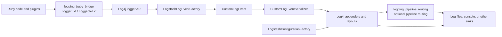
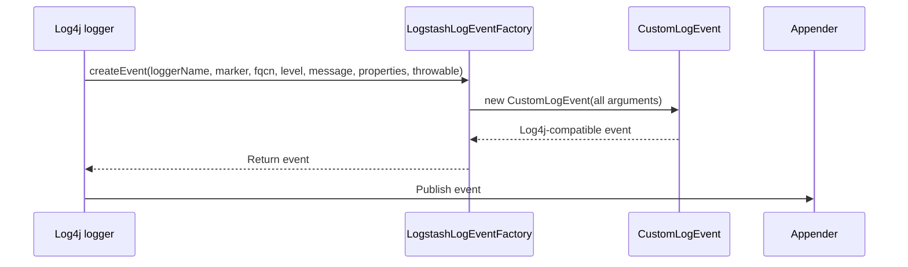
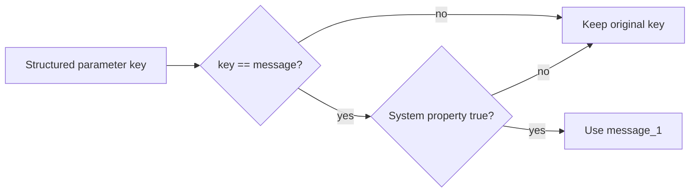
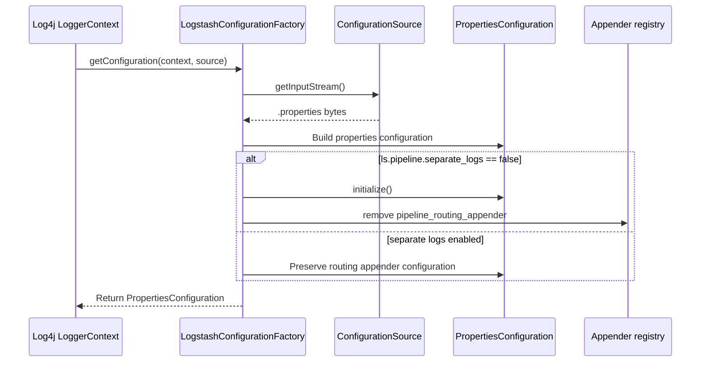
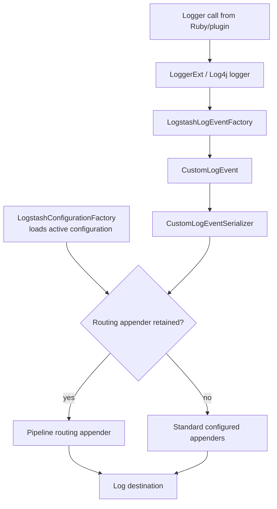

# Logging Event and Configuration

The `logging_event_and_configuration` module customizes Log4j for Logstash's runtime logging path. It supplies the Log4j event factory that creates Logstash event objects, serializes those events into the JSON log schema, and conditionally removes pipeline-specific routing from the loaded Log4j configuration. Together, these components define how a logging call becomes a structured record and which appenders receive it.

This module is a sibling of the Ruby/Log4j adapter documented in [logging_jruby_bridge.md](logging_jruby_bridge.md). The bridge creates logger calls and manages runtime logger levels; this module consumes those calls at the Log4j event/configuration boundary. Pipeline-aware destination selection is handled by the related `logging_pipeline_routing` module.

## Position in the logging architecture



At startup, Log4j asks `LogstashConfigurationFactory` to load a `.properties` configuration. At runtime, each logging call is converted by `LogstashLogEventFactory` into a `CustomLogEvent`; JSON appenders invoke `CustomLogEventSerializer` to produce the emitted representation.

## Components

| Component | Responsibility | Boundary |
| --- | --- | --- |
| `LogstashLogEventFactory` | Implements Log4j's `LogEventFactory` and constructs `CustomLogEvent` instances | Log4j event creation |
| `CustomLogEventSerializer` | Converts a `CustomLogEvent` into the Logstash JSON log shape, including structured parameters | Event-to-JSON serialization |
| `LogstashConfigurationFactory` | Loads Log4j properties configuration and optionally removes the pipeline routing appender | Configuration loading and appender topology |
| `CustomLogEvent` | Event type consumed by the factory and serializer; implementation is outside the supplied component snapshot | Event state and Log4j event contract |
| `StructuredMessage` | Message type recognized by the serializer; implementation is outside the supplied component snapshot | Structured message payload |

The event and message types are not reimplemented here. Changes to their fields or inheritance must preserve the methods used by this module: `getLevel`, `getLoggerName`, `getTimeMillis`, `getThreadName`, `getMessage`, `getFormattedMessage`, and, for structured messages, `getMessage` plus `getParams`.

## Event creation

`LogstashLogEventFactory` is a thin adapter. Log4j supplies the logger name, marker, fully qualified class name, level, message, properties, and throwable. The factory passes all values unchanged to the `CustomLogEvent` constructor.



Because the factory does not normalize, filter, or enrich its arguments, event semantics are determined by the caller and `CustomLogEvent`. The factory's principal purpose is type substitution: Log4j's normal event construction is replaced with the Logstash-specific event implementation.

## JSON event serialization

`CustomLogEventSerializer` is a Jackson `JsonSerializer<CustomLogEvent>` used by the Log4j JSON appender. Every event is emitted as an object with these top-level fields:

```json
{
  "level": "INFO",
  "loggerName": "org.logstash.example",
  "timeMillis": 1700000000000,
  "thread": "pipeline-worker",
  "logEvent": {
    "message": "pipeline started",
    "pipeline": "main"
  }
}
```

The example illustrates the shape; actual values and additional structured fields come from the event message.

### Plain messages

When the event message is not a `StructuredMessage`, the serializer writes only `message` inside `logEvent`, using the message's Log4j-formatted text (`getFormattedMessage()`). The serializer does not independently serialize throwable data or Log4j properties in the supplied implementation.

### Structured messages

For a `StructuredMessage`, the serializer writes the message's base text and then iterates over its parameter map:

1. Write the base text as `logEvent.message`.
2. Return immediately when parameters are absent or empty.
3. Convert each parameter key to a string.
4. Write scalar-safe values directly.
5. Serialize complex values with `LOG4J_JSON_MAPPER` in an isolated temporary generator.
6. If Jackson cannot map a complex value, write `value.toString()` instead.

```mermaid
flowchart TD
    START[serialize CustomLogEvent]
    OUTER[Write level, loggerName,
    timeMillis, thread]
    INNER[Start logEvent object]
    TYPE{Message is StructuredMessage?}
    PLAIN[Write formatted message]
    BASE[Write structured base message]
    PARAMS{Parameters present?}
    NEXT[Take next parameter]
    SAFE{Null, String,
    primitive, or wrapper?}
    DIRECT[Write parameter directly]
    ISOLATE[Create isolated Jackson generator]
    COMPLEX[Write complex value as raw JSON]
    FAIL{Mapping exception?}
    FALLBACK[Write value.toString()]
    END[Close logEvent and outer object]

    START --> OUTER --> INNER --> TYPE
    TYPE -- no --> PLAIN --> END
    TYPE -- yes --> BASE --> PARAMS
    PARAMS -- no --> END
    PARAMS -- yes --> NEXT --> SAFE
    SAFE -- yes --> DIRECT --> PARAMS
    SAFE -- no --> ISOLATE --> COMPLEX --> PARAMS
    COMPLEX -. exception .-> FAIL
    FAIL -- yes --> FALLBACK --> PARAMS
    FAIL -- no --> PARAMS
```

### Safe-value and failure behavior

Values considered safe for direct Jackson output are `null`, `String`, Java primitives, and primitive wrapper classes. Other values are serialized separately so a failure cannot invalidate the main generator. This is particularly important for Ruby-backed or otherwise custom objects, because the secondary mapper is configured with Logstash's custom serializers through `ObjectMappers.LOG4J_JSON_MAPPER`.

If a `JsonMappingException` occurs, the serializer logs a debug diagnostic and degrades that parameter to its string representation. This preserves a valid log record at the cost of losing structured type information. The debug diagnostic itself uses the serializer's Log4j logger and includes the value type.

### Duplicate `message` parameter

The base structured message already occupies the `message` field. A parameter whose key is also `message` can therefore produce a duplicate JSON field. When the system property `ls.log.format.json.fix_duplicate_message_fields` is set to `true` (case-insensitive), that parameter is renamed to `message_1`. Otherwise, the original key is retained and duplicate-field behavior is delegated to the JSON consumer.



## Log4j configuration loading

`LogstashConfigurationFactory` is registered as a Log4j configuration-factory plugin with order `9` and supports only `.properties` sources. Its loading sequence is:

1. Open the `ConfigurationSource` input stream.
2. Load Java properties.
3. Build a `PropertiesConfiguration` with the original source, properties, and `LoggerContext`.
4. If `ls.pipeline.separate_logs` is exactly `false` (the default), initialize the configuration and remove the appender named `pipeline_routing_appender`.
5. Return the resulting configuration.



### Separate-log switch

The `ls.pipeline.separate_logs` system property controls whether the pipeline routing appender remains in the configuration:

| Property value | Result |
| --- | --- |
| Missing | Defaults to `false`; routing appender is removed |
| Exactly `false` | Routing appender is removed |
| Any other value, such as `true` | Routing appender is preserved |

The comparison is string-based and case-sensitive in the supplied implementation. Configuration loading errors are wrapped in Log4j `ConfigurationException` with the source description.

## End-to-end data flow



The configuration decision affects appender topology, not event construction or JSON field generation. Likewise, serializer fallback behavior affects one parameter at a time and does not discard the complete event.

## Integration points and related modules

- [logging_jruby_bridge.md](logging_jruby_bridge.md): Ruby logger objects, `Loggable`, level checks, runtime level changes, and configuration reload entry points.
- [logging_pipeline_routing.md](logging_pipeline_routing.md): pipeline-aware routing appender behavior, when that sibling document is available.
- [observability_and_operational_control.md](observability_and_operational_control.md): operational APIs and metrics around Logstash runtime behavior, when that sibling document is available.
- `org.logstash.ObjectMappers`: supplies `LOG4J_JSON_MAPPER`, including custom serializers needed for non-primitive Logstash/Ruby values.
- Log4j Core: provides `LogEventFactory`, `ConfigurationFactory`, `PropertiesConfiguration`, appenders, and the `LoggerContext` lifecycle.

The module does not own logger naming, Ruby method dispatch, metrics, pipeline lifecycle, or destination-specific routing. Those responsibilities should remain in their respective modules so that changes to serialization and configuration do not duplicate or subtly diverge from the broader logging architecture.

## Operational considerations

- Keep `CustomLogEvent` accessor compatibility stable; the serializer directly depends on its event and message accessors.
- Treat `ls.log.format.json.fix_duplicate_message_fields` as a compatibility switch. Enabling it changes the key of colliding structured parameters.
- Test complex parameter values, especially Ruby-backed objects, because direct serialization and mapper-based serialization follow different paths.
- Test both values of `ls.pipeline.separate_logs` during configuration startup; the routing appender is removed by default.
- Configuration and live logging changes are serialized by the bridge's configuration lock; see [logging_jruby_bridge.md](logging_jruby_bridge.md) for the caller-facing runtime controls.
