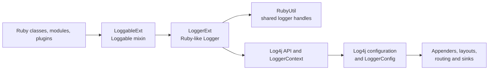
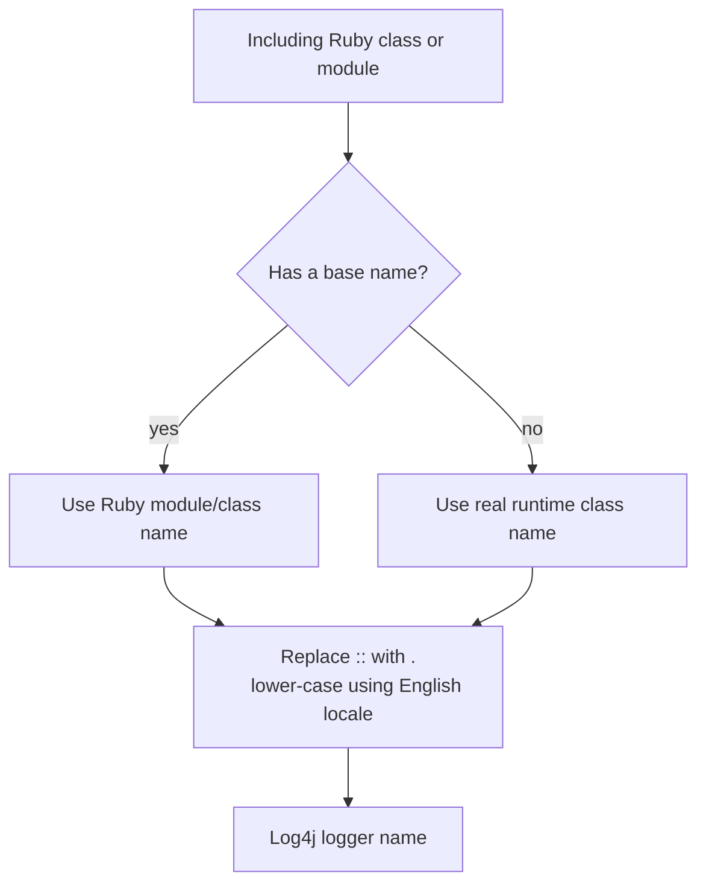
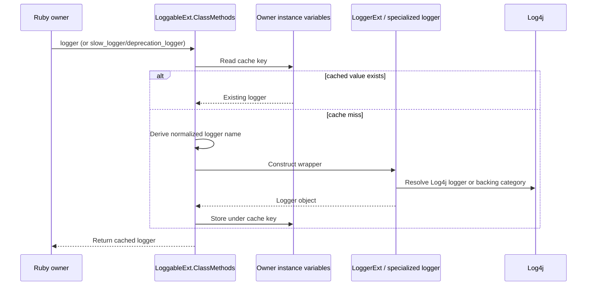
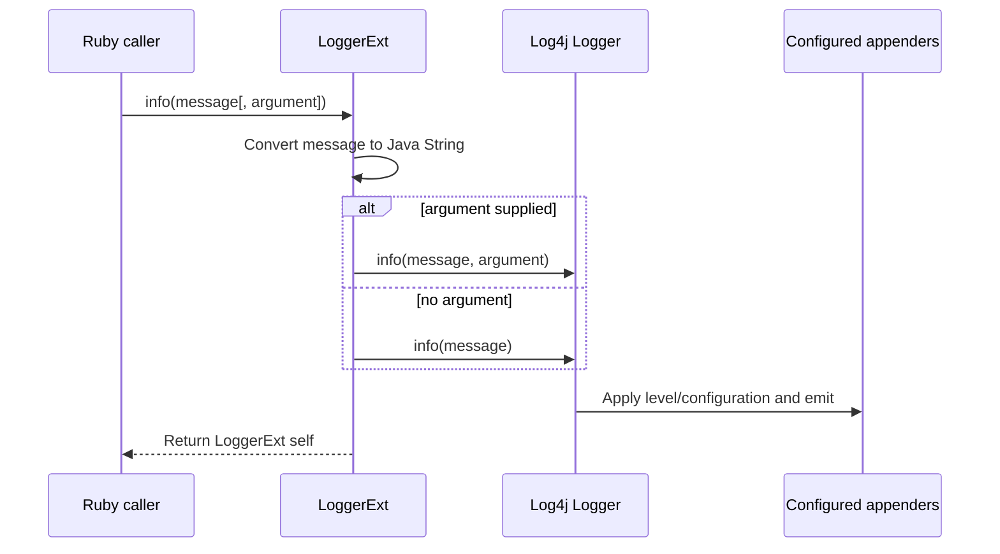
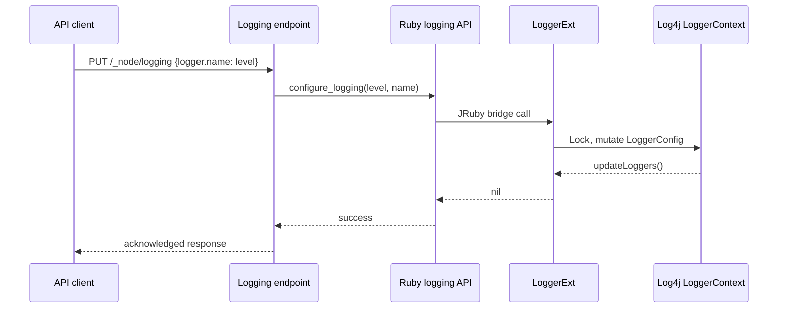

# Logging JRuby Bridge

The `logging_jruby_bridge` module is the Java-to-JRuby adapter for Logstash's Log4j-based logging system. It exposes a Ruby-like `Logger` object, adds the `Loggable` mixin used by Ruby classes and modules, and translates Ruby logging calls into Log4j operations. It also provides the runtime hooks used to change logger levels, reload a Log4j configuration, and obtain the active `LoggerContext`.

This module is an interop layer: it does not define appenders, layouts, event serialization, or pipeline-specific routing. Those concerns belong to the sibling logging modules described by the module tree; the HTTP-facing logging controls are documented in [monitoring_http_api_endpoint_modules.md](monitoring_http_api_endpoint_modules.md).

## Position in the logging architecture

Ruby application and plugin code calls the bridge through JRuby-annotated methods. The bridge creates or reuses Java Log4j loggers and returns JRuby-compatible values. Log4j then applies the active configuration and sends records to the configured appenders.



The bridge sits below the Ruby logging consumers and above Log4j. It therefore participates in startup configuration and live logging control, while the sibling event/configuration module owns how Log4j events are formatted and initialized. The logging pipeline-routing module owns pipeline-aware appender behavior.

## Components and responsibilities

| Component | Responsibility | Main boundary |
| --- | --- | --- |
| `LoggableExt` | JRuby `Loggable` module; forwards instance calls to class-level logger methods and installs `ClassMethods` when included | Ruby module inclusion and per-class logger access |
| `LoggableExt.ClassMethods` | Lazily creates and caches normal, slow, and deprecation loggers | Ruby class/module instance variables |
| `LoggerExt` | Wraps a Log4j `Logger` as a JRuby `Logger` object | Ruby method calls to Log4j API calls |
| `LoggerExt.configureLogging` | Changes the root logger or a named logger's level | Live Log4j configuration mutation |
| `LoggerExt.reconfigure` | Reloads Log4j from a URI when its file exists | Log4j `LoggerContext` lifecycle |
| `LoggerExt.getLoggingContext` | Exposes the active Log4j context to Ruby | Java object conversion through JRuby |

## `LoggableExt`: the Ruby mixin

`LoggableExt` is registered as the JRuby module named `Loggable`. Its `included` hook adds the methods in `ClassMethods` to the including class or module. This makes logging available in the Ruby style expected by Logstash code:

```ruby
include Loggable
logger.info("starting")
```

The instance methods are deliberately thin forwarding methods:

- `logger` invokes the including object's singleton-class `logger` method.
- `slow_logger(*args)` invokes the singleton-class `slow_logger` method.
- `deprecation_logger` invokes the singleton-class `deprecation_logger` method.

This keeps the public Ruby call shape on the mixin while placing construction and caching in `ClassMethods`.

### Logger-name derivation

`ClassMethods` derives a Log4j logger name from the Ruby module or class name. Ruby namespace separators (`::`) become Java-style dots, and the result is lower-cased with `Locale.ENGLISH`. Anonymous modules/classes use the runtime class name, with special handling for `RubyClass#getRealClass`.



### Lazy per-owner caching

Normal loggers are stored under the `logger` instance-variable key. Slow loggers use `slow_logger`, and deprecation loggers use `deprecation_logger`. A cached non-`nil` value is returned on subsequent access, so repeated calls for the same Ruby owner preserve logger identity and avoid repeated construction.

For a `RubyClass`, normal and deprecation logger lookup uses the real class's instance variables. Slow logger lookup uses the receiver's instance variables directly. This asymmetry is part of the implementation and should be preserved when changing caching behavior.



`slow_logger` is constructed with the shared `RubyUtil.SLOW_LOGGER` and four numeric arguments converted by `SlowLoggerExt.toLong`. `deprecation_logger` is constructed with `RubyUtil.DEPRECATION_LOGGER`. Their detailed throttling and buffering behavior is outside the supplied bridge components.

## `LoggerExt`: Ruby-compatible Log4j wrapper

`LoggerExt` subclasses `RubyObject` and is registered with JRuby as `Logger`. Its `initialize` method resolves a Log4j logger by name using `LogManager.getLogger`. The Java logger is held in a transient field, while the JRuby object remains the Ruby-visible handle.

### Level predicates

The wrapper exposes Ruby predicate methods that return JRuby booleans based on Log4j enablement checks:

| Ruby method | Log4j check |
| --- | --- |
| `debug?` | `isDebugEnabled()` |
| `info?` | `isInfoEnabled()` |
| `warn?` | `isWarnEnabled()` |
| `error?` | `isErrorEnabled()` |
| `fatal?` | `isDebugEnabled()` in the supplied implementation |
| `trace?` | `isDebugEnabled()` in the supplied implementation |

The `fatal?` and `trace?` mappings are notable: they do not call the corresponding Log4j predicates in this implementation. Callers should treat the table as the actual compatibility contract unless the bridge is changed.

### Logging methods

`debug`, `info`, `warn`, `error`, `fatal`, and `trace` each require one argument and accept one optional argument. The first argument is converted to a Java string. With a second argument, the wrapper calls the corresponding Log4j overload with the message and argument; otherwise it calls the message-only overload. Every method returns `self`, matching a fluent Ruby-style logger API.



The optional value is passed as a Log4j parameter object; the bridge does not perform Ruby interpolation itself. Formatting, serialization, and destination selection are owned by the active Log4j configuration and sibling logging components.

## Runtime logging configuration

### `configure_logging`

`LoggerExt.configure_logging(level, path = nil)` is a class method exposed to Ruby. It serializes all configuration changes through the static `CONFIG_LOCK`, resolves the requested Log4j `Level`, and updates the active configuration.

- With no path, or an empty path, it changes the root logger level.
- With a path, it looks up that logger configuration.
- If an exact logger configuration does not exist, it creates a new `LoggerConfig` for that path and level.
- Existing configurations are updated only when their level differs.
- `LoggerContext.updateLoggers()` publishes a changed configuration.
- Failures are translated into `IllegalArgumentException` with the requested level and logger path in the message.

```mermaid
flowchart TD
    CALL[Ruby configure_logging(level, path)]
    LOCK[Acquire CONFIG_LOCK]
    PARSE[Convert level to Log4j Level]
    PATH{Path absent or empty?}
    ROOT[Read root LoggerConfig]
    NAMED[Read named LoggerConfig]
    EXISTS{Exact named config exists?}
    CHANGE{Level differs?}
    ADD[Add LoggerConfig]
    UPDATE[Set level and updateLoggers]
    DONE[Release lock and return nil]
    ERROR[Raise IllegalArgumentException]

    CALL --> LOCK --> PARSE
    PARSE -. invalid level .-> ERROR
    PARSE --> PATH
    PATH -- yes --> ROOT --> CHANGE
    PATH -- no --> NAMED --> EXISTS
    EXISTS -- no --> ADD --> UPDATE
    EXISTS -- yes --> CHANGE
    CHANGE -- yes --> UPDATE
    CHANGE -- no --> DONE
    UPDATE --> DONE
```

### `reconfigure` / class-level `initialize`

The static method is registered under both `reconfigure` and `initialize`. It accepts a URI string, extracts its path, and checks that the referenced file exists. If it exists, the current `LoggerContext` receives the URI through `setConfigLocation`, and Log4j is given a `LogstashLoggerContextFactory` based on that context. If the file is absent, the method prints a fallback message and leaves the existing configuration in place.

The operation is protected by the same `CONFIG_LOCK` as level changes. It returns Ruby `nil` in either the successful reload or missing-file case; operational status is communicated through console messages rather than a structured result.

```mermaid
flowchart TD
    RELOAD[Ruby reconfigure(config URI)]
    LOCK[Acquire CONFIG_LOCK]
    URI[Parse URI and extract path]
    FILE{Configuration file exists?}
    APPLY[Set LoggerContext config location]
    FACTORY[Install Logstash logger context factory]
    FALLBACK[Print fallback message;
    retain current/default behavior]
    NIL[Release lock and return nil]

    RELOAD --> LOCK --> URI --> FILE
    FILE -- yes --> APPLY --> FACTORY --> NIL
    FILE -- no --> FALLBACK --> NIL
```

### `get_logging_context`

`get_logging_context` returns the active Log4j `LoggerContext` converted with `JavaUtil.convertJavaToUsableRubyObject`. Ruby callers can therefore inspect or use the context through JRuby without the bridge defining a second context abstraction.

## End-to-end process flows

### Ruby class logging


### Live level update from the monitoring API

The monitoring endpoint parses `logger.<name>` request keys and delegates logger-level changes to the Ruby logging API. The endpoint contract and HTTP error handling are documented in [monitoring_http_api_endpoint_modules.md](monitoring_http_api_endpoint_modules.md).



## Concurrency, lifecycle, and failure behavior

- `CONFIG_LOCK` serializes level updates and configuration reloads, preventing concurrent mutation of the shared Log4j context through these bridge methods.
- Logger construction is lazy and cached per Ruby owner, but the supplied code does not add a separate lock around cache initialization. JRuby/Log4j lifecycle assumptions therefore matter if callers access the same owner concurrently for the first time.
- The wrapped Java `Logger` field is `transient`; rehydration or serialization of the JRuby wrapper must account for the fact that the backing logger is not serialized.
- Invalid logging levels or configuration mutations are surfaced as `IllegalArgumentException`; callers such as the monitoring API translate these into client-facing errors.
- A missing reconfiguration file does not throw from `reconfigure`; it reports the condition and retains the current/default setup.

## Extension points and maintenance guidance

When changing this module, preserve the boundary between Ruby compatibility and Log4j behavior:

1. Add Ruby-visible methods with the appropriate JRuby annotations and return JRuby objects (`RubyBoolean`, `IRubyObject`, or `context.nil`) as required.
2. Keep logger naming stable; changing namespace normalization changes Log4j categories and can invalidate user configuration.
3. Keep configuration mutation synchronized through `CONFIG_LOCK`.
4. Update the monitoring API documentation if method signatures or error behavior change, especially for `configure_logging` and `reconfigure`.
5. Test both named classes and anonymous Ruby owners, cache reuse, level predicates, optional logging arguments, missing configuration files, and concurrent configuration calls.

## Related modules

- [monitoring_http_api_endpoint_modules.md](monitoring_http_api_endpoint_modules.md) — HTTP routes that expose logging inspection and runtime level/reset controls.
- [metrics_and_instrumentation.md](metrics_and_instrumentation.md) — instrumentation architecture that is surfaced through other operational APIs.
- [event_model_and_jruby_interop_jruby_event_and_timestamp_bridge.md](event_model_and_jruby_interop_jruby_event_and_timestamp_bridge.md) — comparable JRuby/Java boundary patterns for event objects.
- [plugin_api_and_registry_plugin_contracts_and_base_classes.md](plugin_api_and_registry_plugin_contracts_and_base_classes.md) — Ruby plugin lifecycle context in which `Loggable` is commonly consumed.
