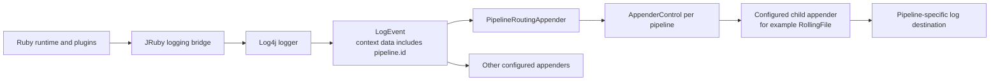
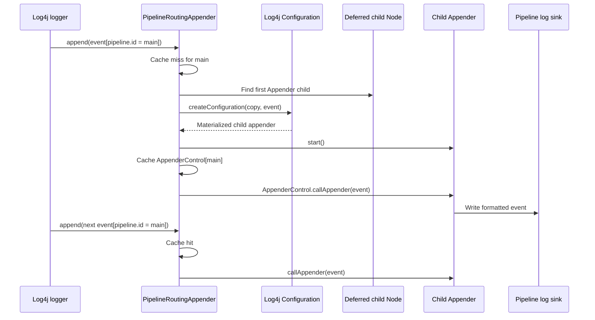
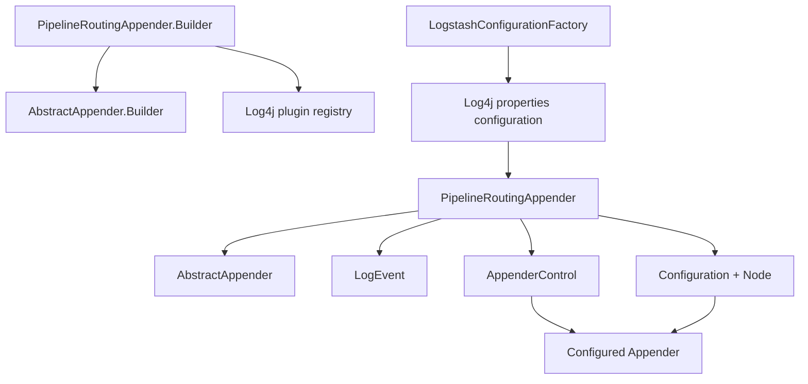
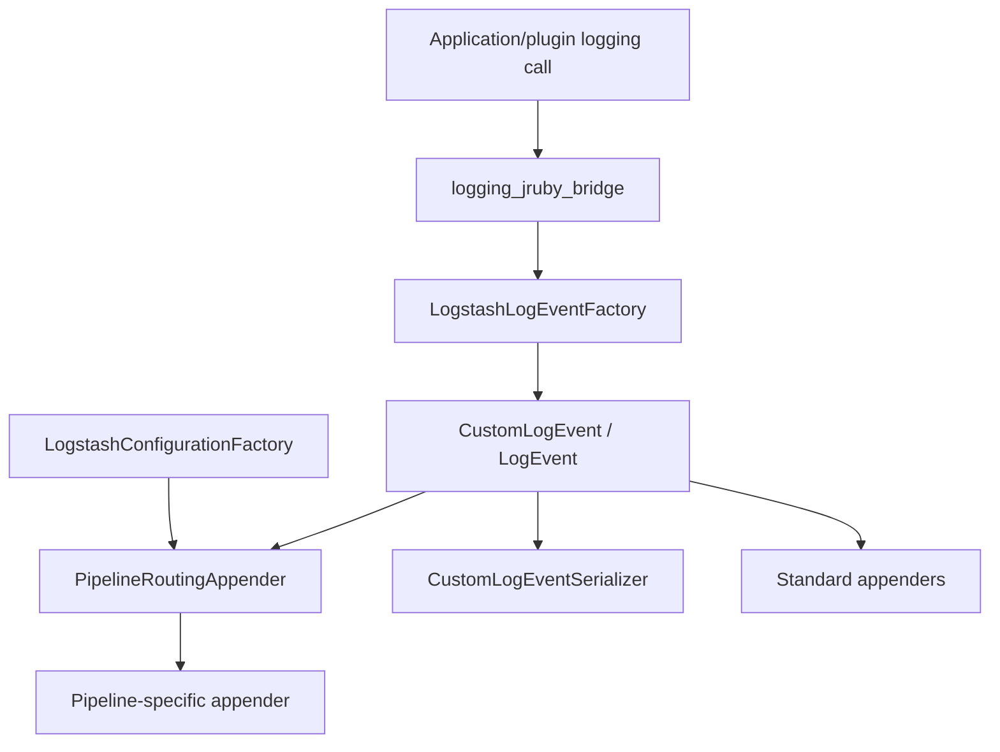

# Logging Pipeline Routing

The `logging_pipeline_routing` module provides the Log4j appender used when Logstash writes separate log files for individual pipelines. `PipelineRoutingAppender` reads `pipeline.id` from each event's context data, lazily creates a child appender for the first event belonging to that pipeline, and forwards later events to the cached child appender.

It is a narrow routing layer: it does not create Log4j events, serialize JSON, select logger levels, or manage pipeline lifecycle. Those responsibilities are covered by [logging_event_and_configuration.md](logging_event_and_configuration.md), [logging_jruby_bridge.md](logging_jruby_bridge.md), and [pipeline_lifecycle_and_execution.md](pipeline_lifecycle_and_execution.md).

## Architectural position



`LogstashConfigurationFactory` retains this appender only when pipeline-separated logging is enabled. By default, it removes the `pipeline_routing_appender` configuration; see [logging_event_and_configuration.md](logging_event_and_configuration.md#separate-log-switch). When retained, Log4j invokes this appender alongside the other appenders attached to the relevant logger configuration.

## Component inventory

| Component | Responsibility |
| --- | --- |
| `PipelineRoutingAppender` | Receives Log4j events and chooses a pipeline-specific child appender. |
| `PipelineRoutingAppender.Builder` | Log4j plugin builder; validates the appender name and captures the deferred child-appender node. |
| `Node appenderNode` | Log4j configuration subtree containing the template child appender. |
| `Configuration configuration` | Active Log4j configuration used to materialize the child appender with event context. |
| `ConcurrentMap<String, AppenderControl> createdAppenders` | Cache keyed by pipeline id. |
| `AppenderControl` | Log4j wrapper used to invoke each created child appender. |

The supplied source contains one production class and one nested builder. The nested `Builder` is the Log4j construction boundary; the outer appender owns routing and cache state.

## Configuration contract

The class is registered as the Log4j plugin `PipelineRouting`, with category `Core.CATEGORY_NAME` and element type `Appender`. Its child configuration is deferred so the template is available as a `Node` when a pipeline event arrives.

Conceptually, the configuration has this shape:

```xml
<PipelineRouting name="pipeline_routing_appender">
  <RollingFile
      name="appender-${ctx:pipeline.id}"
      fileName="${sys:ls.logs}/pipeline_${ctx:pipeline.id}.log"
      filePattern="${sys:ls.logs}/pipeline_${ctx:pipeline.id}.%i.log.gz">
    <PatternLayout>
      <pattern>[%d{ISO8601}][%-5p][%-25c] %m%n</pattern>
    </PatternLayout>
    <SizeBasedTriggeringPolicy size="100MB" />
    <DefaultRolloverStrategy max="30" />
  </RollingFile>
</PipelineRouting>
```

The child appender is a template, not one statically instantiated appender per pipeline. Log4j's context lookup (`${ctx:pipeline.id}`) is resolved while the child node is configured for the current event. The first child appender node whose element type is `Appender` is used; additional child appender definitions are ignored by this implementation.

The builder returns `null` and logs an error when the routing appender has no name. At runtime, creation also fails safely when no child appender is configured or when the child node does not produce an `Appender`.

## Event routing behavior

```mermaid
flowchart TD
    START[append(LogEvent)]
    READ[Read contextData value for pipeline.id]
    PRESENT{pipeline.id present?}
    SKIP[Debug log and return\nno child appender created]
    LOOKUP[Look up cached AppenderControl]
    CACHED{Entry exists?}
    RETURN[Reuse cached control]
    LOCK[Enter synchronized section]
    RECHECK[Check cache again]
    CREATE[Create child appender\nfrom deferred Node]
    VALID{Child appender created?}
    FAIL[Return null\nno event forwarded]
    STARTAPP[Start child appender]
    CACHE[Put control under pipeline id]
    FORWARD[callAppender(event)]

    START --> READ --> PRESENT
    PRESENT -- no --> SKIP
    PRESENT -- yes --> LOOKUP --> CACHED
    CACHED -- yes --> RETURN --> FORWARD
    CACHED -- no --> LOCK --> RECHECK
    RECHECK -- already created --> FORWARD
    RECHECK -- absent --> CREATE --> VALID
    VALID -- no --> FAIL
    VALID -- yes --> STARTAPP --> CACHE --> FORWARD
```

### Pipeline key extraction

`getControl` obtains the key with:

```java
event.getContextData().getValue("pipeline.id")
```

The key is the exact string supplied by Log4j context data. No trimming, normalization, fallback, or wildcard matching is performed.

If the key is `null`, the event is skipped. This is intentional: untagged records are normally already handled by the standard Logstash log appenders, and creating a child from a literal `${ctx:pipeline.id}` path could produce duplicate or incorrectly named files.

An empty string is not treated as missing. It is therefore a valid cache key from this class's perspective, although upstream configuration should generally avoid producing an empty pipeline id.

### Child-appender creation

When a pipeline is first observed, `createAppender` performs the following operations:

1. Iterate over the deferred node's children.
2. Select the first child whose type element name equals Log4j's appender element type.
3. Copy that node.
4. Call `configuration.createConfiguration(appNode, event)` so event context lookups can be resolved.
5. Verify that the resulting object is an `Appender`.
6. Start the appender.
7. Wrap it in `AppenderControl` and cache it under the pipeline id.

If any required appender is absent or materialization does not produce an appender, the method logs an error and returns `null`; the current event is dropped by `append` and no cache entry is inserted.



## Concurrency and cache semantics

The cache is a `ConcurrentHashMap`, and `getAppenders()` exposes only an unmodifiable view of that map. The view prevents callers from mutating the cache through the returned reference, while the map remains live and reflects subsequently created pipeline appenders.

The lookup uses double-checked locking:

```mermaid
flowchart LR
    THREADS[Concurrent append calls]
    FAST[ConcurrentMap get]
    HIT[Existing control]
    MISS[No control]
    MONITOR[synchronized(this)]
    SECOND[Second map lookup]
    ONE[Exactly one creator]
    PUT[Put control]

    THREADS --> FAST
    FAST --> HIT
    FAST --> MISS --> MONITOR --> SECOND
    SECOND --> HIT
    SECOND --> ONE --> PUT
```

The first map lookup allows established pipelines to route without entering the monitor. A cache miss enters `synchronized (this)`, checks again, and only the thread that still sees no entry creates and publishes the child appender. Other threads then reuse the published control.

There is one important publication detail: the new child appender is started before its `AppenderControl` is inserted into the map. This avoids publishing a control for an appender that has not been started. Appender creation occurs while holding the monitor, so a slow configuration or `start()` call temporarily serializes first-event handling for all new pipelines.

The cache has no eviction or per-pipeline removal operation in this class. Consequently, its size grows with the number of distinct pipeline ids observed during the appender's lifetime. Pipeline lifecycle deletion is managed by the pipeline subsystem, not by this routing appender; see [pipeline_lifecycle_and_execution_state_convergence.md](pipeline_lifecycle_and_execution_state_convergence.md).

## Dependency relationships



The direct dependencies are Log4j Core APIs and Java concurrent collections. There is no direct dependency on `PipelinesRegistry`, `StateResolver`, or pipeline execution classes. The coupling to pipelines is deliberately indirect through the shared `pipeline.id` context-data key.

## Integration with the logging system



The routing appender receives the same event that other appenders may receive. It does not prevent standard appenders from writing the event, and it does not alter the event before forwarding it. Formatting is performed by the configured child appender's layout; structured JSON behavior is documented in [logging_event_and_configuration.md](logging_event_and_configuration.md#json-event-serialization).

Pipeline identity must already be present in Log4j context data when the event reaches this appender. The routing class neither derives the id from logger names nor reads pipeline registry state. As a result, correctness depends on the upstream logging context setup and on the logging configuration retaining this plugin.

## Operational and maintenance guidance

- Keep the context-data key exactly `pipeline.id`; changing it requires coordinated changes wherever pipeline logging context is established.
- Preserve the missing-key skip behavior. It prevents accidental files with unresolved context substitutions and avoids duplicate untagged logs.
- Test concurrent first events for the same pipeline to verify single child-appender creation.
- Test concurrent first events for different pipelines, since child creation is serialized by the appender monitor.
- Test missing child configuration and invalid child materialization; both should drop only the affected event and emit an error.
- Verify child-appender start behavior and rollover/layout configuration using the active Log4j version.
- Account for unbounded cache growth when pipeline ids are dynamically generated or churn frequently.
- If pipeline removal must close or evict its child appender, that requires an explicit lifecycle extension; this class currently provides neither operation.

## Related documentation

- [logging_event_and_configuration.md](logging_event_and_configuration.md) — Log4j configuration loading, event creation, serialization, and the `ls.pipeline.separate_logs` switch.
- [logging_jruby_bridge.md](logging_jruby_bridge.md) — Ruby-facing logging calls, logger lookup, levels, and runtime reconfiguration.
- [pipeline_lifecycle_and_execution.md](pipeline_lifecycle_and_execution.md) — Pipeline desired-state convergence and runtime lifecycle; the routing appender does not own these transitions.
- [monitoring_http_api_endpoint_modules.md](monitoring_http_api_endpoint_modules.md) — Logging and operational endpoints exposed through the monitoring API.
