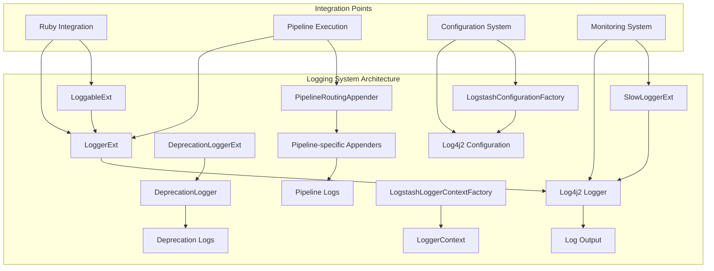
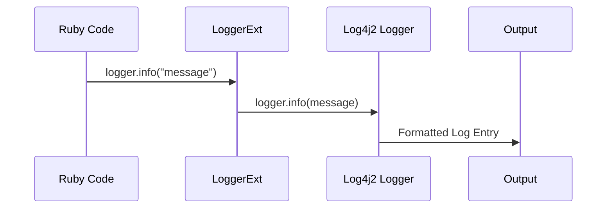
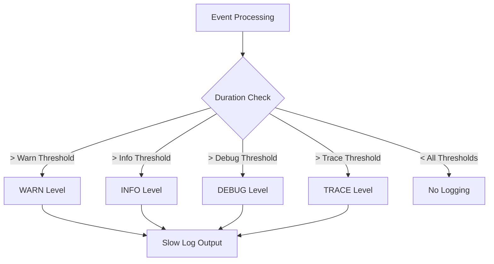
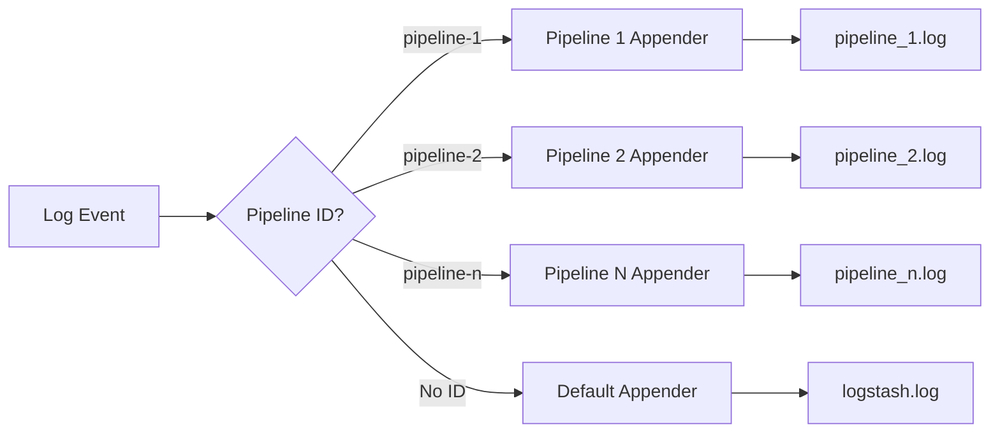

# Logging System Module

## Overview

The Logging System module provides comprehensive logging capabilities for Logstash, serving as the central logging infrastructure that bridges Java's Log4j2 framework with Ruby's logging paradigms. This module enables structured logging, performance monitoring, deprecation warnings, and pipeline-specific log routing throughout the Logstash ecosystem.

## Purpose

The logging system serves several critical functions:

- **Unified Logging Interface**: Provides a consistent logging API across Java and Ruby components
- **Performance Monitoring**: Tracks slow operations and performance bottlenecks through specialized slow loggers
- **Deprecation Management**: Handles deprecation warnings and migration notices
- **Pipeline Isolation**: Routes logs to separate files based on pipeline context
- **Configuration Management**: Dynamically configures logging levels and appenders

## Architecture Overview



## Core Components

### Logger Extensions
- **LoggerExt**: Primary Ruby-Java logging bridge providing standard logging methods
- **LoggableExt**: Mixin module that adds logging capabilities to Ruby classes
- **SlowLoggerExt**: Specialized logger for performance monitoring and slow operation detection
- **DeprecationLoggerExt**: Handles deprecation warnings with structured messaging

### Configuration and Routing
- **LogstashConfigurationFactory**: Custom Log4j2 configuration factory for Logstash-specific settings
- **PipelineRoutingAppender**: Routes log messages to pipeline-specific appenders based on context
- **LogstashLoggerContextFactory**: Manages logger context lifecycle and configuration

## Module Dependencies

The logging system integrates with several other modules:

- **[Ruby Integration](ruby_integration.md)**: Provides JRuby extensions and Ruby-Java bridging
- **[Pipeline Execution](pipeline_execution.md)**: Receives pipeline context for log routing
- **[Settings Management](settings_management.md)**: Configures logging levels and behavior
- **[Monitoring](monitoring.md)**: Integrates with performance monitoring systems

## Key Features

### 1. Ruby-Java Logging Bridge
The module provides seamless integration between Ruby and Java logging systems:



### 2. Performance Monitoring
Slow logger functionality tracks operations exceeding configured thresholds:



### 3. Pipeline Log Routing
The routing appender separates logs by pipeline context:



## Configuration

### Dynamic Log Level Configuration
The system supports runtime log level changes:

- **Global Level Setting**: Affects root logger configuration
- **Package-specific Levels**: Targets specific Java packages or Ruby modules
- **Pipeline-specific Routing**: Controlled via `ls.pipeline.separate_logs` system property

### Appender Management
- **Conditional Appender Loading**: Pipeline routing appender is conditionally loaded
- **Dynamic Appender Creation**: New appenders created on-demand for new pipelines
- **Resource Management**: Automatic cleanup of unused appenders

## Integration Patterns

### 1. Ruby Class Integration
Ruby classes include the `Loggable` module to gain logging capabilities:

```ruby
class MyPlugin
  include LogStash::Util::Loggable
  
  def process
    logger.info("Processing event")
    slow_logger.on_event("slow operation", params, event, duration)
  end
end
```

### 2. Java Component Integration
Java components use the logger extensions directly:

```java
LoggerExt logger = new LoggerExt(runtime, metaClass);
logger.initialize(context, loggerName);
logger.rubyInfo(context, message);
```

## Performance Considerations

### 1. Lazy Logger Initialization
- Loggers are created on-demand to reduce memory footprint
- Instance variables cache logger instances per class

### 2. Threshold-based Logging
- Slow loggers only process events exceeding configured thresholds
- Multiple threshold levels prevent log spam

### 3. Concurrent Appender Management
- Thread-safe appender creation and management
- Concurrent map for efficient appender lookup

## Error Handling

### 1. Configuration Errors
- Graceful fallback to default configuration when custom config fails
- Detailed error messages for invalid log level configurations

### 2. Appender Failures
- Null checks prevent crashes when appenders fail to create
- Synchronized appender creation prevents race conditions

## Monitoring and Observability

The logging system provides several monitoring capabilities:

- **Slow Operation Detection**: Automatic identification of performance bottlenecks
- **Deprecation Tracking**: Structured deprecation warnings for migration planning
- **Pipeline Log Separation**: Isolated logging per pipeline for easier troubleshooting
- **Dynamic Configuration**: Runtime log level adjustments for debugging

## Future Enhancements

Potential areas for expansion include:

- **Structured Logging**: Enhanced JSON-based log formatting
- **Log Aggregation**: Integration with centralized logging systems
- **Metrics Integration**: Direct integration with metrics collection
- **Advanced Filtering**: More sophisticated log filtering capabilities

## Related Documentation

- **[Ruby Integration](ruby_integration.md)**: JRuby extensions and Ruby-Java bridging
- **[Pipeline Execution](pipeline_execution.md)**: Pipeline context and execution flow
- **[Settings Management](settings_management.md)**: Configuration management system
- **[Monitoring](monitoring.md)**: System monitoring and observability