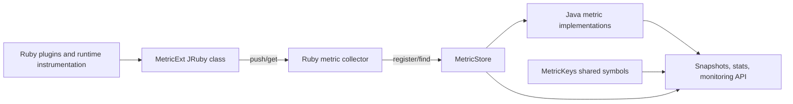
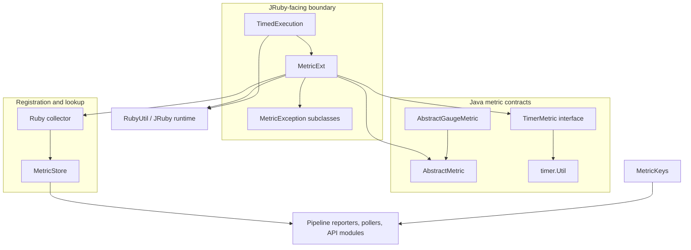
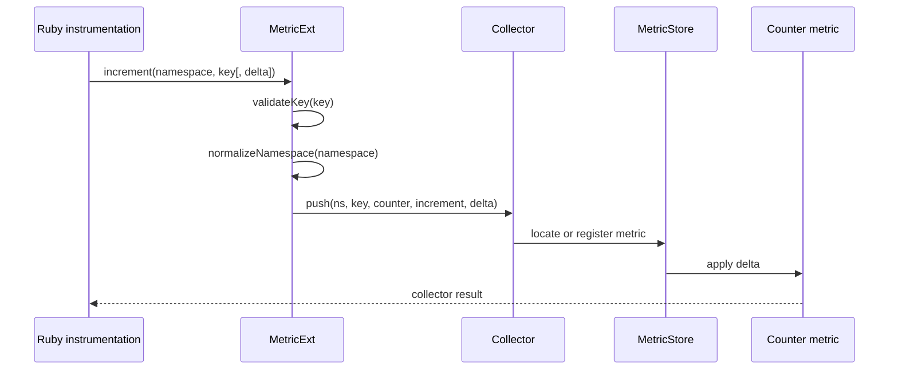
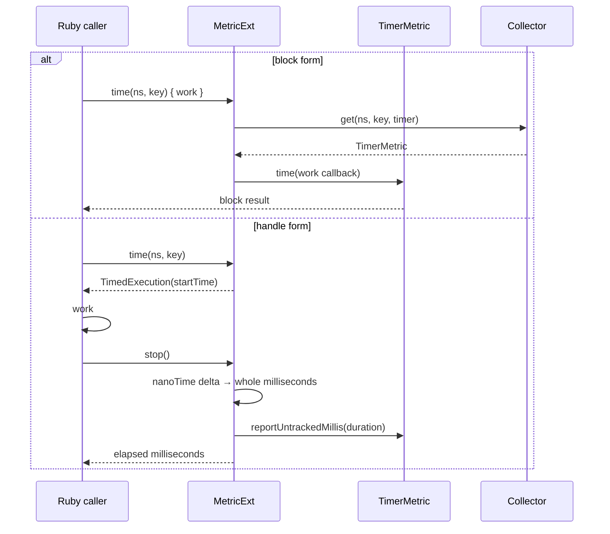
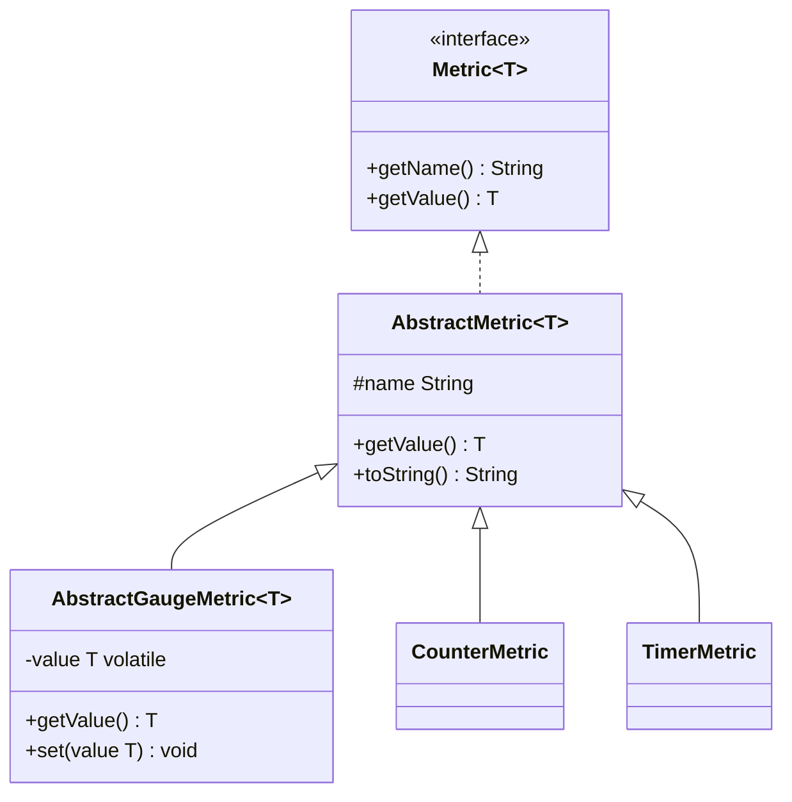
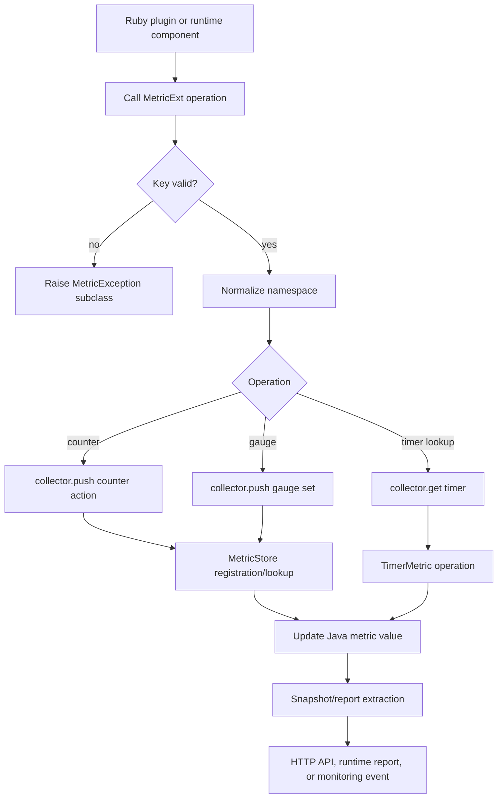

# Metric API and JRuby bridge

The metric API and JRuby bridge provide the instrumentation-facing interface used by Logstash Ruby code while keeping metric storage and value implementations in Java. `MetricExt` exposes counter, gauge, and timer operations as JRuby methods, validates namespaces and keys, and forwards each operation to a Ruby collector. Java metric classes supply the common value and serialization contracts; `MetricKeys` supplies the shared vocabulary used by reporters and API consumers.

This module is the operation and interoperability layer of the observability subsystem. It does not own hierarchical registration or lookup: those responsibilities belong to [metric_store_and_hierarchical_lookup.md](metric_store_and_hierarchical_lookup.md). Runtime pollers, pipeline reporting, the monitoring HTTP API, and X-Pack monitoring consume the resulting metrics as described in the related observability modules.

## Position in the system



`MetricExt` is the boundary between JRuby method calls and collector operations. The collector is deliberately abstracted behind Ruby calls (`push` for mutations and `get` for timer access), which allows the Ruby-side store and metric wiring to control registration and lookup. The Java side supplies typed metric behavior where timing or Java plugin integration requires it.

## Architecture and component responsibilities

| Component | Responsibility | Main boundary |
| --- | --- | --- |
| `AbstractMetric<T>` | Stores the display name, exposes a typed value, and provides JSON value serialization and diagnostic text | Java metric implementations |
| `MetricExt` | JRuby `Metric` class; validates keys, normalizes namespaces, dispatches counter/gauge/timer operations, and creates namespaced views | Ruby caller ↔ collector |
| `TimedExecution` | Captures a monotonic start time and reports elapsed whole milliseconds when stopped | Block-free timing API |
| `MetricException` subclasses | Represent missing key, namespace, or timing block errors at the Ruby boundary | Invalid API usage |
| `AbstractGaugeMetric<T>` | Thread-visible mutable gauge value with getter/setter of the same type | Gauge implementations |
| `MetricKeys` | Interned Ruby symbols for pipeline, plugin, queue, flow, and reporting fields | Report producers ↔ consumers |
| `timer.Util` | Converts nanoseconds into whole milliseconds and sub-millisecond remainder values | Timer implementations |

The module has two complementary contracts:

1. The Java metric contract is typed and serializable. `AbstractMetric#getValue` is annotated with `@JsonValue`, so a metric serializes as its current value rather than as an implementation object.
2. The JRuby contract is dynamic and namespace-oriented. `MetricExt` accepts Ruby symbols/strings and forwards normalized arguments to a collector while raising Ruby-visible exceptions for invalid names.

## Dependency relationships



`MetricStore` is the next module boundary rather than an implementation detail of `MetricExt`: it owns nested paths, flat lookup, extraction, enumeration, and pruning. See [metric_store_and_hierarchical_lookup.md](metric_store_and_hierarchical_lookup.md) for its invariants and query behavior. Consumers that expose metrics through HTTP or runtime snapshots should be documented in [monitoring_http_api.md](monitoring_http_api.md) and the runtime reporting documentation when available.

## JRuby metric API

### Initialization and collector delegation

`MetricExt` is registered as the JRuby class `Metric`. Its private initializer stores a transient Ruby `collector`. The class does not directly maintain a metric map. Instead, it translates operations into collector calls:

- Counter changes call `collector.push(namespace, key, :counter, :increment|:decrement, value)`.
- Gauge assignment calls `collector.push(namespace, key, :gauge, :set, value)`.
- Timer retrieval calls `collector.get(namespace, key, :timer)`.

The collector reference is transient because the object is a bridge into the active JRuby runtime; it is not intended to be a durable serialized dependency.

### Namespaces and keys

`validateName` rejects `nil`, empty Ruby symbols, and empty Ruby strings. `validateKey!` raises `MetricNoKeyProvided` for invalid keys. `createNamespaced` applies the same validation with `MetricNoNamespaceProvided`, then creates a `NamespacedMetricExt` view using `normalizeNamespace`.

The code validates keys before every mutation and timer lookup. Namespace normalization is delegated to the inherited metric extension support, keeping symbol/string conversion consistent for all operations. A caller should therefore use non-empty, stable namespace and key components.

### Counters

`increment` and `decrement` have one-argument-value and explicit-value forms. The no-value overload uses the cached Ruby integer `ONE`, equivalent to a delta of `1`. The explicit form forwards the supplied Ruby value unchanged after key validation; numeric coercion and storage semantics are owned by the collector/metric implementation.



`doIncrement` and `doDecrement` adapt variable-length JRuby argument arrays to the overloaded methods. This preserves a single dispatch path for both the public method and inherited/annotated extension entry points.

### Gauges

The gauge path uses `push(namespace, key, :gauge, :set, value)`. `AbstractGaugeMetric<T>` stores the value in a `volatile` field, making reads and writes visible across threads. Its generic type is intentionally the same for `set` and `get`, simplifying gauge implementations and preserving the current value for JSON serialization through `AbstractMetric`.

```mermaid
flowchart LR
    CALL[Metric gauge(namespace, key, value)] --> VALIDATE[Validate key]
    VALIDATE --> NORMALIZE[Normalize namespace]
    NORMALIZE --> PUSH[Collector.push(..., gauge, set, value)]
    PUSH --> GAUGE[AbstractGaugeMetric.set]
    GAUGE --> READ[AbstractMetric.getValue / JSON value]
```

The gauge class does not itself enforce a numeric type. A gauge can hold any type allowed by its concrete implementation and collector contract, including a nullable initial value.

### Timers and elapsed execution

There are two timer forms:

- `time(namespace, key, block)` obtains a `TimerMetric` and delegates to its Java `time` operation when a block is given.
- `time(namespace, key)` returns a `TimedExecution` object. The caller later invokes `stop`, which calculates elapsed time from `System.nanoTime()` and reports it.

`reportTime` is the direct reporting form. It obtains the timer, converts the Ruby duration to a Java long, and calls `TimerMetric.reportUntrackedMillis`. This is useful when the duration was measured elsewhere.



`TimedExecution` uses a monotonic clock, avoiding wall-clock adjustments. Its `stop` method returns a Ruby integer and reports the same duration through `MetricExt#reportTime`. The timer utility’s `floorDiv`/`floorMod` helpers provide consistent whole-millisecond and sub-millisecond decomposition for timer implementations that need both portions.

If a timing API requires a block and none is supplied, the JRuby extension hierarchy can expose `MetricNoBlockProvided`; the handle-based form is the explicit alternative implemented by `TimedExecution`.

## Metric value and serialization model



`AbstractMetric` requires every concrete metric to provide `getValue` and carries a display name. `toString` includes the concrete class, name, and current value, with null rendered safely. Jackson sees `getValue` as the serialized representation, which is important when snapshots or API responses convert metric objects to JSON-compatible structures.

## Shared metric key vocabulary

`MetricKeys` is a constant holder that creates Ruby symbols once through `RubyUtil`. The constants group into several reporting domains:

| Domain | Examples | Typical consumers |
| --- | --- | --- |
| Pipeline/plugin structure | `pipelines`, `name`, `events`, `plugins`, `inputs`, `filters`, `outputs` | Pipeline stats and monitoring API |
| Queue and DLQ state | `queue`, `capacity`, `queue_size_in_bytes`, `free_space_in_bytes`, `dlq`, `dropped_events`, `expired_events` | Persistent queue and DLQ pollers |
| Flow metrics | `input_throughput`, `output_throughput`, `filter_throughput`, `queue_backpressure`, `worker_utilization` | Flow-rate reporting |
| Timing and throughput | `duration_in_millis`, `queue_push_duration_in_millis`, `throughput`, `encode`, `decode`, `writes_in` | Plugin and pipeline reports |
| Lifecycle and errors | `uptime_in_millis`, `last_error`, `filtered` | Node and pipeline status |

The constants establish spelling and symbol identity; they do not register metrics, calculate values, or define the response shape. Consumers may project these keys into different output documents. The broader monitoring data flow is covered by [runtime_resource_monitoring.md](runtime_resource_monitoring.md) and [monitoring_http_api.md](monitoring_http_api.md) where those module documents exist.

## End-to-end process flows

### Register and update a metric



### Report a manually measured duration

```mermaid
flowchart LR
    BEGIN[time(ns, key)] --> HANDLE[TimedExecution stores nanoTime]
    HANDLE --> WORK[Caller performs work]
    WORK --> STOP[stop()]
    STOP --> DELTA[System.nanoTime - startTime]
    DELTA --> MILLIS[Convert to whole milliseconds]
    MILLIS --> REPORT[MetricExt.reportTime]
    REPORT --> TIMER[TimerMetric.reportUntrackedMillis]
```

## Error and concurrency considerations

- Empty or nil keys fail before collector mutation, making malformed metric paths visible at the call site.
- Empty or nil namespaces fail when a namespaced view is created.
- Counter and gauge mutations are delegated; atomicity and storage synchronization are responsibilities of the collector and concrete metric implementation.
- Gauge visibility is supported by the `volatile` value field.
- Timer handles use `System.nanoTime`, so elapsed measurements are not affected by system clock changes.
- Metric objects may be live after a store lookup. Consumers needing a stable response should use the store’s extraction/snapshot mechanisms rather than retaining mutable metric objects.
- `MetricKeys` symbols are initialized through the shared JRuby runtime. They should be reused rather than recreated by reporting code.

## Related modules

- [metric_store_and_hierarchical_lookup.md](metric_store_and_hierarchical_lookup.md) — namespace tree, flat lookup, extraction, enumeration, and pruning.
- [metrics_and_instrumentation.md](metrics_and_instrumentation.md) — higher-level instrumentation organization and adjacent metric types, when available.
- [monitoring_http_api.md](monitoring_http_api.md) — HTTP/API exposure of node and pipeline statistics, when available.
- [event_model_and_jruby_interop.md](event_model_and_jruby_interop.md) — shared JRuby/Java conversion and runtime registration patterns.
- [pipeline_ir_and_compilation_jruby_plugin_bridge.md](pipeline_ir_and_compilation_jruby_plugin_bridge.md) — another Java-to-JRuby bridge used by compiled plugins.

## Source files

- `logstash-core/src/main/java/org/logstash/instrument/metrics/AbstractMetric.java`
- `logstash-core/src/main/java/org/logstash/instrument/metrics/MetricExt.java`
- `logstash-core/src/main/java/org/logstash/instrument/metrics/MetricKeys.java`
- `logstash-core/src/main/java/org/logstash/instrument/metrics/gauge/AbstractGaugeMetric.java`
- `logstash-core/src/main/java/org/logstash/instrument/metrics/timer/Util.java`
