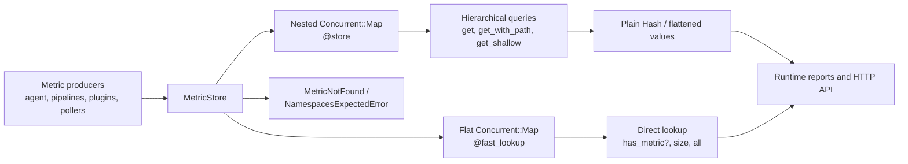
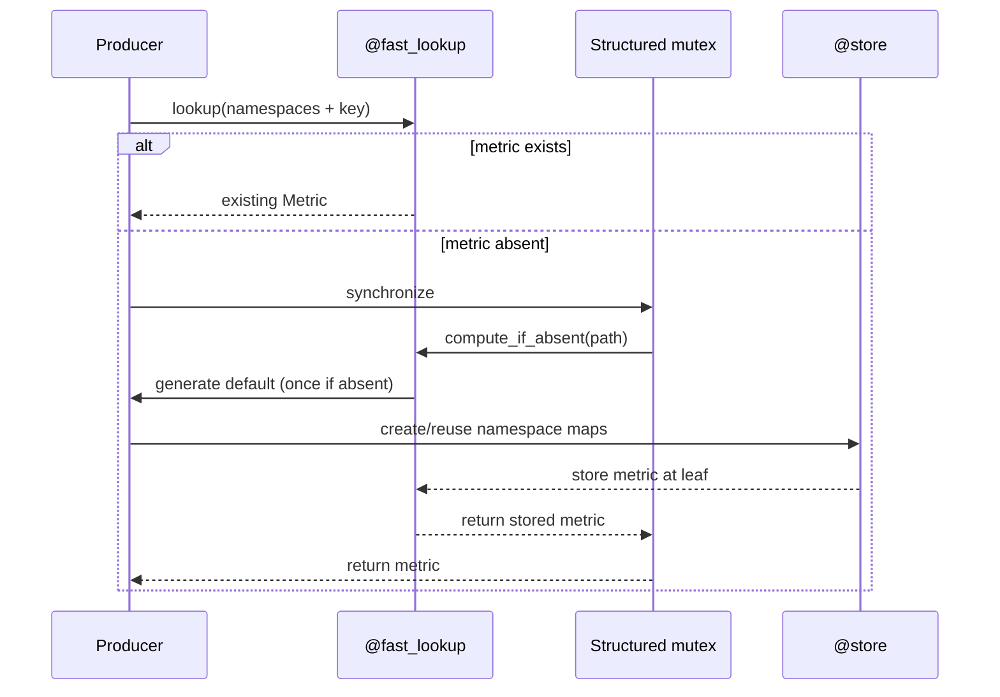
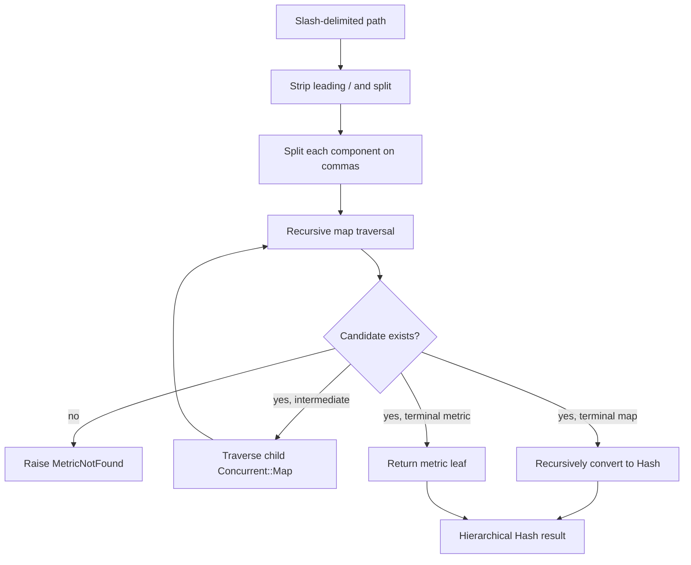
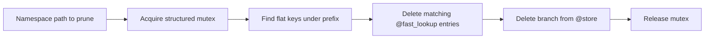
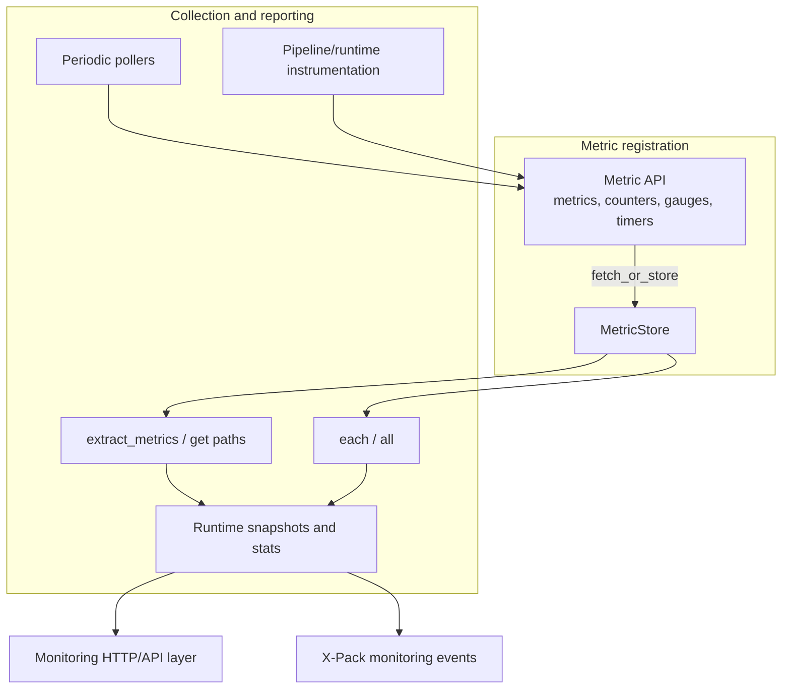

# Metric store and hierarchical lookup

`LogStash::Instrument::MetricStore` is the thread-safe in-memory registry used to organize Logstash metrics by namespace and key. It maintains both a nested tree for hierarchical API queries and a flat index for constant-time metric access. The module also provides path filtering, subtree extraction, enumeration, and pruning.

The store is an instrumentation primitive, not a metric implementation: metric objects are created by the adjacent metric API and stored here. Runtime reporters and HTTP/API consumers read the resulting values; their reporting contracts are documented in [pipeline_lifecycle_and_execution_reporting_runtime_reporting.md](pipeline_lifecycle_and_execution_reporting_runtime_reporting.md) and [pipeline_lifecycle_and_execution.md](pipeline_lifecycle_and_execution.md).

## Architecture



### Responsibilities and boundaries

| Component | Responsibility | Deliberately outside this module |
| --- | --- | --- |
| `MetricStore` | Address metrics by namespace/key; create namespace paths; query and remove values | Updating, timing, or aggregating metric values |
| `@store` | Preserve the namespace tree required for recursive queries and serialization | Constant-time lookup |
| `@fast_lookup` | Index each complete path (`namespaces + key`) for direct access | Reconstructing nested response documents |
| `@structured_lookup_mutex` | Make tree/index insertion, reads, and pruning mutually consistent | Replacing the concurrent maps |
| `MetricNotFound` | Report a missing requested branch during hierarchical lookup | Supplying fallback values |
| `NamespacesExpectedError` | Detect a path collision where a namespace should be a map but is a metric/value | Resolving the collision |

Metric types, counters, timers, gauges, snapshots, and null metrics belong to the neighboring metrics/instrumentation module. See [metrics_and_instrumentation.md](metrics_and_instrumentation.md) when available for those contracts.

## Data model and invariants

The nested store has this conceptual shape:

```text
@store
└── namespace (Concurrent::Map)
    └── nested namespace (Concurrent::Map)
        └── metric key => Metric
```

For example, storing `fetch_or_store([:pipelines, :main], :events, metric)` creates or reuses:

```text
@store[:pipelines][:main][:events] == metric
@fast_lookup[[:pipelines, :main, :events]] == metric
```

The two representations must describe the same metric. New entries are written while the structured lookup mutex is held, and `Concurrent::Map#compute_if_absent` prevents a competing initializer from overwriting the winner. A namespace node must always be a `Concurrent::Map`; a non-map value at an intermediate path raises `NamespacesExpectedError`.

The flat key is an array containing namespace symbols followed by the metric key. Callers should use stable, symbol-compatible path components because path parsing converts query components to symbols.

## Write path: fetch or initialize

`fetch_or_store(namespaces, key, default_value = nil)` supports either a supplied value or a block that generates the value. The generator is invoked only when the complete metric path is absent.



Important behavior:

- The fast path avoids traversing the nested tree.
- The lock covers updates to both representations, preventing readers from observing a partially inserted path.
- An existing value is returned unchanged; this method is not an overwrite operation.
- A block receives `key`, not the namespace array.

## Lookup and path syntax

`get(*key_paths)` recursively traverses the nested map and returns ordinary Ruby hashes. `get_with_path(path)` accepts a slash-delimited string, removes leading slashes, splits it into components, and delegates to `get`. `get_shallow` performs the same lookup but reduces the nested result to the requested terminal level.

At every path component, comma-separated candidates are supported with optional whitespace:

```text
stats/pipelines/pipeline_1
stats/pipelines/pipeline_1,pipeline_2
stats/os,jvm
```

The result preserves the selected branches. A missing candidate raises `MetricNotFound` and includes the candidate and available map keys in its message.



`get` synchronizes the full traversal so the returned structure is internally consistent. Conversion with `transform_to_hash` is recursive and removes the `Concurrent::Map` implementation detail, which makes results suitable for serialization at the API layer.

## Extraction and enumeration

`extract_metrics(path, *keys)` is a projection helper for reporters. It reads selected leaf metrics below a path, unwraps each metric through `.value`, and returns `nil` for a missing leaf at the selected location. Array arguments can describe multiple paths and keys; nested arrays produce the Cartesian combinations needed for grouped pipeline or JVM reports.

`each(path = nil)` and its alias `all` expose metric leaves:

- with no path, values come directly from `@fast_lookup`;
- with a path, the selected nested result is recursively flattened into an array;
- with a block, normal Ruby enumeration semantics are used; without one, the array is returned.

`has_metric?(*path)` checks the flat index and returns the indexed metric or `nil` (despite the predicate-style name). `size` returns the number of indexed metric paths.

## Pruning and lifecycle

`prune(path)` removes the requested subtree from both stores while holding the structured lookup mutex. It first removes flat-index entries whose namespace prefix contains the requested path, then recursively deletes the corresponding branch from `@store`. Pruning is used when an instrumented scope disappears, such as a pipeline or plugin lifecycle change.



The operation does not recursively remove now-empty ancestor maps; those maps may remain as empty structural nodes until the store itself is discarded.

## Component interaction in the observability subsystem



The store does not decide which metrics are exposed, how they are named in an API response, or where monitoring events are sent. Those concerns belong to the runtime reporting, monitoring HTTP API, and X-Pack monitoring modules. This separation lets producers register metrics using stable paths while consumers choose a projection appropriate to their output format.

## Operational considerations

- Use `fetch_or_store` for registration so initialization remains idempotent under concurrent producers.
- Use `get_with_path` for structured responses and `get_shallow` when a consumer needs only the terminal map.
- Use comma-separated path components for sibling selection, not commas embedded in metric names.
- Handle `MetricNotFound` when querying optional or version-dependent namespaces; callers such as metadata/reporting code may intentionally map absence to `nil`.
- Treat returned hashes as snapshots of the store’s structure. Metric objects themselves may remain live and can change after lookup.
- Prune only complete instrumentation scopes. The method removes all indexed leaves beneath the selected namespace prefix.

## Related modules

- [metrics_and_instrumentation.md](metrics_and_instrumentation.md) — metric objects, counters, gauges, timers, snapshots, and the Ruby/Java metric bridge.
- [pipeline_lifecycle_and_execution_reporting_runtime_reporting.md](pipeline_lifecycle_and_execution_reporting_runtime_reporting.md) — runtime snapshots and reporting consumers.
- [pipeline_lifecycle_and_execution.md](pipeline_lifecycle_and_execution.md) — pipeline ownership and lifecycle events that can create or prune metric scopes.
- [runtime_foundation_and_configuration.md](runtime_foundation_and_configuration.md) — process bootstrap and foundational runtime configuration.

## Source

- `logstash-core/lib/logstash/instrument/metric_store.rb`

