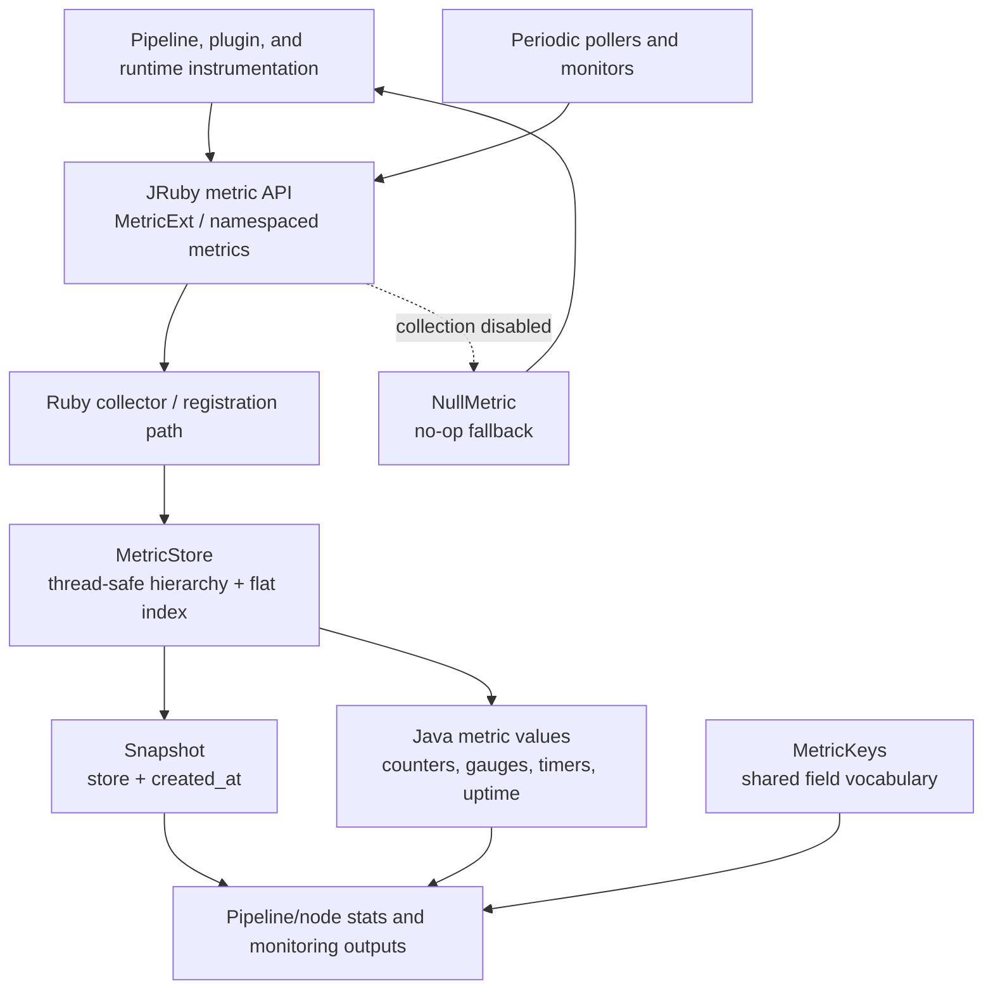
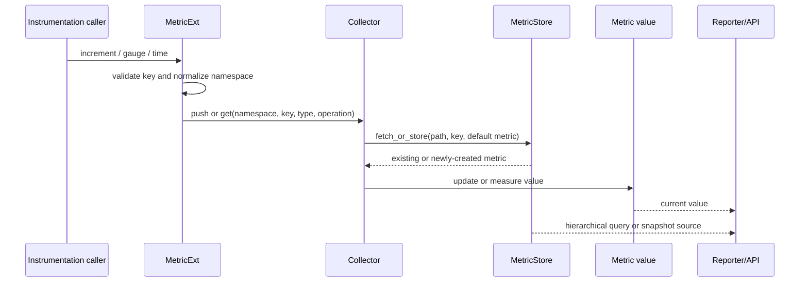
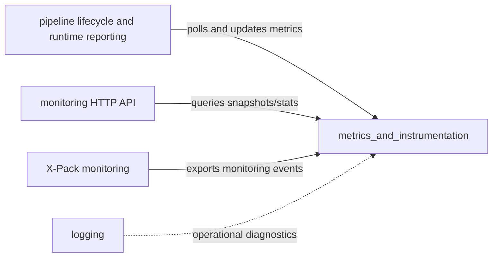
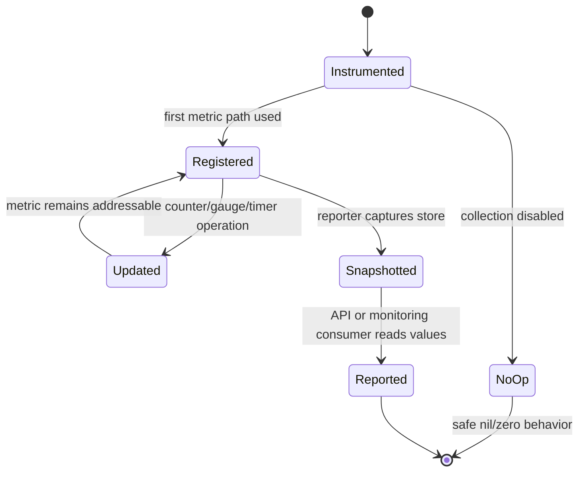

# Metrics and instrumentation

The `metrics_and_instrumentation` module is Logstash’s low-level observability layer. It provides a thread-safe hierarchical registry for metrics, a JRuby-facing API for counters, gauges, and timers, Java metric value abstractions, shared reporting keys, snapshots, and no-op implementations for disabled or unavailable collection. Runtime pipeline reporting builds on these primitives and is documented in [pipeline_lifecycle_and_execution_reporting_runtime_reporting.md](pipeline_lifecycle_and_execution_reporting_runtime_reporting.md).

## Architecture overview



The central design is a separation of concerns: `MetricStore` addresses and exposes metrics, while metric implementations own value semantics. JRuby adapters preserve the Ruby instrumentation API and delegate storage through a collector. Reporters consume plain values or snapshots rather than manipulating the registry’s internal maps.

## Sub-modules

| Sub-module | Scope | Documentation |
| --- | --- | --- |
| Metric store and hierarchical lookup | Concurrent registration, dual indexes, path queries, extraction, enumeration, and pruning | [metric_store_and_hierarchical_lookup.md](metric_store_and_hierarchical_lookup.md) |
| Metric API and JRuby bridge | JRuby operations, validation, namespaced views, Java metric contracts, gauge behavior, timer conversion, and shared keys | [metric_api_and_jruby_bridge.md](metric_api_and_jruby_bridge.md) |
| Null metrics and snapshots | No-op metric behavior and timestamped metric-store snapshots | [null_metrics_and_snapshots.md](null_metrics_and_snapshots.md) |

## End-to-end data flow



For timed operations, `MetricExt#time` either measures a supplied Ruby block immediately or returns `TimedExecution`, whose `stop` method computes elapsed time using `System.nanoTime` and reports whole milliseconds. The no-op path preserves the same calling shape and returns zero or `nil` without modifying the store.

## Metric addressing and output shape

Metrics are addressed by a namespace path plus a leaf key, for example:

```text
pipelines/<pipeline-name>/events/in
pipelines/<pipeline-name>/events/out
flow/input_throughput
```

The store keeps a nested tree for recursive API responses and a flat path index for direct access. Query paths may select multiple siblings with comma-separated names, and API-facing results are converted from `Concurrent::Map` instances into ordinary Ruby hashes. The canonical field names used by reporters—pipeline, plugin, queue, DLQ, flow, and timing fields—are centralized in `MetricKeys`.

## Concurrency and consistency

`MetricStore` uses `Concurrent::Map` for both its structured store and flat lookup. A mutex protects operations that must update or inspect the two representations consistently, especially first insertion, hierarchical reads, and pruning. `compute_if_absent` ensures that concurrent producers do not replace an already-created metric. Individual metric implementations may add their own visibility or atomicity guarantees; the store does not aggregate or mutate metric values itself.

## Integration boundaries



The module should remain focused on instrumentation primitives. Polling schedules, HTTP routing, monitoring event schemas, and logging configuration belong to their respective neighboring modules; the available runtime-reporting details are linked above rather than duplicated here.

## Typical lifecycle



## Maintenance notes

- Keep the flat lookup and nested tree synchronized when changing registration or pruning behavior.
- Preserve JRuby-visible validation and method signatures because plugins and runtime code call these adapters dynamically.
- Add new reporting fields to `MetricKeys` rather than scattering symbol literals across producers and consumers.
- Treat no-op metrics as API-compatible implementations: they should remain safe to call while retaining input validation.
