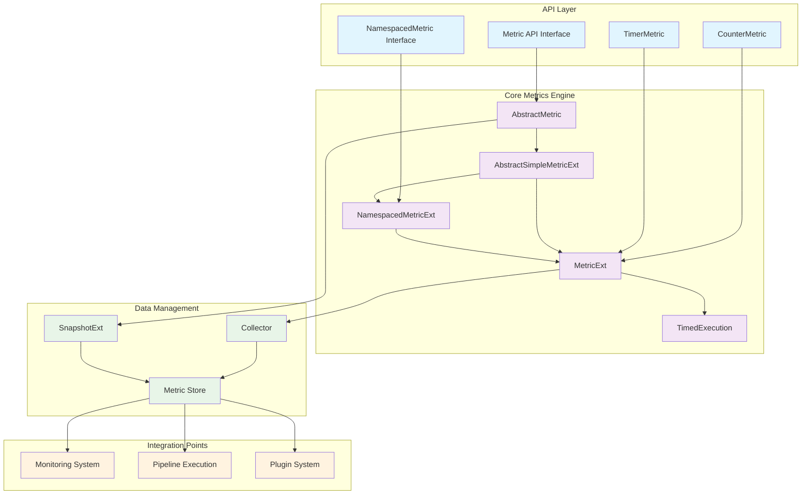
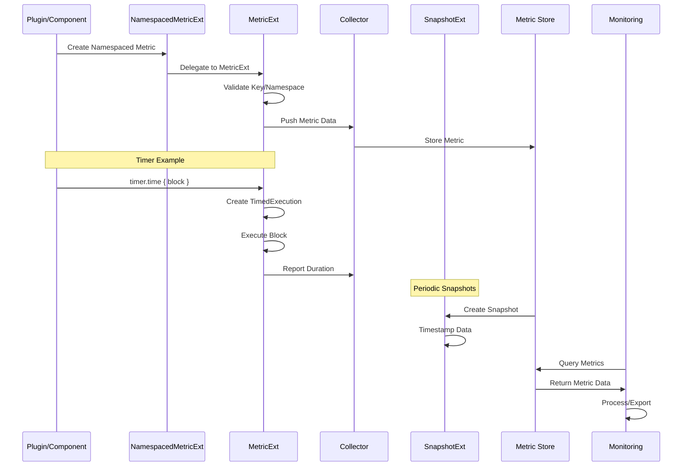
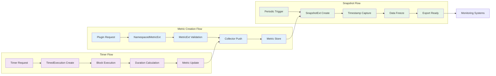

# Metrics System Documentation

## Overview

The Metrics System is a comprehensive instrumentation framework within Logstash that provides real-time monitoring, performance tracking, and operational insights. It serves as the foundation for collecting, aggregating, and reporting various metrics across the entire Logstash pipeline, enabling administrators and developers to monitor system health, performance bottlenecks, and operational statistics.

## Purpose

The metrics system enables:
- **Performance Monitoring**: Track execution times, throughput, and resource utilization
- **Operational Insights**: Monitor pipeline health, plugin performance, and system resources
- **Debugging Support**: Provide detailed metrics for troubleshooting and optimization
- **Integration**: Seamless integration with external monitoring systems and dashboards

## Architecture Overview

The metrics system follows a layered architecture with clear separation of concerns:



## Core Components

### 1. Abstract Metric Foundation
- **AbstractMetric**: Base class providing common metric functionality and naming conventions
- **Metric Interface**: Defines the contract for all metric implementations with namespace support
- **AbstractSimpleMetricExt**: Abstract Ruby extension providing common metric operations
- **Type Safety**: Generic implementation supporting various metric value types

### 2. Metric Extensions and Ruby Integration
- **MetricExt**: Ruby-integrated metric implementation with JRuby bindings and validation
- **NamespacedMetricExt**: Hierarchical metric organization with namespace delegation
- **TimedExecution**: Specialized component for tracking execution time with automatic lifecycle management
- **Validation**: Built-in key and namespace validation with custom exception handling

### 3. Specialized Metric Types
- **CounterMetric**: Thread-safe counter implementation for tracking incremental values
- **TimerMetric**: High-precision timing measurements with functional programming support
- **NamespacedMetric**: Interface for organized metric access with namespace hierarchy
- **Gauge Metrics**: Real-time value tracking for dynamic measurements

### 4. Data Capture and Storage
- **SnapshotExt**: Point-in-time metric data capture with timestamp tracking
- **Metric Store**: Centralized storage and retrieval system for all metric data
- **Collector Integration**: Seamless data flow between metric sources and storage

## System Integration

The metrics system integrates with several other Logstash modules:

### Pipeline Integration
- **Execution Monitoring**: Integration with [pipeline_execution](pipeline_execution.md) for tracking pipeline performance
- **Event Processing**: Metrics collection during event transformation and routing
- **Worker Thread Tracking**: Per-thread performance monitoring

### Plugin System Integration
- **Plugin Metrics**: Integration with [plugin_system](plugin_system.md) for plugin-specific performance tracking
- **Filter Performance**: Detailed timing and throughput metrics for filter plugins
- **Output Monitoring**: Success/failure rates and latency tracking for output plugins

### Monitoring System Integration
- **System Metrics**: Integration with [monitoring](monitoring.md) for system-level resource tracking
- **Health Indicators**: Contribution to [health_system](health_system.md) for overall system health assessment
- **Alert Generation**: Threshold-based alerting and notification support

## Key Features

### 1. High-Performance Metrics Collection
- **Low Overhead**: Minimal performance impact on pipeline execution
- **Thread Safety**: Concurrent metric updates without contention
- **Memory Efficient**: Optimized data structures for high-throughput environments

### 2. Flexible Metric Types
- **Counters**: Monotonic increasing values for event counts and error tracking
- **Timers**: Nanosecond precision timing with statistical aggregation
- **Gauges**: Real-time value tracking for dynamic measurements
- **Histograms**: Distribution tracking for latency and size metrics

### 3. Namespace Organization
- **Hierarchical Structure**: Organized metric namespaces for logical grouping
- **Dynamic Creation**: Runtime namespace creation and management
- **Scoped Access**: Plugin and component-specific metric isolation

### 4. Ruby Integration
- **JRuby Compatibility**: Seamless integration with Ruby-based Logstash components
- **DSL Support**: Ruby-friendly metric creation and manipulation APIs
- **Exception Handling**: Ruby-specific error handling and validation

## Data Flow Architecture



## Component Interaction Details



## Performance Characteristics

### Throughput
- **High Volume**: Supports millions of metric updates per second
- **Batch Processing**: Efficient bulk metric operations
- **Minimal Latency**: Sub-microsecond metric update times

### Memory Management
- **Bounded Memory**: Configurable memory limits for metric storage
- **Garbage Collection**: Efficient cleanup of expired metric data
- **Compression**: Optional compression for historical metric data

### Scalability
- **Horizontal Scaling**: Support for distributed metric collection
- **Vertical Scaling**: Efficient resource utilization on multi-core systems
- **Load Balancing**: Even distribution of metric collection overhead

## Configuration and Usage

### Basic Metric Creation
```ruby
# Counter metric
counter = metrics.counter(:events_processed)
counter.increment
counter.increment(5)  # Increment by 5

# Timer metric with block execution
timer = metrics.timer(:processing_time)
result = timer.time { process_event(event) }

# Manual timer reporting
start_time = System.nanoTime
process_event(event)
duration_ms = (System.nanoTime - start_time) / 1_000_000
metrics.reportTime(:processing_time, duration_ms)

# Gauge metric
metrics.gauge(:queue_size, queue.size)
metrics.gauge(:memory_usage, memory_stats.used_bytes)
```

### Namespace Organization
```ruby
# Create hierarchical namespaced metrics
pipeline_metrics = metrics.namespace(:pipeline, :main)
filter_metrics = pipeline_metrics.namespace(:filters, :grok)
output_metrics = pipeline_metrics.namespace(:outputs, :elasticsearch)

# Use namespaced metrics
filter_metrics.counter(:matches).increment
filter_metrics.timer(:execution_time).time { apply_filter(event) }
output_metrics.counter(:successful_writes).increment

# Access namespace information
puts filter_metrics.namespaceName()  # [:pipeline, :main, :filters, :grok]
```

### Advanced Usage Patterns
```ruby
# Timed execution with manual control
timed_execution = metrics.timer(:batch_processing).start()
begin
  process_batch(events)
ensure
  duration = timed_execution.stop()
  puts "Batch processing took #{duration}ms"
end

# Conditional metrics
if debug_mode?
  metrics.increment(:debug_events)
  metrics.gauge(:debug_memory, get_memory_usage())
end

# Bulk operations
events.each_with_index do |event, index|
  metrics.increment(:events_processed)
  if index % 1000 == 0
    metrics.gauge(:current_position, index)
  end
end
```

### Snapshot and Monitoring Integration
```ruby
# Create metric snapshots
snapshot = metrics.create_snapshot()
puts "Snapshot created at: #{snapshot.created_at}"

# Access snapshot data
metric_store = snapshot.metric_store
pipeline_metrics = metric_store[:pipeline][:main]
puts "Events processed: #{pipeline_metrics[:events_processed][:counter][:value]}"
```

## Error Handling and Validation

The metrics system includes comprehensive error handling:

- **MetricNoKeyProvided**: Thrown when metric key is missing or empty
- **MetricNoNamespaceProvided**: Thrown when namespace is invalid
- **MetricException**: Base exception for all metric-related errors
- **Validation**: Automatic validation of metric names and namespaces

## Integration with External Systems

### Monitoring Backends
- **Elasticsearch**: Direct integration for metric storage and visualization
- **Prometheus**: Export metrics in Prometheus format
- **StatsD**: Real-time metric streaming to StatsD collectors
- **Custom Exporters**: Pluggable architecture for custom monitoring systems

### Alerting Systems
- **Threshold Monitoring**: Configurable thresholds for metric-based alerts
- **Anomaly Detection**: Statistical analysis for unusual metric patterns
- **Notification Integration**: Email, Slack, and webhook notifications

## Best Practices

### Metric Naming
- Use hierarchical namespaces for organization
- Include units in metric names (e.g., `processing_time_ms`)
- Use consistent naming conventions across components

### Performance Optimization
- Batch metric updates when possible
- Use appropriate metric types for different use cases
- Monitor metric collection overhead

### Memory Management
- Configure appropriate retention policies
- Use sampling for high-frequency metrics
- Monitor metric store memory usage

## Related Documentation

- [Monitoring System](monitoring.md) - System-level monitoring and resource tracking
- [Health System](health_system.md) - Overall system health assessment
- [Pipeline Execution](pipeline_execution.md) - Pipeline performance monitoring
- [Plugin System](plugin_system.md) - Plugin-specific metrics and monitoring

## Conclusion

The Metrics System provides a robust, high-performance foundation for monitoring and observability within Logstash. Its flexible architecture, comprehensive metric types, and seamless integration capabilities make it an essential component for maintaining operational visibility and ensuring optimal system performance.