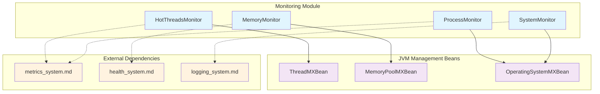
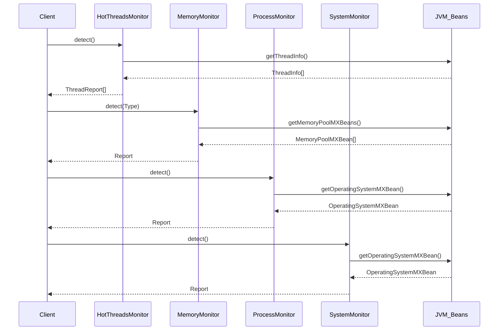

# Monitoring Module Documentation

## Overview

The monitoring module is a critical component of the Logstash system that provides comprehensive runtime monitoring capabilities. It collects and reports various system metrics including thread performance, memory usage, process statistics, and system information. This module serves as the foundation for observability and performance analysis within the Logstash ecosystem.

## Purpose

The monitoring module enables:
- **Performance Analysis**: Real-time monitoring of thread performance and CPU usage
- **Resource Management**: Memory and system resource tracking
- **Operational Insights**: Process-level statistics and system information
- **Troubleshooting**: Hot thread detection and performance bottleneck identification

## Architecture Overview

The monitoring module is built around four specialized monitor components, each responsible for different aspects of system monitoring:



## Core Components

### HotThreadsMonitor
**Purpose**: Identifies and analyzes threads with high CPU usage, blocking, or waiting times.

**Key Features**:
- Thread performance analysis with configurable sorting (CPU, wait, block time)
- Detailed thread reports including stack traces
- Real-time thread state monitoring
- Configurable stack trace depth

**Usage Patterns**:
```java
// Basic hot threads detection
List<ThreadReport> reports = HotThreadsMonitor.detect();

// Advanced detection with options
Map<String, String> options = new HashMap<>();
options.put("ordered_by", "cpu");
options.put("stacktrace_size", "50");
List<ThreadReport> reports = HotThreadsMonitor.detect(options);
```

### MemoryMonitor
**Purpose**: Monitors JVM memory usage across different memory pools and types.

**Key Features**:
- Heap and non-heap memory tracking
- Memory pool-specific monitoring
- Usage and peak memory statistics
- Flexible filtering by memory type

**Memory Types Supported**:
- **Heap Memory**: Application object storage
- **Non-Heap Memory**: Method area, code cache, compressed class space
- **All Memory**: Combined heap and non-heap monitoring

### ProcessMonitor
**Purpose**: Provides process-level statistics including CPU usage, memory, and file descriptors.

**Key Features**:
- CPU usage tracking (process and system level)
- Virtual memory monitoring
- File descriptor usage (Unix systems)
- Cross-platform compatibility

**Platform Support**:
- **Unix Systems**: Full feature set including file descriptor monitoring
- **Other Systems**: Core CPU and memory monitoring

### SystemMonitor
**Purpose**: Collects system-level information and operating system metrics.

**Key Features**:
- Operating system information (name, version, architecture)
- System load average monitoring
- Available processor count
- System-wide performance indicators

## Data Flow Architecture



## Integration with Other Modules

### Metrics System Integration
The monitoring module works closely with the [metrics_system](metrics_system.md) to provide:
- Real-time metric collection
- Performance counter updates
- Statistical aggregation support

### Health System Integration
Monitoring data feeds into the [health_system](health_system.md) for:
- Health indicator calculations
- System status determination
- Alert threshold monitoring

### Logging System Integration
The monitoring module utilizes the [logging_system](logging_system.md) for:
- Debug information logging
- Error reporting and diagnostics
- Performance event logging

## Report Structures

### ThreadReport Structure
```java
{
    "cpu.time": long,           // CPU time in nanoseconds
    "blocked.count": long,      // Number of times blocked
    "blocked.time": long,       // Total blocked time
    "waited.count": long,       // Number of times waited
    "waited.time": long,        // Total waited time
    "thread.name": String,      // Thread name
    "thread.id": long,          // Thread ID
    "thread.state": String,     // Thread state (lowercase)
    "thread.stacktrace": List<String>  // Stack trace elements
}
```

### Memory Report Structure
```java
{
    "heap": {
        "pool_name": {
            "usage.init": long,     // Initial memory
            "usage.committed": long, // Committed memory
            "usage.used": long,     // Used memory
            "usage.max": long,      // Maximum memory
            "peak.init": long,      // Peak initial
            "peak.committed": long, // Peak committed
            "peak.used": long,      // Peak used
            "peak.max": long        // Peak maximum
        }
    },
    "non_heap": { /* similar structure */ }
}
```

### Process Report Structure
```java
{
    "open_file_descriptors": long,
    "max_file_descriptors": long,
    "is_unix": boolean,
    "cpu": {
        "total_in_millis": long,
        "process_percent": short,
        "system_percent": short
    },
    "mem": {
        "total_virtual_in_bytes": long
    }
}
```

### System Report Structure
```java
{
    "os.name": String,
    "os.version": String,
    "os.arch": String,
    "system.available_processors": int,
    "system.load_average": double
}
```

## Performance Considerations

### Thread Monitoring
- **CPU Time Enablement**: Automatically enables CPU time tracking if supported
- **Current Thread Exclusion**: Excludes monitoring thread from analysis to prevent skew
- **Configurable Depth**: Stack trace depth can be adjusted for performance vs. detail trade-off

### Memory Monitoring
- **Pool Filtering**: Efficient filtering by memory type to reduce overhead
- **Lazy Evaluation**: Memory statistics collected on-demand
- **Type-Safe Access**: Structured access to prevent memory type confusion

### Process Monitoring
- **Platform Detection**: Automatic detection of Unix vs. other platforms
- **Reflection-Based CPU Load**: Uses appropriate CPU load method based on JDK version
- **Error Handling**: Graceful degradation when metrics are unavailable

## Usage Examples

### Comprehensive System Monitoring
```java
// Hot threads analysis
List<ThreadReport> hotThreads = HotThreadsMonitor.detect();
hotThreads.forEach(report -> 
    System.out.println("Thread: " + report.getThreadName() + 
                      " CPU: " + report.getCpuTime()));

// Memory monitoring
MemoryMonitor.Report memReport = MemoryMonitor.detect(MemoryMonitor.Type.All);
System.out.println("Heap pools: " + memReport.getHeap().keySet());

// Process statistics
ProcessMonitor.Report procReport = ProcessMonitor.detect();
System.out.println("Process report: " + procReport.toMap());

// System information
SystemMonitor.Report sysReport = SystemMonitor.detect();
System.out.println("System info: " + sysReport.toMap());
```

### Performance Troubleshooting
```java
// Identify CPU-intensive threads
Map<String, String> options = new HashMap<>();
options.put("ordered_by", "cpu");
options.put("stacktrace_size", "20");

List<ThreadReport> cpuHotThreads = HotThreadsMonitor.detect(options);
cpuHotThreads.stream()
    .limit(5)  // Top 5 CPU consumers
    .forEach(report -> {
        System.out.println("High CPU Thread: " + report.getThreadName());
        System.out.println("CPU Time: " + report.getCpuTime());
    });

// Monitor memory pressure
MemoryMonitor.Report memReport = MemoryMonitor.detect(MemoryMonitor.Type.Heap);
memReport.getHeap().forEach((poolName, stats) -> {
    long used = (Long) stats.get("usage.used");
    long max = (Long) stats.get("usage.max");
    double utilization = (double) used / max * 100;
    System.out.println(poolName + " utilization: " + utilization + "%");
});
```

## Error Handling and Limitations

### Security Considerations
- **Thread CPU Time**: May be disabled by security manager
- **File Descriptors**: Unix-specific functionality
- **Reflection Access**: CPU load method access may be restricted

### Platform Limitations
- **File Descriptors**: Only available on Unix-like systems
- **CPU Load Methods**: Different methods for different JDK versions
- **Memory Pools**: Pool availability varies by JVM implementation

### Graceful Degradation
- **Missing Metrics**: Returns -1 for unavailable metrics
- **Security Restrictions**: Logs warnings and continues with available data
- **Platform Differences**: Adapts functionality based on detected platform

## Best Practices

1. **Regular Monitoring**: Implement periodic monitoring for trend analysis
2. **Threshold Setting**: Establish baselines for normal operation
3. **Resource Cleanup**: Monitor file descriptor usage on Unix systems
4. **Memory Pressure**: Track both usage and peak values for capacity planning
5. **Thread Analysis**: Use different sort orders based on suspected issues
6. **Platform Awareness**: Account for platform-specific feature availability

The monitoring module provides essential observability capabilities that enable effective system management, performance optimization, and troubleshooting within the Logstash ecosystem.