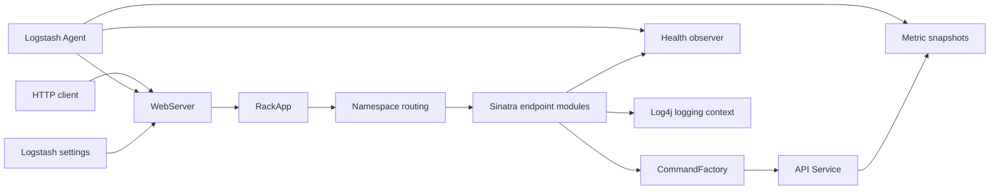
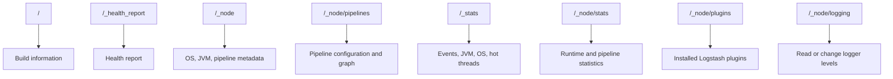
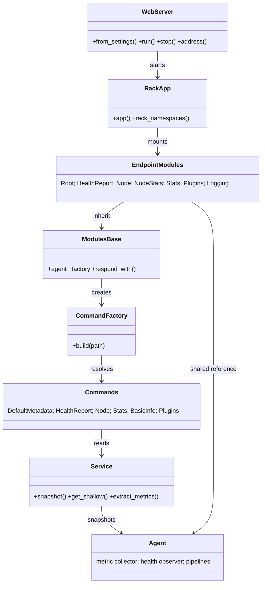
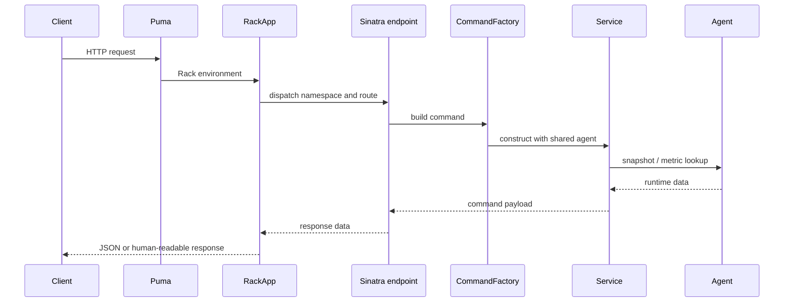

# Monitoring HTTP API

The `monitoring_http_api` module exposes Logstash’s operational state over HTTP. It owns server startup and shutdown, listener security, Rack/Sinatra request routing, response/error normalization, and endpoint access to node metadata, health, metrics, plugins, and logging controls.

It is an observability and operational-control boundary: runtime components publish state into the agent’s metric and health systems, while this module turns that state into HTTP responses for operators, automation, and monitoring integrations.

## Architecture overview

The main runtime path is:

1. `WebServer.from_settings` converts `api.*` settings into listener, TLS, and authentication options.
2. `WebServer` creates Puma, selects a usable port, and starts the Rack application.
3. `RackApp` installs request logging and production error containment, then mounts the root and namespace applications.
4. Each endpoint module receives the shared `agent`, creates a `CommandFactory`, and either executes a command or reads a specialized runtime service.
5. `respond_with` serializes JSON, adds default node metadata where appropriate, applies field filters, and formats API errors.

## Submodules

| Submodule | Scope | Documentation |
| --- | --- | --- |
| Server and routing | Puma lifecycle, TLS/Basic Auth, Rack middleware, namespace mapping, shared Sinatra base | [monitoring_http_api_server_and_routing.md](monitoring_http_api_server_and_routing.md) |
| Command layer | Command factory and data-producing commands for metadata, health, node, statistics, and installed plugins | [monitoring_http_api_command_layer.md](monitoring_http_api_command_layer.md) |
| Endpoint modules | HTTP routes under `/_health_report`, `/_node`, `/_stats`, and related namespaces | [monitoring_http_api_endpoint_modules.md](monitoring_http_api_endpoint_modules.md) |

The linked documents contain component-level behavior. This file describes relationships and integration boundaries without duplicating their route or response details.

## API surface

The route groups are registered centrally by `RackApp.rack_namespaces`:

| Namespace | Primary responsibility | Main data source |
| --- | --- | --- |
| `/` | Build information | Build metadata |
| `/_health_report` | Overall health status and indicators | Agent health observer |
| `/_node` | Node, JVM, OS, pipeline, and hot-thread information | Agent state and instrumentation |
| `/_stats` | Events, flow, JVM, process, queue, pipeline, and hot-thread statistics | Metric snapshots and pipeline information |
| `/_node/stats` | Expanded node and pipeline statistics | Statistics command and metric store |
| `/_node/plugins` | Installed plugin names and versions | RubyGems plugin specifications |
| `/_node/logging` | Read, update, or reset logger configuration | Log4j logger context |

Several endpoints support optional field selection, JSON pretty-printing, boolean query parameters, and—in hot-thread routes—human-readable text output. Exact route behavior is documented in [monitoring_http_api_endpoint_modules.md](monitoring_http_api_endpoint_modules.md).

## Component relationships

`Service` is a thin adapter over the live agent. It takes metric snapshots and performs shallow metric lookup/extraction; command objects shape those values into API payloads. Health and logging routes additionally access their specialized observers/contexts directly.

## Request and response flow

`ApiLogger` logs completed responses with request metadata. In non-test environments, `ApiErrorHandler` catches unexpected downstream exceptions and returns a JSON 500 response; known API errors are formatted by the shared endpoint helpers. See [monitoring_http_api_server_and_routing.md](monitoring_http_api_server_and_routing.md).

## Security and lifecycle boundaries

- The default listener is local (`127.0.0.1`) and searches the configured port candidates.
- TLS uses a JKS keystore and validates keystore access before binding.
- Basic Auth is applied as a Rack wrapper and validates credentials through Logstash password-policy settings.
- Listener start/stop state uses an atomic flag and mutex-protected Puma replacement/stop operations.
- Successful startup publishes the bound HTTP address as an agent metric when metrics are available.
- API environment selection controls whether unexpected exceptions are contained (`production`/`development`) or allowed to propagate for tests.

Detailed configuration, binding, and middleware behavior belongs in [monitoring_http_api_server_and_routing.md](monitoring_http_api_server_and_routing.md).

## Integration with surrounding modules

The API is a consumer of, rather than the owner of, several system capabilities:

- [observability_and_operational_control.md](observability_and_operational_control.md) supplies the broader operational-control context.
- [metrics_and_instrumentation.md](metrics_and_instrumentation.md) provides metric storage, snapshots, namespaces, and lookup semantics.
- [health_reporting.md](health_reporting.md) defines health indicators and report serialization consumed by `/_health_report`.
- [runtime_resource_monitoring.md](runtime_resource_monitoring.md) supplies JVM, process, OS, queue, and thread observations.
- [logging.md](logging.md) owns logger implementation and Log4j integration used by `/_node/logging`.
- [event_processing_and_extensibility.md](event_processing_and_extensibility.md) and [data_plane_execution_and_reliability.md](data_plane_execution_and_reliability.md) are upstream sources of plugin/pipeline runtime state exposed through statistics.

This separation keeps the HTTP layer focused on transport, routing, and presentation while pipeline execution, instrumentation, health analysis, and logging retain ownership of their state.

## Extension guidance

To add an API capability:

1. Implement or extend a command when the behavior is a reusable data transformation.
2. Add a Sinatra route in the relevant endpoint module, or create a new module derived from `Modules::Base`.
3. Register a new namespace in `RackApp.rack_namespaces` when introducing a top-level route group.
4. Reuse `respond_with`, `CommandFactory`, and the shared `agent` rather than creating parallel serialization or runtime-access paths.
5. Update [monitoring_http_api_endpoint_modules.md](monitoring_http_api_endpoint_modules.md) and the relevant command document when the public response contract changes.

## Source components

- `logstash-core/lib/logstash/webserver.rb` — `WebServer`
- `logstash-core/lib/logstash/api/rack_app.rb` — `RackApp`, `ApiLogger`, `ApiErrorHandler`
- `logstash-core/lib/logstash/api/command_factory.rb` — `CommandFactory`
- `logstash-core/lib/logstash/api/commands/*.rb` — API command implementations
- `logstash-core/lib/logstash/api/modules/*.rb` — Sinatra endpoint modules
