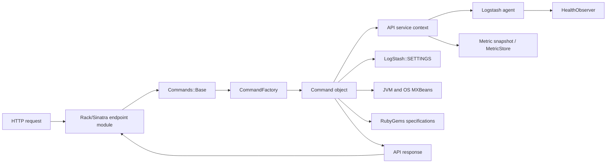
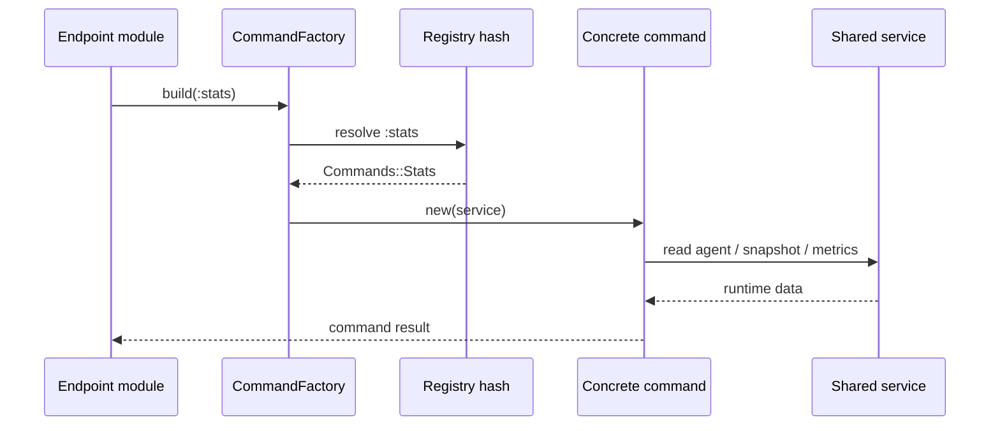
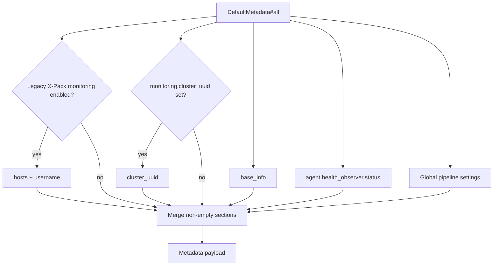
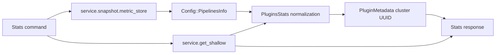
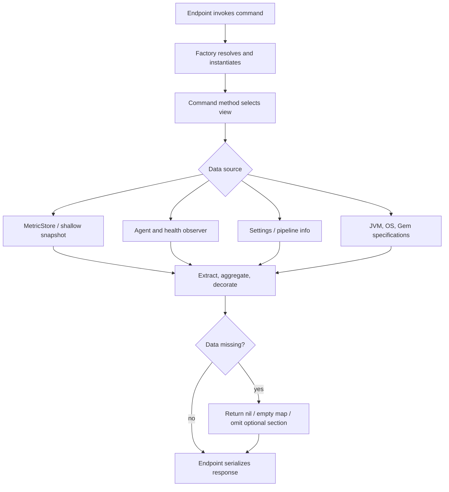

# Monitoring HTTP API command layer

The `monitoring_http_api_command_layer` module implements the command objects used by Logstash’s monitoring HTTP API. It translates a symbolic command path into a command class, injects the API service context, and exposes operational data such as node metadata, health, JVM/OS state, pipeline statistics, and installed plugins.

This layer is intentionally separate from HTTP transport and URL routing. The listener, Rack middleware, authentication, and namespace dispatch are documented in [monitoring_http_api_server_and_routing.md](monitoring_http_api_server_and_routing.md). Sinatra endpoint modules that select commands and shape HTTP responses are documented in [monitoring_http_api_endpoint_modules.md](monitoring_http_api_endpoint_modules.md). The command layer reads existing runtime observations; metric production and hierarchical lookup belong to [metrics_and_instrumentation.md](metrics_and_instrumentation.md) and [metric_store_and_hierarchical_lookup.md](metric_store_and_hierarchical_lookup.md).

## Role in the system

Commands are instantiated with a shared `service`. In normal operation this service provides access to the running agent, a metric snapshot, shallow metric lookup, and API-related state such as the bound HTTP address. Every command therefore presents a read-oriented facade over live Logstash state.

The command layer sits between endpoint modules and several independent data owners:

| Boundary | Responsibility | Related documentation |
| --- | --- | --- |
| API server and routing | Listener lifecycle, Rack middleware, authentication, namespace dispatch | [monitoring_http_api_server_and_routing.md](monitoring_http_api_server_and_routing.md) |
| Endpoint modules | URL routes, request parameters, command invocation, response serialization | [monitoring_http_api_endpoint_modules.md](monitoring_http_api_endpoint_modules.md) |
| Command layer | Lookup and aggregation of command results | This document |
| Metrics | Counters, gauges, snapshots, and hierarchical lookup | [metrics_and_instrumentation.md](metrics_and_instrumentation.md), [metric_store_and_hierarchical_lookup.md](metric_store_and_hierarchical_lookup.md) |
| Health | Status, indicators, diagnoses, and impacts | [health_reporting.md](health_reporting.md) |
| Pipeline state | Pipeline lifecycle, registry state, and execution reporting | [pipeline_lifecycle_and_execution.md](pipeline_lifecycle_and_execution.md), [pipeline_lifecycle_and_execution_reporting.md](pipeline_lifecycle_and_execution_reporting.md) |
| Pipeline configuration | Pipeline metadata and extended pipeline representation | [configuration_sources_and_loading_pipeline_representation.md](configuration_sources_and_loading_pipeline_representation.md) |
| Plugin inventory and execution | Plugin registry, plugin instances, and plugin statistics | [plugin_api_and_registry.md](plugin_api_and_registry.md), [event_processing_and_extensibility.md](event_processing_and_extensibility.md) |

## Command registry and construction

`LogStash::Api::CommandFactory` owns a fixed symbolic registry. Its constructor stores the service and maps command keys to concrete classes:

| Command path | Class | Main entry points |
| --- | --- | --- |
| `:system_basic_info` | `Commands::System::BasicInfo` | `run` |
| `:plugins_command` | `Commands::System::Plugins` | `run` |
| `:stats` | `Commands::Stats` | `queue`, `jvm`, `reloads`, `process`, `events`, `flow`, `pipeline`, `memory`, `os`, `gc`, `hot_threads`, `geoip` |
| `:node` | `Commands::Node` | `all`, `pipelines`, `pipeline`, `os`, `jvm`, `hot_threads` |
| `:health_report` | `Commands::HealthReport` | `all` |
| `:default_metadata` | `Commands::DefaultMetadata` | `all`, `base_info` |

`build(*klass_path)` reduces the supplied symbols through the registry and calls `klass.new(service)`. A missing path raises `ArgumentError` with the requested path, making unknown command names a programming/configuration error rather than silently returning an empty response. The registry is flat in the supplied implementation, although the reducer supports nested paths such as `(:system, :plugins)` if the registry is extended in that shape.

All concrete commands inherit from `Commands::Base`, which supplies the common service-facing helpers such as `extract_metrics` and the service reference. The base class is a framework dependency of this module; its HTTP/error behavior is covered with the endpoint base in [monitoring_http_api_server_and_routing.md](monitoring_http_api_server_and_routing.md).

## Command behavior

### DefaultMetadata

`DefaultMetadata#all` builds the default node metadata payload from three layers:

1. `base_info`: hostname, Logstash version, HTTP address, agent ID/name, ephemeral ID, and the build snapshot flag.
2. `status` and `pipeline`: health observer status plus `pipeline.workers`, `pipeline.batch.size`, and `pipeline.batch.delay` from global settings.
3. Optional `monitoring`: Elasticsearch hosts and username when legacy X-Pack monitoring collection is enabled, and `monitoring.cluster_uuid` when that setting is set.

The hostname is cached at the class-variable level and the HTTP address is cached per command instance. If the HTTP address metric is unavailable, `http_address` returns `nil` instead of failing metadata generation. Optional monitoring fields are omitted entirely when unavailable, so consumers should not assume the `monitoring` object exists.

### HealthReport

`HealthReport#all` delegates directly to `service.agent.health_observer.report`. It does not filter `selected_fields`, transform indicators, or calculate health itself. The returned structure and health semantics are owned by the health subsystem; see [health_reporting.md](health_reporting.md). This direct delegation keeps the API representation aligned with the observer’s current indicator, diagnosis, impact, and status model.

### Node

`Node#all(selected_fields = [])` returns `pipelines`, `os`, and `jvm`. When fields are supplied, the result is restricted to those top-level keys. Pipeline data is read from the `stats.pipelines` metric namespace. For each pipeline, `pipeline` extracts configuration metadata including:

- ephemeral ID and pipeline hash;
- workers, batch size, and batch delay;
- automatic reload settings and reload interval;
- persisted queue and dead-letter-queue settings.

With `options[:graph]`, the command additionally returns the pipeline graph and decorates graph vertices with an Elasticsearch cluster UUID when plugin metadata can resolve the vertex’s plugin ID. Decoration copies the vertex rather than mutating the metric-derived object. Missing pipeline metrics are treated as an empty result.

The `os` section uses Java system properties and the runtime processor count. The `jvm` section reports process ID, Java/VM identity, start time, heap and non-heap initialization/max values, and garbage collector names. Negative MXBean memory values are normalized to zero. `hot_threads` creates a `HotThreadsReport` for the separate diagnostic workflow.

### Stats

`Stats` is the main aggregation command for operational counters. It provides the following views:

| Method | Result and source |
| --- | --- |
| `queue` | Total queued events across non-system pipelines whose queue type is `persisted`; missing metrics return `{}`. |
| `jvm` | JVM thread counts, memory, GC, and uptime. |
| `reloads` | Reload counters from `stats.reloads`. |
| `process` | File descriptors, virtual memory, CPU totals/percent/load average. |
| `events` | Input, filtered, output, duration, and queue-push duration counters; unpopulated metrics return `{}`. |
| `flow` | Input/filter/output throughput, queue backpressure, and worker concurrency; unpopulated metrics return `{}`. |
| `pipeline(pipeline_id = nil, opts = {})` | Plugin and pipeline statistics for all pipelines or one selected pipeline. |
| `memory` | JVM heap/non-heap values and memory pools; pool committed bytes are removed from the returned pool hashes. |
| `os` | Shallow OS metrics, or `{}` when unavailable. |
| `gc` | Shallow JVM GC metrics. |
| `hot_threads` | Constructs a hot-thread diagnostic report. |
| `geoip` | GeoIP download-manager metrics, or `{}` when the manager is absent. |

Pipeline reporting combines shallow per-pipeline metrics with `Config::PipelinesInfo.format_pipelines_info`. The nested `PluginsStats` helper converts plugin hashes keyed by instance ID into arrays of objects containing an `id`, preserving separate data points for each input, codec, filter, and output. It also includes events, flow, reloads, queue, pipeline batch settings, and dead-letter-queue data when present. Optional extended data adds the pipeline hash, ephemeral ID, queue fields, and—when `opts[:vertices]` is true—graph vertices decorated with plugin cluster UUID metadata.

The queue aggregation deliberately excludes system pipelines and non-persisted queues. This prevents internal/system traffic and memory queues from being represented as persisted backlog. Several methods rescue `MetricNotFound` (or, for compatibility paths, broadly rescue unavailable OS/GeoIP/pipeline data) and return an empty structure; callers should distinguish “no metric populated yet” from a populated zero value.

### System commands

`System::BasicInfo#run` returns the global `BUILD_INFO` structure from `logstash/build`, including build and packaging metadata. It does not query the agent or metrics.

`System::Plugins#run` returns `{ total:, plugins: }`. It scans `Gem::Specification.find_all`, selects specifications whose metadata contains `logstash_plugin == "true"`, maps each to name and version, and sorts by plugin name. The result is memoized at both discovery and normalized-list levels for the lifetime of the command object. This is an installed-gem inventory, not a report of currently instantiated pipeline plugins.

## Data-flow and failure semantics

The commands are read-only in the supplied implementation. They do not start/stop pipelines, change settings, mutate metrics, or modify plugin installation. Their principal consistency rule is to preserve the established metric hierarchy and return API-friendly hashes/arrays. Where a metric is not yet registered, commands generally fail soft with `{}`, `nil`, or an omitted optional section; health reporting is the exception in that it delegates the observer’s report directly.

## Extension and maintenance guidance

To add a command:

1. Implement a class under `logstash/api/commands` inheriting `Commands::Base`.
2. Require it from `command_factory.rb`.
3. Add a symbolic entry to `CommandFactory#factory`.
4. Connect it from an endpoint module and document the route there; do not place Rack routing in the command.
5. Reuse `extract_metrics` and established metric names instead of introducing a parallel storage format.
6. Add tests for missing metrics, optional fields, and any selected-field/options behavior.

When changing response fields, update the endpoint documentation and any X-Pack monitoring consumers together. Pipeline graph decoration depends on stable plugin IDs and `LogStash::PluginMetadata`; changes to plugin metadata are described with the plugin subsystem rather than duplicated here.

## Component references

- `logstash-core/lib/logstash/api/command_factory.rb` — `LogStash::Api::CommandFactory`
- `logstash-core/lib/logstash/api/commands/default_metadata.rb` — `DefaultMetadata`
- `logstash-core/lib/logstash/api/commands/health_report.rb` — `HealthReport`
- `logstash-core/lib/logstash/api/commands/node.rb` — `Node`
- `logstash-core/lib/logstash/api/commands/stats.rb` — `Stats` and `Stats::PluginsStats`
- `logstash-core/lib/logstash/api/commands/system/basicinfo_command.rb` — `System::BasicInfo`
- `logstash-core/lib/logstash/api/commands/system/plugins_command.rb` — `System::Plugins`

