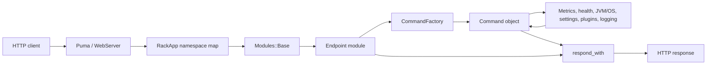
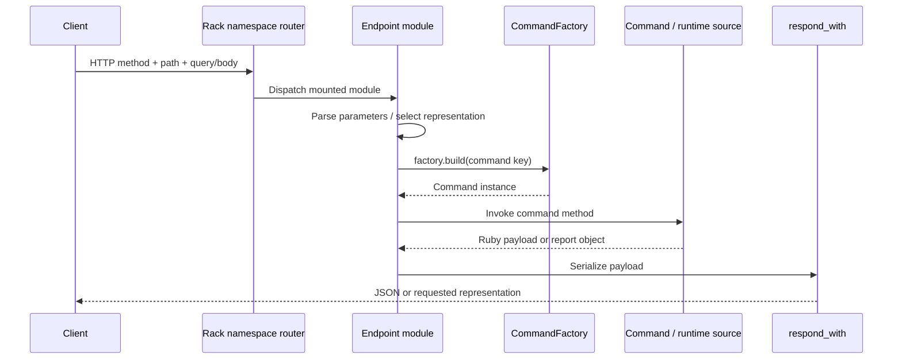
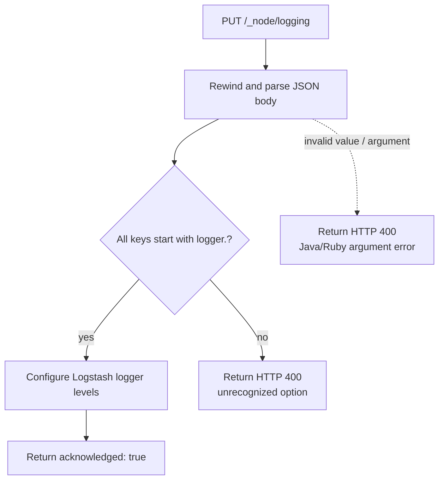
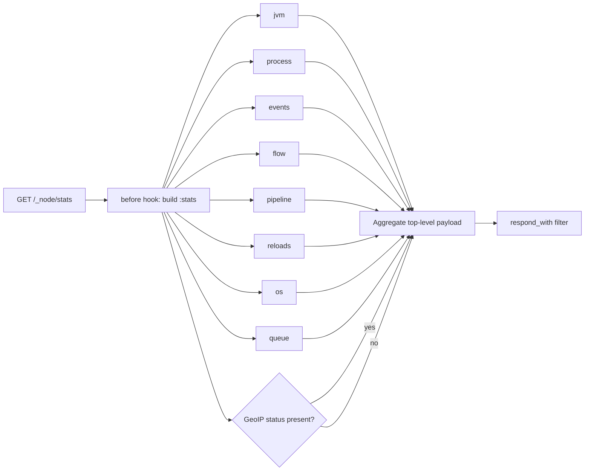

# Monitoring HTTP API endpoint modules

The `monitoring_http_api_endpoint_modules` module contains the Sinatra endpoint classes mounted by Logstash’s monitoring HTTP API. These classes define the public route contract, parse request parameters, invoke command objects, and shape command results into JSON or human-readable responses. They do not own the HTTP listener, Rack middleware, metric collection, or health calculations.

The listener and namespace mounts are described in [monitoring_http_api_server_and_routing.md](monitoring_http_api_server_and_routing.md). Command construction and runtime-data aggregation are described in [monitoring_http_api_command_layer.md](monitoring_http_api_command_layer.md). This document focuses on the six endpoint modules in the current module tree.

## Position in the API architecture

`RackApp` mounts each endpoint module below a namespace. A request enters through Puma and Rack, is dispatched to one module, and is then handled by a route. The route either builds a command through the shared `Base` factory or uses an endpoint-specific command helper.



The endpoint layer therefore has four responsibilities:

1. Match a route within its mounted namespace.
2. Convert query parameters and request bodies into command options.
3. Handle endpoint-level validation and not-found cases.
4. Select the response representation and omit or add endpoint-specific metadata.

The shared `Modules::Base` contract, Rack error handling, authentication, and TLS behavior belong to [monitoring_http_api_server_and_routing.md](monitoring_http_api_server_and_routing.md). The underlying health model is documented in [health_reporting.md](health_reporting.md); metric production and lookup are documented in [metrics_and_instrumentation.md](metrics_and_instrumentation.md) and [metric_store_and_hierarchical_lookup.md](metric_store_and_hierarchical_lookup.md).

## Mounted modules and route inventory

The effective URL is the mounted namespace plus the route declared by the module.

| Module | Mounted namespace | Routes | Primary delegate |
| --- | --- | --- | --- |
| `HealthReport` | `/_health_report` | `GET /` | `:health_report` command |
| `Logging` | `/_node/logging` | `GET /`, `PUT /`, `PUT /reset` | Log4j logging context and logger API |
| `Node` | `/_node` | `GET /`, `GET /hot_threads`, `GET /pipelines`, `GET /pipelines/:id` | `:node` command |
| `NodeStats` | `/_node/stats` | `GET /`, `GET /pipelines`, `GET /pipelines/:id` | `:stats` command |
| `Plugins` | `/_node/plugins` | `GET /` | `:plugins_command` command |
| `Stats` | `/_stats` | `GET /`, `GET /jvm/memory`, `GET /jvm/hot_threads` | `:stats` command |

The namespace-to-class mapping is maintained by `RackApp`; see [monitoring_http_api_server_and_routing.md](monitoring_http_api_server_and_routing.md) for the complete Rack composition and lifecycle.

## Shared endpoint behavior

All six classes inherit from `LogStash::Api::Modules::Base`. This supplies the Sinatra endpoint context, the command factory, response helpers, field/filter helpers, and common API error handling. Endpoint modules should consequently return Ruby hashes or command results through `respond_with` rather than manually constructing Rack response tuples.

The normal request path is:



Most routes are read-only. The exception is `Logging#PUT /`, which changes logger levels, and `Logging#PUT /reset`, which asks Log4j to reconfigure its context.

## Health report endpoint

`HealthReport` is mounted at `/_health_report` and exposes `GET /`.

```ruby
GET /_health_report
```

The route builds the `:health_report` command and calls `all`. The command returns a health-report POJO, so the endpoint explicitly creates a Ruby hash for the API helper:

- `status`
- `symptom`
- `indicators`

It merges these fields with `default_metadata.base_info` and calls `respond_with` with `exclude_default_metadata: true`. The option is important: the endpoint supplies its own base metadata and prevents the response helper from adding a second default-metadata block.

```mermaid
flowchart TD
    REQUEST[GET /_health_report]
    COMMAND[factory.build(:health_report)]
    OBSERVER[Health observer report]
    META[default_metadata.base_info]
    HASH[Merge status, symptom, indicators, base metadata]
    RESPONSE[respond_with
    exclude_default_metadata: true]

    REQUEST --> COMMAND --> OBSERVER --> HASH
    META --> HASH --> RESPONSE
```

The endpoint does not determine health status or interpret indicators. Consumers needing the meaning of statuses, diagnoses, impacts, and probes should use [health_reporting.md](health_reporting.md).

## Logging endpoint

`Logging` is mounted at `/_node/logging` and is the control-plane endpoint in this module set.

### Read current logger levels

```ruby
GET /_node/logging
```

The route obtains the Log4j `LoggerContext`, enumerates its loggers, and returns sorted logger names and level names:

```json
{
  "loggers": {
    "": "INFO",
    "logstash.runner": "DEBUG"
  }
}
```

If the logging context is unavailable, it returns HTTP 500 with an error message. Sorting makes the result deterministic for callers and tests.

### Change logger levels

```ruby
PUT /_node/logging
Content-Type: application/json
```

The request body is parsed as JSON. Keys beginning with `logger.` are interpreted as logger paths; the suffix after `logger.` and the supplied value are passed to `LogStash::Logging::Logger.configure_logging`. For example:

```json
{
  "logger.logstash.agent": "debug"
}
```

Every non-`logger.` key is retained as an unused option. If any remain, the endpoint raises a localized `ArgumentError` naming the first unrecognized option. `IllegalArgumentException` from the Java logging bridge and Ruby `ArgumentError` both become HTTP 400 responses:

```json
{"error":"..."}
```

Successful updates return `{"acknowledged":true}`. The body is rewound before reading, which allows the route to consume a Rack request body reliably.

### Reset logging configuration

```ruby
PUT /_node/logging/reset
```

The route calls `LoggerContext#reconfigure`. It returns an acknowledgement on success, or HTTP 500 if Logstash’s logging context was not initialized.



The endpoint changes logging state but does not document Log4j configuration internals; those belong to the logging subsystem represented in the module tree.

## Node endpoint

`Node` is mounted at `/_node` and exposes node identity, pipeline descriptions, and hot-thread diagnostics.

### Node information

```ruby
GET /_node
GET /_node/:filter
```

The optional route segment is treated as a field filter. `extract_fields` parses the requested fields, and `node.all(selected_fields)` returns the selected node information. An empty result raises `NotFoundError`, which is handled by the shared API error behavior.

### Pipeline descriptions

```ruby
GET /_node/pipelines
GET /_node/pipelines/:id
```

Both routes accept:

- `graph=true|false`
- `vertices=true|false`

The flags are converted with `as_boolean` and passed to `node.pipelines` or `node.pipeline`. The collection route returns `{"pipelines": ...}`. The single-pipeline route returns `{"pipelines": {"<id>": ...}}` and responds with HTTP 404 when the command returns an empty payload.

`graph` requests the pipeline graph; `vertices` requests vertex details. The pipeline representation and configuration metadata are produced by the command layer and configuration subsystem, not by this endpoint. See [monitoring_http_api_command_layer.md](monitoring_http_api_command_layer.md) and [configuration_sources_and_loading_pipeline_representation.md](configuration_sources_and_loading_pipeline_representation.md).

### Hot threads

```ruby
GET /_node/hot_threads
```

Supported query parameters are:

- `ignore_idle_threads`
- `threads`
- `ordered_by`
- `stacktrace_size`

The endpoint converts `ignore_idle_threads` with `as_boolean`, converts `threads` to an integer when present, and forwards the remaining options to `node.hot_threads`. The response is JSON by default and becomes a string when the request is recognized as `human?`. Invalid arguments are returned as HTTP 400 JSON errors.

The implementation defaults `ignore_idle_threads` using `params["ignore_idle_threads"] || true`; callers should therefore provide an explicit parseable value when they need non-default behavior. Thread collection and diagnostic formatting are owned by the runtime monitoring layer; see [runtime_resource_monitoring_thread_diagnostics.md](runtime_resource_monitoring_thread_diagnostics.md).

## Node statistics endpoint

`NodeStats` is mounted at `/_node/stats`. A `before` hook creates one `:stats` command per request and stores it in `@stats`, so all sections in a response read through the same command instance.

### Full node statistics

```ruby
GET /_node/stats
GET /_node/stats/:filter
```

The route assembles these top-level sections:

| Section | Command method |
| --- | --- |
| `jvm` | `@stats.jvm` |
| `process` | `@stats.process` |
| `events` | `@stats.events` |
| `flow` | `@stats.flow` |
| `pipelines` | `pipeline_payload` / `@stats.pipeline` |
| `reloads` | `@stats.reloads` |
| `os` | `@stats.os` |
| `queue` | `@stats.queue` |
| `geoip_download_manager` | `@stats.geoip`, when populated |

The optional `filter` is passed to `respond_with`, allowing the shared response helper to select fields. `vertices=true|false` is read for pipeline statistics and passed as `{:vertices => ...}`. GeoIP data is included only when it is non-empty and its download status has a non-nil value.

### Pipeline statistics

```ruby
GET /_node/stats/pipelines
GET /_node/stats/pipelines/:id
```

The optional pipeline ID is passed to `@stats.pipeline`. An empty result produces HTTP 404; otherwise the route returns a `pipelines` object. `vertices` is supported here as well.



The endpoint is an assembly layer. Definitions of counters, flow-rate calculations, queue statistics, JVM/process metrics, and pipeline plugin statistics are in [monitoring_http_api_command_layer.md](monitoring_http_api_command_layer.md), [metrics_and_instrumentation.md](metrics_and_instrumentation.md), [runtime_resource_monitoring.md](runtime_resource_monitoring.md), [persistent_queue.md](persistent_queue.md), and [xpack_geoip_database_management.md](xpack_geoip_database_management.md).

## Plugins endpoint

`Plugins` is mounted at `/_node/plugins` and exposes one read-only route:

```ruby
GET /_node/plugins
```

The route builds `:plugins_command`, calls `run`, and serializes the result unchanged. The command reports installed Logstash plugin gems; it is not a live inventory of plugin instances in each pipeline. See [monitoring_http_api_command_layer.md](monitoring_http_api_command_layer.md) for discovery and filtering semantics, and [plugin_manager.md](plugin_manager.md) for plugin installation and lifecycle behavior.

## Stats endpoint

`Stats` is mounted at `/_stats` and provides the compact statistics API.

### Summary statistics

```ruby
GET /_stats
GET /_stats/:filter
```

The route builds a `:stats` command and returns:

- `events`: event counters and durations;
- `jvm.timestamp`: process start time;
- `jvm.uptime_in_millis`: process uptime;
- `jvm.memory`: JVM memory details;
- `os`: operating-system statistics.

The optional filter is passed to `respond_with`.

### JVM memory

```ruby
GET /_stats/jvm/memory
```

This returns the command’s memory payload under a `memory` key. No query parameters are interpreted by the endpoint.

### JVM hot threads

```ruby
GET /_stats/jvm/hot_threads
```

The route accepts `threads` and `ignore_idle_threads`, defaulting to 10 threads and idle-thread exclusion. It converts `threads` to an integer and `ignore_idle_threads` with `as_boolean`, then calls `stats_command.hot_threads`. Invalid arguments result in HTTP 400 JSON errors.

```mermaid
flowchart TD
    STATS[Stats namespace]
    SUMMARY[GET /]
    MEMORY[GET /jvm/memory]
    HOT[GET /jvm/hot_threads]
    CMD[factory.build(:stats)]
    EVENTS[events]
    JVM[jvm / memory]
    OS[os]
    THREADS[hot_threads(options)]
    JSON[respond_with]

    STATS --> SUMMARY --> CMD
    STATS --> MEMORY --> CMD
    STATS --> HOT --> CMD
    CMD --> EVENTS --> JSON
    CMD --> JVM --> JSON
    CMD --> OS --> JSON
    CMD --> THREADS --> JSON
```

The distinction between `/_stats` and `/_node/stats` is intentional: `Stats` exposes a compact summary and dedicated JVM routes, while `NodeStats` assembles the broader node operational payload, including process, flow, queue, reload, pipeline, and optional GeoIP sections.

## Cross-cutting process and maintenance notes

### Response and error boundaries

Endpoint-level argument errors are handled locally where a route invokes `as_boolean`, integer conversion, hot-thread collection, or logging configuration. Known API errors and not-found behavior are handled by `Modules::Base`; unexpected failures are converted by the Rack error handler in non-test environments. The complete error boundary is documented in [monitoring_http_api_server_and_routing.md](monitoring_http_api_server_and_routing.md).

### Data freshness and consistency

The endpoints read live command and metric state at request time. `NodeStats` intentionally reuses one command object during a request, but it does not create a transaction over the underlying metric store. Different sections can therefore reflect slightly different observation times. Empty maps or omitted optional sections generally indicate unavailable/unpopulated metrics rather than endpoint failure; command-specific semantics are documented in [monitoring_http_api_command_layer.md](monitoring_http_api_command_layer.md).

### Extension points

To add an endpoint, maintainers generally need to:

1. Implement a class under `logstash-core/lib/logstash/api/modules` inheriting from `Modules::Base`.
2. Define routes relative to the desired namespace.
3. Use an existing command or add a command/factory entry when new aggregation logic is required.
4. Add the class to `RackApp.rack_namespaces`.
5. Preserve the shared response, filtering, boolean-conversion, and error conventions.
6. Add route and failure-mode coverage at the API boundary.

Changes that only alter endpoint selection or response shape belong here. Changes to metric collection, health semantics, pipeline representation, plugin discovery, or logging internals should be documented with and tested in their owning modules, then referenced from this layer.

## Component reference

| Component | Source |
| --- | --- |
| `HealthReport` | `logstash-core/lib/logstash/api/modules/health_report.rb` |
| `Logging` | `logstash-core/lib/logstash/api/modules/logging.rb` |
| `Node` | `logstash-core/lib/logstash/api/modules/node.rb` |
| `NodeStats` | `logstash-core/lib/logstash/api/modules/node_stats.rb` |
| `Plugins` | `logstash-core/lib/logstash/api/modules/plugins.rb` |
| `Stats` | `logstash-core/lib/logstash/api/modules/stats.rb` |

