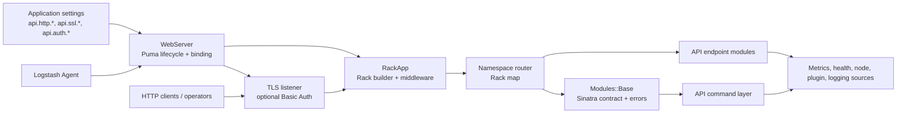
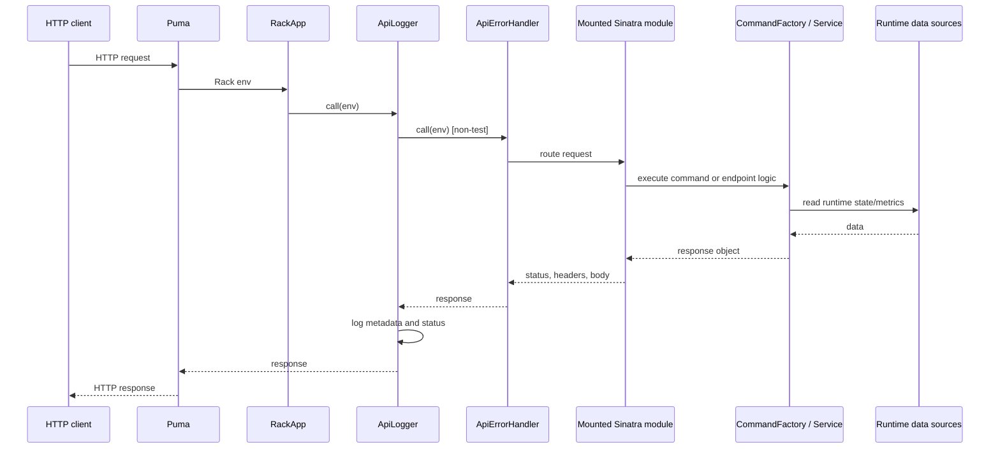
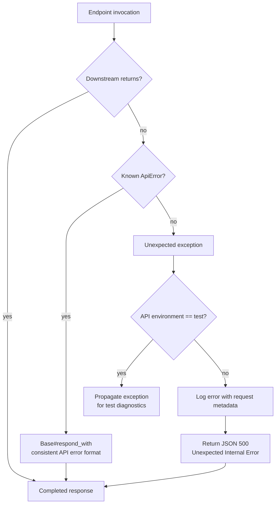
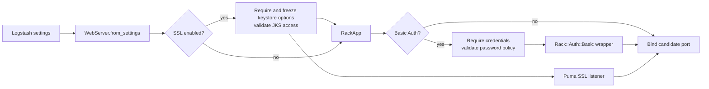
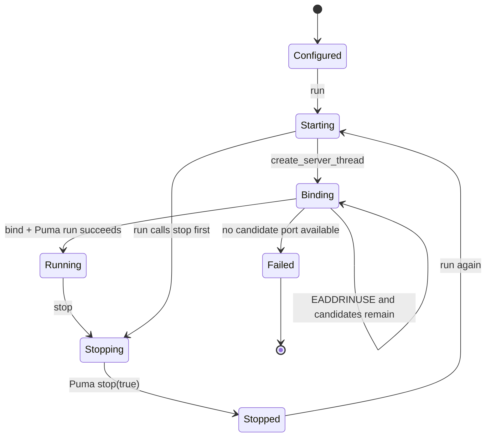
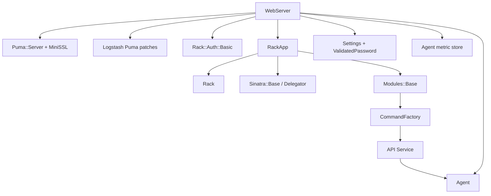

# Monitoring HTTP API server and routing

The `monitoring_http_api_server_and_routing` module owns the HTTP boundary for Logstash’s operational API. It converts API settings into a Puma server, optionally enables TLS and Basic Authentication, builds the Rack middleware stack, maps URL namespaces to Sinatra endpoint modules, and provides consistent request and error handling.

The API’s command implementations are documented in [monitoring_http_api_command_layer.md](monitoring_http_api_command_layer.md), while endpoint-specific Sinatra modules are documented in [monitoring_http_api_endpoint_modules.md](monitoring_http_api_endpoint_modules.md). This module passes requests to those layers; it does not own their response data or command semantics.

## Position in the system



The server is created by `WebServer.from_settings(logger, agent, settings)`. The `agent` reference is passed into the Rack application and then into every mounted API module, giving endpoint code access to the running collector. Metrics and runtime observations come from the observability modules, especially [metrics_and_instrumentation.md](metrics_and_instrumentation.md), [health_reporting.md](health_reporting.md), and [runtime_resource_monitoring.md](runtime_resource_monitoring.md).

## Components and responsibilities

| Component | Responsibility | Boundary |
| --- | --- | --- |
| `LogStash::WebServer` | Reads effective API options, validates secure configuration, owns Puma creation, binding, start/stop state, and the bound address | Process/server boundary |
| `RackApp` | Creates the Rack application and installs logging, error handling, root dispatch, and namespace mounts | Rack composition boundary |
| `ApiLogger` | Logs every completed request at debug level, or error level for 5xx responses | Request observability |
| `ApiErrorHandler` | Converts unexpected production/dev exceptions into a JSON 500 response | Failure containment |
| `Modules::Base` | Shared Sinatra base class; creates a `CommandFactory`, enables common helpers, and standardizes 404/API errors | Endpoint framework contract |
| `CommandFactory` and command classes | Resolve and execute API commands | [monitoring_http_api_command_layer.md](monitoring_http_api_command_layer.md) |
| Mounted endpoint modules | Implement namespace-specific routes and response assembly | [monitoring_http_api_endpoint_modules.md](monitoring_http_api_endpoint_modules.md) |

## Rack composition and routing

`RackApp.app` builds one Rack application. The order of the middleware and dispatch layers is significant:

```mermaid
flowchart TD
    REQ[Incoming HTTP request]
    LOG[ApiLogger]
    ENV{environment == test?}
    ERR[ApiErrorHandler\nproduction / development]
    ROOT[Root Sinatra module\nrequests outside mapped namespaces]
    MAP[Rack map]
    HEALTH[/ _health_report]
    NODE[/ _node]
    STATS[/ _stats]
    NODESTATS[/ _node/stats]
    PLUGINS[/ _node/plugins]
    LOGGING[/ _node/logging]
    RESP[HTTP response]

    REQ --> LOG
    LOG --> ENV
    ENV -- no --> ERR
    ENV -- yes --> ROOT
    ERR --> ROOT
    ROOT --> MAP
    MAP --> HEALTH
    MAP --> NODE
    MAP --> STATS
    MAP --> NODESTATS
    MAP --> PLUGINS
    MAP --> LOGGING
    ROOT --> RESP
    HEALTH --> RESP
    NODE --> RESP
    STATS --> RESP
    NODESTATS --> RESP
    PLUGINS --> RESP
    LOGGING --> RESP
    RESP --> LOG
```

The namespace table is defined centrally by `RackApp.rack_namespaces`:

| Namespace | Sinatra module | Typical concern |
| --- | --- | --- |
| `/_health_report` | `Modules::HealthReport` | Structured health status and diagnoses |
| `/_node` | `Modules::Node` | Node-level information and commands |
| `/_stats` | `Modules::Stats` | Pipeline and node statistics |
| `/_node/stats` | `Modules::NodeStats` | Node resource/runtime statistics |
| `/_node/plugins` | `Modules::Plugins` | Installed plugin information |
| `/_node/logging` | `Modules::Logging` | Logging configuration and controls |

The root module is also mounted with `run`. Because Rack dispatch first checks the root application and then mapped namespaces as composed by the builder, route implementation details belong to the endpoint-module documentation. The important integration rule is that each mounted class is instantiated as `app.new(nil, agent)`, so all modules receive the same agent instance.

## Request processing



`ApiLogger` records `request_method`, `path_info`, `query_string`, `http_version`, and `http_accept`, together with the response status, under the message `API HTTP Request`. Statuses from 500 through 599 are logged at error level; all other completed requests are logged at debug level. It logs after the downstream application returns, so the status in the log is the final response status.

## Error handling and response behavior

There are two distinct error paths:

1. `Modules::Base` handles known `ApiError` instances with `respond_with(error)`. Its `not_found` handler creates a `NotFoundError` and passes it through the same response formatter.
2. In non-test environments, `ApiErrorHandler` catches unexpected exceptions from downstream Rack/Sinatra code and returns status 500 with `Content-Type: application/json`.

Unexpected errors are serialized with request metadata plus `error`, exception `class`, `message`, and `backtrace`. This prevents an endpoint exception from terminating the Logstash process. In the `test` environment the custom handler is deliberately omitted so failures propagate to tests and retain their natural stack traces.



Sinatra’s base settings are fixed to production-style behavior: `raise_errors` is enabled and `show_exceptions` is disabled. This is intentional because runtime error propagation is controlled by `ApiErrorHandler`, not by Sinatra’s built-in HTML exception pages.

## Configuration and security

`WebServer.from_settings` translates settings into immutable option hashes before constructing the server.

### Listener

- `api.http.host` selects the bind address.
- `api.http.port` supplies an enumerable of candidate ports. Defaults in the constructor are host `127.0.0.1` and ports `9600..9700` when options are absent.
- `api.environment` controls the Rack error-handler behavior; the default is `production`.
- If `api.http.host` is not explicitly set and both TLS and Basic Auth are enabled, the host is changed to `0.0.0.0` so the secured API is reachable on all interfaces.

### TLS

When `api.ssl.enabled` is true, the server requires:

- `api.ssl.keystore.path`
- `api.ssl.keystore.password`

It optionally passes `api.ssl.supported_protocols` to Puma’s `MiniSSL::ContextBuilder`. Before binding any port, `validate_keystore_access!` opens the JKS keystore using the supplied password. Failure is raised as an `ArgumentError`, which makes bad credentials or an inaccessible file fail during initialization rather than after the listener has been exposed.

When TLS is disabled, explicitly supplied `api.ssl.*` settings are warned as ignored.

### Basic Authentication

When `api.auth.type` is `basic`, the Rack application is wrapped with `Rack::Auth::Basic`. The username and password are required, and the password is validated through `Setting::ValidatedPassword` using the configured password policy:

- `api.auth.basic.password_policy.mode`
- `api.auth.basic.password_policy.length.minimum`, constrained to 8–1024
- upper-case, lower-case, digit, and symbol inclusion flags

The password-policy mode has a changing-default warning when it is not explicitly configured. When Basic Auth is disabled, explicitly supplied `api.auth.basic.*` settings are warned as ignored.



The diagram shows configuration decisions conceptually; TLS is applied at the Puma listener while Basic Auth wraps the Rack application. Both may be enabled simultaneously.

## Server lifecycle and port selection



`run` first calls `stop` to make repeated starts safe, marks the server running, creates the Puma server thread, and joins it. The running flag is a `Concurrent::AtomicBoolean`; server replacement and stopping are protected by a mutex.

Port binding tries each value in `http_ports` in order. A single occupied candidate raises an error immediately. For a range, occupied ports are skipped until either one succeeds or the final candidate fails, producing a localized “cannot bind to port” error. The listener is TCP when TLS is disabled and SSL when TLS is enabled. After a successful bind, the server records `@port`, logs the endpoint, and writes the `http_address` gauge to the agent metric store when metrics are available.

The public `address` method returns `host:port`, `running?` exposes the atomic lifecycle state, `ssl_enabled?` reports whether SSL options were configured, and `stop` synchronously clears the state and stops Puma.

## Dependency relationships



The direct source-level dependencies are deliberately thin: `WebServer` owns transport and security setup, `RackApp` owns composition, and `Modules::Base` supplies the common endpoint framework. Data production remains in the command, endpoint, health, metrics, and runtime modules linked above.

## Maintenance and extension guidance

- Add a new API namespace in `RackApp.rack_namespaces` and provide a Sinatra module compatible with `Modules::Base`; document its behavior in the endpoint-module document.
- Keep middleware order stable. `ApiLogger` must remain around the downstream application to observe final statuses, and `ApiErrorHandler` must remain outside endpoint execution in non-test environments.
- Preserve the shared `agent` injection path. Endpoint modules and command services rely on the live collector rather than constructing independent runtime state.
- Validate new secure settings before binding the port, following the keystore-access check pattern.
- Keep binding and stop operations under the existing mutex and retain the atomic running flag when changing lifecycle code.
- Update related documentation instead of duplicating command or endpoint response contracts here. Health semantics belong in [health_reporting.md](health_reporting.md), and metric storage/lookup belongs in [metrics_and_instrumentation.md](metrics_and_instrumentation.md).

## Source components

- `logstash-core/lib/logstash/webserver.rb` — `LogStash::WebServer`
- `logstash-core/lib/logstash/api/rack_app.rb` — `LogStash::Api::RackApp::ApiLogger` and Rack composition/error handling
- `logstash-core/lib/logstash/api/modules/base.rb` — `LogStash::Api::Modules::Base`
