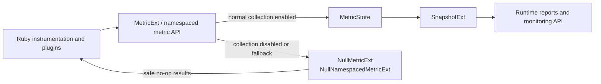
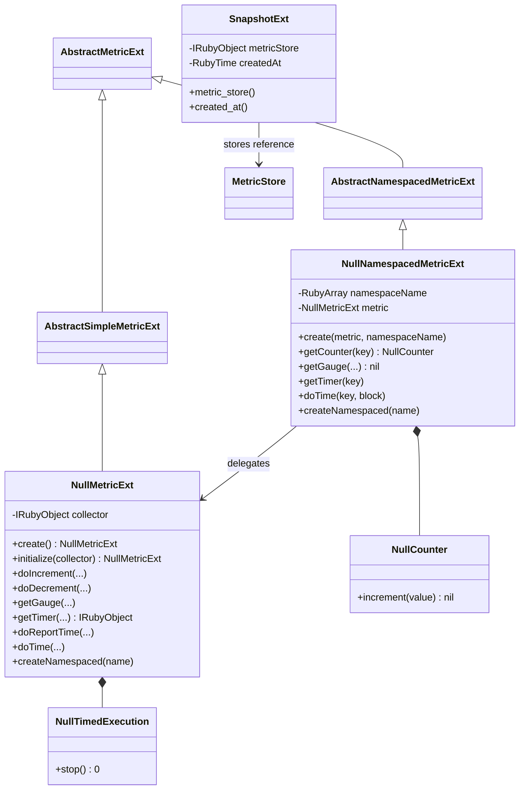
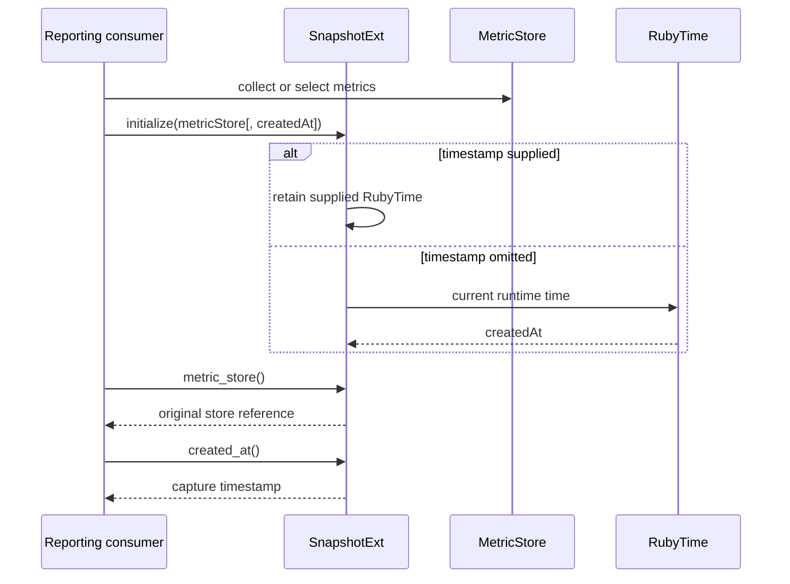

# Null metrics and snapshots

The `null_metrics_and_snapshots` module supplies two complementary observability primitives for Logstash: no-op metric objects that preserve the metric API contract without collecting values, and a `Snapshot` wrapper that associates a metric store with the time at which it was captured. The implementation is Java code exposed to Ruby through JRuby annotations.

This module is intentionally small and sits below the metric API and metric-store layers. `MetricExt` defines the normal operation and validation boundary, while `MetricStore` owns hierarchical registration and lookup. See [metric_api_and_jruby_bridge.md](metric_api_and_jruby_bridge.md) and [metric_store_and_hierarchical_lookup.md](metric_store_and_hierarchical_lookup.md) for those responsibilities.

## Role in the observability architecture



The null implementation is useful when callers need an object with the same shape as a real metric but instrumentation should have no observable storage or timing side effects. It still validates keys and namespace names, so malformed instrumentation does not become silently valid merely because collection is disabled.

## Components

| Component | JRuby class | Responsibility |
| --- | --- | --- |
| `NullMetricExt` | `NullMetric` | Root no-op metric; validates operation inputs, ignores counter/gauge/time reports, and returns a shared null timer metric. |
| `NullNamespacedMetricExt` | `NamespacedNullMetric` | No-op view bound to a namespace path; supports nested namespace creation and delegates timer/block behavior to its root null metric. |
| `NullTimedExecution` | `NullTimedExecution` | Handle returned by handle-based timing; `stop` always returns `0`. |
| `NullCounter` | `NullCounter` | Counter returned from a namespaced null metric; `increment` returns Ruby `nil`. |
| `SnapshotExt` | `Snapshot` | Holds a metric-store reference and capture timestamp for reporting consumers. |

The two null metric classes extend the abstract metric extension hierarchy, allowing callers to use normal metric methods such as `increment`, `decrement`, `gauge`, `timer`, `time`, and `namespace`. The abstract hierarchy and regular implementations are described in [metric_api_and_jruby_bridge.md](metric_api_and_jruby_bridge.md).

## Class relationships



`SnapshotExt` does not extend the metric hierarchy. It is a reporting data carrier, independent of whether the referenced store contains real or null metrics.

## Null metric behavior

### Root metric lifecycle

`NullMetricExt.create()` constructs a `NullMetric` using the shared JRuby runtime and initializes it with no collector. `initialize` accepts an optional collector; when omitted, the collector is Ruby `nil`. The collector is retained so a namespaced view can expose the same collector contract as a normal metric, but the null operations themselves do not push values into it.

```mermaid
sequenceDiagram
    participant R as Ruby caller
    participant N as NullMetricExt
    participant V as NullNamespacedMetricExt
    participant C as Collector reference

    R->>N: NullMetric.create([collector])
    N->>N: initialize; collector = supplied or nil
    R->>N: namespace(:pipeline)
    N->>N: validateName(:pipeline)
    N->>V: create(N, [:pipeline])
    V->>C: expose collector reference
    V-->>R: namespaced no-op view
```

### Operations and return values

The null implementation preserves validation but discards metric state:

| Operation | Validation | Result |
| --- | --- | --- |
| Root `increment` / `decrement` | Validates the key | Ruby `nil` |
| Root gauge lookup/set | Validates the key | Ruby `nil` |
| Root timer lookup | Validates the key | Shared `NullTimerMetric` Ruby object |
| Root `reportTime` | Validates the key | Ruby `nil` |
| Root `time(namespace, key) { block }` | Validates the key | Block result; block is still executed |
| Root `time(namespace, key)` without block | Validates the key | Shared `NullTimedExecution` instance |
| Namespaced counter lookup | Inherited key validation where applicable | Shared `NullCounter` instance |
| Namespaced counter increment/decrement | Normal namespaced dispatch | Ruby `nil` |
| Namespaced gauge lookup | Normal namespaced dispatch | Ruby `nil` |
| Namespaced `reportTime` | Normal namespaced dispatch | Ruby `nil` |
| `NullTimedExecution.stop` | None | Ruby integer `0` |

The block form is an important distinction: disabling metric collection does not skip the instrumented work block. It simply avoids timing and recording it, then returns the block's value. The handle form allows existing code that calls `stop` later to continue operating with a zero duration.

## Namespace composition

`NullNamespacedMetricExt` stores its namespace as a `RubyArray`. Calling `namespace` again appends the new name (or names) to that array and creates another view backed by the same `NullMetricExt` root.

```mermaid
flowchart TD
    ROOT[NullMetricExt] --> N1[namespace(:pipelines)\n[:pipelines]]
    N1 --> N2[namespace(:main)\n[:pipelines, :main]]
    N2 --> OPS[No-op counter, gauge, timer operations]
    ROOT --> OPS_ROOT[Root no-op operations]
    N1 --> COLLECTOR[Same collector reference]
    N2 --> COLLECTOR
```

Namespace names are validated with `MetricExt.validateName`. A scalar name is converted into a one-element Ruby array; an array is appended as a path. This keeps nested null views structurally compatible with real namespaced metrics and prevents invalid empty namespace components.

## Snapshot behavior

`SnapshotExt` is a minimal JRuby-exposed wrapper with two fields:

- `metricStore` is the object supplied as the required first initializer argument. The class does not copy, query, or synchronize that object.
- `createdAt` is an optional `RubyTime`. If omitted, initialization creates a timestamp from the current JRuby runtime time; if supplied, it is cast to `RubyTime`.



The snapshot is therefore a point-in-time marker and reference holder, not a deep immutable copy. Consumers that need stable values must extract or serialize metric values through the store/reporting layer. See [metric_store_and_hierarchical_lookup.md](metric_store_and_hierarchical_lookup.md) for lookup and extraction semantics, and [pipeline_lifecycle_and_execution_reporting_runtime_reporting.md](pipeline_lifecycle_and_execution_reporting_runtime_reporting.md) for runtime reporting consumers.

## End-to-end process flows

### No-op instrumentation

```mermaid
flowchart TD
    START[Instrumentation call] --> VALIDATE{Key/name valid?}
    VALIDATE -- no --> ERROR[JRuby metric validation error]
    VALIDATE -- yes --> ACTION{Operation}
    ACTION -->|counter/gauge/report| NIL[Return nil; no state change]
    ACTION -->|timer lookup| NT[Return null timer metric]
    ACTION -->|time with block| EXEC[Execute caller block]
    ACTION -->|time without block| HANDLE[Return NullTimedExecution]
    HANDLE --> STOP[stop()] --> ZERO[Return 0 milliseconds]
    EXEC --> RESULT[Return block result]
```

### Snapshot handoff

```mermaid
flowchart LR
    PRODUCER[Metric producers] --> STORE[MetricStore]
    STORE --> CAPTURE[Reporting capture]
    CAPTURE --> SNAP[SnapshotExt(metric store, timestamp)]
    SNAP --> REPORTER[Pipeline/runtime reporter]
    REPORTER --> API[Monitoring HTTP API or monitoring event]
```

The snapshot handoff connects this module to the wider observability pipeline without making `SnapshotExt` responsible for output formatting, metric naming, or transport. Those concerns remain in the reporting and monitoring modules.

## Concurrency, memory, and integration considerations

- Null metric instances are effectively stateless apart from their collector and namespace references; operations do not mutate counters, gauges, timers, or stores.
- Shared singleton objects are used for the null timer metric, `NullTimedExecution`, and `NullCounter`, reducing allocation during disabled instrumentation.
- The collector and snapshot store references are `transient`; these Java extension objects are bridges into the live JRuby runtime rather than durable serialized state.
- `SnapshotExt` does not synchronize access to the referenced metric store. Consistency of collection and extraction belongs to `MetricStore` and its callers.
- The null path still performs key/name validation and can therefore raise the same Ruby-visible validation errors as the normal metric path.
- Because a block passed to `time` is executed, the null implementation is safe as a drop-in instrumentation substitute; it changes observability cost, not application control flow.

## Related modules

- [metric_api_and_jruby_bridge.md](metric_api_and_jruby_bridge.md) — normal metric operations, validation, timers, gauges, and Java/JRuby dispatch.
- [metric_store_and_hierarchical_lookup.md](metric_store_and_hierarchical_lookup.md) — metric registration, namespace trees, lookup, extraction, and pruning.
- [pipeline_lifecycle_and_execution_reporting_runtime_reporting.md](pipeline_lifecycle_and_execution_reporting_runtime_reporting.md) — snapshot/reporting consumers in pipeline execution.
- [pipeline_lifecycle_and_execution_reporting.md](pipeline_lifecycle_and_execution_reporting.md) — execution reporting context and lifecycle integration.
- [runtime_foundation_and_configuration.md](runtime_foundation_and_configuration.md) — process-level runtime configuration that controls the surrounding Logstash services.

## Source files

- `logstash-core/src/main/java/org/logstash/instrument/metrics/NullMetricExt.java`
- `logstash-core/src/main/java/org/logstash/instrument/metrics/NullNamespacedMetricExt.java`
- `logstash-core/src/main/java/org/logstash/instrument/metrics/SnapshotExt.java`
