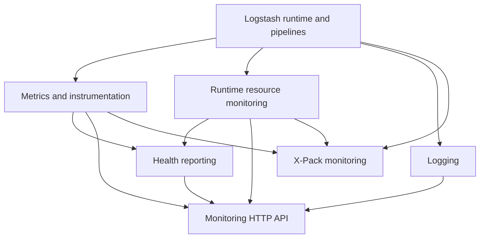
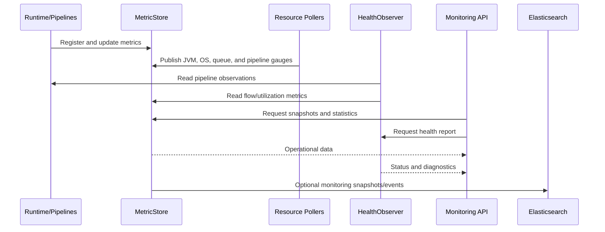

# Observability and Operational Control

## Purpose

The `observability_and_operational_control` module provides Logstash’s runtime visibility and operator-control surface. It collects metrics and resource data, evaluates pipeline health, exposes operational information through an HTTP API, manages structured logging, and optionally ships monitoring data to Elasticsearch.

## Architecture



Metrics form the foundational observability layer. Periodic resource pollers and pipeline instrumentation publish values into the metric store. Health indicators interpret pipeline state and utilization into status, diagnosis, and impact reports. The monitoring API presents these data to operators, while X-Pack monitoring can transform snapshots into Elasticsearch monitoring events.



## Repository structure

```text
observability_and_operational_control/
├── metrics_and_instrumentation/                 logstash-core
│   ├── metric_store_and_hierarchical_lookup
│   ├── metric_api_and_jruby_bridge
│   └── null_metrics_and_snapshots
├── runtime_resource_monitoring/                  logstash-core
├── health_reporting/                             logstash-core/src/main/java/org/logstash/health
├── monitoring_http_api/                          logstash-core/lib/logstash/api
│   ├── monitoring_http_api_server_and_routing
│   ├── monitoring_http_api_command_layer
│   └── monitoring_http_api_endpoint_modules
├── logging/                                      logstash-core/src/main/java/org/logstash/log
│   ├── logging_jruby_bridge
│   ├── logging_event_and_configuration
│   ├── logging_pipeline_routing
│   └── logging_deprecation_buffer
└── xpack_monitoring/                             x-pack/lib/monitoring
```

## Core component documentation

- [Metrics and instrumentation](/home/anhnh/CodeWiki-journal/results/generation/logstash/metrics_and_instrumentation.md)
- [Runtime resource monitoring](/home/anhnh/CodeWiki-journal/results/generation/logstash/runtime_resource_monitoring.md)
- [Health reporting](/home/anhnh/CodeWiki-journal/results/generation/logstash/health_reporting.md)
- [Monitoring HTTP API](/home/anhnh/CodeWiki-journal/results/generation/logstash/monitoring_http_api.md)
- [Logging](/home/anhnh/CodeWiki-journal/results/generation/logstash/logging.md)
- [X-Pack monitoring](/home/anhnh/CodeWiki-journal/results/generation/logstash/xpack_monitoring.md)