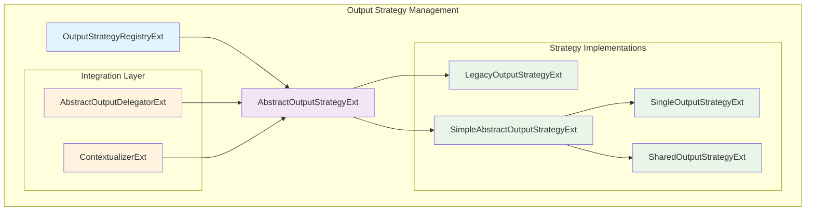
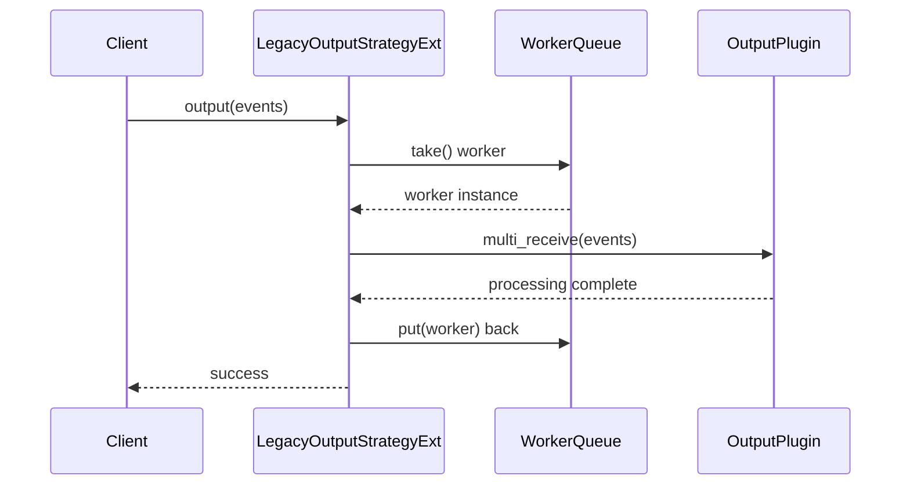
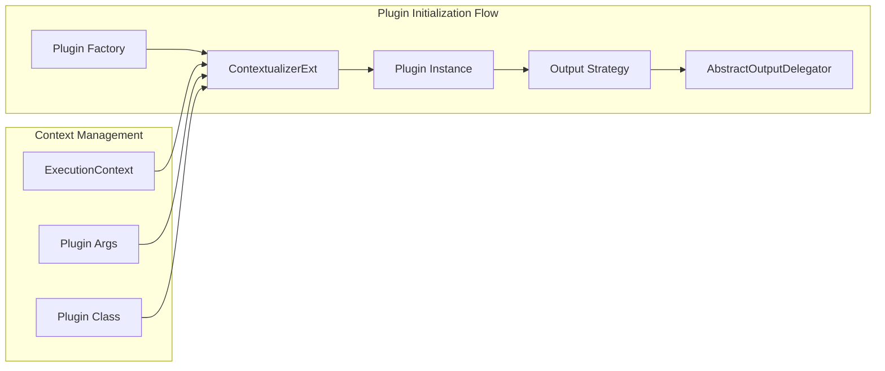
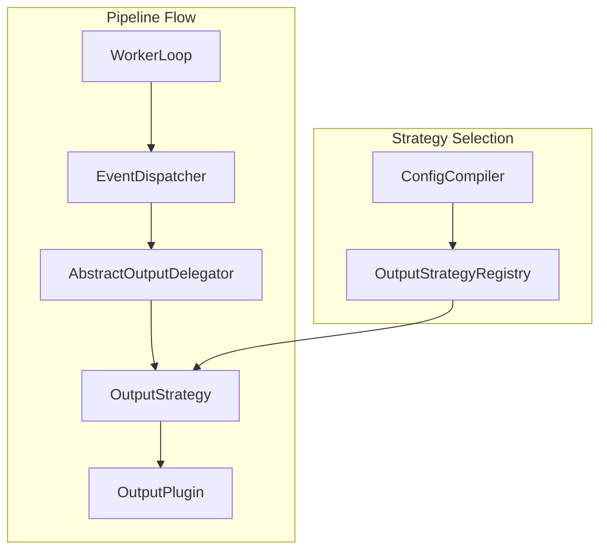

# Output Strategy Management Module

## Overview

The Output Strategy Management module is a critical component of Logstash's [IR Compiler](ir_compiler.md) system that manages different strategies for handling output plugin execution. This module provides a flexible framework for controlling how events are dispatched to output plugins, supporting various concurrency models and execution patterns to optimize performance based on plugin characteristics and system requirements.

## Architecture

The module implements a strategy pattern architecture that allows different output execution strategies to be dynamically selected and configured based on plugin requirements and system constraints.



## Core Components

### OutputStrategyRegistryExt

A singleton registry that manages the mapping between strategy types and their corresponding implementation classes.

**Key Features:**
- **Singleton Pattern**: Ensures a single registry instance across the system
- **Type-to-Class Mapping**: Maintains associations between strategy identifiers and implementation classes
- **Dynamic Registration**: Allows runtime registration of new strategy types
- **Strategy Discovery**: Provides methods to query available strategies

**Methods:**
- `instance()`: Returns the singleton registry instance
- `register(type, klass)`: Registers a strategy class for a given type
- `class_for(type)`: Retrieves the implementation class for a strategy type
- `types()`: Returns all registered strategy types
- `classes()`: Returns all registered strategy classes

### AbstractOutputStrategyExt

The base class for all output strategies, defining the common interface and shared functionality.

**Core Responsibilities:**
- **Plugin Lifecycle Management**: Handles registration and cleanup of output plugins
- **Output Method Delegation**: Provides a unified interface for event processing
- **Callsite Optimization**: Caches method lookups for performance

**Abstract Methods:**
- `output(context, events)`: Processes events using the strategy-specific approach
- `close(context)`: Handles cleanup when the strategy is shut down
- `reg(context)`: Performs plugin registration

### Strategy Implementations

#### LegacyOutputStrategyExt

Implements a worker pool strategy for output plugins that require thread isolation.



**Features:**
- **Worker Pool Management**: Maintains a configurable number of worker instances
- **Thread-Safe Queuing**: Uses `ArrayBlockingQueue` for worker distribution
- **Load Balancing**: Distributes work across available workers
- **Blocking Semantics**: Ensures proper resource management

#### SingleOutputStrategyExt

Provides synchronized access to a single output plugin instance.

**Characteristics:**
- **Thread Safety**: Uses synchronization to ensure thread-safe access
- **Single Instance**: Maintains one plugin instance for all processing
- **Simple Lifecycle**: Straightforward initialization and cleanup

#### SharedOutputStrategyExt

Allows concurrent access to a single output plugin instance without synchronization.

**Use Cases:**
- Thread-safe output plugins that can handle concurrent access
- High-throughput scenarios where synchronization overhead is undesirable
- Plugins with internal thread safety mechanisms

## Integration Points

### Plugin Factory Integration

The module integrates with the [Plugin Factory](plugin_factory.md) system through `ContextualizerExt`:



### Metrics Integration

Each strategy integrates with the [Metrics System](metrics_system.md) to provide performance monitoring:

- **Event Counters**: Tracks input/output event counts
- **Timing Metrics**: Measures processing duration
- **Plugin Metrics**: Exposes plugin-specific performance data

### Pipeline Execution Integration

The module works closely with the [Pipeline Execution](pipeline_execution.md) system:



## Configuration and Usage

### Strategy Selection

Strategies are selected based on plugin configuration and characteristics:

```java
// Registry-based strategy selection
OutputStrategyRegistryExt registry = OutputStrategyRegistryExt.instance(context);
RubyClass strategyClass = registry.classFor(context, strategyType);

// Strategy initialization
AbstractOutputStrategyExt strategy = (AbstractOutputStrategyExt) 
    strategyClass.newInstance(context, outputClass, metric, executionContext, pluginArgs);
```

### Worker Configuration

For the Legacy strategy, worker count is configurable:

```ruby
# Plugin configuration
output {
  plugin_name {
    workers => 4  # Number of worker instances
    # other plugin settings
  }
}
```

## Performance Considerations

### Strategy Selection Guidelines

| Strategy | Use Case | Concurrency | Memory Usage |
|----------|----------|-------------|--------------|
| Legacy | Thread-unsafe plugins | High (worker pool) | High (multiple instances) |
| Single | Thread-unsafe plugins, low throughput | Low (synchronized) | Low (single instance) |
| Shared | Thread-safe plugins | High (concurrent) | Low (single instance) |

### Optimization Features

- **Method Callsite Caching**: Reduces reflection overhead
- **Worker Pool Reuse**: Minimizes object creation
- **Blocking Queue Efficiency**: Optimized worker distribution

## Error Handling

The module implements comprehensive error handling:

- **Strategy Registration Errors**: Clear error messages for missing strategies
- **Plugin Initialization Failures**: Proper cleanup and error propagation
- **Runtime Exceptions**: Graceful handling during event processing

## Dependencies

### Internal Dependencies
- [IR Compiler](ir_compiler.md): Parent module providing compilation context
- [Plugin Factory](plugin_factory.md): Plugin instantiation and contextualization
- [Metrics System](metrics_system.md): Performance monitoring and reporting
- [Ruby Integration](ruby_integration.md): JRuby interoperability layer

### External Dependencies
- **JRuby Runtime**: Ruby-Java integration
- **Java Concurrency**: Thread-safe collections and synchronization
- **Logstash Plugin API**: Output plugin interface

## Thread Safety

The module ensures thread safety through multiple mechanisms:

- **Synchronized Access**: Single strategy uses explicit synchronization
- **Worker Isolation**: Legacy strategy isolates workers in separate threads
- **Immutable Configuration**: Strategy configuration is immutable after initialization
- **Thread-Safe Collections**: Uses `ArrayBlockingQueue` for worker management

## Monitoring and Observability

### Key Metrics

- **Event Throughput**: Events processed per second by strategy
- **Worker Utilization**: Active vs. idle workers in Legacy strategy
- **Processing Latency**: Time spent in output processing
- **Error Rates**: Failed output operations

### Health Indicators

The module contributes to the [Health System](health_system.md) through:

- **Strategy Status**: Operational state of each strategy
- **Worker Health**: Individual worker status in Legacy strategy
- **Resource Utilization**: Memory and thread usage metrics

## Future Considerations

### Extensibility

The strategy pattern allows for future enhancements:

- **Custom Strategies**: Plugin-specific optimization strategies
- **Adaptive Strategies**: Dynamic strategy switching based on load
- **Resource-Aware Strategies**: Strategies that adapt to system resources

### Performance Improvements

- **Lock-Free Implementations**: Reduce synchronization overhead
- **Batch Processing Optimization**: Improved batch handling strategies
- **Memory Pool Management**: Reduce garbage collection pressure

## Related Documentation

- [IR Compiler](ir_compiler.md) - Parent compilation system
- [Plugin Factory](plugin_factory.md) - Plugin instantiation framework
- [Pipeline Execution](pipeline_execution.md) - Event processing pipeline
- [Metrics System](metrics_system.md) - Performance monitoring
- [Plugin System](plugin_system.md) - Plugin management infrastructure