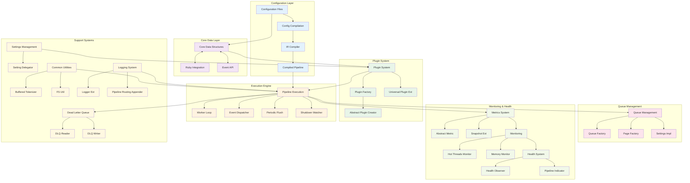
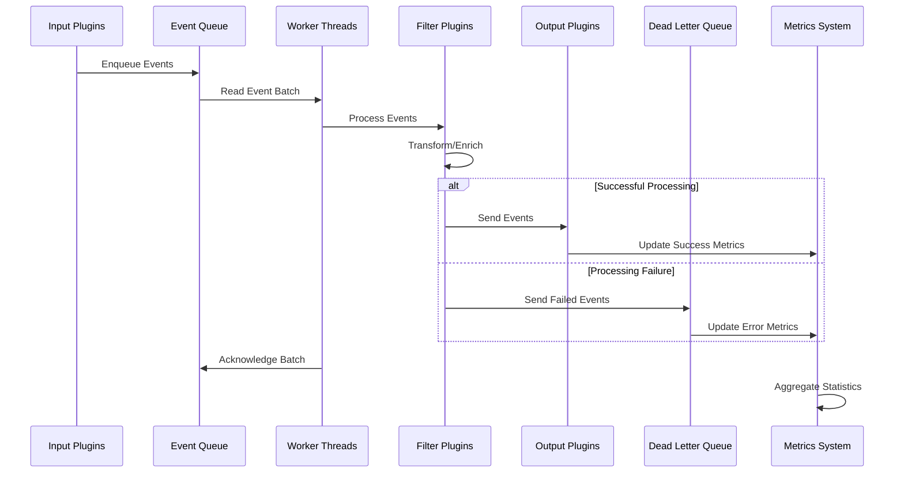

# Elastic Logstash Repository Overview

## Purpose

The `elastic--logstash` repository is the core implementation of Logstash, a powerful data processing pipeline that ingests data from multiple sources, transforms it, and sends it to various destinations. This repository contains the Java-based core engine that provides high-performance event processing, plugin management, and pipeline execution capabilities while maintaining seamless integration with Ruby-based plugins and configurations.

## End-to-End Architecture

The Logstash architecture follows a modular design with clear separation of concerns across multiple layers:

### Data Processing Flow

## Core Modules Documentation

### Configuration and Compilation
- **[Core Data Structures](core_data_structures.md)**: Foundational data manipulation, type conversion, and serialization capabilities that bridge Java and Ruby environments
- **[Config Compilation](config_compilation.md)**: Transforms pipeline configuration into executable code with optimization strategies
- **[IR Compiler](ir_compiler.md)**: Low-level compilation and code generation for high-performance pipeline execution

### Runtime and Execution
- **[Pipeline Execution](pipeline_execution.md)**: Multi-threaded event processing engine with worker loops, periodic flushing, and graceful shutdown
- **[Ruby Integration](ruby_integration.md)**: Seamless interoperability between Java and Ruby components with type conversion and method overrides
- **[Event API](event_api.md)**: Primary interface for event manipulation, plugin contracts, and error handling through dead letter queues

### Plugin Architecture
- **[Plugin System](plugin_system.md)**: Core infrastructure for plugin discovery, validation, and lifecycle management across Java and Ruby
- **[Plugin Factory](plugin_factory.md)**: Centralized plugin instantiation with configuration validation, context injection, and metrics integration

### Data Management
- **[Queue Management](queue_management.md)**: Event buffering with both persistent and in-memory implementations, flow control, and durability guarantees
- **[Dead Letter Queue](dead_letter_queue.md)**: Fault tolerance system for capturing and storing failed events with configurable retention policies

### Monitoring and Operations
- **[Metrics System](metrics_system.md)**: Comprehensive instrumentation framework for performance tracking, operational insights, and external monitoring integration
- **[Monitoring](monitoring.md)**: System-level monitoring including thread performance, memory usage, and resource tracking
- **[Health System](health_system.md)**: Real-time health monitoring with probe-based architecture and diagnostic reporting

### Support Infrastructure
- **[Settings Management](settings_management.md)**: Configuration parameter management with type safety, validation, and coercion capabilities
- **[Common Utilities](common_utilities.md)**: Shared utility functions for text processing, file system operations, and queue management
- **[Logging System](logging_system.md)**: Unified logging infrastructure bridging Java Log4j2 with Ruby logging paradigms

## Key Features

### High Performance
- **Multi-threaded Processing**: Configurable worker threads with efficient batch processing
- **Compiled Execution**: Configuration compiled to optimized Java bytecode
- **Memory Management**: Efficient data structures with minimal garbage collection impact

### Extensibility
- **Plugin Architecture**: Support for Java and Ruby plugins across input, filter, output, and codec types
- **Hook System**: Event-driven plugin lifecycle management
- **Dynamic Configuration**: Runtime configuration updates and plugin management

### Reliability
- **Fault Tolerance**: Dead letter queue for failed events with configurable policies
- **Graceful Shutdown**: Coordinated shutdown with optional queue draining
- **Health Monitoring**: Comprehensive health checks with proactive issue detection

### Observability
- **Comprehensive Metrics**: Performance counters, timing metrics, and custom plugin metrics
- **Structured Logging**: Pipeline-specific log routing with performance monitoring
- **Health Reporting**: Real-time health status with actionable diagnostics

### Cross-Platform Support
- **JVM-based**: Runs on any platform supporting Java 8+
- **Ruby Integration**: Seamless JRuby integration for Ruby-based plugins
- **File System Abstraction**: Cross-platform file operations with Windows compatibility

This architecture enables Logstash to process millions of events per second while maintaining data integrity, providing comprehensive observability, and supporting a rich ecosystem of plugins for diverse data processing needs.