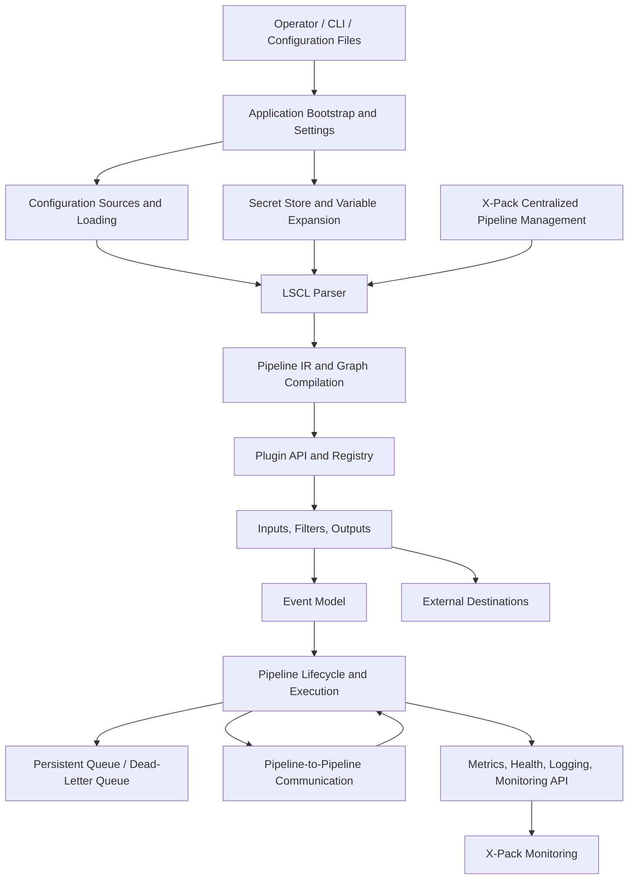
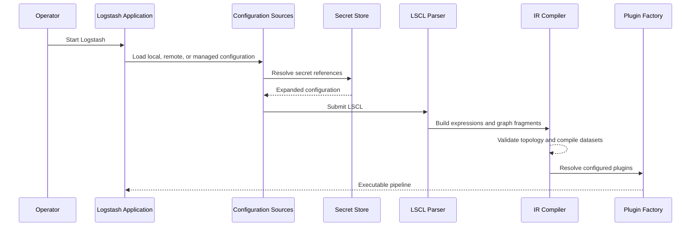
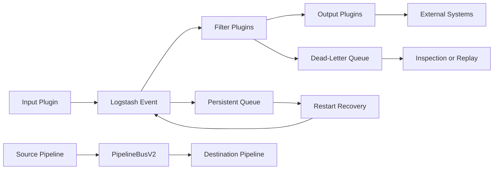
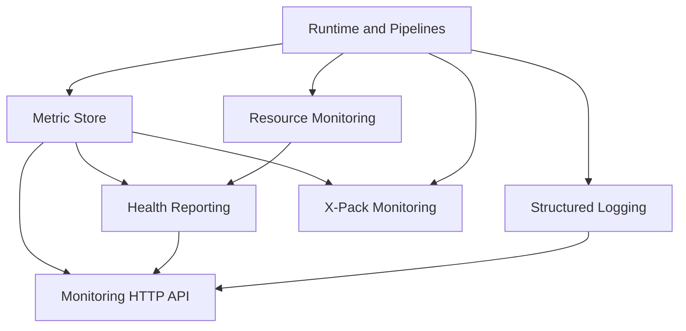

# Logstash Repository Overview

## Purpose

Logstash is a plugin-based data processing and ingestion engine. It loads pipeline configuration, compiles Logstash Configuration Language (LSCL) into executable graphs, processes events through inputs, filters, and outputs, and provides reliability, extensibility, monitoring, logging, and operational controls.

The repository combines Ruby, Java, and JRuby components. `logstash-core` contains the runtime foundation and execution engine, while `x-pack` provides commercial features such as centralized pipeline management, monitoring, and GeoIP database management.

## End-to-End Architecture

```mermaid
flowchart TB
    Operator[Operator / CLI / Configuration Files]
    Bootstrap[Application Bootstrap and Settings]
    Sources[Configuration Sources and Loading]
    Secrets[Secret Store and Variable Expansion]
    Managed[X-Pack Centralized Pipeline Management]
    Parser[LSCL Parser]
    IR[Pipeline IR and Graph Compilation]
    Registry[Plugin API and Registry]
    Runtime[Pipeline Lifecycle and Execution]
    Events[Event Model]
    Plugins[Inputs, Filters, Outputs]
    Reliability[Persistent Queue / Dead-Letter Queue]
    P2P[Pipeline-to-Pipeline Communication]
    Observe[Metrics, Health, Logging, Monitoring API]
    XMonitoring[X-Pack Monitoring]
    Destinations[External Destinations]

    Operator --> Bootstrap
    Bootstrap --> Sources
    Bootstrap --> Secrets
    Sources --> Parser
    Secrets --> Parser
    Managed --> Parser
    Parser --> IR
    IR --> Registry
    Registry --> Plugins
    Plugins --> Events
    Events --> Runtime
    Runtime --> Reliability
    Runtime --> P2P
    P2P --> Runtime
    Plugins --> Destinations
    Runtime --> Observe
    Observe --> XMonitoring
```

### Configuration and compilation

```mermaid
sequenceDiagram
    participant User as Operator
    participant App as Logstash Application
    participant Config as Configuration Sources
    participant Secret as Secret Store
    participant Parser as LSCL Parser
    participant Compiler as IR Compiler
    participant Factory as Plugin Factory

    User->>App: Start Logstash
    App->>Config: Load local, remote, or managed configuration
    Config->>Secret: Resolve secret references
    Secret-->>Config: Expanded configuration
    Config->>Parser: Submit LSCL
    Parser->>Compiler: Build expressions and graph fragments
    Compiler-->>Compiler: Validate topology and compile datasets
    Compiler->>Factory: Resolve configured plugins
    Factory-->>App: Executable pipeline
```

### Runtime processing and reliability

```mermaid
flowchart LR
    Input[Input Plugin] --> Event[Logstash Event]
    Event --> Filter[Filter Plugins]
    Filter --> Output[Output Plugins]
    Output --> Destination[External Systems]

    Event --> PQ[Persistent Queue]
    PQ --> Recovery[Restart Recovery]
    Recovery --> Event

    Filter --> DLQ[Dead-Letter Queue]
    DLQ --> Replay[Inspection or Replay]

    Source[Source Pipeline] --> Bus[PipelineBusV2]
    Bus --> Target[Destination Pipeline]
```

### Observability and operations

```mermaid
flowchart TB
    Runtime[Runtime and Pipelines] --> Metrics[Metric Store]
    Runtime --> Resources[Resource Monitoring]
    Runtime --> Logging[Structured Logging]
    Metrics --> Health[Health Reporting]
    Resources --> Health
    Metrics --> API[Monitoring HTTP API]
    Health --> API
    Logging --> API
    Metrics --> XPack[X-Pack Monitoring]
    Runtime --> XPack
```

## Repository Structure and Core Documentation

| Area | Primary implementation paths | Documentation |
|---|---|---|
| Runtime foundation and configuration | `logstash-core/lib/logstash`, `logstash-core/lib/logstash/config`, `logstash-core/src/main/java/org/logstash/secret`, `x-pack/lib/config_management` | [Runtime Foundation and Configuration](</home/anhnh/CodeWiki-journal/results/generation/logstash/runtime_foundation_and_configuration.md>) |
| Pipeline language and compilation | `logstash-core/lib/logstash/compiler`, `logstash-core/src/main/java/org/logstash/config/ir`, `logstash-core/src/main/java/org/logstash/config/ir/graph` | [Pipeline Language and Compilation](</home/anhnh/CodeWiki-journal/results/generation/logstash/pipeline_language_and_compilation.md>) |
| Data-plane execution and reliability | `logstash-core`, `logstash-core/src/main/java/org/logstash/plugins/pipeline`, `logstash-core/src/main/java/org/logstash/ackedqueue`, `logstash-core/src/main/java/org/logstash/common` | [Data Plane Execution and Reliability](</home/anhnh/CodeWiki-journal/results/generation/logstash/data_plane_execution_and_reliability.md>) |
| Event processing and extensibility | `logstash-core/src/main/java/org/logstash`, `logstash-core/src/main/java/org/logstash/plugins`, `lib/pluginmanager`, `x-pack/lib/geoip_database_management` | [Event Processing and Extensibility](</home/anhnh/CodeWiki-journal/results/generation/logstash/event_processing_and_extensibility.md>) |
| Observability and operational control | `logstash-core`, `logstash-core/src/main/java/org/logstash/health`, `logstash-core/lib/logstash/api`, `logstash-core/src/main/java/org/logstash/log`, `x-pack/lib/monitoring` | [Observability and Operational Control](</home/anhnh/CodeWiki-journal/results/generation/logstash/observability_and_operational_control.md>) |

Together, these modules form the complete path from operator configuration to compiled pipelines, event execution, durable delivery, plugin extensibility, and runtime supervision.