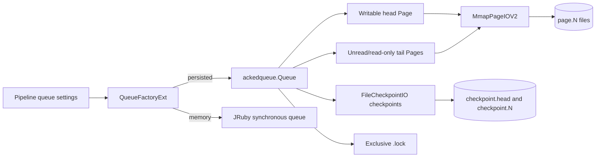
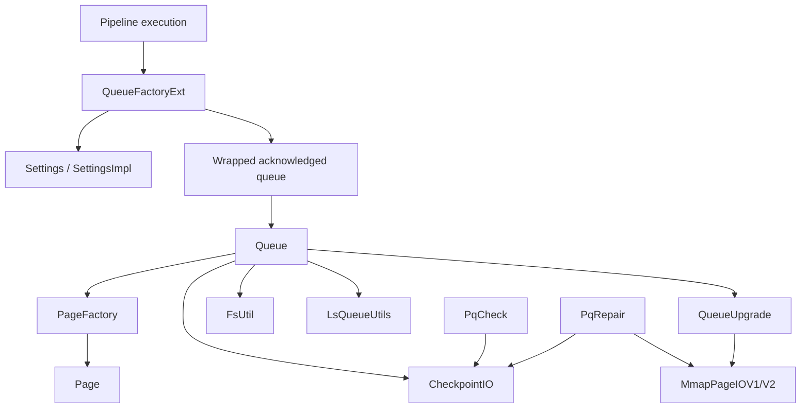
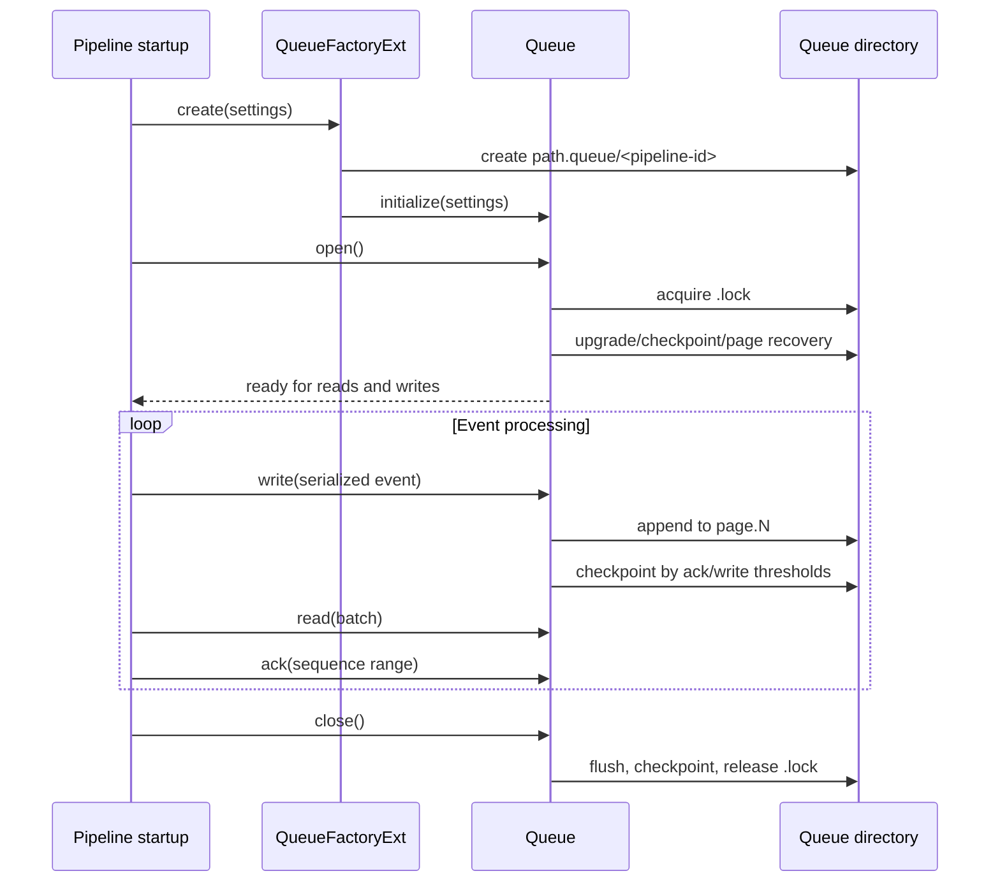
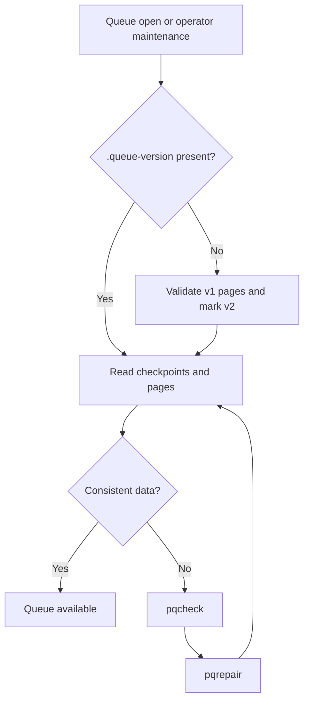

# Persistent Queue

## Purpose

The `persistent_queue` module provides Logstash’s durable, acknowledged event queue implementation. It stores serialized events in page files with checkpoint metadata, recovers queue state after restart, enforces capacity and disk limits, and exposes the Java queue through JRuby so pipeline execution can select persisted or memory-backed buffering.

The module is part of [pipeline lifecycle and execution](pipeline_lifecycle_and_execution.md). Pipeline lifecycle code owns pipeline startup and shutdown; this module supplies the durable queue used by a pipeline when `queue.type: persisted` is configured. Queue metrics are surfaced through the resource-monitoring layer described in [observability and operational control](runtime_foundation_and_configuration.md) when that documentation is available.

## Architecture overview

A queue is organized around one writable head page, zero or more read-only tail pages, and checkpoint files that describe sequence ranges and acknowledgement progress.

At runtime, the queue serializes `Queueable` elements (Logstash events in the normal integration path), assigns monotonically increasing sequence numbers, and appends records to the current page. When the page is full, it is “beheaded” into the tail set and a new head page is created. Acknowledgements are represented in page/checkpoint state; fully acknowledged pages can be purged.

## Component relationships

The core `Queue`, `Page`, `Checkpoint`, and page/checkpoint I/O implementations are supporting components of the module. The supplied module components are grouped by responsibility in the linked sub-module pages below.

## Sub-modules

- [Persistent queue configuration and factory](persistent_queue_configuration_and_factory.md) — defines the immutable queue settings model and JRuby factory. It maps pipeline settings to either a persisted queue directory (`path.queue/<pipeline id>`) or an in-memory queue and passes page, byte, unread, and checkpoint limits into the queue implementation.

- [Persistent queue storage and recovery](persistent_queue_storage_and_recovery.md) — creates head/tail pages, upgrades the on-disk format, checks queue integrity, repairs inconsistent page/checkpoint files, and removes fully acknowledged data.

- [Persistent queue queue utilities](persistent_queue_queue_utilities.md) — provides filesystem free-space checks and blocking-queue batch insertion/draining helpers used around queue operation.

## Persistent queue lifecycle

## On-disk model

A queue directory contains:

| Artifact | Role |
|---|---|
| `page.N` | Versioned memory-mapped page containing sequenced event records and checksums. |
| `checkpoint.head` | State for the active head page and the first unacknowledged page/sequence. |
| `checkpoint.N` | State associated with a tail page. |
| `checkpoint.N.tmp` | Temporary checkpoint written before an atomic move; repair removes leftovers. |
| `.queue-version` | Persistent queue format marker; version 2 is written after validating/upgrading legacy pages. |
| `.lock` | Exclusive directory lock preventing concurrent queue ownership. |

Page records include a sequence number, payload length, payload, and checksum. Checkpoints include page number, acknowledgement position, minimum sequence number, element count, format version, and checksum. Recovery trusts valid page data and can reconstruct or correct head metadata when the page and checkpoint disagree.

## Configuration and limits

The factory accepts `queue.type` values `persisted` and `memory`. For persisted queues, the following settings are forwarded to the acknowledged queue:

- page capacity
- maximum queue events
- maximum queue bytes
- checkpoint write threshold
- checkpoint acknowledgement threshold
- checkpoint retry behavior

A zero value in the Java settings model represents an unlimited capacity for event count, byte size, or unread count. Validation and user-facing setting definitions belong to [application_bootstrap_and_settings](application_bootstrap_and_settings.md), including persisted-queue configuration validation.

## Maintenance and failure handling

`QueueUpgrade` validates legacy v1 pages by reading and deserializing every recorded event before changing the page version marker to v2. `PqCheck` is a read-only diagnostic utility that validates checkpoint sizes and reports page presence and acknowledgement status. `PqRepair` is a mutating repair utility: it removes temporary checkpoints, deletes orphaned or empty pages, removes fully acknowledged files, and recreates missing or malformed checkpoints where the page data is sufficient.

Repair can delete queue files. Operators should retain a backup and ensure the queue is not being used by a running pipeline before invoking it.

## Operational notes

- Queue directories are pipeline-specific, so multiple pipelines can have independent persisted queues beneath the configured queue path.
- The queue takes an exclusive filesystem lock; a second process cannot safely open the same directory.
- Page and checkpoint checksums protect against partial or corrupt writes.
- Disk availability is checked before allocating or extending queue storage.
- Queue format upgrades are intentionally conservative: if an event cannot be validated, the upgrade fails and the operator must drain using a compatible version or intentionally remove the queue data.

## Related modules

- [Pipeline lifecycle and execution](pipeline_lifecycle_and_execution.md) — starts, converges, reports, and shuts down pipelines that consume the queue.
- [Application bootstrap and settings](application_bootstrap_and_settings.md) — defines and validates queue-related configuration.
- [Runtime resource monitoring](runtime_resource_monitoring.md) — contains periodic queue/resource instrumentation when documented in this wiki.
- [pipeline lifecycle and execution](pipeline_lifecycle_and_execution.md) — a separate durable path for events rejected during processing; it is not the persistent input queue.
