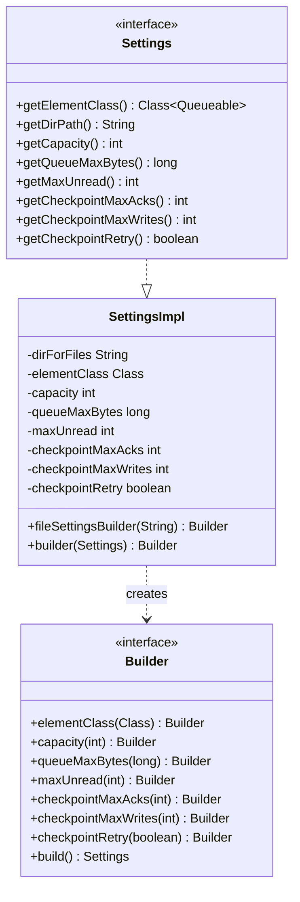
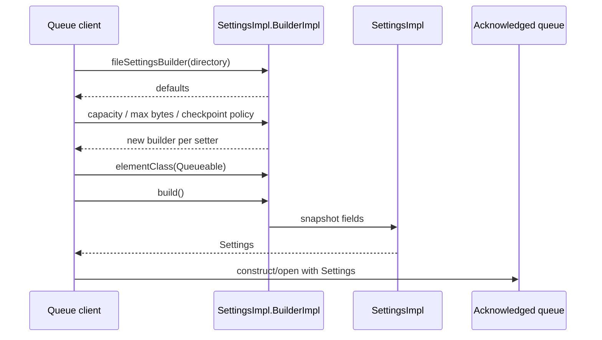
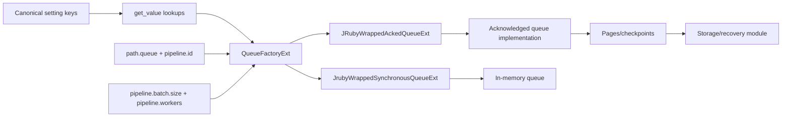
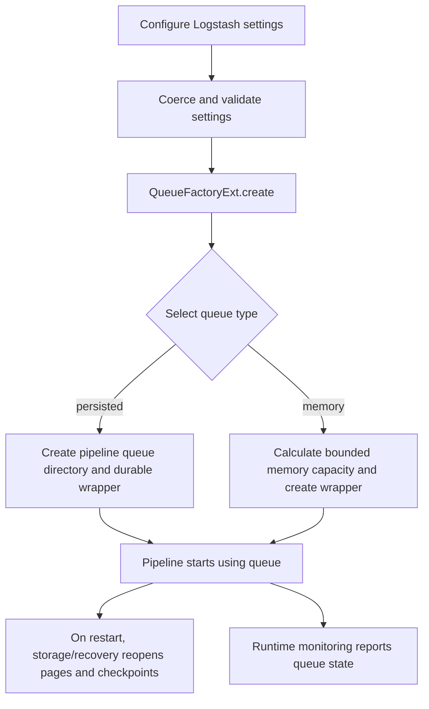

# Persistent queue configuration and factory

## Introduction

The `persistent_queue_configuration_and_factory` module translates Logstash queue settings into a concrete queue implementation. Its JRuby extension, `QueueFactoryExt`, selects either a durable acknowledged queue or an in-memory synchronous queue for a pipeline. Its Java settings API, `Settings` and `SettingsImpl`, provides the typed configuration contract used by the acknowledged-queue implementation and by direct Java clients.

This module is the configuration/construction boundary for the persistent queue subsystem. Page files, checkpoints, validation, repair, and format upgrades are covered by [persistent_queue_storage_and_recovery](persistent_queue_storage_and_recovery.md). Queue-directory helpers belong to [persistent_queue_queue_utilities](persistent_queue_queue_utilities.md), while the pipeline that owns and consumes the resulting queue is described in [data_plane_execution_and_reliability](data_plane_execution_and_reliability.md).

## Architectural position


At the Logstash/Ruby boundary, `QueueFactoryExt.create` receives a settings object and calls its `get_value(name)` method. It does not parse command-line values itself; setting registration, coercion, defaults, and validation are upstream concerns described in [application_bootstrap_and_settings](application_bootstrap_and_settings.md). The factory only uses the normalized values needed to construct the selected queue.

## Components and responsibilities

| Component | Responsibility | Key boundary |
| --- | --- | --- |
| `QueueFactoryExt` | Selects and initializes the memory or persisted queue implementation | JRuby settings object → wrapped queue |
| `Settings` | Defines the acknowledged-queue configuration contract | Typed getters and fluent `Builder` |
| `Settings.Builder` | Describes immutable-style configuration changes before construction | `elementClass`, limits, checkpoint policy → `Settings` |
| `SettingsImpl` | Stores settings and supplies builder defaults/copy builders | `Builder` → concrete `SettingsImpl` |
| `SettingKeyDefinitions` | Supplies the canonical setting-key names consumed by the factory | Logstash setting names → factory lookups |
| Wrapped queue extensions | Adapt Java queue implementations to JRuby | Java queue → Ruby pipeline runtime |

The current module directly owns the first three components. `SettingKeyDefinitions`, the Ruby settings registry, and pipeline lifecycle code are dependencies rather than duplicated responsibilities.

## `QueueFactoryExt` selection logic

`QueueFactoryExt` is annotated as the JRuby class `QueueFactory` and exposes a metaclass method, `create`. The method reads `queue.type` and accepts exactly two values:

| `queue.type` | Constructed implementation | Initialization inputs |
| --- | --- | --- |
| `persisted` | `JRubyWrappedAckedQueueExt` | queue path, page capacity, max events, checkpoint writes, checkpoint acks, checkpoint retry, max bytes |
| `memory` | `JrubyWrappedSynchronousQueueExt` | `pipeline.batch.size × pipeline.workers` |

The persisted branch computes a pipeline-specific directory by joining `path.queue` and `pipeline.id`. It creates that directory when it does not exist, then passes the normalized queue settings to the wrapped acknowledged queue. The existence check is intentional: calling `Files.createDirectories` on a symlink path can raise `FileAlreadyExistsException`, so an existing path—including an existing symlink—is not recreated.

The memory branch does not use the on-disk queue settings. Its bounded capacity is derived from the product of batch size and worker count, and the result is passed as a JRuby integer to the synchronous queue wrapper.

Any other value produces a Ruby `ConfigurationError` with the supported values in the message. This is a defensive check in addition to the setting registry's allowed-value validation.

```mermaid
flowchart TD
    Start[QueueFactory.create(settings)] --> Type[Read queue.type]
    Type --> Persisted{persisted?}
    Persisted -- yes --> Path[Read path.queue and pipeline.id]
    Path --> Join[Join queue root and pipeline id]
    Join --> Exists{Queue directory exists?}
    Exists -- no --> Mkdir[Create directories]
    Exists -- yes --> Durable[Initialize JRubyWrappedAckedQueueExt]
    Mkdir --> Durable
    Durable --> DurableArgs[Page capacity, max events, checkpoint policy, max bytes]
    Persisted -- no --> Memory{memory?}
    Memory -- yes --> Size[batch.size × workers]
    Size --> Sync[Initialize JrubyWrappedSynchronousQueueExt]
    Memory -- no --> Error[Raise ConfigurationError]
```

## Settings contract

The `Settings` interface models the values required by an acknowledged queue:

| Getter | Meaning |
| --- | --- |
| `getDirPath()` | Directory used for queue files |
| `getElementClass()` | Java `Queueable` element type |
| `getCapacity()` | Event capacity; `0` means unlimited in the current implementation |
| `getQueueMaxBytes()` | Byte capacity; `0` means unlimited |
| `getMaxUnread()` | Maximum unread count; `0` means unlimited |
| `getCheckpointMaxAcks()` | Acknowledgements that trigger a checkpoint |
| `getCheckpointMaxWrites()` | Writes that trigger a checkpoint |
| `getCheckpointRetry()` | Whether checkpoint attempts may retry |

`Settings.Builder` exposes all mutable configuration fields except the directory. The directory is fixed when the builder is created through `SettingsImpl.fileSettingsBuilder(dirForFiles)`. This keeps the storage location stable while allowing the queue limits, element class, and checkpoint policy to be refined fluently.

The builder is persistent/immutable-style: every setter returns a new `BuilderImpl` containing the changed value, leaving the previous builder unchanged. `build()` snapshots the current values into a `SettingsImpl`.



## Defaults and builder lifecycle

`SettingsImpl.fileSettingsBuilder(path)` starts with these defaults:

| Field | Default | Interpretation |
| --- | ---: | --- |
| capacity | `0` | Infinite event capacity (legacy behavior) |
| queue max bytes | `0L` | Infinite byte capacity (legacy behavior) |
| max unread | `0` | Unlimited unread elements |
| checkpoint max acks | `1024` | Checkpoint after this acknowledgement count |
| checkpoint max writes | `1024` | Checkpoint after this write count |
| checkpoint retry | `false` | No retry unless explicitly enabled |
| element class | `null` | Must be supplied by the queue client when required |

`SettingsImpl.builder(existingSettings)` copies every getter, including the directory and element class, into a new builder. This is useful when a queue configuration needs a small controlled modification without reconstructing all values manually.



The defaults in this Java API are not necessarily identical to the Logstash application defaults. Application-level registration currently supplies values such as `queue.page_capacity`, `queue.max_bytes`, `queue.max_events`, checkpoint settings, `path.queue`, and `queue.type`; see [application_bootstrap_and_settings](application_bootstrap_and_settings.md) for that registry and post-processing behavior. The factory consumes the application settings directly, while direct Java queue users consume `Settings`.

## Data and dependency flow



Important dependency directions are:

* [application_bootstrap_and_settings](application_bootstrap_and_settings.md) defines and normalizes the user-facing settings.
* `QueueFactoryExt` depends on `SettingKeyDefinitions` for names and on the two JRuby wrapped queue classes for the runtime adapters.
* The persisted queue implementation owns page/checkpoint operations; see [persistent_queue_storage_and_recovery](persistent_queue_storage_and_recovery.md), which documents `PageFactory`, `PqCheck`, `PqRepair`, and `QueueUpgrade`.
* The resulting queue is consumed as part of pipeline startup and execution; see [pipeline_lifecycle_and_execution](pipeline_lifecycle_and_execution.md) and [data_plane_execution_and_reliability](data_plane_execution_and_reliability.md) where available.
* Queue filesystem helpers and queue statistics are intentionally outside this module; see [persistent_queue_queue_utilities](persistent_queue_queue_utilities.md) and [runtime_resource_monitoring](runtime_resource_monitoring.md).

## Operational and failure behavior

* Invalid `queue.type` values fail before a queue is returned.
* A persisted queue path is created lazily during factory construction. Filesystem permission errors and other `IOException`s propagate from the factory.
* The persisted path is pipeline-scoped, preventing different pipeline IDs from sharing the same queue directory under one queue root.
* Queue limits and checkpoint values are passed through after application-level coercion; this class does not document or enforce additional numeric range checks.
* Memory queue capacity is the batch/worker product. Changes to either pipeline setting therefore change the in-memory buffering bound.
* A `Settings` object is a value snapshot. Later builder changes do not mutate a previously built settings object.
* `elementClass` defaults to `null` in `SettingsImpl`; callers that instantiate the underlying acknowledged queue directly must provide an appropriate `Queueable` class.

## Process summary



## Related modules

* [application_bootstrap_and_settings](application_bootstrap_and_settings.md) — application setting registration, defaults, coercion, and validation.
* [persistent_queue_storage_and_recovery](persistent_queue_storage_and_recovery.md) — on-disk pages, checkpoints, checking, repair, and upgrade.
* [persistent_queue_queue_utilities](persistent_queue_queue_utilities.md) — queue filesystem and utility helpers.
* [data_plane_execution_and_reliability](data_plane_execution_and_reliability.md) — pipeline runtime and reliability boundary.
* [pipeline_lifecycle_and_execution](pipeline_lifecycle_and_execution.md) — pipeline startup, convergence, and execution lifecycle.
* [runtime_resource_monitoring](runtime_resource_monitoring.md) — persistent-queue metrics and periodic polling.

## Source components

* `org.logstash.ackedqueue.QueueFactoryExt`
* `org.logstash.ackedqueue.Settings`
* `org.logstash.ackedqueue.Settings.Builder`
* `org.logstash.ackedqueue.SettingsImpl`
