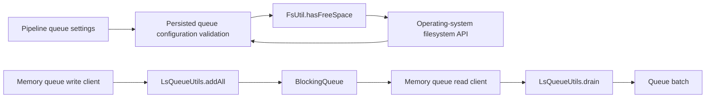
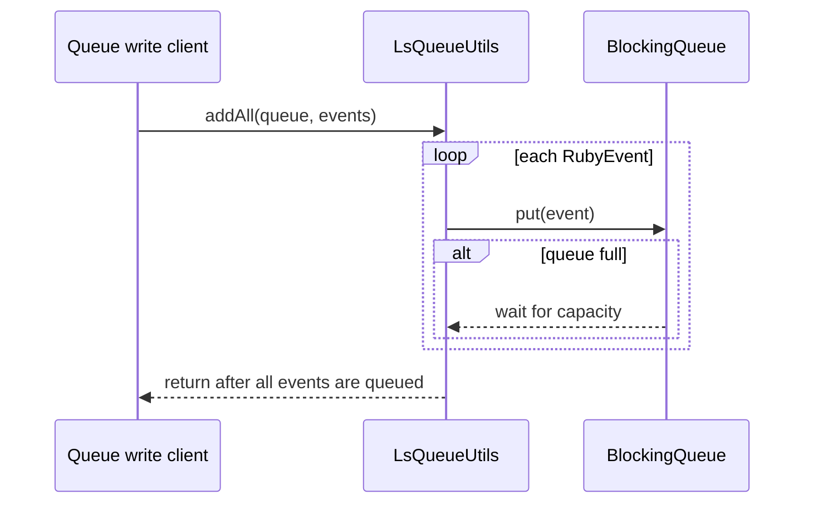
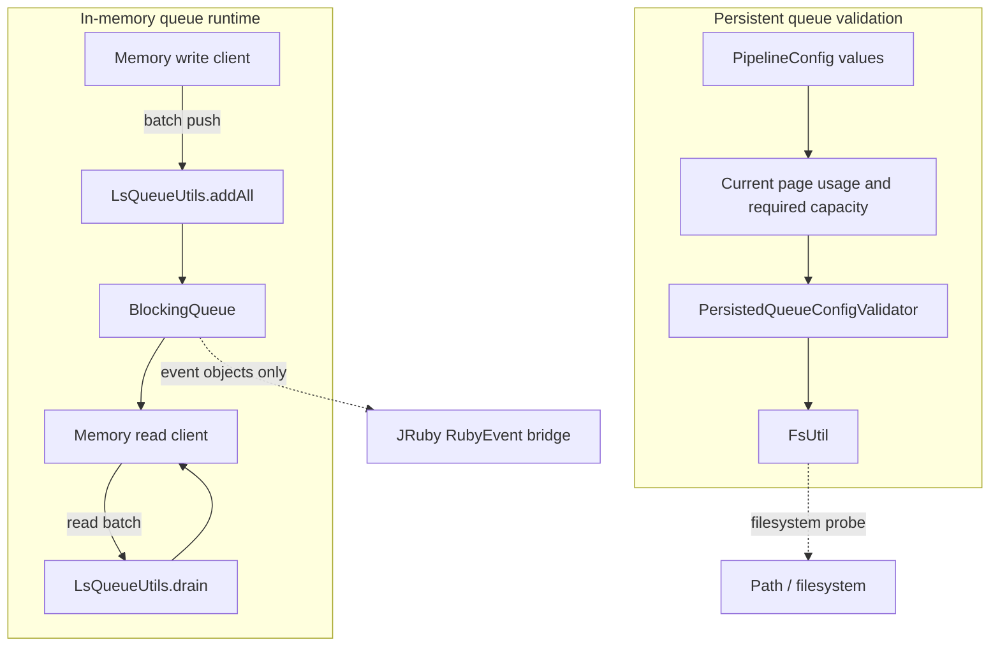
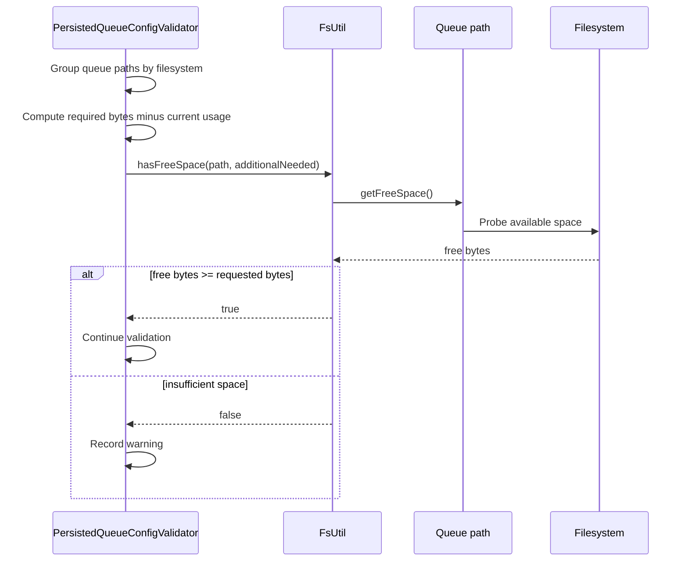
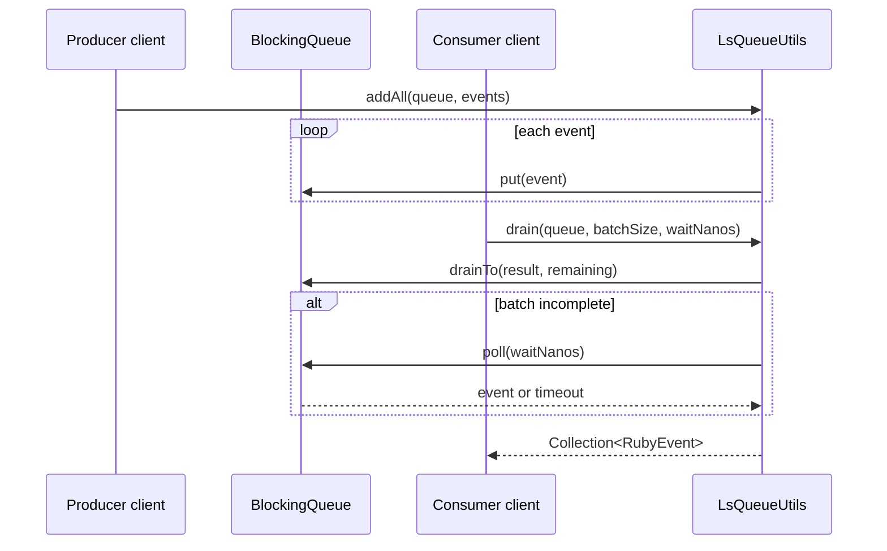

# Persistent queue queue utilities

## Introduction

The `persistent_queue_queue_utilities` module contains two small, stateless Java utility classes used around Logstash queue operation:

* `FsUtil` answers whether a filesystem location has enough free space for a requested byte budget.
* `LsQueueUtils` provides blocking bulk insertion and timed batch draining for `BlockingQueue<RubyEvent>` instances.

These classes do not create queues, serialize queue pages, or recover persistent-queue files. Queue construction and settings are documented in [persistent_queue_configuration_and_factory](persistent_queue_configuration_and_factory.md); page storage, checking, repair, and upgrades are documented in [persistent_queue_storage_and_recovery](persistent_queue_storage_and_recovery.md). The utilities are shared infrastructure used by those higher-level paths.

## Architectural position



The module has no persistent state and no object instances. Both classes use private constructors and expose only static methods. Their responsibilities are complementary:

| Utility | Concern | Used by | Result |
| --- | --- | --- | --- |
| `FsUtil` | Filesystem capacity probing | Persistent-queue bootstrap validation | Boolean capacity decision |
| `LsQueueUtils` | Blocking-queue transfer and batching | In-memory queue clients | Enqueued events or a drained collection |

## Components

### `FsUtil`

Source: `logstash-core/src/main/java/org/logstash/common/FsUtil.java`

`FsUtil` is a final utility class with one public operation:

```java
boolean hasFreeSpace(Path path, long size)
```

The method obtains the free-space value from `path.toFile().getFreeSpace()` and returns `true` when that value is greater than or equal to `size`. The comparison is inclusive, so an exact fit is accepted.

```mermaid
flowchart TD
    Call[hasFreeSpace(path, requestedBytes)] --> Probe[Path.toFile().getFreeSpace()]
    Probe --> Zero{freeSpace == 0 and Windows?}
    Zero -- yes --> Warn[Log warning about unavailable free-space result]
    Warn --> Allow[Return true]
    Zero -- no --> Compare{freeSpace >= requestedBytes?}
    Compare -- yes --> True[Return true]
    Compare -- no --> False[Return false]
```

#### Windows compatibility behavior

The class computes an `IS_WINDOWS` flag once from the `os.name` system property. On Windows, Java may report `0L` for a `SUBST`-mapped drive. When that exact condition is observed, `FsUtil` logs a warning and returns `true` rather than rejecting the configuration. This is a compatibility exception for an unreliable probe result, not an assertion that the drive has a known amount of free space.

On non-Windows systems, a zero result is treated normally and therefore returns `false` for any positive requested size. The method also performs no path existence check, filesystem grouping, or arithmetic of its own; callers provide the already-computed byte requirement.

### `LsQueueUtils`

Source: `logstash-core/src/main/java/org/logstash/common/LsQueueUtils.java`

`LsQueueUtils` is a final utility class for queues containing JRuby-backed Logstash events:

```java
void addAll(BlockingQueue<RubyEvent> queue, Collection<RubyEvent> events)
Collection<RubyEvent> drain(BlockingQueue<RubyEvent> queue, int count, long nanos)
```

#### Blocking bulk insertion

`addAll` iterates over the input collection and calls `queue.put(event)` for every event. It therefore applies normal `BlockingQueue` backpressure: when the queue is full, the producer waits until capacity becomes available. The method returns only after every input event has been inserted, unless the thread is interrupted.



`InterruptedException` is propagated. The method does not discard, reorder, copy, or transform events.

#### Timed batch draining

`drain` attempts to return up to `count` events. It first uses the queue's bulk `drainTo` operation and, when fewer than `count` events are available, waits with `poll(nanos, TimeUnit.NANOSECONDS)` for one event. Once an event arrives, the implementation drains any additional immediately available events and repeats until the requested count is reached or a timed poll returns `null`.

```mermaid
flowchart TD
    Start[drain(queue, count, timeoutNanos)] --> Init[Create result collection; left = count]
    Init --> Bulk[drainTo(result, left)]
    Bulk --> Enough{left count reached?}
    Enough -- yes --> Return[Return result]
    Enough -- no --> Poll[Poll for one event with timeout]
    Poll --> Event{Event received?}
    Event -- no --> Return
    Event -- yes --> Add[Add event; decrement left]
    Add --> Bulk
```

The timeout is applied to each waiting poll, and the public method repeats its internal drain step after every successful round. Consequently, the method's documented behavior is an inactivity timeout: receiving an event allows another wait period for subsequent events. It is not a single absolute deadline for the whole batch.

The returned collection may contain fewer than `count` events when the queue remains empty for the polling interval. An empty queue with an expired timeout produces an empty collection. Interrupts from `drainTo` or `poll` propagate as `InterruptedException`.

## Component interaction and dependency flow



The important dependency directions are:

* [application_bootstrap_and_settings](application_bootstrap_and_settings.md) supplies normalized queue settings to the validation path.
* The persistent-queue validator computes queue usage, required capacity, and filesystem grouping; `FsUtil` only performs the final path-level free-space comparison.
* [persistent_queue_configuration_and_factory](persistent_queue_configuration_and_factory.md) selects persisted versus memory queue implementations. `LsQueueUtils` participates in the memory queue's blocking client operations after construction.
* [persistent_queue_storage_and_recovery](persistent_queue_storage_and_recovery.md) owns pages and checkpoints. Neither utility reads or writes queue page files.
* `RubyEvent` is the event representation crossing the Java/JRuby boundary; `LsQueueUtils` treats it as an opaque queue element.

## End-to-end process flows

### Persistent queue disk-space check



The validator remains responsible for user-facing diagnostics and bootstrap failure decisions. `FsUtil` returns only a boolean, except for the Windows warning it emits when the operating system cannot provide a meaningful value.

### In-memory queue batch transfer



This flow provides the batching contract used by memory-queue clients: producers block on capacity, while consumers collect available events and wait briefly for more work.

## API and behavioral contract

| Method | Blocking behavior | Mutation | Failure/edge behavior |
| --- | --- | --- | --- |
| `FsUtil.hasFreeSpace` | Non-blocking filesystem probe | None | Windows `SUBST` result of zero logs and permits; otherwise compares bytes |
| `LsQueueUtils.addAll` | Blocks in `put` while queue is full | Adds every input event | Propagates `InterruptedException`; partial insertion is possible if interrupted mid-collection |
| `LsQueueUtils.drain` | Bulk drains, then waits in timed polls | Removes returned events from queue | Returns up to requested count; timeout ends the attempt; propagates interruption |

Callers should pass a non-negative event count and a timeout in nanoseconds consistent with `TimeUnit.NANOSECONDS`. The implementation does not explicitly validate these arguments. In particular, callers should not rely on the utility to normalize negative counts or timeouts.

The result collection is newly allocated for each `drain` call with an initial capacity sized from the requested count. Events retain queue order as supplied by the queue's `drainTo` and `poll` operations.

## Operational considerations

* A `true` result from `FsUtil` on a Windows `SUBST` drive means “free space could not be measured,” not “the requested capacity was verified.”
* Disk-space calculations should be performed by the caller using the filesystem semantics relevant to all configured queues; `FsUtil` checks one path and one requested amount at a time.
* `addAll` is intentionally backpressure-aware. Replacing it with non-blocking insertion would change memory queue behavior when producers outrun consumers.
* `drain` favors throughput by draining immediately available elements in bulk before waiting for another event.
* Queue utilities do not provide synchronization beyond the guarantees of `BlockingQueue`; the supplied queue remains responsible for thread safety.
* Neither class owns lifecycle resources, so there is no close or shutdown operation.

## Related modules

* [persistent_queue_configuration_and_factory](persistent_queue_configuration_and_factory.md) — queue settings and queue implementation selection.
* [persistent_queue_storage_and_recovery](persistent_queue_storage_and_recovery.md) — persistent page and checkpoint handling.
* [pipeline_lifecycle_and_execution](pipeline_lifecycle_and_execution.md) — pipeline execution and lifecycle boundaries.
* [application_bootstrap_and_settings](application_bootstrap_and_settings.md) — setting registration and validation context.

## Source components

* `org.logstash.common.FsUtil`
* `org.logstash.common.LsQueueUtils`
