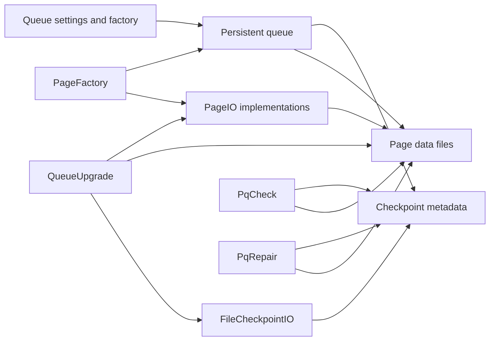
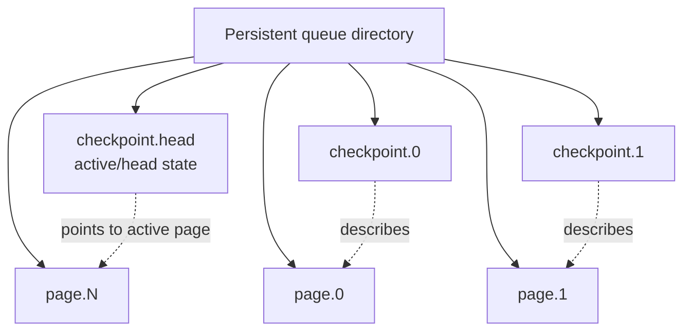
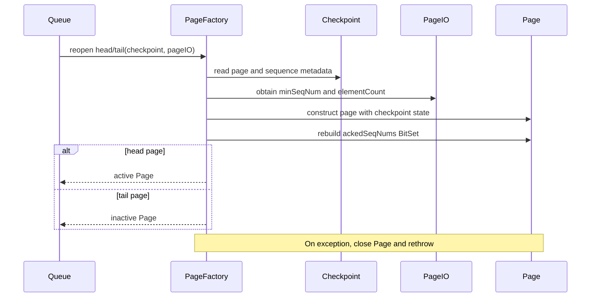
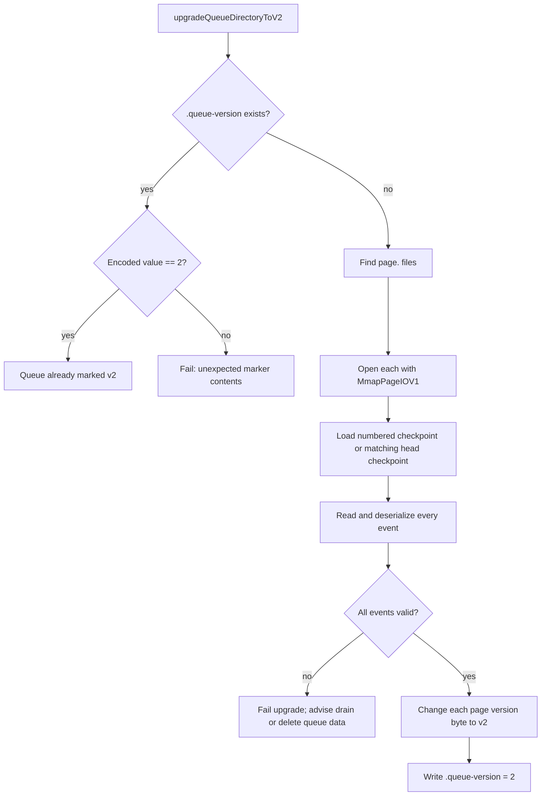
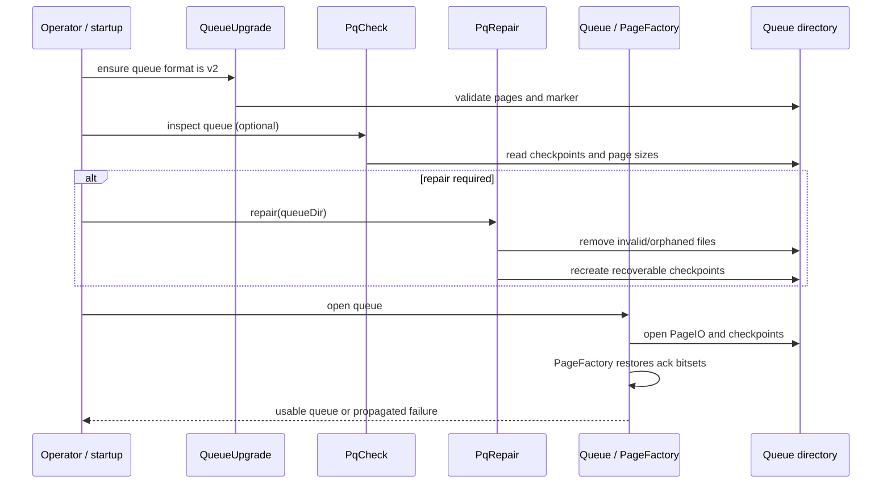

# Persistent queue storage and recovery

## Introduction

The `persistent_queue_storage_and_recovery` module maintains the on-disk representation of a Logstash acknowledged persistent queue and provides tools for rebuilding or validating that representation. It bridges queue pages and checkpoints, restores page state after restart, detects malformed queue directories, repairs recoverable metadata inconsistencies, and upgrades legacy page files to the version 2 format.

The module is a storage/recovery child of [persistent_queue_configuration_and_factory](persistent_queue_configuration_and_factory.md). Queue construction, capacity, page sizing, and queue settings belong to that module; this module operates on the page/checkpoint files selected by the queue. Runtime queue behavior is covered by [data_plane_execution_and_reliability](data_plane_execution_and_reliability.md), while queue metrics are covered by [runtime_resource_monitoring](runtime_resource_monitoring.md) when that documentation is available.

## Architectural position



At runtime, a queue is represented by an ordered sequence of page files and checkpoint files. `PageFactory` reconstructs `Page` objects from checkpoint state and an open `PageIO` delegate. The command-line utilities inspect or mutate the same directory without implementing normal event enqueue/dequeue behavior.

## Storage model

### Page and checkpoint pairing

Each page is stored as `page.<number>`. Tail pages have a corresponding `checkpoint.<number>`; the active head is represented by `checkpoint.head`. Checkpoints preserve the logical state needed to reopen a page, including:

| Checkpoint value | Meaning in this module |
| --- | --- |
| `pageNum` | Physical page number to reopen |
| `minSeqNum` | First sequence number represented by the page |
| `elementCount` | Number of serialized queue elements |
| `firstUnackedSeqNum` | Boundary used to reconstruct acknowledged positions |
| `firstUnackedPageNum` | Head-checkpoint boundary used by repair cleanup |

The exact binary layout and page serialization are owned by `PageIO` and `FileCheckpointIO`; this module consumes those abstractions. See [persistent_queue_configuration_and_factory](persistent_queue_configuration_and_factory.md) for how queue settings select and construct the storage implementation.



### Reconstructing page state

`PageFactory` is a small factory with two recovery paths:

* `newHeadPage(int, ...)` creates an empty active page with sequence number and element count set to zero.
* `newHeadPage(Checkpoint, ...)` reopens an existing head page as active, verifies that checkpoint and `PageIO` agree on minimum sequence number and element count, and restores the acknowledged prefix.
* `newTailPage(Checkpoint, ...)` reopens an existing non-head page and restores its acknowledged prefix without marking it active.

Acknowledgement state is represented in memory by a `BitSet`. When `firstUnackedSeqNum` is greater than `minSeqNum`, the factory flips the range from zero through the acknowledged prefix length. This converts the checkpoint's contiguous acknowledgement boundary into the page object's per-element acknowledgement representation.

If reconstruction fails, the factory closes the partially created page before propagating the exception. That close-on-failure behavior prevents a failed recovery attempt from leaking page resources.



## Component responsibilities

| Component | Responsibility | Primary boundary |
| --- | --- | --- |
| `PageFactory` | Creates empty pages and restores head/tail pages from checkpoints | `Page`, `Checkpoint`, `PageIO` |
| `PqCheck` | Read-only queue-directory validator and diagnostic utility | `FileCheckpointIO`, filesystem |
| `PqRepair` | Best-effort repair of missing, temporary, empty, or orphaned files | `FileCheckpointIO`, page files, filesystem |
| `QueueUpgrade` | Validates legacy v1 pages and changes their version marker to v2 | `MmapPageIOV1`, `MmapPageIOV2`, `CheckpointIO` |

The normal queue factory and settings are deliberately outside this module. Likewise, filesystem helpers such as queue path handling are shared by [persistent_queue_queue_utilities](persistent_queue_queue_utilities.md).

## Validation with `PqCheck`

`PqCheck` is a command-line utility whose default target is `data/queue/main`; an explicit first argument overrides that path. `-h` and `--help` print usage. It requires the target to be a directory, then scans files matching `checkpoint.<number>` and `checkpoint.head`.

For every checkpoint, it requires the file size to be exactly 34 bytes, decodes it with `FileCheckpointIO`, and reports:

* whether the checkpoint is fully acknowledged;
* the associated page number and page-file size, or `NOT FOUND`; and
* the checkpoint's decoded representation.

Checkpoint files are sorted numerically, with `checkpoint.head` sorted last. The utility reports structural and metadata evidence; it does not rewrite files or prove that every serialized event can be deserialized.

```mermaid
flowchart TD
    Start[pqcheck [PQ dir path]] --> Valid{Directory exists?}
    Valid -- no --> Error[Fail: invalid PQ path]
    Valid -- yes --> Scan[Find checkpoint.* and checkpoint.head]
    Scan --> Sort[Sort numbered checkpoints; head last]
    Sort --> Size{Checkpoint is 34 bytes?}
    Size -- no --> Invalid[Fail: invalid checkpoint size]
    Size -- yes --> Decode[Decode with FileCheckpointIO]
    Decode --> Report[Print ack status, page number, page size, checkpoint]
    Report --> More{More checkpoints?}
    More -- yes --> Size
    More -- no --> Done[Complete without mutation]
```

## Repair workflow with `PqRepair`

`PqRepair.repair(path)` requires an existing directory and performs a fixed sequence of filesystem operations:

1. Delete temporary checkpoint files matching `checkpoint.*.tmp`.
2. Index `page.*` files and numbered `checkpoint.*` files.
3. If `checkpoint.head` exists, delete pages and checkpoints below its first unacknowledged page boundary.
4. Delete checkpoints that have no matching page.
5. Delete page files smaller than `MmapPageIOV2.MIN_CAPACITY`, along with their checkpoints.
6. Recreate missing or incorrectly sized checkpoints for all pages except the highest-numbered page.

When recreating a checkpoint, the utility reads the page header, accepts only version 1 or version 2, scans serialized records using each record's length and checksum size, counts records, and writes a checkpoint containing the page's first sequence number and count. It writes zero for the first unacknowledged page number because that field is only consumed from the head checkpoint.

The operation is destructive: it deletes files judged temporary, fully acknowledged, orphaned, malformed, or too small. Operators should preserve a backup before running it and use `PqCheck` first to establish the directory state.

```mermaid
flowchart TD
    R[Run PqRepair(queueDir)] --> T[Delete temporary checkpoints]
    T --> Index[Index page and checkpoint files]
    Index --> Head{Head checkpoint exists?}
    Head -- yes --> Ack[Delete fully acknowledged pages/checkpoints]
    Head -- no --> Orphans
    Ack --> Orphans[Delete checkpoints without pages]
    Orphans --> Empty[Delete pages below minimum capacity and their checkpoints]
    Empty --> Missing{Missing or invalid checkpoint for non-head page?}
    Missing -- yes --> Read[Read page header and scan record lengths]
    Read --> Write[Write reconstructed checkpoint]
    Missing -- no --> Finish[Log repair complete]
    Write --> Finish
```

Repair is conservative in some important ways: it does not reconstruct a missing page from a checkpoint, and it refuses to recreate a checkpoint if the page version byte is not v1 or v2. A page with no corresponding checkpoint can therefore be used as the source of metadata, but a checkpoint without a page is removed.

## Version migration with `QueueUpgrade`

`QueueUpgrade.upgradeQueueDirectoryToV2(path)` manages the `.queue-version` marker. If the marker exists, its contents must encode integer `2`; any other value fails immediately. If it does not exist, the utility treats matching `page.<number>` files as legacy candidates:



Validation uses checkpoint element counts and minimum sequence numbers, then deserializes every event through the v1 page reader. Only after all page files validate does the utility rewrite their first byte to `MmapPageIOV2.VERSION_TWO` and create the marker. If a page has no numbered checkpoint, the head checkpoint must identify that page; otherwise migration fails. This ordering avoids marking an unvalidated queue as upgraded.

The upgrade method does not rewrite event bodies or resize pages. Its migration is an in-place version-marker conversion guarded by full read validation. On validation failure, the logged recommendation is to downgrade and drain the queue or remove the queue data when retention is unnecessary.

## End-to-end recovery process



The utilities are complementary rather than interchangeable: upgrade changes a supported on-disk format, check diagnoses checkpoint/page consistency, and repair mutates the directory to remove or reconstruct known classes of damage.

## Failure modes and operational guidance

* A non-directory path fails immediately in both command-line workflows.
* A malformed checkpoint size causes `PqCheck` to fail instead of interpreting partial bytes.
* A missing page causes its checkpoint to be deleted by repair; the reverse relationship is repaired when the page is readable.
* Pages below the minimum capacity are treated as certainly corrupt and deleted.
* Unsupported page version bytes prevent checkpoint recreation and queue upgrade.
* Event deserialization failure prevents v1-to-v2 upgrade and leaves the queue unmarked as v2.
* Page reconstruction closes a partially opened page before propagating an exception.

Because repair deletes data, the recommended operational order is: stop the affected Logstash instance, copy the queue directory, run `PqCheck`, run `PqRepair` only on the copy or after preserving the original, and validate again before reopening the queue.

## Related modules

- [persistent_queue_configuration_and_factory](persistent_queue_configuration_and_factory.md) — queue settings, `QueueFactoryExt`, and `SettingsImpl` construction boundaries.
- [persistent_queue_queue_utilities](persistent_queue_queue_utilities.md) — shared queue-directory and filesystem utilities.
- [data_plane_execution_and_reliability](data_plane_execution_and_reliability.md) — pipeline execution and the persistent-queue runtime boundary.
- [runtime_resource_monitoring](runtime_resource_monitoring.md) — persistent-queue metrics and periodic resource polling.
- [event_processing_and_extensibility](event_processing_and_extensibility.md) — event representation and serialization boundary used during upgrade validation.

## Source components

- `org.logstash.ackedqueue.PageFactory`
- `org.logstash.ackedqueue.PqCheck`
- `org.logstash.ackedqueue.PqRepair`
- `org.logstash.ackedqueue.QueueUpgrade`
