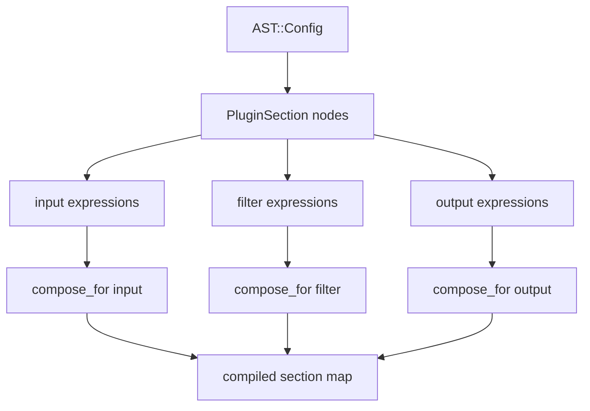
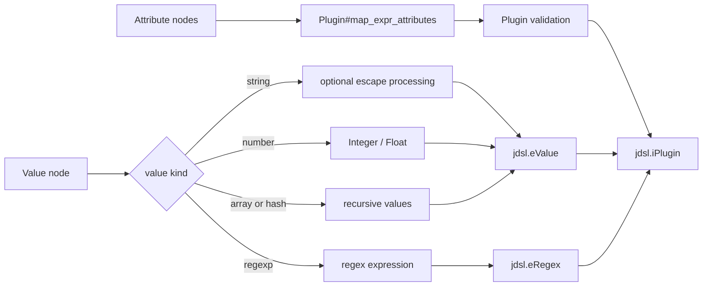
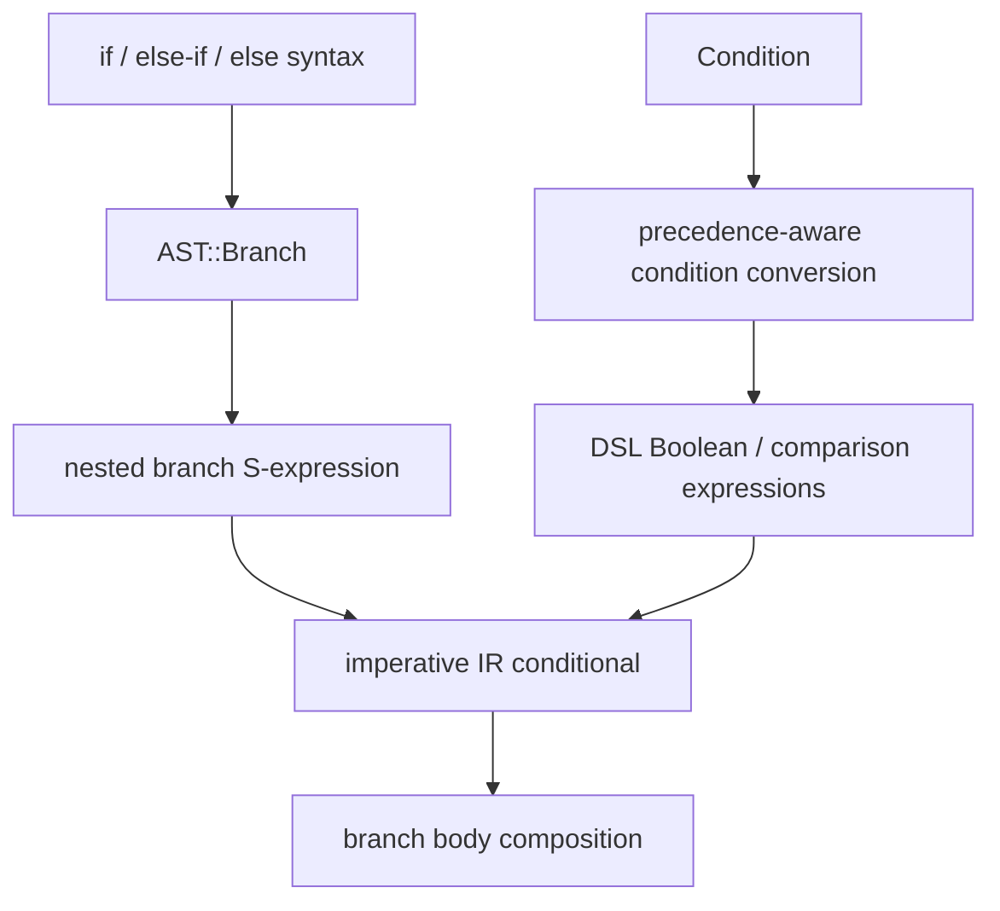
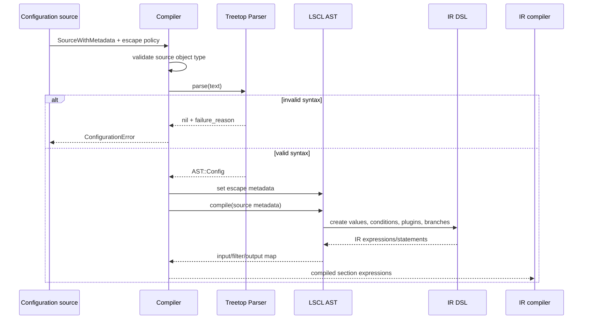
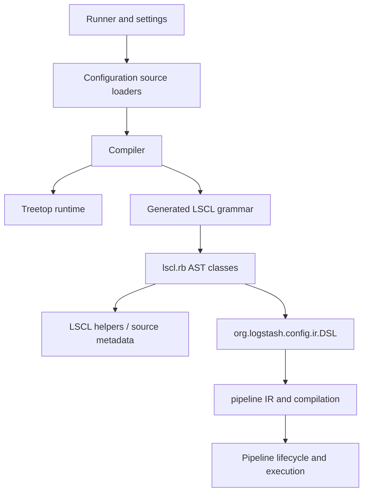

# Pipeline configuration parser

The pipeline configuration parser converts Logstash Configuration Language (LSCL) text into an intermediate representation (IR) suitable for pipeline compilation. It validates the input shape, preserves source metadata for diagnostics, turns plugin settings and event conditions into IR expressions, and returns independently composed input, filter, and output sections.

Configuration acquisition is outside this module. Local, inline, and remote sources produce `SourceWithMetadata` fragments for this parser; see [configuration_sources_and_loading.md](configuration_sources_and_loading.md) and [configuration_sources_and_loading_source_loading.md](configuration_sources_and_loading_source_loading.md). IR graph construction and executable pipeline compilation are covered by [pipeline_ir_and_compilation.md](pipeline_ir_and_compilation.md) when that module is involved.

## Position in the system


The parser is the boundary between textual configuration and the IR layer. It does not load files, resolve plugin classes, start pipelines, or execute events. Startup orchestration belongs to [application_bootstrap_and_settings.md](application_bootstrap_and_settings.md); runtime ownership belongs to [pipeline_lifecycle_and_execution.md](pipeline_lifecycle_and_execution.md).

## Components

### `LogStash::Compiler`

`Compiler.compile_imperative(source_with_metadata, support_escapes)` is the public entry point.

1. It requires an `org.logstash.common.SourceWithMetadata` object. Other inputs raise `ArgumentError`.
2. It creates `LogStashCompilerLSCLGrammarParser` and parses the source text from the metadata object.
3. A failed parse raises `ConfigurationError` using the grammar's failure reason.
4. It stores the caller's escape-sequence policy on the resulting AST.
5. It invokes `AST::Config#compile`, returning the compiled section map.

The source object is important: AST nodes use it to retain line, column, byte, and source text information for configuration errors and IR provenance.

### `Parser`

`LogStashCompilerLSCLGrammar::Parser` is a generated Treetop parser. It uses packrat-style node caching and produces typed syntax nodes from the LSCL grammar. The generated file should not be edited manually; grammar changes belong in the source grammar and are regenerated.

At the top level, a configuration contains zero or more plugin sections surrounded by comments/whitespace. A section is one of `input`, `filter`, or `output`, followed by a block. A block contains plugins and conditional branches. Plugin attributes use `name => value` syntax.

The grammar recognizes:

- plugin names and plugin sections;
- comments beginning with `#`, whitespace, and line endings;
- barewords, quoted strings, numbers, regular expressions, arrays, and hashes;
- event selectors such as `[host][name]`;
- plugin and method-call-shaped values;
- `if`, `else if`, and `else` branches;
- comparisons (`==`, `!=`, `<`, `<=`, `>`, `>=`), membership (`in`, `not in`), regular-expression matching (`=~`, `!~`), and Boolean operators (`and`, `or`, `xor`, `nand`).

The grammar is syntactic. Semantic conversion and validation occur in the AST classes described below.

### `AST::Config` and `AST::PluginSection`

`AST::Config#compile` selects all `PluginSection` nodes and groups their expressions by section name. It rejects unknown section names, then calls `compose_for(key)` for each input, filter, and output list. The result is a hash with these keys:

```ruby
{ input: <composed expression>, filter: <composed expression>, output: <composed expression> }
```

`AST::PluginSection#expr` preserves source order while collecting plugin and branch expressions. Multiple sections of the same type are flattened into their corresponding section list before composition.



### `AST::Plugin` and values

`AST::Plugin#expr` maps attributes into a Ruby hash, validates them, and calls the injected DSL (`jdsl.iPlugin`) with source metadata, plugin type, plugin name, and settings.

Plugin type is inferred from the containing section. A plugin nested inside a plugin's codec is treated as a `CODEC`; top-level plugins become `INPUT`, `FILTER`, or `OUTPUT` according to their section. Repeated attributes follow compatibility rules:

- repeated hash values are merged;
- repeated arrays are concatenated;
- other repeated values become an array unless the values are equal.

For input and output plugins, multiple `codec` blocks are rejected because the resulting array cannot be serialized as a valid plugin setting. Hash values independently reject duplicate keys and report the first source location.

Primitive AST nodes convert as follows:

| AST node | Result |
| --- | --- |
| `Bareword` | DSL value expression containing the text |
| `String` | DSL value expression, optionally after escape processing |
| `Number` | Ruby `Integer` or `Float`, wrapped as a DSL value |
| `RegExp` | DSL regular-expression expression without delimiter slashes |
| `Array` | DSL value containing recursively evaluated values |
| `Hash` | DSL value containing validated key/value pairs |
| `Selector` / `SelectorElement` | DSL event-value expression |



### Branches and conditions

`AST::Branch#expr` first represents an `if`/`else if`/`else` chain as nested S-expressions, then converts it into imperative IR. Each branch body is a composition of its nested plugins and branches. Empty branches become DSL no-ops.

Conditions are converted to IR expressions through the DSL:

- a bare selector becomes a truthiness test;
- `!` becomes negation;
- comparisons map to `eEq`, `eNeq`, `eGt`, `eLt`, `eGte`, or `eLte`;
- `in` maps to `eIn`, and `not in` wraps it in `eNot`;
- `=~` and `!~` map to regular-expression equality/inequality;
- `and` and `or` are assembled using precedence-aware shunting-yard conversion. The grammar and operator mapping also recognize `xor` and `nand`, but the current precedence helper only defines precedence for `and` and `or`; changes involving the former operators should therefore be tested against the conversion path.

The implementation assigns higher precedence to `and` than `or`; `xor` and `nand` are supported by the conversion layer but are not assigned a separate precedence tier. Parenthesized conditions are parsed recursively and preserve explicit grouping.



## End-to-end processing



## Error and diagnostic behavior

Parser errors are surfaced as `ConfigurationError` with the grammar failure reason. Semantic errors are raised while AST expressions are materialized, including unknown section names, duplicate hash keys, and multiple codecs on an input/output plugin. Source metadata is carried into DSL calls and is used for line/column/byte reporting.

Escape processing is controlled by the `support_escapes` argument. The parser always recognizes quoted strings; the flag only controls whether `AST::String#expr` passes the unquoted contents through `LogStash::Config::StringEscape.process_escapes`.

## Dependencies and ownership



The parser depends on the source-loading contract and the IR DSL, but it does not own either. Plugin lookup and plugin API behavior are documented in [plugin_api_and_registry.md](plugin_api_and_registry.md), while execution and reload behavior belong to [pipeline_lifecycle_and_execution.md](pipeline_lifecycle_and_execution.md). Runtime startup policy is described in [application_bootstrap_and_settings.md](application_bootstrap_and_settings.md).

## Maintenance notes

- Treat `lscl_grammar.rb` as generated output.
- Keep AST conversion and semantic checks in `lscl.rb`; keep token and production changes in the grammar source.
- Preserve `SourceWithMetadata` through new conversion paths so diagnostics and IR source identity remain stable.
- When adding syntax, update parser tests for valid syntax, malformed syntax, source locations, and interactions with nested branches and plugin values.
- When changing composition or DSL calls, verify the downstream contracts in [pipeline_ir_and_compilation.md](pipeline_ir_and_compilation.md) and pipeline execution documentation.

## Related documentation

- [configuration_sources_and_loading.md](configuration_sources_and_loading.md) — source selection and multi-source assembly.
- [pipeline_ir_and_compilation.md](pipeline_ir_and_compilation.md) — IR compiler, imperative statements, and graph algorithms.
- [plugin_api_and_registry.md](plugin_api_and_registry.md) — plugin discovery and plugin contracts.
- [pipeline_lifecycle_and_execution.md](pipeline_lifecycle_and_execution.md) — runtime ownership of compiled pipelines.
- [application_bootstrap_and_settings.md](application_bootstrap_and_settings.md) — startup settings and validation.
