# Pipeline Execution Module

## Overview

The `pipeline_execution` module is the core runtime engine of Logstash, responsible for orchestrating the execution of data processing pipelines. This module manages the continuous processing of events through worker threads, handles periodic flushing operations, coordinates graceful shutdowns, and provides event dispatching capabilities for pipeline lifecycle management.

## Purpose

The pipeline execution module serves as the operational heart of Logstash, providing:

- **Multi-threaded Event Processing**: Manages worker threads that continuously process events from input queues through filter and output plugins
- **Pipeline Lifecycle Management**: Coordinates pipeline startup, runtime operations, and graceful shutdown procedures
- **Event Flow Control**: Handles batch processing, periodic flushing, and backpressure management
- **Monitoring and Observability**: Provides hooks for monitoring pipeline health and performance metrics
- **Error Handling**: Manages exception scenarios including batch abortion and pipeline stalling detection

## Architecture Overview

The pipeline execution module operates as a multi-layered system that bridges the gap between compiled pipeline configurations and runtime execution:

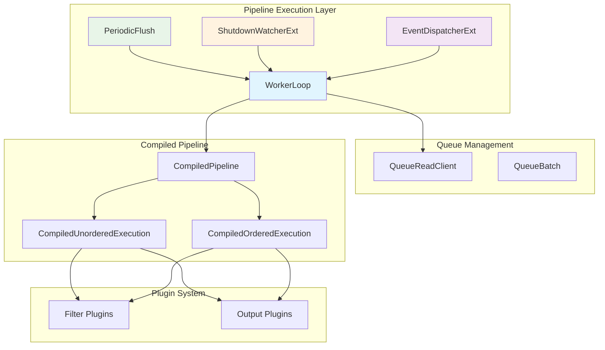

## Core Components

### WorkerLoop
The primary execution engine that runs in dedicated worker threads, continuously processing event batches from the input queue through the compiled pipeline execution chain.

**Architecture:**
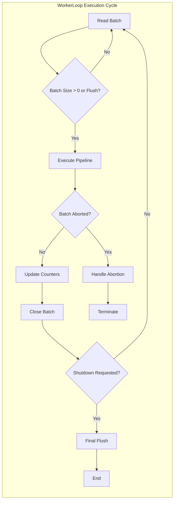

**Key Responsibilities:**
- **Event Batch Processing**: Continuously pulls event batches from `QueueReadClient` and processes them through the compiled pipeline
- **Pipeline Execution**: Delegates event processing to `ObservedExecution` instances created from `CompiledPipeline`
- **Flush Coordination**: Responds to periodic flush requests and performs final flush during shutdown
- **Error Handling**: Manages `AbortedBatchException` scenarios and graceful error recovery
- **Metrics Tracking**: Updates `consumedCounter` and `filteredCounter` for monitoring and observability
- **Shutdown Management**: Supports graceful shutdown with optional queue draining

**Implementation Details:**
- Implements `Runnable` interface for thread execution
- Uses atomic boolean flags for thread-safe coordination (`flushRequested`, `flushing`, `shutdownRequested`)
- Supports both ordered and unordered event processing modes
- Handles batch lifecycle management including proper batch closure

### EventDispatcherExt
A JRuby extension providing event notification capabilities for pipeline lifecycle management and plugin coordination.

**Architecture:**
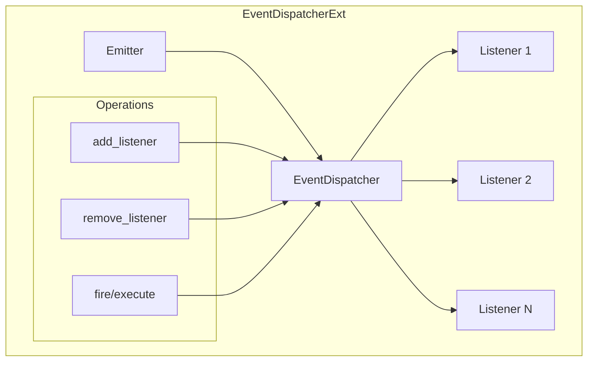

**Key Responsibilities:**
- **Listener Management**: Maintains thread-safe collection of event listeners using `CopyOnWriteArraySet`
- **Event Broadcasting**: Dispatches events to all registered listeners that respond to the specified method
- **Ruby Integration**: Provides JRuby extension for seamless Ruby-Java interoperability
- **Dynamic Registration**: Supports runtime addition and removal of event listeners
- **Method Dispatch**: Dynamically invokes methods on listeners based on event types

**Implementation Details:**
- Uses `@JRubyClass` annotation for Ruby class integration
- Thread-safe listener collection optimized for frequent reads and infrequent writes
- Supports variable argument method calls through Ruby's method dispatch mechanism
- Includes emitter context in all dispatched events

### PeriodicFlush
Manages scheduled flush operations to ensure timely processing of buffered events and maintain pipeline throughput.

**Architecture:**
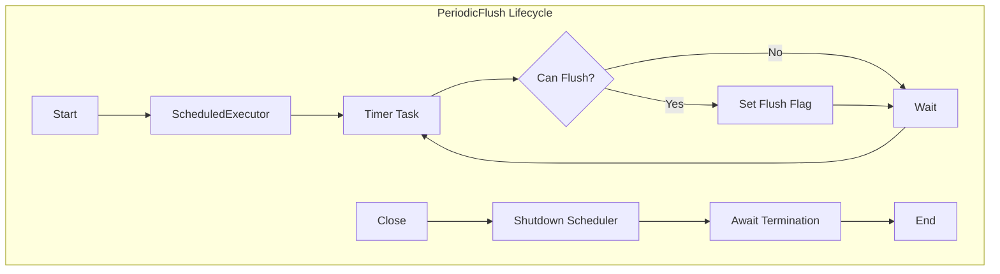

**Key Responsibilities:**
- **Scheduled Execution**: Uses `ScheduledExecutorService` to trigger periodic flush operations every 5 seconds
- **Flush Coordination**: Coordinates with worker threads through atomic boolean flags (`flushRequested`, `flushing`)
- **Concurrency Control**: Prevents multiple concurrent flush operations using compare-and-set operations
- **Resource Management**: Implements `AutoCloseable` for proper resource cleanup
- **Thread Management**: Creates dedicated thread for flush scheduling with appropriate naming

**Implementation Details:**
- Single-threaded executor with custom thread factory for proper thread naming
- Uses atomic operations to prevent race conditions between flush requests
- Configurable flush interval (default: 5 seconds)
- Graceful shutdown with timeout handling (10-second termination timeout)

### ShutdownWatcherExt
Monitors pipeline shutdown progress and handles stalled shutdown scenarios with configurable escalation policies.

**Architecture:**
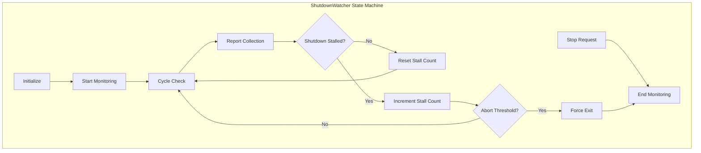

**Key Responsibilities:**
- **Shutdown Monitoring**: Continuously monitors pipeline shutdown progress through periodic snapshots
- **Stall Detection**: Identifies stalled shutdown conditions by analyzing inflight event counts and thread states
- **Progress Reporting**: Generates detailed shutdown progress reports for debugging and monitoring
- **Escalation Management**: Implements configurable escalation policies including forced termination
- **Thread Safety**: Manages concurrent access to monitoring state using atomic operations

**Implementation Details:**
- Configurable monitoring parameters: cycle period, report frequency, abort threshold
- Uses `AtomicBoolean` and `AtomicInteger` for thread-safe state management
- Implements sophisticated stall detection algorithm comparing consecutive reports
- Supports both safe and unsafe shutdown modes with different escalation behaviors
- Integrates with pipeline reporting system for detailed shutdown analysis

## Execution Patterns

### Event Processing Modes

The pipeline execution module supports two distinct event processing modes, each optimized for different use cases:

#### Unordered Execution (CompiledUnorderedExecution)
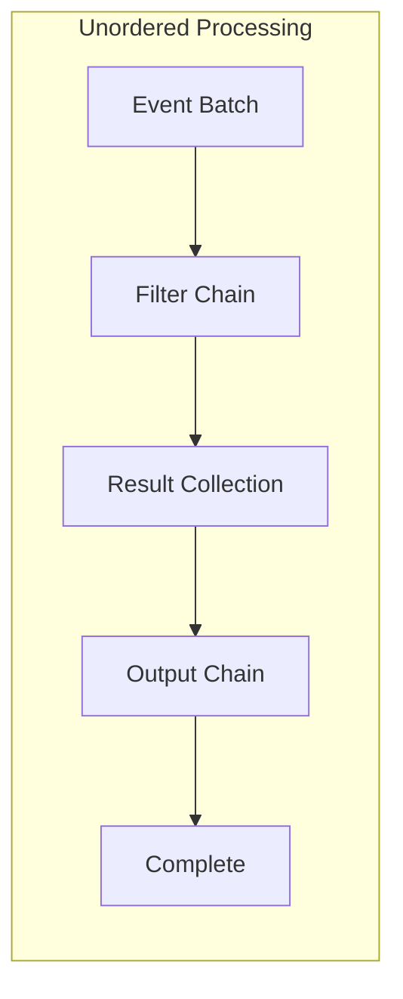

**Characteristics:**
- Processes entire batches through filter chain simultaneously
- Higher throughput due to batch-level optimizations
- Events may be reordered during processing
- Suitable for scenarios where event order is not critical

**Use Cases:**
- High-volume log aggregation
- Metrics collection and processing
- Non-sequential data transformation

#### Ordered Execution (CompiledOrderedExecution)
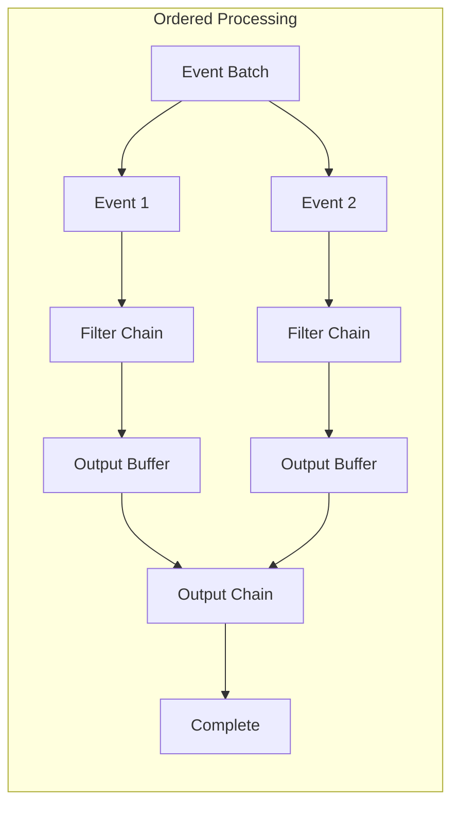

**Characteristics:**
- Processes events individually through filter chain
- Maintains strict event ordering
- Lower throughput due to sequential processing
- Guarantees event order preservation

**Use Cases:**
- Transaction log processing
- Audit trail maintenance
- Sequential data analysis

### Batch Processing Lifecycle

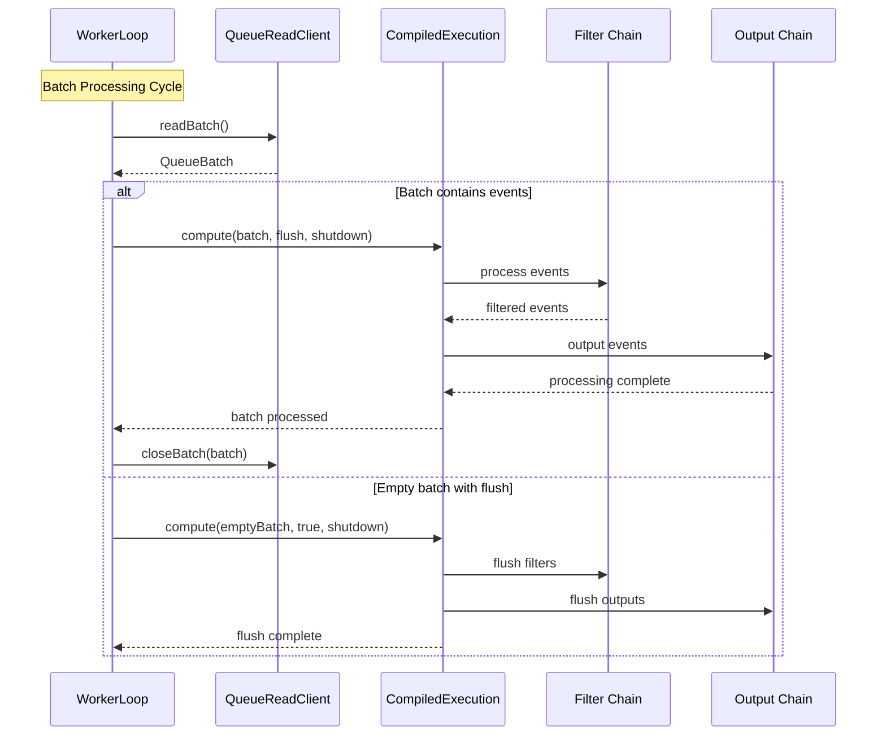

### Error Handling Patterns

The module implements comprehensive error handling through multiple layers:

#### Batch Abortion Mechanism
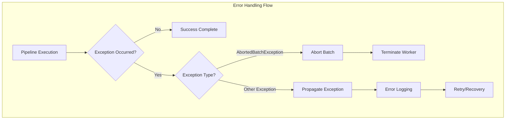

**Abortion Scenarios:**
- Resource exhaustion (memory, file handles)
- Critical plugin failures
- External system unavailability
- Configuration errors during runtime

#### Recovery Strategies
1. **Graceful Degradation**: Continue processing with reduced functionality
2. **Batch Retry**: Attempt to reprocess failed batches
3. **Plugin Isolation**: Isolate failing plugins to prevent cascade failures
4. **Circuit Breaking**: Temporarily disable problematic components

## Data Flow Architecture

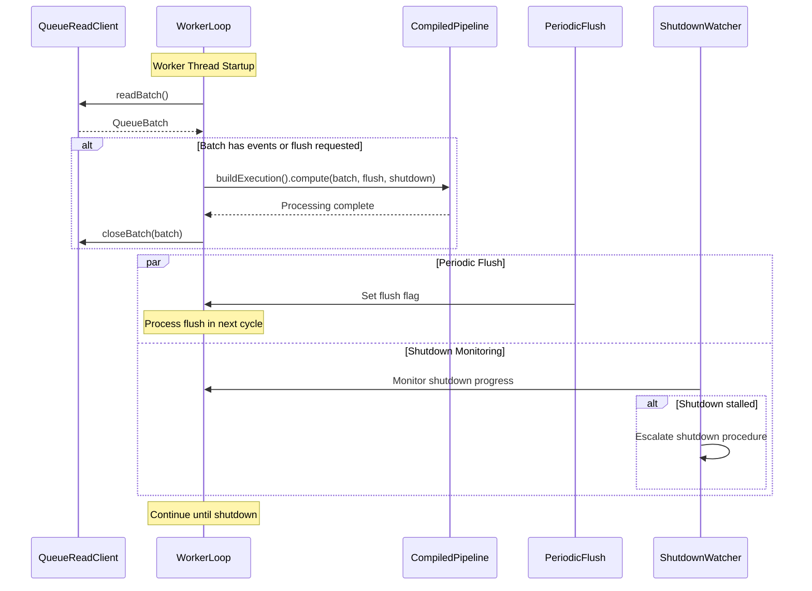

## Integration with Other Modules

The pipeline execution module integrates closely with several other system modules:

### Config Compilation Module
- **Relationship**: Consumes compiled pipeline execution objects
- **Integration**: Uses `CompiledPipeline.buildExecution()` to create execution instances
- **Reference**: See [config_compilation.md](config_compilation.md) for pipeline compilation details

### Queue Management Module
- **Relationship**: Interfaces with queue systems for event batch processing
- **Integration**: Uses `QueueReadClient` for batch operations and queue state management
- **Reference**: See [queue_management.md](queue_management.md) for queue implementation details

### Plugin System Module
- **Relationship**: Executes filter and output plugins through compiled execution chains
- **Integration**: Delegates plugin execution to compiled pipeline components
- **Reference**: See [plugin_system.md](plugin_system.md) for plugin architecture

### Metrics System Module
- **Relationship**: Reports execution metrics and performance counters
- **Integration**: Updates consumed/filtered counters and execution timing metrics
- **Reference**: See [metrics_system.md](metrics_system.md) for metrics collection

### Monitoring Module
- **Relationship**: Provides runtime monitoring and health reporting
- **Integration**: Exposes pipeline state and execution progress for monitoring
- **Reference**: See [monitoring.md](monitoring.md) for monitoring capabilities

## Key Features

### Multi-threaded Processing
- Supports configurable number of worker threads
- Thread-safe batch processing with atomic operations
- Concurrent execution with proper synchronization

### Graceful Shutdown
- Coordinated shutdown across all worker threads
- Optional queue draining before shutdown
- Stall detection with escalation policies
- Final flush operations during shutdown

### Error Handling
- Batch abortion mechanism for error scenarios
- Exception propagation and logging
- Recovery strategies for transient failures

### Performance Optimization
- Batch-based processing for efficiency
- Configurable flush intervals
- Event order preservation options
- Metrics collection for performance monitoring

## Configuration Options

The pipeline execution behavior can be configured through various settings:

- **Worker Thread Count**: Number of concurrent worker threads
- **Batch Size**: Maximum events per batch
- **Flush Interval**: Periodic flush frequency (default: 5 seconds)
- **Shutdown Timeout**: Maximum time to wait for graceful shutdown
- **Queue Draining**: Whether to drain queue during shutdown
- **Event Order Preservation**: Maintain event ordering through pipeline

## Thread Safety

The module implements comprehensive thread safety through:

- **Atomic Operations**: Uses `AtomicBoolean` and `LongAdder` for shared state
- **Copy-on-Write Collections**: Thread-safe listener management in EventDispatcher
- **Synchronized Execution**: Proper coordination between worker threads and control threads
- **Lock-free Design**: Minimizes contention through atomic operations and immutable data structures

## Performance Considerations

- **Batch Processing**: Optimizes throughput through event batching
- **Memory Management**: Efficient batch lifecycle management
- **CPU Utilization**: Balanced worker thread allocation
- **I/O Optimization**: Coordinated flush operations to minimize I/O overhead

## Operational Considerations

### Performance Tuning

#### Worker Thread Configuration
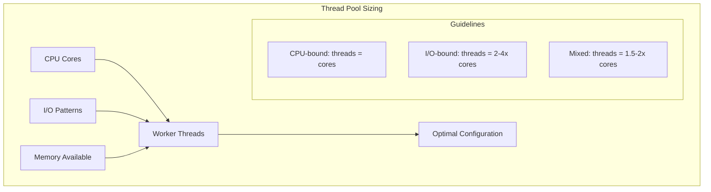

**Tuning Guidelines:**
- **CPU-intensive pipelines**: Set worker threads equal to CPU cores
- **I/O-intensive pipelines**: Use 2-4x CPU cores for better utilization
- **Mixed workloads**: Start with 1.5-2x CPU cores and adjust based on monitoring
- **Memory constraints**: Reduce threads if memory pressure is observed

#### Batch Size Optimization
- **Small batches (< 100 events)**: Lower latency, higher CPU overhead
- **Medium batches (100-1000 events)**: Balanced performance for most use cases
- **Large batches (> 1000 events)**: Higher throughput, increased memory usage and latency

#### Flush Interval Tuning
- **Frequent flushing (< 5s)**: Lower latency, higher CPU overhead
- **Standard flushing (5s)**: Default balanced approach
- **Infrequent flushing (> 10s)**: Higher throughput, increased memory usage

### Monitoring and Alerting

#### Key Metrics to Monitor
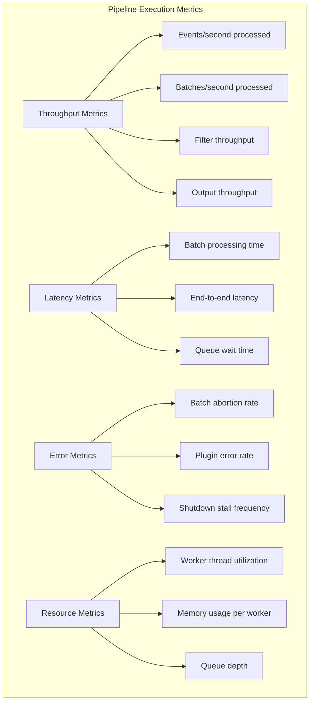

#### Alert Thresholds
- **High batch abortion rate**: > 1% of batches aborted
- **Shutdown stalls**: Any occurrence of stalled shutdowns
- **Low throughput**: < 80% of expected processing rate
- **High latency**: > 95th percentile SLA thresholds
- **Resource exhaustion**: > 90% memory or CPU utilization

### Troubleshooting Guide

#### Common Issues and Solutions

**1. Pipeline Stalls During Shutdown**
```
Symptoms: ShutdownWatcher reports stalled shutdown
Causes: Blocked output plugins, infinite loops in filters, resource locks
Solutions: 
- Enable unsafe shutdown mode for emergency situations
- Investigate plugin-specific logs for blocking operations
- Review filter logic for potential infinite loops
- Check external system connectivity
```

**2. High Batch Abortion Rate**
```
Symptoms: Frequent AbortedBatchException in logs
Causes: Resource exhaustion, plugin failures, configuration errors
Solutions:
- Monitor memory usage and adjust heap size
- Review plugin configurations for errors
- Implement circuit breakers for external dependencies
- Reduce batch sizes to lower memory pressure
```

**3. Poor Throughput Performance**
```
Symptoms: Lower than expected events/second processing
Causes: Insufficient worker threads, I/O bottlenecks, inefficient filters
Solutions:
- Increase worker thread count based on workload characteristics
- Optimize filter configurations and remove unnecessary processing
- Implement output batching and connection pooling
- Monitor and resolve queue bottlenecks
```

**4. Memory Leaks in Long-Running Pipelines**
```
Symptoms: Gradual memory increase over time
Causes: Event retention in filters, unclosed resources, plugin memory leaks
Solutions:
- Review filter implementations for event retention
- Ensure proper resource cleanup in custom plugins
- Monitor heap dumps for memory leak patterns
- Implement periodic pipeline restarts if necessary
```

### Best Practices

#### Configuration Best Practices
1. **Thread Pool Sizing**: Start conservative and scale based on monitoring
2. **Batch Configuration**: Use medium batch sizes (125-250 events) for balanced performance
3. **Flush Intervals**: Keep default 5-second intervals unless specific requirements dictate otherwise
4. **Shutdown Timeouts**: Configure appropriate timeouts based on pipeline complexity

#### Operational Best Practices
1. **Monitoring**: Implement comprehensive monitoring of all key metrics
2. **Alerting**: Set up proactive alerts for performance degradation
3. **Capacity Planning**: Monitor trends and plan for capacity increases
4. **Testing**: Regularly test shutdown procedures and error handling paths

#### Development Best Practices
1. **Plugin Development**: Ensure plugins handle errors gracefully and don't block indefinitely
2. **Filter Logic**: Avoid complex operations that could cause performance bottlenecks
3. **Resource Management**: Properly manage external connections and resources
4. **Error Handling**: Implement appropriate error handling and recovery mechanisms

## Error Scenarios and Recovery

The module handles various error conditions:

1. **Batch Processing Errors**: Individual batch failures with retry mechanisms
2. **Plugin Failures**: Graceful handling of filter/output plugin errors
3. **Queue Exhaustion**: Backpressure handling and flow control
4. **Shutdown Stalls**: Detection and escalation of stalled shutdown scenarios
5. **Resource Exhaustion**: Memory and thread pool management

## Monitoring and Observability

The module provides extensive monitoring capabilities:

- **Processing Metrics**: Event counts, processing rates, and latency measurements
- **Thread Health**: Worker thread status and performance metrics
- **Queue Status**: Batch processing progress and queue depth
- **Shutdown Progress**: Detailed shutdown monitoring and reporting
- **Error Tracking**: Exception counts and error rate monitoring

This module forms the operational core of Logstash's event processing engine, ensuring reliable, performant, and observable data pipeline execution.