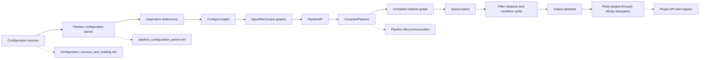
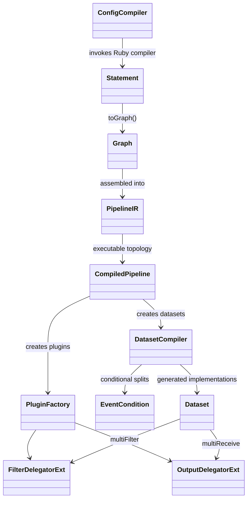
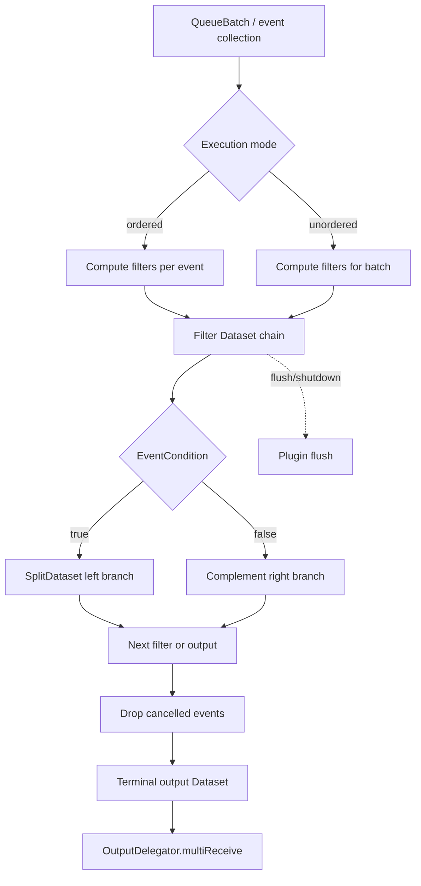

# Pipeline IR and Compilation

## Purpose

The `pipeline_ir_and_compilation` module converts Logstash configuration into an executable pipeline. It bridges the Ruby configuration compiler and the Java execution engine through an intermediate representation (IR): imperative statements become a directed graph of plugin and conditional vertices, and the graph is compiled into per-worker `Dataset` objects that process event batches.

The module is responsible for:

- assembling input, filter, and output graphs into a validated `PipelineIR`;
- preserving plugin definitions, source metadata, branches, and configuration variables;
- translating graph nodes into cached runtime datasets;
- evaluating event conditions and routing matching/non-matching events;
- instantiating Ruby plugins through JRuby delegators;
- supporting ordered and unordered execution, flushing, shutdown, cancellation, and output concurrency.

## Architectural position

Configuration loading and parsing are outside this module. The parser produces imperative statements through the Ruby compiler, while this module builds the IR and runtime execution used by pipeline lifecycle code.



## End-to-end compilation flow

`ConfigCompiler.compileSources` compiles every source partition with the Ruby `LogStash::Compiler`, converts each returned statement to a graph, groups graphs by plugin type, combines input and output graphs, chains filter graphs, and constructs `PipelineIR`. `PipelineIR` then adds the queue and filter/output separator, validates the resulting DAG, and records a stable hash from the original source or graph structure.

```mermaid
sequenceDiagram
    participant Ruby as Ruby LSCL compiler
    participant CC as ConfigCompiler
    participant G as Graph
    participant IR as PipelineIR
    participant CP as CompiledPipeline
    participant DC as DatasetCompiler
    participant P as Ruby plugin

    CC->>Ruby: compile_imperative(source, supportEscapes)
    Ruby-->>CC: input/filter/output Statements
    CC->>G: Statement.toGraph(config variables)
    CC->>G: combine inputs and outputs; chain filters
    CC->>IR: new PipelineIR(input, filter, output)
    IR->>G: add queue and filter/output separator
    IR->>G: validate DAG and compute hash
    CP->>IR: discover plugin and conditional vertices
    CP->>P: PluginFactory builds input/filter/output/codec
    CP->>DC: compile filter and output datasets
    DC-->>CP: executable Dataset instances
```

## Sub-modules

### IR assembly

[pipeline_ir_and_compilation_ir_assembly.md](pipeline_ir_and_compilation_ir_assembly.md) documents `ConfigCompiler`, the public construction helpers in `DSL`, expression substitution, and sequence/parallel statement composition. This is the boundary between parser-produced statements and graph-backed IR.

### Graph processing

[pipeline_ir_and_compilation_graph_processing.md](pipeline_ir_and_compilation_graph_processing.md) documents `Graph`, boolean edges, and traversal/diff/topological-sort algorithms. These structures enforce the pipeline DAG and preserve branch topology while graphs are combined and chained.

### Dataset runtime and execution

[pipeline_ir_and_compilation_dataset_runtime.md](pipeline_ir_and_compilation_dataset_runtime.md) documents `CompiledPipeline`, `DatasetCompiler`, dataset state/caching, event conditions, common actions, split complements, and execution utilities. Its focused pages cover [compiled execution](pipeline_ir_and_compilation_dataset_runtime_compiled_execution.md), [dataset compilation](pipeline_ir_and_compilation_dataset_runtime_dataset_compilation.md), and [conditions and common actions](pipeline_ir_and_compilation_dataset_runtime_conditions_and_common_actions.md).

### JRuby plugin bridge

[pipeline_ir_and_compilation_jruby_plugin_bridge.md](pipeline_ir_and_compilation_jruby_plugin_bridge.md) documents filter/output delegators, output concurrency strategies, the strategy registry, and the `RubyIntegration.PluginFactory` contract. It explains how Java-generated datasets invoke Ruby plugin methods while preserving plugin IDs, metrics, lifecycle hooks, and batching semantics.

## Core relationships



## Runtime event flow

Each `CompiledExecution` instance owns cached dataset instances and is intended to be created per worker thread. It recursively flattens graph dependencies from the filter separator and output leaves. Filter datasets buffer non-cancelled events, condition datasets split them into positive and complement collections, and output datasets invoke `multiReceive`.



## Important invariants

- The assembled `PipelineIR` must be a validated DAG; cycles and duplicate vertex IDs are rejected.
- Graph combination copies vertices and edges, so composing independent statements does not reuse graph ownership accidentally.
- Dataset `compute` results are cached until `clear`; this allows branches and multiple consumers to share a computation within one traversal.
- Cancelled events are filtered before being passed downstream. Conditional evaluation errors cancel the affected event and are reported through the configured listener.
- Ordered execution processes each event as a single-element filter batch; unordered execution preserves batch-level processing and is the default.
- Plugin configuration variables are expanded recursively, including nested maps, lists, codec plugin statements, environment variables, and secret-store values.
- Output strategy selection follows the plugin’s declared concurrency and may use a synchronized single instance, a shared instance, or a worker pool.

## Integration points

- [pipeline_configuration_parser.md](pipeline_configuration_parser.md) supplies the Ruby parser/compiler that creates imperative statements.
- [configuration_sources_and_loading.md](configuration_sources_and_loading.md) supplies source text and metadata consumed by compilation.
- Plugin API and registry code provides plugin lookup, factories, and Ruby plugin base contracts.
- Pipeline lifecycle and execution code owns pipeline startup, worker lifecycle, and invocation of compiled execution.
- Event model and JRuby interop code defines the Ruby/Java event representation used by datasets and conditions.
- [secret_store.md](secret_store.md) provides secret expansion inputs when compiling plugin arguments and conditional expressions.

## Failure and lifecycle boundaries

Configuration errors can surface while Ruby statements are compiled, while statements are converted to graphs, or while graph validation detects invalid topology. Runtime plugin construction failures are wrapped as an inability to configure plugins. Conditional type/evaluation failures cancel the event and notify the listener; plugin flush and shutdown flags are propagated through every dataset so flushable filters and outputs can release state correctly.
