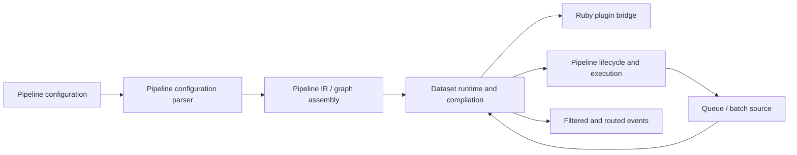
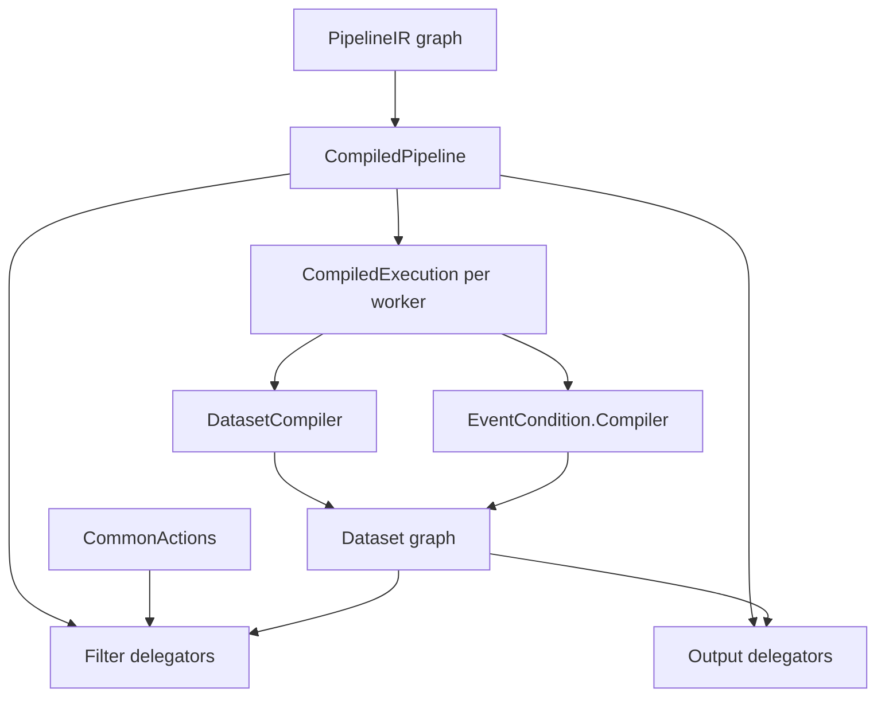
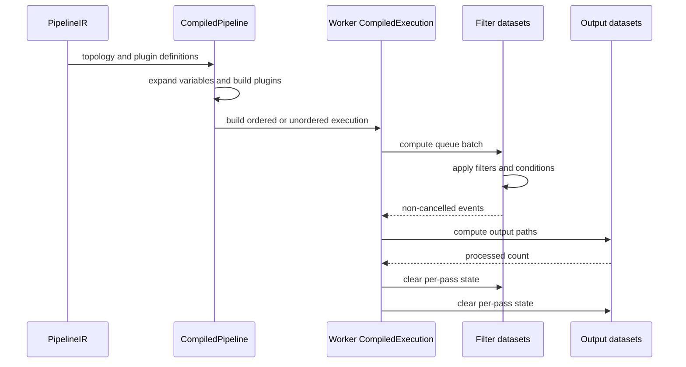

# Pipeline IR and compilation dataset runtime

The `pipeline_ir_and_compilation_dataset_runtime` module is Logstash's execution-time layer between a parsed pipeline graph and running plugin calls. It takes `PipelineIR` vertices and edges, instantiates configured Ruby plugins, compiles graph paths into Java-backed `Dataset` objects, evaluates event conditions, and processes queue batches through filters and outputs.

## Position in the system

The parser and IR assembly are upstream concerns. See [pipeline_configuration_parser.md](pipeline_configuration_parser.md) and [pipeline_ir_and_compilation_ir_assembly.md](pipeline_ir_and_compilation_ir_assembly.md). Plugin construction is shared with [pipeline_ir_and_compilation_jruby_plugin_bridge.md](pipeline_ir_and_compilation_jruby_plugin_bridge.md) when present; operational lifecycle is consumed by [pipeline_lifecycle_and_execution.md](pipeline_lifecycle_and_execution.md) when present.

## Architecture

## Sub-modules

| Area | Documentation | Main responsibility |
|---|---|---|
| Compiled execution | [pipeline_ir_and_compilation_dataset_runtime_compiled_execution.md](pipeline_ir_and_compilation_dataset_runtime_compiled_execution.md) | Plugin setup, graph flattening, per-thread execution, ordered/unordered batches |
| Dataset compilation | [pipeline_ir_and_compilation_dataset_runtime_dataset_compilation.md](pipeline_ir_and_compilation_dataset_runtime_dataset_compilation.md) | Generated datasets, buffering, flush/clear behavior, filter/output invocation |
| Conditions and actions | [pipeline_ir_and_compilation_dataset_runtime_conditions_and_common_actions.md](pipeline_ir_and_compilation_dataset_runtime_conditions_and_common_actions.md) | Conditional predicates, branch partitioning, cancellation, shared event actions |

## End-to-end data flow

## Key design properties

- Graph topology is compiled once into reusable dataset objects, with vertex-ID caches avoiding duplicate plugin and condition compilation.
- Dataset state is isolated per `CompiledExecution`, matching worker-thread ownership.
- Ordered mode provides event-at-a-time filter semantics; unordered mode maximizes batch processing.
- Flush and shutdown flags propagate through every dataset, allowing filter flush output to reach outputs.
- Cancelled events are removed at dataset boundaries, while conditional failures are reported and cancel the problematic event.
- Ruby interoperability remains at plugin boundaries; generated Java code handles routing, buffering, and lifecycle bookkeeping.
