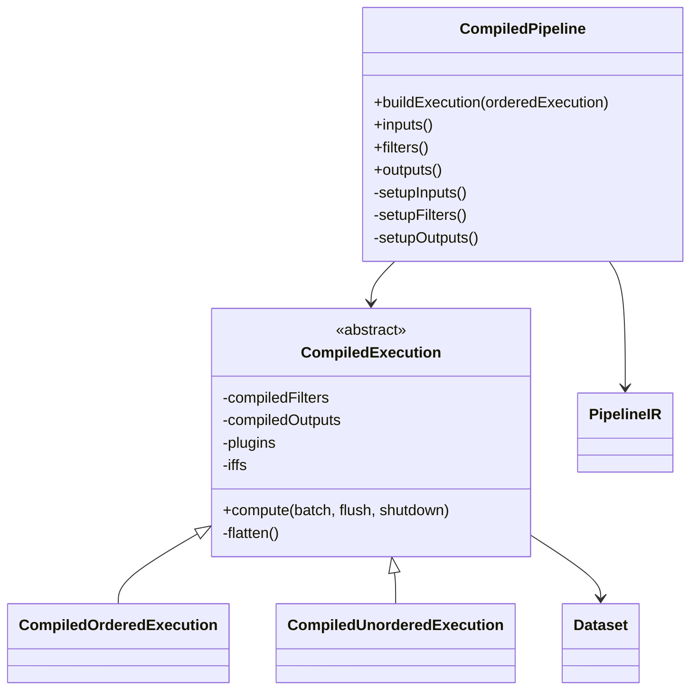
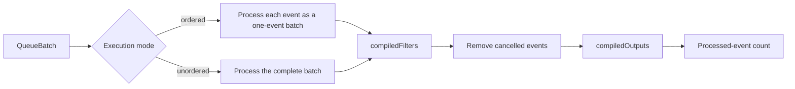

# Compiled execution and pipeline runtime

This sub-module turns a parsed `PipelineIR` graph into per-worker executable state. Its central class is `CompiledPipeline`; it creates input, filter, codec, and output plugin instances, then produces a `CompiledExecution` that can process queue batches.

## Responsibilities

- Expand environment and secret-backed configuration values.
- Instantiate Ruby plugins through `RubyIntegration.PluginFactory`.
- Compile filter and output graph paths into `Dataset` objects.
- Select ordered or unordered batch execution.
- Maintain per-execution caches and buffers, so a compiled execution can be reused by one worker thread.

## Runtime structure

`CompiledExecution` discovers the separator between filter and output sections, recursively flattens incoming graph dependencies, and memoizes generated datasets by vertex ID. Conditional vertices are separately cached as `SplitDataset` instances.

## Batch semantics

Ordered mode preserves event-by-event filter processing and aggregates the resulting events before output. Unordered mode submits the batch together. Both modes honor `flush` and `shutdown`; filters with flush support may emit additional events.

## Configuration and plugin construction

`CompiledPipeline` recursively expands strings, lists, and maps with `ConfigVariableExpander`. Nested codec `PluginStatement` values are intercepted and instantiated through the plugin factory. The resulting Ruby hashes are passed to filter/output builders together with source metadata. Secret expansion is normally hidden from ordinary configuration handling, while conditional comparison has explicit support for `SecretVariable` values.

The plugin bridge is described in [pipeline_ir_and_compilation_jruby_plugin_bridge.md](pipeline_ir_and_compilation_jruby_plugin_bridge.md) when that module is available. Pipeline startup and lifecycle consumers are covered by [pipeline_lifecycle_and_execution.md](pipeline_lifecycle_and_execution.md) when available.

## Lifecycle and isolation

`CompiledPipeline` owns configured plugin instances. Each `CompiledExecution` owns dataset instances, buffers, and caches and should therefore be created once per worker thread. `compute` returns the number of events reaching the output stage, which may differ from the input count when filters cancel, clone, or drop events.

