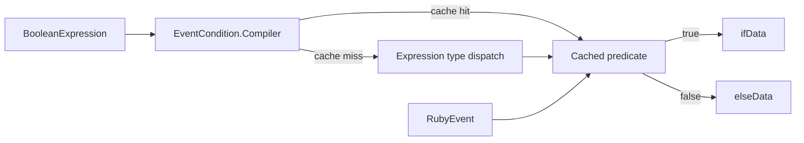
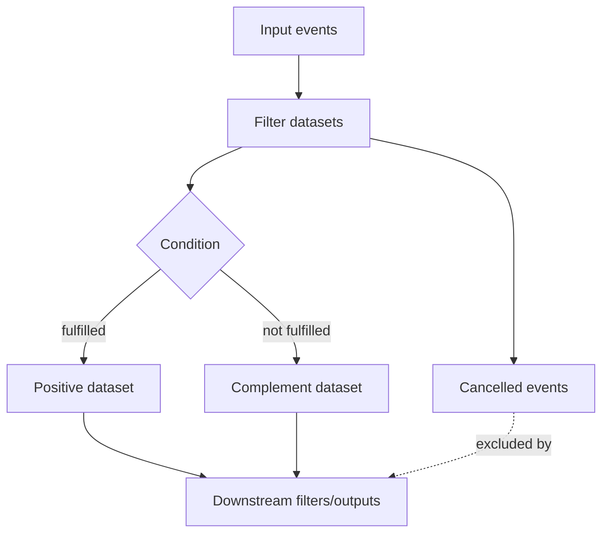

# Conditions, branching, and common event actions

This sub-module evaluates `if` expressions against JRuby-backed events and implements shared plugin actions such as `add_field`, `add_tag`, `remove_field`, `remove_tag`, and input `type` handling.

## Condition compilation

`EventCondition.Compiler` converts IR boolean expressions into executable predicates and caches them by their Ruby-string representation. Supported families include equality/inequality, regular expressions, membership, comparisons, conjunction/disjunction, negation, and truthiness. The compiler handles constants, event fields, field-to-field comparisons, lists, and Ruby-compatible scalar values.

`FieldTruthy` treats null, an empty string, and the string `false` as false; other non-null values are true. Regex and string membership use JRuby representations where needed. Secret variables used in equality checks are unwrapped only for comparison, keeping secret handling localized.

## Error behavior

`Utils.filterEvents` catches JRuby type, argument, and illegal-argument failures during condition evaluation. The affected event is cancelled and a `ConditionalEvaluationError` is raised. `CompiledPipeline` can report that error through its conditional-evaluation listener; the complement branch is designed to remain consistent when evaluation fails.

## CommonActions

`CommonActions` maps plugin configuration keys to event transformations. Field names, field values, and tags are passed through `StringInterpolation`. Adding a field appends to an existing list or converts a scalar into a two-element list; adding tags delegates to the event tag API. Removing fields or tags is best-effort over the configured names. Input actions operate on map data and additionally support `tags` and `type`.

## Branching and cancellation

`Utils.copyNonCancelledEvents` prevents cancelled events from entering downstream datasets. This is used both after filter execution and when buffering parent results.

