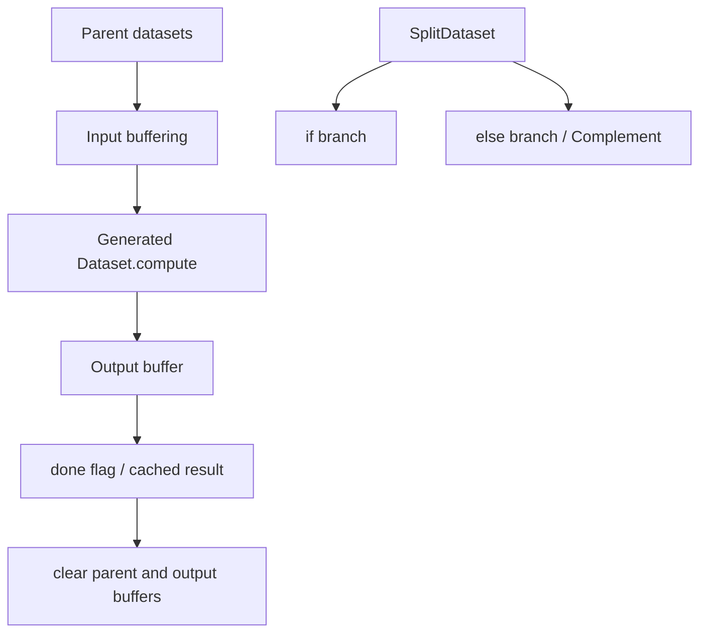
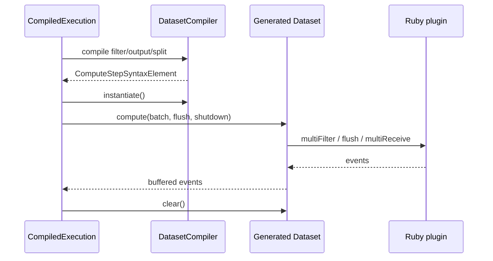

# Dataset compilation and event routing

This sub-module provides the runtime compiler for Logstash execution datasets. `DatasetCompiler` generates Java-backed dataset implementations from syntax elements, while `BaseDataset` supplies shared completion state. The generated datasets connect filter, condition, and output stages without repeatedly recomputing a parent stage.

## Dataset model

Every dataset exposes `compute(batch, flush, shutdown)` and `clear()`. `BaseDataset`'s `done` flag supports idempotent computation within a pass: a second call returns the buffered result, and `clear` releases it only after the result has been consumed.

## DatasetCompiler responsibilities

- `filterDataset`: invoke `multiFilter`, preserve returned events, and optionally invoke `flush`.
- `outputDataset`: invoke `multiReceive`, using the optimized Ruby call path generated by the syntax factory.
- `splitDataset`: evaluate a condition and partition events into positive and negative buffers.
- `terminalFilterDataset`: merge multiple filter parents as a pass-through terminal dataset.
- `terminalOutputDataset`: compute all output parents and clear them.
- Buffering helpers: copy only non-cancelled events from parent datasets and clear intermediate state.

Plugin IDs are written to Log4j thread context around filter and output calls, allowing runtime logs to identify the active plugin. Output datasets optimize the single-terminal-output case by clearing parent state inline.

## Conditional complement

`Complement` implements the negative side of a split. It shares the else-event collection populated while the positive branch evaluates. Calling its `compute` first forces the positive branch to run, then returns the shared complement; `clear` delegates to the positive branch so both sides have one lifecycle.

## Compilation flow

The compiler emits class fields for parent datasets, plugin delegators, buffers, and conditions. This keeps the hot path in generated Java while retaining Ruby plugin behavior.

