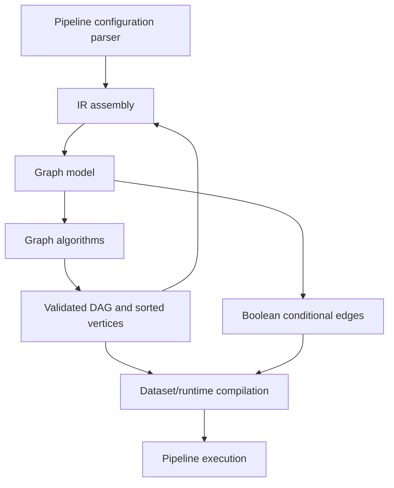
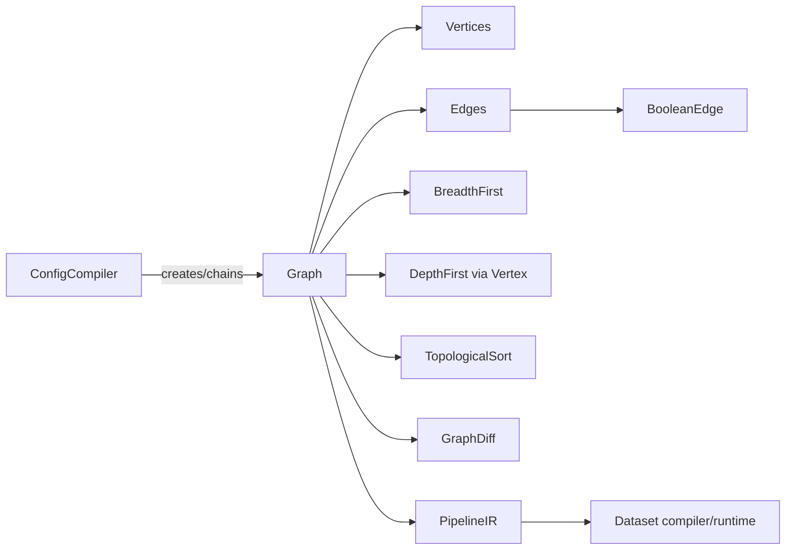
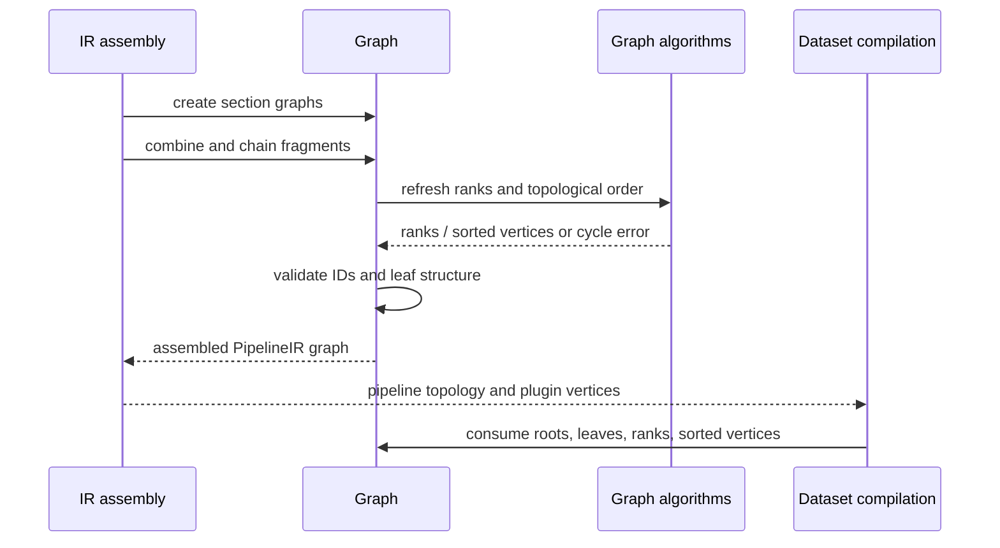

# Pipeline IR and Compilation Graph Processing

## Introduction

The `pipeline_ir_and_compilation_graph_processing` module supplies the graph representation and graph algorithms underlying Logstash's pipeline intermediate representation. It turns pipeline sections into validated directed acyclic graphs, preserves conditional branches, supports composition of graph fragments, and exposes topology needed by IR assembly and executable dataset compilation.

This module is infrastructure rather than a standalone pipeline stage: [pipeline_ir_and_compilation_ir_assembly.md](pipeline_ir_and_compilation_ir_assembly.md) constructs and combines these graphs, while [pipeline_ir_and_compilation_dataset_runtime.md](pipeline_ir_and_compilation_dataset_runtime.md) consumes the assembled topology to build runtime datasets.

## Architecture overview

The graph model owns membership, connectivity, copying, chaining, validation, and identity. The algorithm layer calculates ranks, traverses lineage, produces topological order, and compares graph revisions.

## Sub-modules

| Sub-module | Documentation | Scope |
|---|---|---|
| Graph model | [pipeline_ir_and_compilation_graph_processing_graph_model.md](pipeline_ir_and_compilation_graph_processing_graph_model.md) | `Graph`, vertex/edge ownership, graph composition, Boolean edges, validation, hashing |
| Graph algorithms | [pipeline_ir_and_compilation_graph_processing_algorithms.md](pipeline_ir_and_compilation_graph_processing_algorithms.md) | Breadth-first ranking, depth-first traversal, topological sorting, cycle detection, graph diffs |

## Component interaction

## End-to-end processing

## Design characteristics

- Graph fragments are copied when combined, preventing one vertex or edge from belonging to multiple graphs.
- Conditional paths are explicit Boolean edges, so true and false branches remain distinguishable during comparison and compilation.
- Refresh is the consistency boundary: it recalculates derived indexes and ordering after mutations.
- Cycle detection protects downstream compilation, which assumes DAG execution paths.
- Source-aware equivalence and hashing support reproducibility, diagnostics, and change detection.

## Maintenance guidance

Changes to vertex edge acceptance, graph chaining, or topological ordering can alter pipeline execution semantics. Changes to source-component equality or unique hashing can affect graph comparison, caching, and diagnostics. When modifying these areas, verify both conditional and parallel/branched pipeline configurations, plus graph copy/combine behavior.
