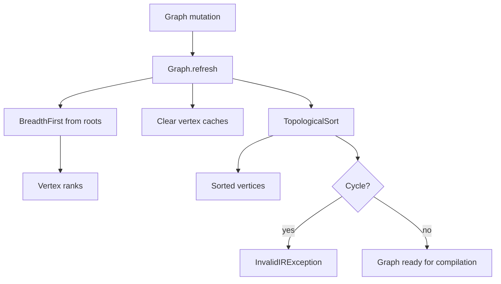

# Pipeline IR and Compilation Graph Processing: Algorithms

## Purpose

This sub-module provides the algorithms that make the pipeline IR graph usable: breadth-first ranking, depth-first lineage traversal, topological ordering with cycle detection, and structural graph diffs.

## Algorithm catalogue

| Component | Role | Used by |
|---|---|---|
| `BreadthFirst` | Computes shortest edge distance from roots, or traverses backward from targets when `reverse` is enabled | `Graph.refresh`, `Graph.rank` |
| `DepthFirst` | Exposes forward and reverse traversals as Java streams | `Vertex.ancestors`, `Vertex.descendants`, callers needing lineage |
| `TopologicalSort` | Orders vertices using Kahn's algorithm and detects cycles | `Graph.refresh`, sorted graph output |
| `GraphDiff` | Reports added/removed equivalent vertices and edges | `Graph.sourceComponentEquals`, diagnostics/tests |

## Graph refresh pipeline

### Breadth-first ranking

`BreadthFirst.breadthFirst(roots)` initializes every root at distance zero and visits outgoing neighbors. The resulting `BfsResult.vertexDistances` is stored by `Graph` as `vertexRanks`; `Vertex.rank()` therefore means shortest distance from any root. The optional reverse mode follows incoming vertices and the optional consumer receives each visited vertex and distance.

The implementation records parents but currently exposes only distances and visited vertices through `BfsResult`. Traversal state is local to each invocation.

### Depth-first traversal

`DepthFirst` wraps an iterator in a non-parallel distinct stream. Forward traversal starts at graph roots (or an explicit vertex) and follows outgoing vertices. Reverse traversal starts at leaves (or an explicit vertex) and follows incoming vertices. `Vertex.ancestors`, `descendants`, and `lineage` build on these methods.

The traversal marks visited vertices but queues discovered vertices, so callers should treat the stream as a graph traversal rather than a guaranteed recursive pre-order. It does not itself reject cycles; DAG validation remains the responsibility of topological sorting.

### Topological ordering and cycle detection

`TopologicalSort.sortVertices` uses Kahn's algorithm. It starts with roots, emits a vertex, marks each outgoing edge traversed, and enqueues a target only after all of its incoming edges have been traversed. If any graph edge remains untraversed after the queue is exhausted, the graph contains a cycle and `UnexpectedGraphCycleError` is raised.

`Graph.refresh` translates that checked algorithm error into `InvalidIRException("Graph is not a dag!")`, making invalid cycles visible at graph mutation/refresh boundaries.

### Graph differences

`GraphDiff.diff(left, right)` performs four set-like scans:

1. Vertices and edges in `left` with no equivalent item in `right` are removed.
2. Vertices and edges in `right` with no equivalent item in `left` are added.
3. Equivalence is delegated to each component's `sourceComponentEquals` implementation.
4. `DiffResult` exposes collections, a compact summary, and a detailed textual report.

This is a structural comparison, not an object-identity comparison. `Graph.sourceComponentEquals` uses it to implement graph equality semantics for IR components.

## Complexity and operational considerations

All algorithms are in-memory and operate over graph vertices/edges. Breadth-first and topological traversal are linear in the reachable graph size; `GraphDiff` performs repeated equivalent-item scans and can be more expensive for large graphs. Graph mutation should therefore be batched where possible so that `refresh` is not repeatedly invoked during construction.

## Related documentation

The data structures used by these algorithms are described in [pipeline_ir_and_compilation_graph_processing_graph_model.md](pipeline_ir_and_compilation_graph_processing_graph_model.md). Assembly invokes graph chaining and combination as described in [pipeline_ir_and_compilation_ir_assembly.md](pipeline_ir_and_compilation_ir_assembly.md); downstream compilation uses the resulting order and topology in [pipeline_ir_and_compilation_dataset_runtime.md](pipeline_ir_and_compilation_dataset_runtime.md).
