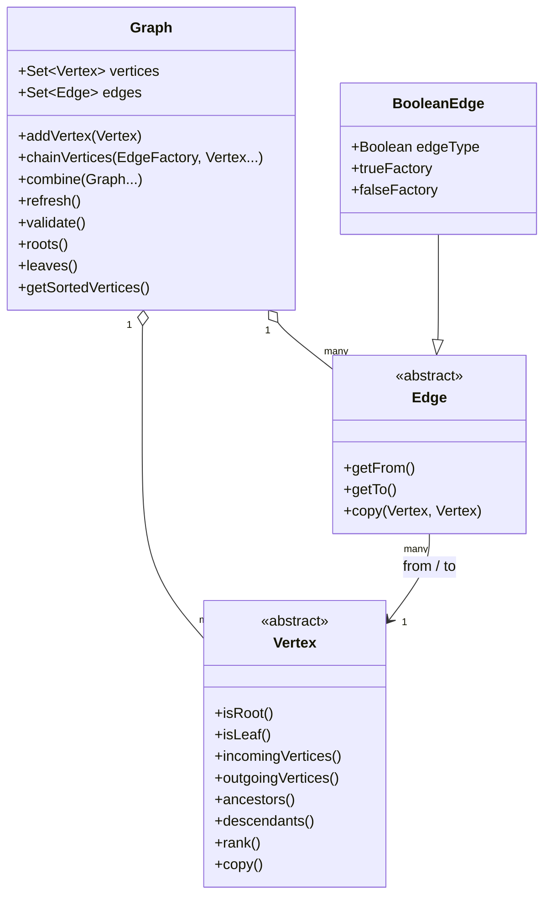
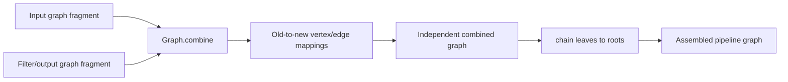

# Pipeline IR and Compilation Graph Processing: Graph Model

## Purpose

This sub-module defines the directed graph representation used by Logstash's pipeline intermediate representation (IR). A graph is a set of typed `Vertex` nodes connected by `Edge` instances. It models the possible execution paths through inputs, filters, condition branches, queues, separators, and outputs.

The primary implementation is `org.logstash.config.ir.graph.Graph`; edge and vertex base types are shared infrastructure in the same package. The graph model is deliberately stricter than a general-purpose graph library: vertices belong to one graph, edges must connect vertices in that graph, and the resulting graph is expected to be a directed acyclic graph (DAG).

## Responsibilities

- Own vertex and edge membership and maintain incoming/outgoing indexes.
- Import, copy, combine, and chain graph fragments during IR assembly.
- Track roots, leaves, partial leaves, ranks, and topologically sorted vertices.
- Validate basic IR invariants such as unique vertex IDs and the presence of leaves.
- Provide structural equality and stable hashing based on source metadata.
- Represent conditional branches through `BooleanEdge.BooleanEdgeFactory` and `BooleanEdge`.

## Object model

`Vertex` uses identity equality and is assigned to at most one `Graph`. `Edge` rejects self-loops and asks its source vertex whether the edge type is accepted. This allows specialized vertices to constrain which edge factories can originate from them.

## Graph construction and mutation

`Graph(Collection<Vertex>, Collection<Edge>)` bulk-loads a graph and then calls `refresh`. Incremental construction uses `addVertex` and `chainVertices`; the latter imports vertices from another graph when necessary and creates edges with a supplied factory. `chain` connects unused outgoing edge types from leaves to roots or specified targets, which is the operation used to join pipeline sections.

`combine` creates a new graph containing copies of all supplied graphs and returns mappings from original to copied vertices and edges. `copy` is implemented through this operation. Consequently, combining graphs does not reassign existing IR objects to a second graph.

After structural mutation, `refresh` recalculates ranks, clears vertex caches, and recomputes topological order. `chainVerticesUnsafe` exists for controlled internal construction and explicitly skips validation until the caller refreshes/validates the graph.

## Conditional edges and identity

`BooleanEdgeFactory(true)` and `BooleanEdgeFactory(false)` are canonical factories for conditional branches. The produced edge includes its boolean type in its ID, textual representation, hash source, and source-component comparison. Thus two otherwise identical paths with opposite branch values remain distinct.

Graph structural comparison delegates to `GraphDiff`, comparing vertices and edges by `sourceComponentEquals`, rather than Java object identity. `Graph.uniqueHash` hashes source metadata from relevant vertices and excludes queue/separator vertices that do not carry configuration metadata.

## Invariants and failure modes

- A vertex or edge already attached to another graph cannot be reused directly; it must be copied/imported.
- An edge must reference vertices in its owning graph.
- Self-loops are rejected by `Edge` construction.
- `refresh` fails with `InvalidIRException` when topological sorting detects a cycle.
- `validate` rejects graphs without leaves and graphs containing duplicate vertex IDs.
- Rank lookup fails if called before the graph has calculated ranks.

## Related documentation

Graph algorithms are documented in [pipeline_ir_and_compilation_graph_processing_algorithms.md](pipeline_ir_and_compilation_graph_processing_algorithms.md). The graph is assembled by [pipeline_ir_and_compilation_ir_assembly.md](pipeline_ir_and_compilation_ir_assembly.md) and consumed by [pipeline_ir_and_compilation_dataset_runtime.md](pipeline_ir_and_compilation_dataset_runtime.md).
