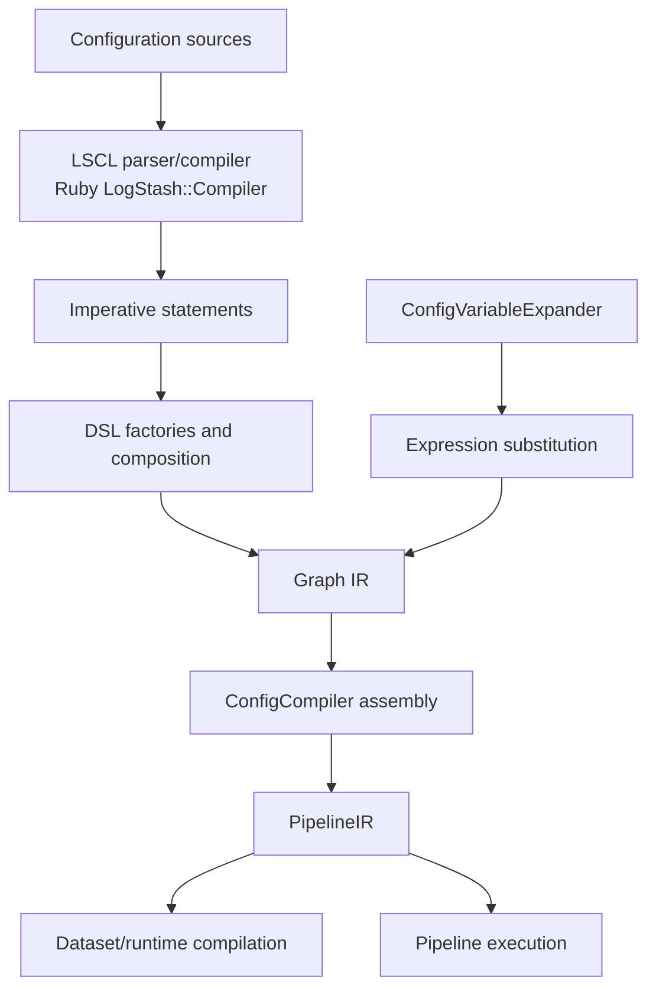
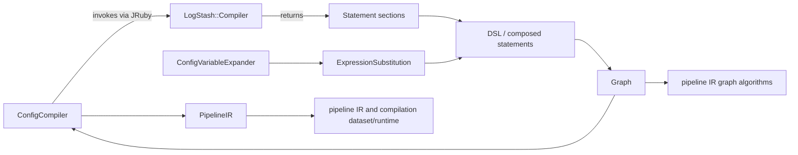
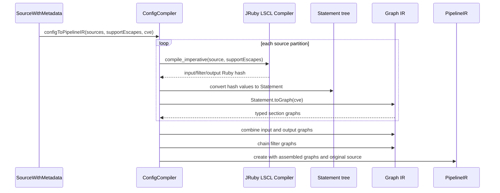

# Pipeline IR and Compilation IR Assembly

## Purpose

This module assembles Logstash pipeline configuration into an intermediate representation (IR) suitable for compilation and execution. It sits at the boundary between the Ruby LSCL parser/compiler and the Java graph/compiler runtime: parsed plugin sections become imperative statements, statements become typed graphs, and those graphs are assembled into a `PipelineIR` containing input, filter, and output execution structure.

The module also provides the construction DSL used by IR-producing code and the recursive expression substitution mechanism used to resolve configuration variables while retaining source metadata and secret-handling rules.

## Architecture overview

## Sub-modules

| Sub-module | Scope | Main entry points |
|---|---|---|
| [Configuration compilation](pipeline_ir_and_compilation_ir_assembly_config_compilation.md) | JRuby bridge, statement conversion, graph grouping, and `PipelineIR` construction | `ConfigCompiler` |
| [Expression substitution](pipeline_ir_and_compilation_ir_assembly_expression_substitution.md) | Recursive `${...}` expansion in boolean/value expressions | `ExpressionSubstitution` |
| [Statement composition](pipeline_ir_and_compilation_ir_assembly_statement_composition.md) | Sequential/parallel statement trees and their graph conversion | `ComposedStatement`, `ComposedSequenceStatement`, `ComposedParallelStatement` |

## Component relationships

## End-to-end processing

## High-level responsibilities

- `ConfigCompiler` owns source partition compilation and final section assembly.
- `DSL` centralizes creation of expressions, plugin statements, conditionals, graph vertices, and composition nodes.
- `ComposedSequenceStatement` preserves order through graph chaining.
- `ComposedParallelStatement` preserves branch independence through graph combination.
- `ExpressionSubstitution` resolves eligible expression values through `ConfigVariableExpander`; regex values remain unchanged.
- `PipelineIR` is the handoff object consumed by downstream dataset/runtime compilation and execution.

## System fit and dependencies

The upstream [pipeline_configuration_parser.md](pipeline_configuration_parser.md) supplies the Ruby compiler and LSCL syntax model. The sibling `pipeline_ir_graph` module supplies graph data structures and algorithms used during assembly. Downstream `pipeline_ir_and_compilation_dataset_runtime` compiles the assembled IR into executable dataset/runtime structures, while `pipeline_lifecycle_and_execution` owns runtime lifecycle and execution behavior.

Variable expansion can consult secure configuration facilities documented in [secret_store_backend.md](secret_store_backend.md) and [secure_data_utilities.md](secure_data_utilities.md).

## Error and compatibility boundaries

`InvalidIRException` represents invalid intermediate representation or incompatible graph operations. The Java compiler uses JRuby conversion (`JavaUtil`, `RubyHash`, and `Statement` conversion) as a compatibility boundary with the Ruby compiler. Source metadata is carried into expressions/statements/graph nodes to support diagnostics and structural comparisons.

## Maintenance notes

Changes to parser output shape must remain compatible with `ConfigCompiler.readStatementFromRubyHash`. Changes to composition semantics affect graph topology and therefore pipeline behavior. Changes to variable expansion must preserve the secret-store/environment/default precedence and the deliberate regex exclusion.
