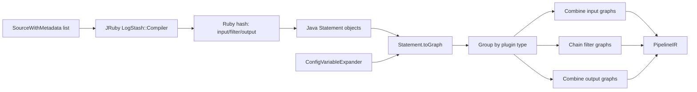

# Pipeline IR Assembly: Configuration Compilation

## Responsibility

This sub-module is the Java-facing orchestration layer that turns one or more `SourceWithMetadata` configuration partitions into a `PipelineIR`. It bridges the Ruby LSCL compiler, converts the resulting imperative statements to graphs, groups graphs by plugin type, and assembles input, filter, and output sections.

## Core components

### `ConfigCompiler`

`ConfigCompiler.configToPipelineIR` is the public entry point. It delegates to `compileSources`, passing the `config.support_escapes` behavior and a `ConfigVariableExpander` used while graph nodes are created.

`compileSources` performs four stages:

1. Compile every source independently with `compileGraph`.
2. Flatten and group the resulting graphs by `PluginDefinition.Type` (`INPUT`, `FILTER`, and `OUTPUT`).
3. Combine input and output graphs; chain filter graphs in source order.
4. Join the original source text and construct `PipelineIR`.

`compileImperative` invokes the Ruby `LogStash::Compiler#compile_imperative` method through JRuby. The returned Ruby hash is converted into Java `Statement` instances, one for each plugin section. `compileGraph` then calls `Statement.toGraph`, where variable expansion and IR validation occur.

## Assembly behavior

Input and output sections are combined with `Graph.combine`, allowing independently compiled source partitions to form a single section. Filter sections are reduced using `Graph.chain`, preserving sequential filter semantics. Missing filter sections produce a `null` filter graph; input and output are expected to have grouped graph entries before conversion to arrays.

Invalid IR errors crossing the Java stream/lambda boundary are wrapped as `IllegalArgumentException`; the public API documents `InvalidIRException` as the configuration-validation failure. Callers should therefore preserve the original cause when reporting compilation failures.

## Data flow

## Related documentation

- [pipeline_ir_and_compilation_ir_assembly_statement_composition.md](pipeline_ir_and_compilation_ir_assembly_statement_composition.md) explains the statements that are converted to graphs.
- [pipeline_ir_and_compilation_ir_assembly_expression_substitution.md](pipeline_ir_and_compilation_ir_assembly_expression_substitution.md) explains configuration-variable expansion in expressions.
- [pipeline_configuration_parser.md](pipeline_configuration_parser.md) documents the upstream Ruby parser/compiler that supplies the imperative statements.
- [pipeline_ir_and_compilation_dataset_runtime.md](pipeline_ir_and_compilation_dataset_runtime.md) covers downstream dataset compilation and runtime execution.
