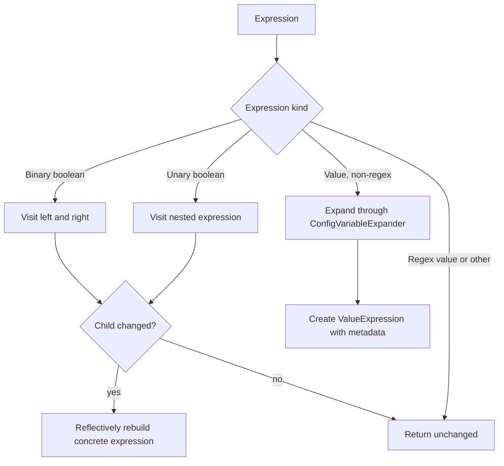

# Pipeline IR Assembly: Expression Substitution

## Responsibility

`ExpressionSubstitution` performs late configuration-variable expansion inside IR expressions. It keeps expression structure and source metadata intact while replacing values such as `${VAR:defaultValue}` according to the configured expansion policy.

## `ExpressionSubstitution`

`substituteBoolExpression(ConfigVariableExpander, Expression)` recursively traverses:

- `BinaryBooleanExpression` trees, substituting both operands.
- `UnaryBooleanExpression` trees, substituting the nested expression.
- `ValueExpression` leaves, except `RegexValueExpression` leaves.

Value expansion delegates to `CompiledPipeline.expandConfigVariableKeepingSecrets`. The documented precedence is secret store, environment variable, then default value. Regex expressions are explicitly excluded, preventing configuration substitution from changing regular-expression semantics.

When a child changes, the implementation reconstructs the original concrete expression class reflectively using constructors that accept source metadata and child expressions. If no suitable constructor exists or reconstruction fails, it throws `IllegalStateException` with the instantiation failure as its cause.

## Design implications

The traversal is copy-on-change: unchanged expression objects are returned as-is, while changed branches receive new nodes. This preserves metadata and avoids rebuilding unrelated parts of the tree. Expression substitution is concerned with expression values, not plugin arguments generally; plugin and dataset expansion are handled by the surrounding compilation/runtime layers.

## Related documentation

- [pipeline_ir_and_compilation_ir_assembly_config_compilation.md](pipeline_ir_and_compilation_ir_assembly_config_compilation.md) describes where source compilation and expansion enter the IR pipeline.
- [secret_store_backend.md](secret_store_backend.md) and [secure_data_utilities.md](secure_data_utilities.md) describe the secure-value side of variable resolution.
