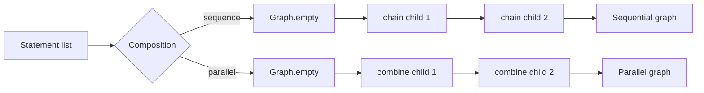

# Pipeline IR Assembly: Imperative Statement Composition

## Responsibility

The imperative statement classes provide a structured intermediate form between the Ruby parser and the graph IR. `ComposedStatement` supplies shared validation, introspection, equality, and formatting; its two concrete subclasses define sequential and parallel graph assembly.

## Core components

### `ComposedStatement` and `IFactory`

`ComposedStatement` stores an ordered, non-null list of child `Statement` objects. Its constructor rejects a null list or null child with `InvalidIRException`. `sourceComponentEquals` compares concrete type, size, and each child recursively, which supports structural comparisons of parsed configurations. `toString(int)` renders the composition type and indented children.

`IFactory` abstracts construction of a composed statement. `DSL.iCompose` uses it to normalize empty and singleton compositions: zero children become `NoopStatement`, one child is returned directly, and larger collections are passed to the selected factory.

### `ComposedSequenceStatement`

`toGraph` starts with `Graph.empty()` and chains each child graph in list order. This represents ordinary Logstash filter/plugin sequencing.

### `ComposedParallelStatement`

`toGraph` starts with an empty graph and combines each child graph. This represents branches that can execute independently and later be merged by graph semantics.

## Sequence versus parallel assembly

## Relationship to `DSL`

`DSL.iComposeSequence` and `DSL.iComposeParallel` expose the two composition modes without requiring callers to instantiate implementation classes directly. The same DSL also creates plugin statements, conditionals, expressions, and graph vertices, making it the factory vocabulary used while translating parser output into IR.

## Failure behavior

Child graph conversion can raise `InvalidIRException`; sequence chaining can additionally reject incompatible graph shapes. These failures propagate to the compilation layer, where they are surfaced as invalid pipeline configuration.

## Related documentation

- [pipeline_ir_and_compilation_ir_assembly_config_compilation.md](pipeline_ir_and_compilation_ir_assembly_config_compilation.md) documents the statement-to-graph compilation boundary.
- The sibling `pipeline_ir_graph` module documents graph combination, traversal, and topological processing.
- [pipeline_configuration_parser.md](pipeline_configuration_parser.md) documents the parser that creates the initial statement structure.
