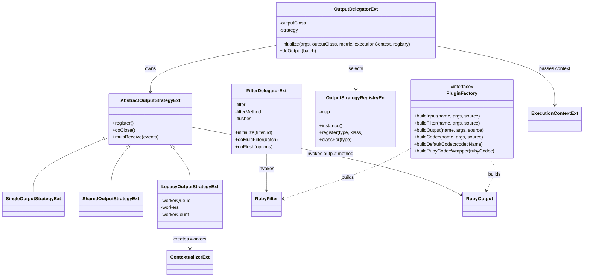
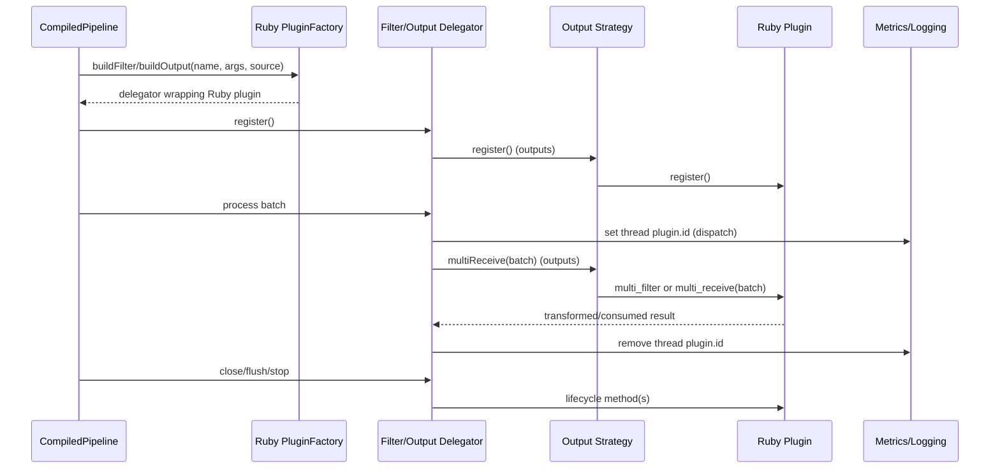
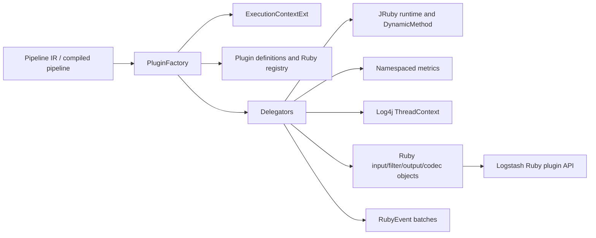
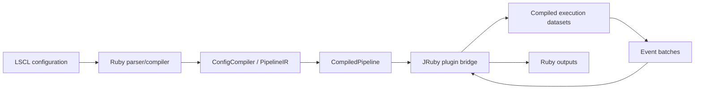

# Pipeline IR and compilation: JRuby plugin bridge

This module is the execution boundary between Logstash’s Java pipeline-IR runtime and its Ruby plugins. It wraps Ruby filter and output instances in JRuby-exposed Java delegators, dispatches batches through cached JRuby call sites, selects output concurrency behavior, and exposes a Ruby-implemented plugin factory to the Java compiler.

The bridge does not parse configuration or assemble the pipeline graph. Those responsibilities are documented in [pipeline_configuration_parser.md](pipeline_configuration_parser.md) and [pipeline_ir_and_compilation_ir_assembly_config_compilation.md](pipeline_ir_and_compilation_ir_assembly_config_compilation.md). The resulting delegators are consumed by compiled pipeline execution as described in [pipeline_ir_and_compilation_dataset_runtime_compiled_execution.md](pipeline_ir_and_compilation_dataset_runtime_compiled_execution.md).

## Responsibilities and boundaries

The bridge has four closely related responsibilities:

- `FilterDelegatorExt` adapts a Ruby filter’s lifecycle and `multi_filter` method to the Java compiled-execution API.
- `OutputDelegatorExt` adapts a Ruby output and routes batches through a concurrency-specific output strategy.
- `OutputStrategyExt` contains the strategy registry and the `Single`, `Shared`, and `Legacy` strategy implementations.
- `RubyIntegration.PluginFactory` defines the Java-facing contract implemented by Ruby code for constructing inputs, filters, outputs, and codecs.

The code intentionally keeps plugin construction in Ruby. Java supplies the execution context, plugin class, configuration arguments, source metadata, and metrics; Ruby performs the actual plugin instantiation and returns objects that the Java runtime can invoke.

## Architecture



`FilterDelegatorExt` and `OutputDelegatorExt` are JRuby classes (`FilterDelegator` and `OutputDelegator` from Ruby’s perspective). Their superclass contracts are supplied by the compiler package’s abstract delegators; the concrete classes implement the Ruby-specific calls while inherited code owns common event and metric behavior.

## Filter delegation

### Initialization

`FilterDelegatorExt.initialize` receives a Ruby filter object and plugin ID. It stores the object, resolves its real singleton class, and caches the class’s `multi_filter` method as a JRuby `DynamicMethod`. It obtains the filter’s namespaced metric through `metric` and initializes delegator metrics with the plugin ID. The presence of `flush` is detected once and cached in `flushes`.

The testing initializer avoids normal metric setup, installs dummy counters and a null timer, generates an ID, and resolves the method from the test object’s metaclass. This keeps tests independent from production metric wiring while preserving the same dispatch shape.

### Batch dispatch

`doMultiFilter` invokes the cached `multi_filter` method with the Ruby filter as receiver, its real class as dispatch class, and the Ruby array batch. Around the call it places `plugin.id` in Log4j’s thread context, then removes it in a `finally` block. This makes plugin-specific log attribution available during the call without leaking the ID to later work on the thread.

The return value is expected to be a Ruby array, allowing the Ruby filter to cancel, clone, or otherwise transform the batch according to normal Logstash filter semantics.

### Lifecycle and capabilities

The delegator forwards lifecycle and capability queries directly to the Ruby plugin:

| Delegator operation | Ruby method |
| --- | --- |
| Register | `register` |
| Close | `close` |
| Final close | `do_close` |
| Stop | `do_stop` |
| Reloadability | `reloadable?` |
| Thread safety | `threadsafe?` |
| Configuration name | class method `config_name` |
| Flush | `flush(options)` |
| Periodic flush | `periodic_flush` |

The `has_flush` result is based on whether the plugin responds to `flush`; `periodic_flush` is queried when needed. These methods let compiled execution honor plugin-specific flushing and shutdown behavior.

## Output delegation and concurrency strategies

`OutputDelegatorExt` does not instantiate an output directly. It initializes metrics from the `id` argument, asks the singleton `OutputStrategyRegistryExt` for a strategy class based on the Ruby output class’s `concurrency` value, and constructs that strategy with the output class, namespaced metric, execution context, and plugin arguments.

```mermaid
flowchart TD
    A[Compiled pipeline creates output delegator] --> B[Read output class and plugin args]
    B --> C[Read Ruby concurrency]
    C --> D[OutputStrategyRegistryExt.classFor]
    D --> E{Registered strategy}
    E -->|single| S[Single strategy]
    E -->|shared| H[Shared strategy]
    E -->|legacy| L[Legacy strategy]
    S --> I[ContextualizerExt.initializePlugin]
    H --> I
    L --> W[Create workerCount plugin instances]
    I --> R[OutputDelegatorExt.strategy]
    W --> R
    R --> O[doOutput(batch)]
```

### Registry

`OutputStrategyRegistryExt` is a synchronized, lazily initialized singleton backed by a Ruby hash. Ruby-side registration maps a concurrency type to a strategy class. `classFor` returns the registered class or raises `IllegalArgumentException` with the requested type and available values when registration is incomplete. This registry allows Ruby initialization code to define or alter the mapping without changing the Java delegator.

### Common strategy behavior

`AbstractOutputStrategyExt` caches the output class’s `multi_receive` method as a `DynamicMethod`. Its `multiReceive` JRuby method is the strategy entry point; `register` and `doClose` forward to strategy-specific implementations. `invokeOutput` calls the cached method with a concrete Ruby plugin instance and the event batch.

Each strategy creates plugins through `ContextualizerExt.initializePlugin`, then assigns the delegator’s metric with `metric=`. The context and arguments are therefore applied consistently regardless of concurrency mode.

### `SingleOutputStrategyExt`

This strategy creates one output instance and synchronizes `output` on the strategy object. Batches are serialized through the plugin, which is appropriate when the plugin is not safe for concurrent calls but uses the modern strategy API.

### `SharedOutputStrategyExt`

This strategy also creates one output instance, but performs no synchronization around `multi_receive`. The output plugin is expected to declare that it can safely handle concurrent calls. The strategy still serializes lifecycle operations through the normal delegator lifecycle, while batch calls may overlap.

### `LegacyOutputStrategyExt`

The legacy strategy creates a pool of output instances. `workers` defaults to one when the plugin arguments do not contain `workers`; otherwise the configured count determines both the worker array and an `ArrayBlockingQueue` of available workers. For each batch, `output` takes one worker, invokes `multi_receive`, and returns the worker to the queue in a `finally` block. This bounds concurrent calls to the configured worker count and preserves one in-flight batch per worker.

`register` and `do_close` iterate over all workers. A queue interruption becomes `IllegalStateException` in `OutputDelegatorExt.doOutput`, so callers see an unchecked failure rather than a leaked `InterruptedException`.

## JRuby call and event flow



For filters, the delegator directly invokes `multi_filter`. For outputs, the delegator invokes the selected strategy, which invokes the output class’s cached `multi_receive` call site. Both paths use JRuby `IRubyObject` values and Ruby arrays/hashes at the boundary; output batches are represented as collections of `RubyEvent` values before being passed into the Ruby-facing method.

## Plugin factory contract

`RubyIntegration.PluginFactory` is a Java interface intentionally implemented in Ruby. It provides construction methods for all plugin categories and two codec adapters:

- `buildInput`, `buildFilter`, and `buildOutput` accept a name, Ruby arguments, and `SourceWithMetadata`.
- `buildCodec` constructs a configured Ruby codec.
- `buildDefaultCodec` supplies a default Java `Codec` by name.
- `buildRubyCodecWrapper` adapts a Ruby codec object to the Java `Codec` API.

The factory is the compiler’s dependency-injection seam: Java IR compilation can request plugin objects without knowing Ruby plugin class loading, configuration normalization, or constructor details. The plugin registry and event/JRuby interop layers remain separate concerns; see the corresponding module documentation when available. Compiled pipeline construction and per-worker execution are covered in [pipeline_ir_and_compilation_dataset_runtime_compiled_execution.md](pipeline_ir_and_compilation_dataset_runtime_compiled_execution.md).

## Dependency relationships



The bridge depends on the Java execution context, JRuby runtime types, metrics, and Ruby plugin API. It is depended upon by pipeline compilation/runtime; it does not own queueing, graph traversal, event model conversion, or pipeline lifecycle orchestration.

## Operational and maintenance notes

- Keep the cached JRuby method lookup aligned with the Ruby API names (`multi_filter` and `multi_receive`). A mismatch fails at dispatch time rather than during Java compilation.
- Preserve `finally` blocks around worker return and thread-context cleanup. Removing either can permanently reduce output concurrency or misattribute subsequent logs.
- Treat output `concurrency` values and registry registration as a compatibility contract between Ruby plugin code and Java strategies.
- When changing plugin initialization, verify metric assignment and `ExecutionContextExt` propagation for every strategy, including each worker in legacy mode.
- Lifecycle calls are delegated to plugin instances; plugin-specific resource management and reloadability remain Ruby-plugin responsibilities.

## End-to-end placement



The bridge is therefore the seam where declarative IR becomes calls into concrete Ruby plugin behavior. Its correctness affects plugin lifecycle, filter transformations, output concurrency, metrics attribution, and codec availability, while the graph and dataset semantics remain in the adjacent modules linked above.
