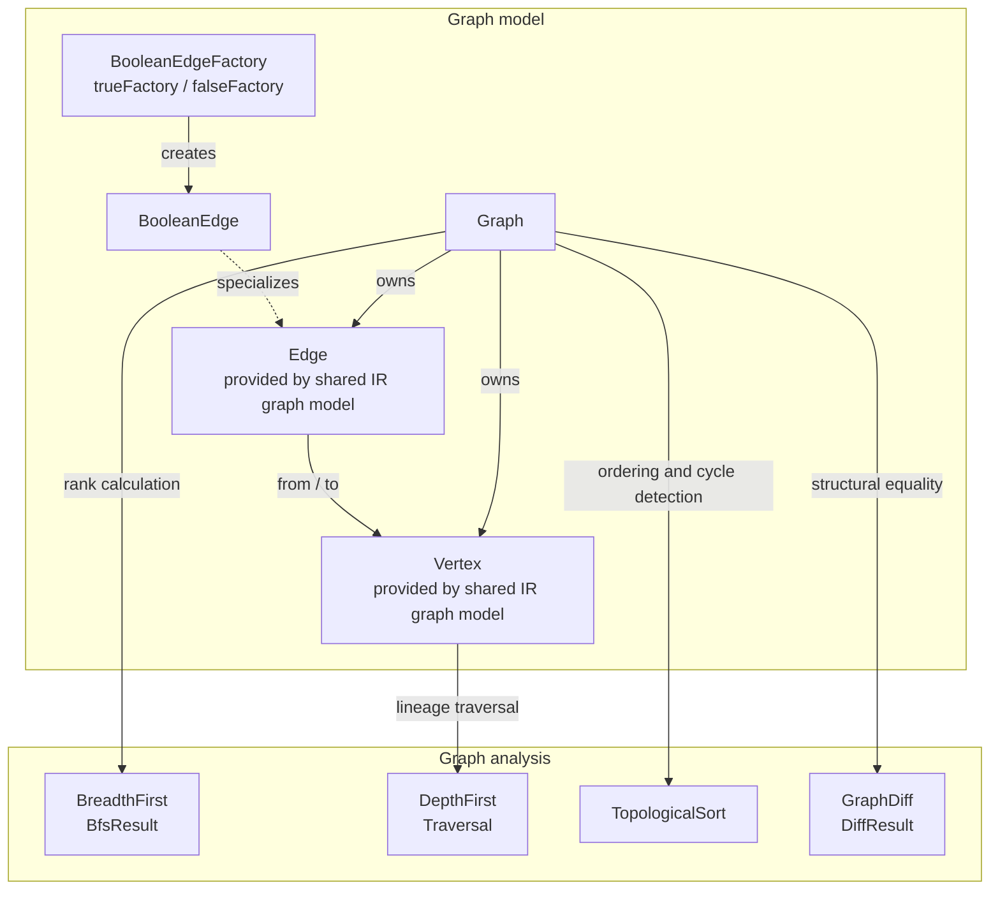
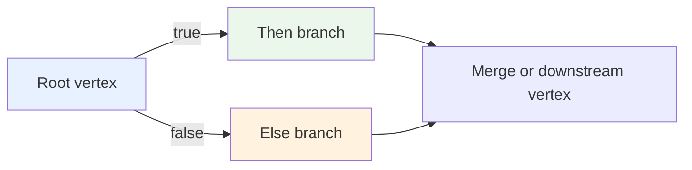
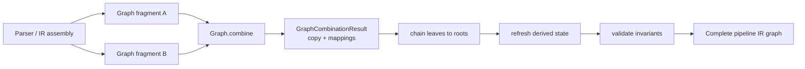
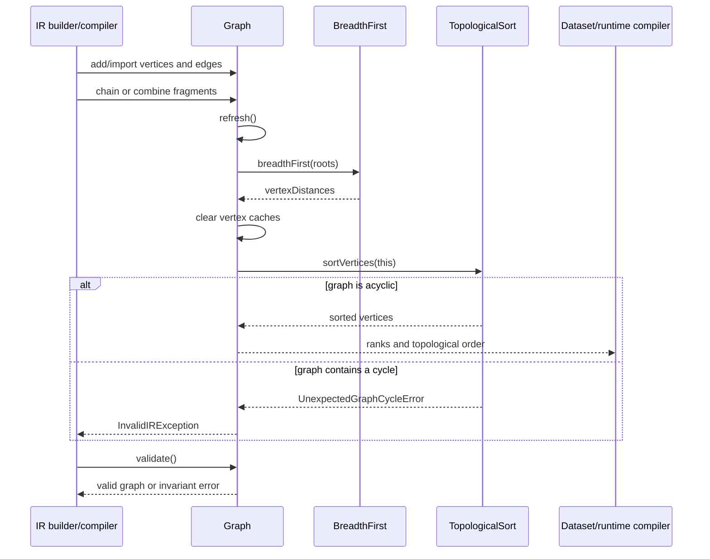
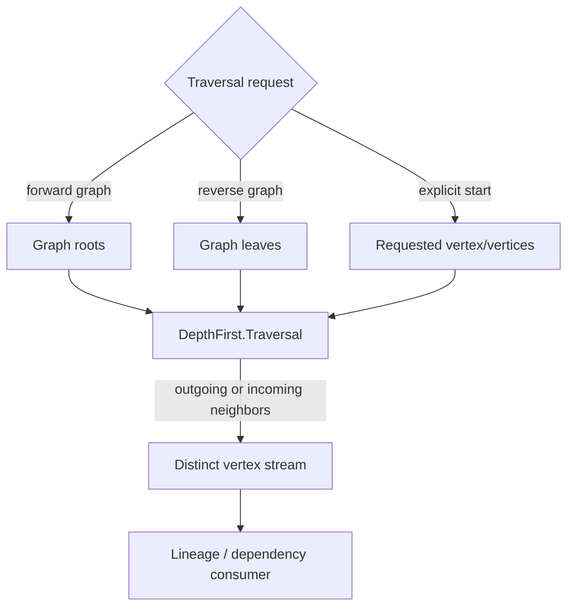
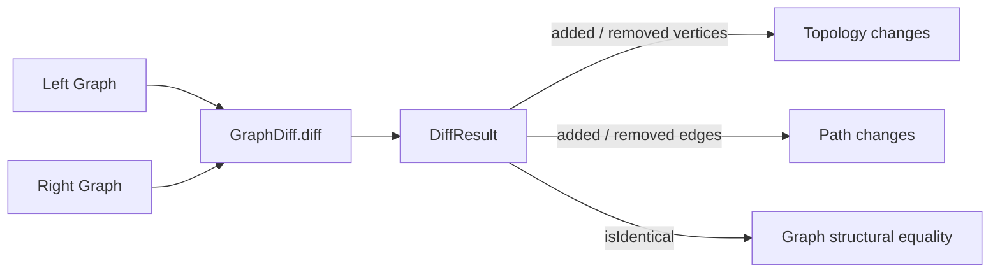
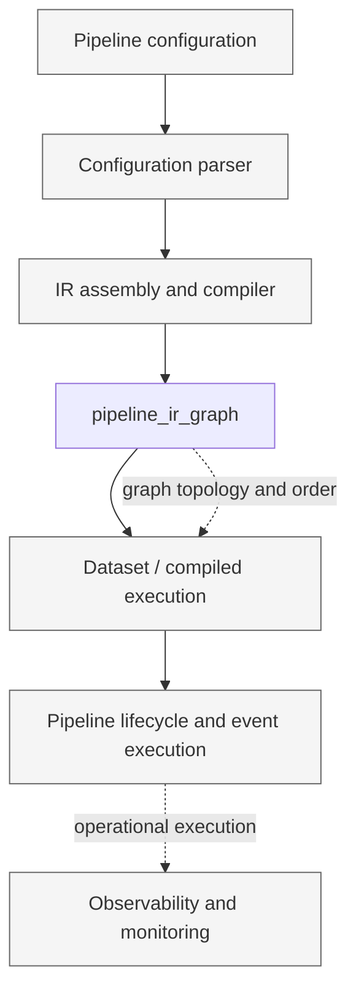

# Pipeline IR Graph

## Introduction

The `pipeline_ir_graph` module is Logstash’s in-memory graph-processing layer for pipeline intermediate representation (IR). It represents execution topology as vertices connected by typed directed edges, then supplies traversal, ranking, ordering, comparison, and branch-aware construction operations.

The module is intentionally small and infrastructure-oriented. It does not parse Logstash configuration or instantiate plugins. Configuration parsing and IR assembly are covered by [pipeline_ir_and_compilation.md](pipeline_ir_and_compilation.md), while graph construction details and runtime dataset use are documented in [pipeline_ir_and_compilation_graph_processing_graph_model.md](pipeline_ir_and_compilation_graph_processing_graph_model.md) and [pipeline_ir_and_compilation_dataset_runtime.md](pipeline_ir_and_compilation_dataset_runtime.md).

## Module responsibilities

- Model a pipeline as a directed graph of `Vertex` and `Edge` objects.
- Represent conditional execution paths with `BooleanEdge` (`true`/`false`) edges.
- Import, copy, combine, and chain graph fragments without reusing graph-owned objects.
- Maintain incoming/outgoing indexes and derived graph state.
- Calculate root-based vertex ranks and a topological execution order.
- Traverse graphs forward or backward for lineage and dependency analysis.
- Compare graphs structurally and report added or removed vertices and edges.
- Reject invalid topology, especially cycles discovered during refresh.

## Architecture

### Component map

| Component | Responsibility | Main collaboration |
|---|---|---|
| `Graph` | Owns graph membership, indexes, mutation, derived state, validation, copying, combination, and chaining | Calls `BreadthFirst`, `TopologicalSort`, and `GraphDiff`; stores `Vertex`/`Edge` objects |
| `BooleanEdge` / `BooleanEdgeFactory` | Encodes a boolean branch on an edge and provides canonical factories for both branch values | Extends the shared `Edge` abstraction; used by `Graph.chainVertices(boolean, ...)` |
| `BreadthFirst` / `BfsResult` | Computes root-relative distances, optionally walking incoming edges in reverse mode | Used by `Graph.refresh()` to populate ranks |
| `DepthFirst` / `Traversal` | Provides forward and reverse distinct streams over reachable vertices | Starts at roots, leaves, or an explicit vertex; supports vertex lineage operations |
| `TopologicalSort` | Produces a vertex order and detects cycles using Kahn’s algorithm | Used by `Graph.refresh()`; cycle errors become `InvalidIRException` |
| `GraphDiff` / `DiffResult` | Finds structurally equivalent additions and removals between two graphs | Used by `Graph.sourceComponentEquals()` and diagnostics/tests |

## Graph representation

`Graph` stores vertices and edges in insertion-preserving `LinkedHashSet` collections. Two lookup maps index outgoing edges by source vertex and incoming edges by destination vertex. Each vertex and edge records its owning graph, which prevents accidentally attaching an object already owned by another graph.

Edges are created through an `EdgeFactory`. A plain edge represents an unconditional connection; `BooleanEdgeFactory(true)` and `BooleanEdgeFactory(false)` create branch-specific connections. Boolean type participates in the edge’s hash source, ID, string representation, and source-component comparison, so the two branches remain distinguishable even when their endpoints are the same.

For the detailed vertex/edge contract, graph ownership rules, leaf semantics, and source metadata behavior, see [pipeline_ir_and_compilation_graph_processing_graph_model.md](pipeline_ir_and_compilation_graph_processing_graph_model.md).

## Construction and graph composition

Graph fragments are commonly assembled incrementally or combined from independently built fragments. `Graph.combine` copies every vertex and edge and returns a `GraphCombinationResult` containing the new graph plus old-to-new mappings. `Graph.copy()` is implemented through this operation.

`chain` connects leaves of one graph to roots of another, using each leaf’s unused outgoing edge factories. `chainVertices` creates an explicit sequence of edges and imports vertices when they come from another graph. `chainVerticesUnsafe` is the lower-level variant: it batches additions and refreshes afterward, but leaves validation to the caller.

The assembly layer owns the semantics of turning configuration into graph fragments; this module supplies the safe graph operations it needs. See [pipeline_ir_and_compilation_ir_assembly.md](pipeline_ir_and_compilation_ir_assembly.md) and [pipeline_ir_and_compilation_ir_assembly_config_compilation.md](pipeline_ir_and_compilation_ir_assembly_config_compilation.md) for that boundary.

## Derived state and processing lifecycle

Mutation updates the graph’s membership and indexes, then `refresh()` rebuilds all derived state. Refresh calculates root-relative ranks with breadth-first search, clears vertex caches, and calculates a topological order. Topological sorting is also the graph’s cycle check: if not every edge can be consumed from roots, `TopologicalSort` raises `UnexpectedGraphCycleError`, which `Graph` translates to `InvalidIRException`.

### Ranks and ordering

`BreadthFirst.breadthFirst(roots)` assigns every root distance `0` and assigns reachable vertices increasing distances. `Graph.rank(vertex)` exposes that shortest root-relative distance. Reverse breadth-first mode follows incoming vertices and is available for callers that need reverse reachability.

`TopologicalSort.sortVertices` starts at roots and enqueues a destination only after all of its incoming edges have been traversed. Its result is stored as `Graph.sortedVertices`; `sortedEdges()` derives an edge stream from that order. The graph is expected to be a DAG.

## Traversal and interaction patterns

`DepthFirst` provides lazy Java streams. Forward traversal starts at graph roots and follows outgoing vertices; reverse traversal starts at leaves and follows incoming vertices. An explicit vertex or collection can also be supplied. `Traversal` tracks visited vertices and emits each vertex through a distinct stream.

The traversal algorithm itself does not perform DAG validation. Callers that require a valid pipeline topology should use a refreshed graph, where topological sorting has already enforced the DAG invariant.

## Structural comparison and identity

`GraphDiff.diff(left, right)` scans both graphs for vertices and edges that lack an equivalent counterpart. Equivalence delegates to `sourceComponentEquals`, allowing source-aware comparison rather than Java object identity. `DiffResult` exposes added/removed collections, compact counts, detailed text, and predicates for equal vertices, equal edges, or fully identical graphs.

`Graph.sourceComponentEquals` uses `GraphDiff`; consequently graph equality is structural. `Graph.uniqueHash()` derives a stable digest from vertex source metadata, excluding queue and separator vertices that do not carry configuration metadata. `BooleanEdge` contributes its branch value to this identity behavior.

## Invariants and failure modes

- A vertex cannot be added directly to a second graph. `importVertex` returns the existing vertex when unattached, or a copy when it belongs to another graph.
- An edge must connect vertices already present in its graph.
- `refresh()` can fail when the topology is cyclic because pipeline IR must be a DAG.
- `validate()` accepts an empty graph, but rejects a non-empty graph without leaf vertices and rejects duplicate vertex IDs.
- `rank(vertex)` assumes refresh has calculated a rank; an unavailable rank is treated as an internal programming error.
- `chainVerticesUnsafe` intentionally postpones validation; callers must ensure the resulting graph is refreshed and validated before consumption.

## Position in the Logstash system

This module is a reusable middle layer: it knows the topology and structural identity of IR, but not plugin behavior, event transport, persistent queues, or monitoring. Plugin integration is documented separately in [pipeline_ir_and_compilation_jruby_plugin_bridge.md](pipeline_ir_and_compilation_jruby_plugin_bridge.md); execution and operational concerns belong to the corresponding runtime modules.

## Maintenance guidance

When changing graph mutation behavior, check all three derived-state effects: rank calculation, vertex cache invalidation, and topological ordering. When changing edge identity or vertex source comparison, review `GraphDiff`, graph equality, unique hashing, and Boolean branch distinction together. When changing traversal semantics, preserve the forward/reverse contract used by vertex lineage consumers.

## Related documentation

- [pipeline_ir_and_compilation.md](pipeline_ir_and_compilation.md) — overall parsing and compilation subsystem.
- [pipeline_ir_and_compilation_graph_processing.md](pipeline_ir_and_compilation_graph_processing.md) — graph-processing area overview.
- [pipeline_ir_and_compilation_graph_processing_graph_model.md](pipeline_ir_and_compilation_graph_processing_graph_model.md) — detailed `Graph`, `Vertex`, and `Edge` model.
- [pipeline_ir_and_compilation_graph_processing_algorithms.md](pipeline_ir_and_compilation_graph_processing_algorithms.md) — detailed algorithm behavior.
- [pipeline_ir_and_compilation_ir_assembly.md](pipeline_ir_and_compilation_ir_assembly.md) — graph-fragment assembly.
- [pipeline_ir_and_compilation_dataset_runtime.md](pipeline_ir_and_compilation_dataset_runtime.md) — downstream compiled dataset execution.
