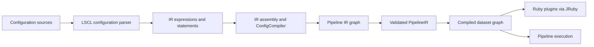
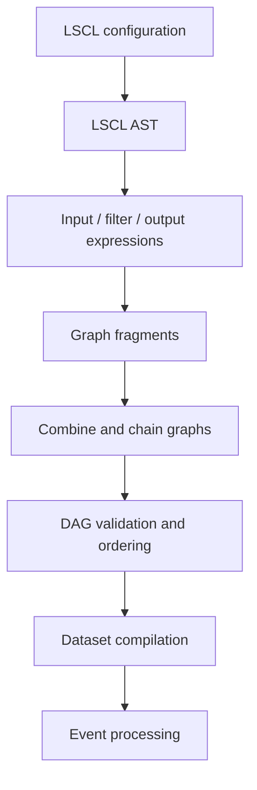
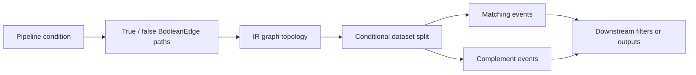

# Pipeline Language and Compilation

## Purpose

The `pipeline_language_and_compilation` module transforms Logstash Configuration Language (LSCL) into executable pipeline structures.

It:

- Parses and validates LSCL configuration.
- Converts syntax into intermediate representation (IR) expressions and statements.
- Assembles input, filter, and output graphs into a validated `PipelineIR`.
- Compiles graph topology into executable datasets.
- Bridges compiled datasets to Ruby plugins through JRuby.
- Preserves source metadata for diagnostics, graph identity, and configuration errors.

## Architecture

The parser is responsible for textual syntax and semantic conversion, while the IR and graph layers construct and validate execution topology.

Conditional branches are represented as boolean graph edges and later become dataset splits during execution.

## Core components

- **Pipeline configuration parser** — Converts LSCL text and source metadata into compiled input, filter, and output expressions.
- **Pipeline IR and compilation** — Assembles statements into `PipelineIR`, compiles graphs into datasets, and coordinates runtime plugin execution.
- **Pipeline IR graph** — Provides vertices, edges, boolean branches, graph composition, traversal, topological sorting, cycle detection, and structural comparison.

## Core documentation

- [Pipeline configuration parser](pipeline_configuration_parser.md)
- [Pipeline IR and compilation](pipeline_ir_and_compilation.md)
- [Pipeline IR graph](pipeline_ir_graph.md)

The subsystem integrates with configuration loading, plugin registration, event/JRuby interop, and pipeline lifecycle execution, which are documented by their respective runtime modules.