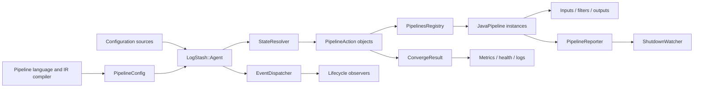
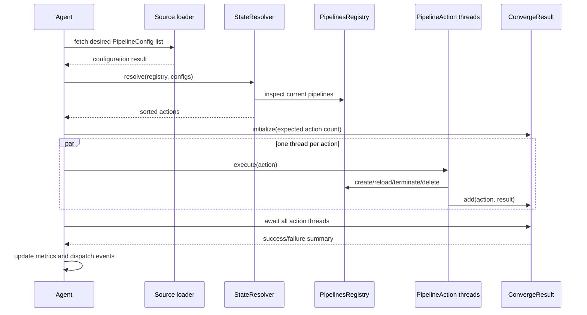
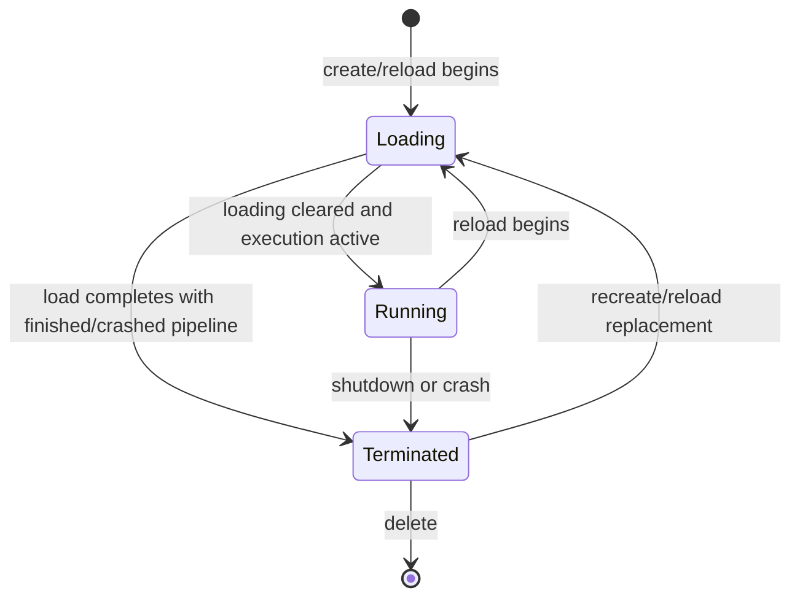
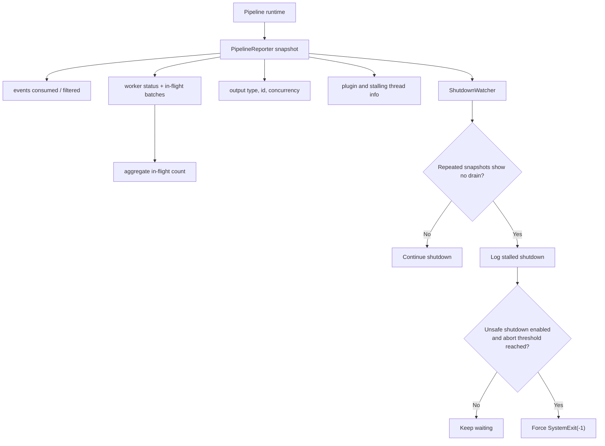

# Pipeline Lifecycle and Execution

## Purpose

The `pipeline_lifecycle_and_execution` module turns the desired set of pipeline configurations into a running set of Logstash pipelines, tracks each pipeline's lifecycle, reports convergence outcomes, emits lifecycle events, and supervises shutdown.

It is the runtime coordination layer between configuration loading/compilation and the pipeline execution engine. The module does not parse pipeline configuration or implement plugin processing; it decides which lifecycle operations must occur and records whether those operations completed successfully.

## Architectural position

The agent periodically obtains desired pipeline configurations, compares them with the registry, orders the resulting actions, executes them, and publishes the result.

The surrounding system is documented in [configuration_sources_and_loading.md](configuration_sources_and_loading.md) and [pipeline_language_and_compilation.md](pipeline_language_and_compilation.md). The event model and extensibility layer is the downstream runtime boundary for the pipelines described here.

## Core responsibilities

| Responsibility | Components | Result |
|---|---|---|
| Desired-state comparison | `StateResolver` | Creates, reloads, stops, or deletes actions |
| Serialized per-pipeline lifecycle changes | `PipelineStates`, `PipelinesRegistry` | Thread-safe lifecycle state and pipeline lookup |
| Deterministic action execution | `PipelineAction::Base` and concrete actions | Ordered lifecycle transitions |
| Convergence accounting | `ConvergeResultExt` | Complete/successful/failed action results |
| Lifecycle notifications | `EventDispatcherExt` | Listener callbacks for pipeline events |
| Runtime diagnostics | `PipelineReporterExt::SnapshotExt` | Immutable-ish snapshot of worker, output, and in-flight state |
| Shutdown supervision | `ShutdownWatcherExt` | Detects stalled shutdown and optionally force-exits |

## Sub-module documentation

- [State convergence and registry](pipeline_lifecycle_and_execution_state_convergence.md) — desired-state reconciliation, action ordering, registry locking, and lifecycle transitions.
- [Execution reporting and shutdown](pipeline_lifecycle_and_execution_reporting.md) — convergence results, event dispatch, pipeline snapshots, and stalled-shutdown detection.

## Lifecycle and convergence

A convergence cycle follows this sequence:

`StateResolver` derives actions by comparing desired configurations with registered pipelines:

- A missing pipeline becomes `Create`.
- A present pipeline whose configuration differs becomes `Reload`.
- A running or loading pipeline absent from the desired set becomes `StopAndDelete`.
- A terminated pipeline absent from the desired set becomes `Delete`.

Actions are sorted through `PipelineAction::Base#<=>`. The default ordering is create, reload, stop, stop-and-delete, then delete; ties are ordered by pipeline id. System pipeline creation receives elevated precedence through the concrete create action.

The agent executes actions under a convergence mutex and starts one worker thread per action. The mutex prevents overlapping convergence cycles, while the registry's per-pipeline locks prevent concurrent create, reload, termination, or deletion of the same pipeline.

## Registry state model

Each registry entry is a `PipelineState` containing:

- the pipeline id;
- the current pipeline object;
- a loading flag;
- a monitor protecting visibility of state transitions.

The observable state is derived from loading and pipeline execution state:

A loading pipeline is deliberately excluded from both `running?` and `terminated?`. This prevents a concurrent observer from treating a partially constructed replacement as available or safely removable.

`PipelinesRegistry#create_pipeline`, `reload_pipeline`, and `terminate_pipeline` hold a pipeline-specific lock for the whole operation. Failed initial creation removes the newly inserted state; failed reload leaves the registry entry in place while the replacement operation reports failure. Deletion succeeds only after the pipeline reports terminated.

## Execution result and observability

Each action contributes one result to `ConvergeResult`. Results can be booleans, prebuilt action-result objects, or exceptions converted to failed results. A convergence is complete when the number of recorded actions equals the expected count, and successful only when it is complete and contains no failed actions.

`EventDispatcherExt` maintains a copy-on-write listener set. This favors frequent notification and infrequent listener registration. Dispatch calls a named listener method only when the listener responds to it, allowing optional lifecycle hooks without a rigid listener interface.

`PipelineReporterExt` builds a snapshot from the pipeline's counters, worker threads, in-flight batches, outputs, plugin-thread information, and stalling-thread information. `SnapshotExt` exposes the captured data and groups stalling threads by plugin for diagnostics.

## Shutdown behavior

The agent converges to an empty desired configuration during shutdown. The shutdown watcher periodically samples the pipeline reporter until execution finishes or it is stopped. It considers shutdown stalled when:

1. the configured number of reports has been collected;
2. in-flight counts never decrease across the report window; and
3. the stalling-thread collections remain unchanged.

When stalled, it logs diagnostic information. A forceful exit is guarded by the process-wide unsafe-shutdown flag and an abort threshold, so normal shutdown remains graceful by default.

## Failure and concurrency considerations

- Action exceptions are captured as failed action results rather than preventing other action threads from reporting.
- A convergence result is not successful until every expected action has reported.
- Registry state reads use monitors or mutex-protected snapshots, avoiding partially visible pipeline replacement.
- The agent's convergence lock must not be reacquired from plugin initialization/registration paths; doing so can deadlock during reload.
- Pipeline-to-pipeline shutdown configures the pipeline bus to block on unlisten before stopping the pipeline graph; this depends on the pipeline communication subsystem.
- Queue draining and persistent buffering are runtime concerns of the persistent-queue subsystem; dead-letter handling is handled by the dead-letter-queue subsystem.

## Integration points

- [application_bootstrap_and_settings.md](application_bootstrap_and_settings.md) supplies agent settings, reload intervals, and runtime startup.
- [configuration_sources_and_loading.md](configuration_sources_and_loading.md) supplies desired pipeline configurations.
- [pipeline_language_and_compilation.md](pipeline_language_and_compilation.md) produces the executable pipeline representation.
- The event model/JRuby interop layer defines the event/runtime boundary used by pipeline execution.
- The observability and health layers consume lifecycle metrics, reports, logs, and pipeline status transitions.

## Practical reading order

1. Read [pipeline_lifecycle_and_execution_state_convergence.md](pipeline_lifecycle_and_execution_state_convergence.md) for desired-state reconciliation and registry locking.
2. Read [pipeline_lifecycle_and_execution_reporting.md](pipeline_lifecycle_and_execution_reporting.md) for action results, event listeners, runtime snapshots, and shutdown monitoring.
3. Follow the links above into configuration, compilation, queues, and observability for the dependent subsystems.
