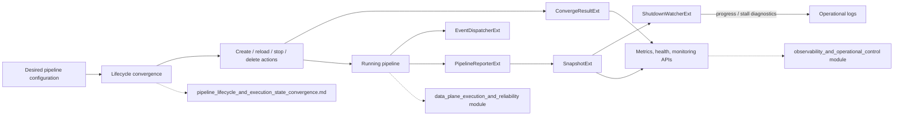
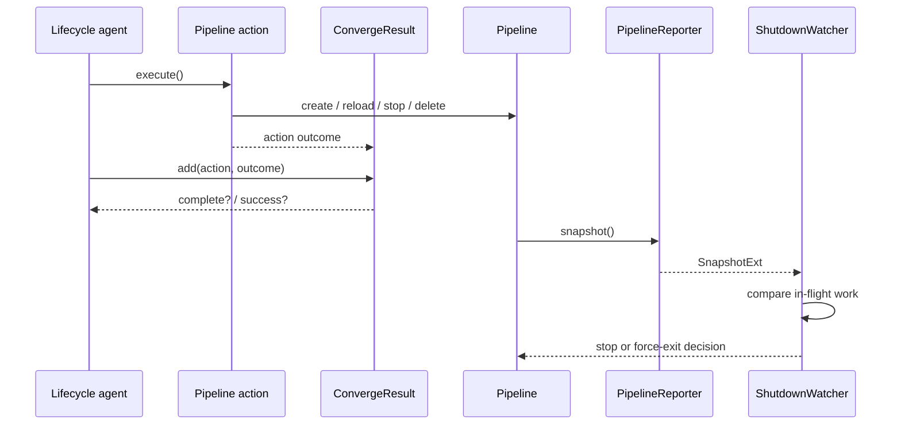
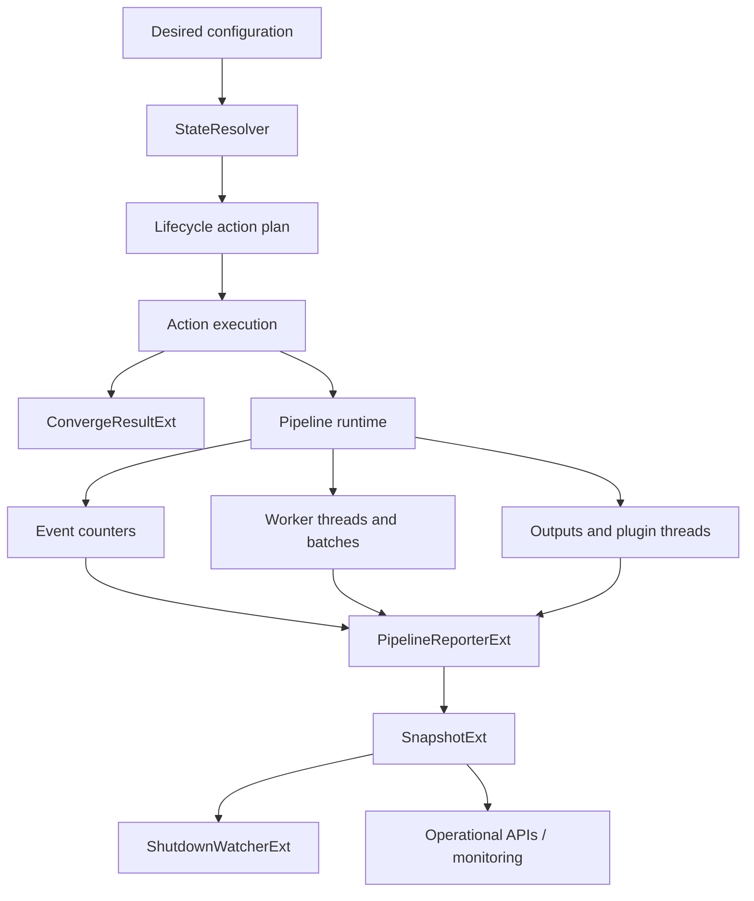

# Pipeline Lifecycle and Execution Reporting

## Purpose

This module provides the reporting and coordination primitives used around Logstash pipeline lifecycle operations. It bridges Ruby orchestration with Java execution support to record convergence outcomes, publish lifecycle events, expose pipeline execution snapshots, and detect shutdowns that are no longer making progress.

The module does not own pipeline configuration resolution or the pipeline worker implementation. Configuration resolution belongs to [pipeline_lifecycle_and_execution_state_convergence.md](pipeline_lifecycle_and_execution_state_convergence.md); the worker implementation belongs to the adjacent `data_plane_execution_and_reliability` module.

## Architectural position

## Core workflow

## Submodules

The implementation is documented in the focused page [pipeline_lifecycle_and_execution_reporting_runtime_reporting.md](pipeline_lifecycle_and_execution_reporting_runtime_reporting.md). It covers:

* convergence result normalization and aggregation (`ConvergeResultExt`, `ActionResultExt`, `FailedActionExt`, and `SuccessfulActionExt`);
* listener registration and callback dispatch (`EventDispatcherExt`);
* worker, counter, output, and thread snapshot construction (`PipelineReporterExt` and `SnapshotExt`); and
* shutdown sampling, stall detection, logging, and unsafe forced termination (`ShutdownWatcherExt`).

## Data and control boundaries

The lifecycle module decides what should run; this module records what happened and what is currently happening. Snapshot data is observational and can change immediately after construction. Convergence results, in contrast, are cumulative for a specific action plan and become authoritative only after all expected actions have been added.

## Related modules

* [pipeline_lifecycle_and_execution_state_convergence.md](pipeline_lifecycle_and_execution_state_convergence.md) — desired/current pipeline diffing, registry state, and lifecycle action execution.
* `data_plane_execution_and_reliability` — worker execution, pipeline communication, persistent queues, and dead-letter queues.
* [pipeline_ir_and_compilation.md](pipeline_ir_and_compilation.md) — executable pipeline IR, datasets, conditions, and plugin delegators reported by this module.
* `observability_and_operational_control` — metrics, health reporting, logs, HTTP APIs, and monitoring integration.
