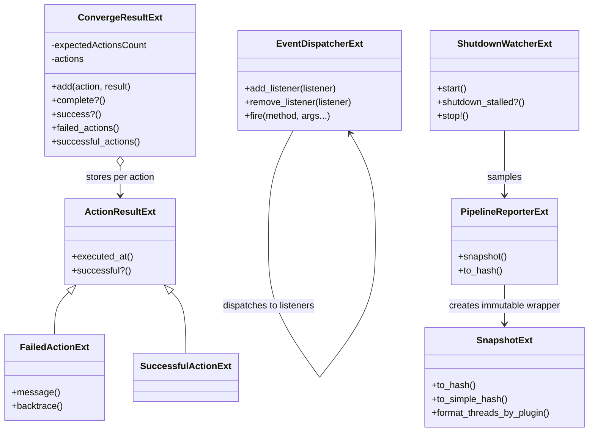
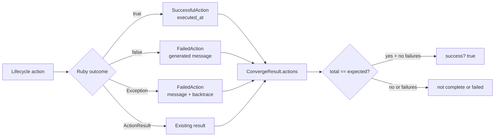
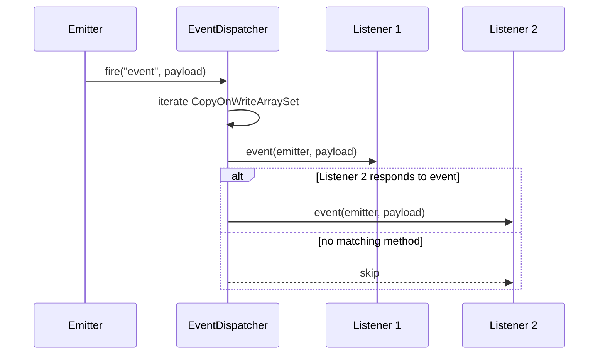
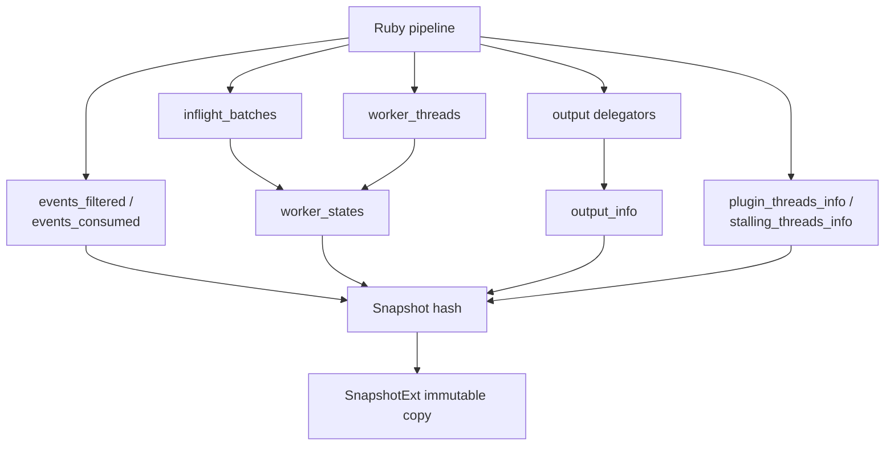
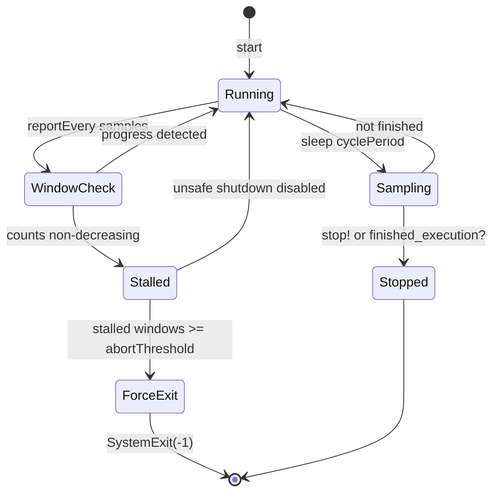

# Pipeline Lifecycle and Execution Reporting: Runtime Reporting and Shutdown

This submodule documents the Java/JRuby bridge classes that report pipeline execution state, publish lifecycle events, aggregate convergence actions, and supervise shutdown. The classes are deliberately small adapters: Ruby owns pipeline orchestration and plugin objects, while Java supplies concurrency-safe collections, timestamped result objects, and efficient snapshot construction.

## Scope and responsibilities

| Component | Responsibility | Primary consumers |
| --- | --- | --- |
| `ConvergeResultExt` | Collects results for create, update, and delete actions; exposes completion and success counts. | Agent convergence code and lifecycle actions |
| `EventDispatcherExt` | Maintains listeners and invokes matching Ruby callbacks with the emitter as the first argument. | Pipeline/lifecycle event publishers |
| `PipelineReporterExt` | Builds a point-in-time pipeline execution snapshot from counters, worker threads, queues, outputs, and thread diagnostics. | Shutdown watcher, operational reporting, monitoring adapters |
| `PipelineReporterExt.SnapshotExt` | Wraps the snapshot hash and provides simple formatting and dynamic key access. | Shutdown watcher and Ruby callers |
| `ShutdownWatcherExt` | Samples snapshots while a pipeline stops, detects non-progress, logs diagnostics, and optionally force-exits. | Pipeline shutdown flow |

## Component relationships

## Convergence result aggregation

`ConvergeResultExt` is initialized with the expected number of actions and stores results in a `ConcurrentHashMap`. `ActionResultExt.create` normalizes Ruby outcomes into one of three forms:

* an existing `ActionResultExt`, which is retained;
* an exception, converted to `FailedActionExt` with message and backtrace;
* Ruby `true` or `false`, converted to `SuccessfulActionExt` or `FailedActionExt`.

The result is complete when the number of distinct action keys equals the expected count. It is successful only when complete and no stored action is failed. `executed_at` is assigned when each result object is initialized using the JRuby timestamp extension.

Because action keys are map keys, adding the same action twice replaces its result and does not increase `total`. `add` returns the value returned by `ConcurrentHashMap.put` (the previous value), so callers should use the aggregate queries rather than interpret `add` as a success flag.

## Event dispatch

`EventDispatcherExt` stores listeners in a `CopyOnWriteArraySet`. Listener registration/removal is optimized for the bootstrap-heavy, notification-heavy usage pattern: mutation copies the backing structure, while firing can safely iterate without external locking. Duplicate listeners are suppressed by set semantics.

`fire`/`execute` receives a Ruby method name followed by callback arguments. For each listener that responds to that method, it invokes the method with the configured emitter inserted as argument zero. Missing callback methods are ignored. The dispatcher returns Ruby `nil`; registration and removal return Ruby booleans.

## Pipeline snapshots

`PipelineReporterExt#to_hash` gathers data from the Ruby pipeline and returns a Ruby hash containing:

| Key | Source / meaning |
| --- | --- |
| `worker_states` | Every worker’s status, liveness, index, and current in-flight batch size. |
| `events_filtered` | Sum of the pipeline’s filtered-event counters. |
| `events_consumed` | Sum of the pipeline’s consumed-event counters. |
| `output_info` | Each output delegator’s configuration name, ID, and concurrency. |
| `thread_info` | Pipeline plugin-thread information. |
| `stalling_threads_info` | Pipeline-provided stalling-thread diagnostics. |
| `inflight_count` | Sum of worker-level in-flight counts. |

Worker batch size is extracted defensively. Native `QueueBatch` objects use `filteredSize`; other Ruby objects are queried with `size`; unsupported or absent batches contribute zero. A worker with a nil Ruby thread status is reported as `dead`.

`SnapshotExt` holds the generated hash and does not refresh it. Its `method_missing` delegates key lookup to the hash, allowing Ruby callers to use snapshot fields as methods. `to_simple_hash` keeps only total in-flight count and stalling-thread information. `format_threads_by_plugin` groups stalling thread hashes by their `plugin` field and places entries without a plugin under `other`.

The snapshot is a consistency boundary rather than a transaction over all pipeline internals: each Ruby method is read during construction, so values can change between fields. It is nevertheless useful for operational decisions because it captures all relevant values at one reporting cycle and derives `inflight_count` from the worker states it just collected.

## Shutdown supervision

`ShutdownWatcherExt` periodically samples `pipeline.reporter.snapshot` while the pipeline is stopping. Its configurable parameters are:

* `cyclePeriod`: seconds between samples, default `1`;
* `reportEvery`: samples in the comparison window, default `5`;
* `abortThreshold`: consecutive stalled windows before forced exit when unsafe shutdown is enabled, default `3`.

After each cycle it stops if explicitly stopped or if `finished_execution?` is true. Once a reporting window is reached, it logs the latest snapshot unless workers are draining a persistent queue. A shutdown is considered stalled when all of the following hold across the full window:

1. the window is full;
2. in-flight counts never decrease; and
3. the stalling-thread collection is unchanged between adjacent samples.

When stalled, the watcher logs an error and increments the stalled-window count. If `unsafe_shutdown?` is enabled and the count reaches `abortThreshold`, `force_exit` raises a Ruby `SystemExit(-1)`. The static unsafe-shutdown flag is process-wide, while the sample window and counters belong to one watcher instance.

The watcher always calls `stop` in `finally`, so an interruption or exception clears its running flag. `attempts_count` counts completed sampling attempts, not necessarily full reporting windows.

## Integration boundaries

* [pipeline_lifecycle_and_execution_state_convergence.md](pipeline_lifecycle_and_execution_state_convergence.md) creates and executes lifecycle actions whose outcomes are aggregated by `ConvergeResultExt`.
* [pipeline_ir_and_compilation.md](pipeline_ir_and_compilation.md) produces the executable pipeline and output delegators whose runtime state is exposed by `PipelineReporterExt`.
* The adjacent `data_plane_execution_and_reliability` module owns workers, queues, and pipeline execution that supply the reporter’s counters and in-flight batches.
* The adjacent `observability_and_operational_control` module exposes related metrics, health, logging, and HTTP reporting surfaces.
