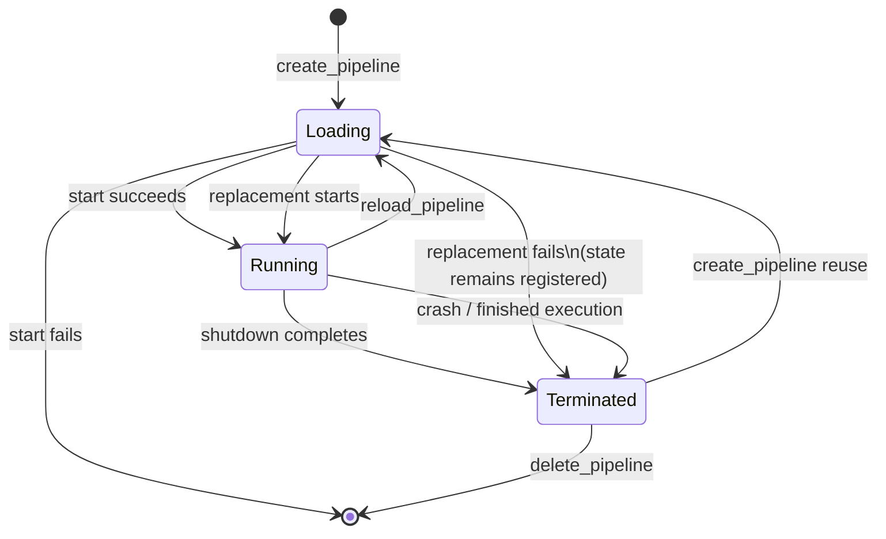
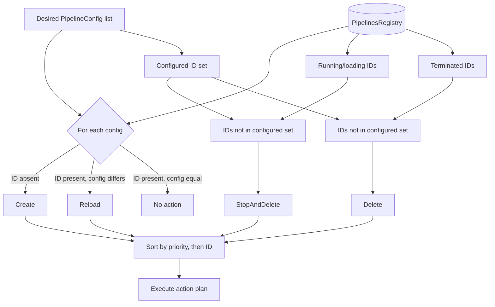
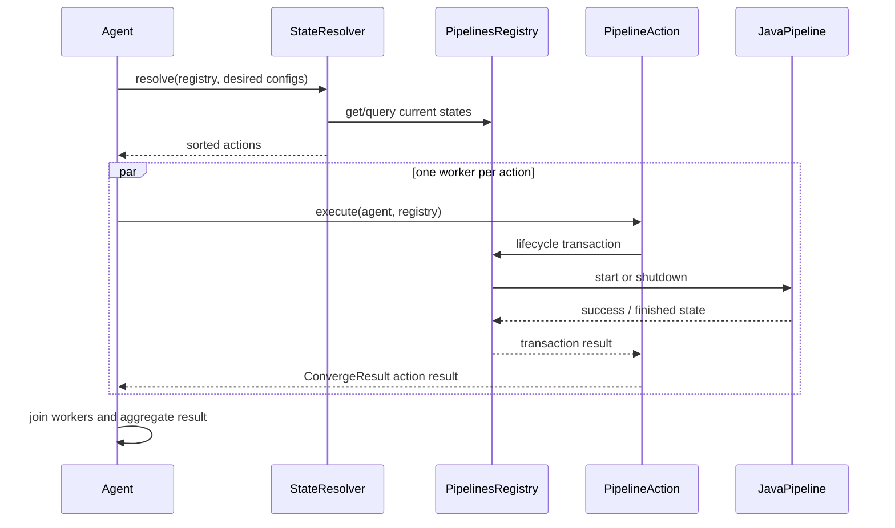

# Pipeline Lifecycle and Execution State Convergence

This module keeps the set of running Logstash pipelines aligned with the latest desired configuration. It compares configured pipeline definitions with the `PipelinesRegistry`, produces a deterministic set of lifecycle actions, and applies those actions while protecting each pipeline’s state from concurrent create, reload, stop, and delete operations.

It is the state-management portion of the broader execution subsystem. Pipeline execution, event reporting, pipeline-to-pipeline transport, persistent queues, and dead-letter queues are documented in [data_plane_execution_and_reliability.md](data_plane_execution_and_reliability.md); configuration acquisition is covered by [configuration_sources_and_loading.md](configuration_sources_and_loading.md); compilation is covered by [pipeline_language_and_compilation.md](pipeline_language_and_compilation.md).

## Position in the system

The module sits between configuration loading and concrete `JavaPipeline` execution. A source loader supplies `PipelineConfig` objects. The agent asks `StateResolver` to compare them with the registry, then executes the resulting actions. Actions construct or control pipelines, while the registry is the authoritative in-process index of lifecycle state.

```mermaid
flowchart LR
  Sources[Configuration sources\nPipelineConfig[]] --> Agent[LogStash::Agent]
  Agent --> Resolver[StateResolver\nDesired/current diff]
  Resolver --> Plan[Sorted PipelineAction[]]
  Plan --> Converge[Agent convergence\nparallel action workers]
  Converge --> Actions[Create / Reload /\nStopAndDelete / Delete]
  Actions --> Registry[PipelinesRegistry]
  Actions --> Runtime[JavaPipeline\nstart / shutdown]
  Registry --> Status[Lifecycle queries]
```

## Components and responsibilities

### `StateResolver`

`StateResolver#resolve(pipelines_registry, pipeline_configs)` is a pure planning boundary around the registry and desired configuration:

* A configured pipeline missing from the registry produces `PipelineAction::Create`.
* A configured pipeline whose `pipeline_config` differs from the registered pipeline produces `PipelineAction::Reload`.
* A running or loading pipeline absent from the desired configuration produces `PipelineAction::StopAndDelete`.
* A terminated pipeline absent from the desired configuration produces `PipelineAction::Delete`.
* A configured pipeline with an equal configuration produces no action.

Pipeline identifiers are normalized to symbols when compared. The desired identifier set is therefore also used to distinguish removed pipelines from retained ones. The resulting actions are sorted using `PipelineAction::Base#<=>`.

### `PipelineAction::Base`

The base class defines the action protocol:

* `execute(agent, pipelines_registry)` is the operation implemented by each concrete action.
* `execution_priority` looks up the class in `LogStash::PipelineAction::ORDERING`.
* Equal-priority actions are ordered by `pipeline_id`.
* `inspect`/`to_s` provide pipeline-oriented diagnostics.

The current priorities are Create (100), Reload (200), Stop (300), StopAndDelete (350), and Delete (400). `Create` gives system pipelines an inverted priority so they are started before user pipelines. Sorting establishes the action plan order; the agent subsequently starts one worker thread per action, so the plan is not a global serialization mechanism.

### `PipelineStates` and `PipelineState`

`PipelinesRegistry` stores one `PipelineState` per pipeline ID. A state contains:

* the pipeline ID;
* the current pipeline object; and
* a loading flag.

`PipelineState` uses a reentrant `Monitor` to make state predicates and pipeline replacement visible consistently. Its predicates have these meanings:

| Predicate | Meaning |
| --- | --- |
| `loading?` | A create or reload transition is in progress. |
| `running?` | Not loading and execution has not finished. |
| `terminated?` | Not loading and execution has finished, whether normally or after a crash. |
| `finished?` | Not loading and the pipeline finished normally. |
| `crashed?` | The underlying pipeline reports a crash. |

`PipelineStates` protects the state map with a mutex and provides a separate mutex per pipeline ID. Snapshot iteration duplicates the map before filtering, avoiding iteration over a mutating collection.

### `PipelinesRegistry`

The registry exposes lifecycle transactions:

* `create_pipeline` installs a loading state, runs the caller’s start block, clears loading, and removes the state if creation fails. A terminated state may be reused.
* `reload_pipeline` marks the existing state loading, runs the replacement block, installs the returned pipeline, and clears loading.
* `terminate_pipeline` serializes access and yields the current pipeline to the shutdown block.
* `delete_pipeline` removes only a terminated state.
* Query methods (`running_pipelines`, `loading_pipelines`, `loaded_pipelines`, `non_running_pipelines`, and `running_user_defined_pipelines`) expose filtered views used by planning and operational code.

Each lifecycle transaction obtains the mutex for its pipeline ID. This permits unrelated pipelines to transition concurrently while preventing two transitions for the same ID from interleaving.

## State model

The registry’s state is deliberately separate from the pipeline’s internal execution state. The `loading` flag covers the gap during construction or replacement, preventing a partially installed pipeline from being treated as running or terminated.



The reload failure path is important: the old pipeline is shut down before the new pipeline is started, and the registry replaces its pipeline reference with the new object returned by the reload block. A failed replacement can therefore leave a terminated pipeline state registered, allowing a later convergence cycle to plan a create/reload correction rather than silently losing the ID.

## Convergence data flow



The resolver intentionally treats loading pipelines as running for removal purposes (`running_pipelines(include_loading: true)`). This ensures a configuration removal cannot leave a pipeline construction operation outside the desired state.

## Action execution and interaction



The agent guards planning and convergence with a convergence lock, then joins all action workers before returning the aggregate result. Registry locks provide the finer-grained protection during action execution. Consequently, actions for different pipeline IDs can overlap, but actions targeting the same ID are serialized by that ID’s mutex.

## Lifecycle action details

| Action | Preconditions and operation | Registry effect |
| --- | --- | --- |
| `Create` | Builds a `JavaPipeline`, attaches its health indicator, and starts it. | Creates or reuses a state; failed creation removes a newly inserted state. |
| `Reload` | Requires an existing, reloadable old pipeline and reloadable new configuration; shuts down old, starts new. | Keeps the ID and replaces the pipeline reference during a loading transition. |
| `Stop` | Looks up the pipeline and invokes `shutdown`. | Leaves the terminated pipeline registered. |
| `StopAndDelete` | Shuts down, then deletes only after termination. | Removes the state and detaches its health indicator on successful deletion. |
| `Delete` | Deletes an already terminated pipeline. | Removes the state and detaches its health indicator on success. |

`Create` and `Reload` return action results reflecting pipeline start success. `Stop` returns a successful result after invoking shutdown; `StopAndDelete` and `Delete` report whether registry deletion succeeded. Exceptions are converted by the agent into failed converge results and logged with action and pipeline context.

## Failure, safety, and consistency considerations

* A duplicate create is rejected when an existing state is not terminated.
* Deletion of a running or loading pipeline is rejected; removal must pass through shutdown first.
* `set_pipeline` rejects `nil`, preventing a successful reload from publishing an invalid pipeline reference.
* The loading flag is cleared in the create/reload `ensure` paths, including start and replacement failures.
* Resolver output is based on a point-in-time view. A subsequent configuration fetch or convergence cycle is required to reconcile changes that occur after planning.
* Action results are aggregated only after all workers join, so callers receive a complete success/failure picture for the plan.

## Related modules

Follow these documents for adjacent responsibilities:

* [data_plane_execution_and_reliability.md](data_plane_execution_and_reliability.md) — runtime pipeline execution, queues, pipeline buses, and reliability storage.
* [pipeline_lifecycle_and_execution_reporting.md](pipeline_lifecycle_and_execution_reporting.md) — converge results, event dispatch, snapshots, and shutdown observation.
* [configuration_sources_and_loading.md](configuration_sources_and_loading.md) — loading and representing desired pipeline configurations.
* [pipeline_ir_and_compilation.md](pipeline_ir_and_compilation.md) — compiling pipeline configuration into executable IR.
* [observability_and_operational_control.md](observability_and_operational_control.md) — health, metrics, logging, and HTTP operational views.

## Extension points

The action strategy is intentionally replaceable. New lifecycle operations can implement `PipelineAction::Base`, add an entry to `ORDERING`, and participate in the same `execute(agent, registry)` protocol. A new state source can provide `PipelineConfig` objects to the resolver without changing registry mechanics. Any extension must preserve the per-pipeline locking rules and ensure that loading is cleared on every path.
