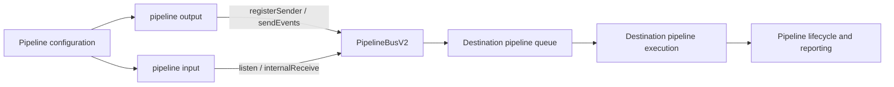
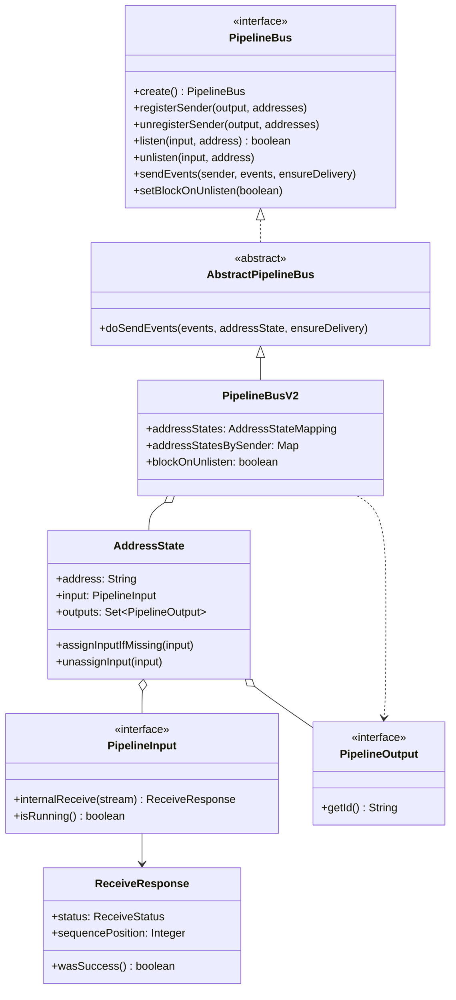
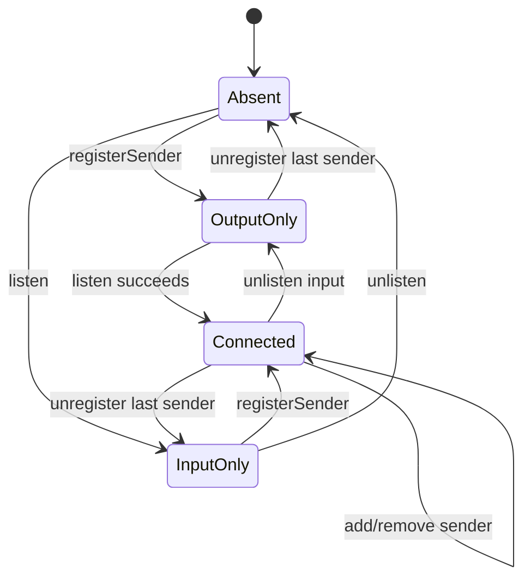
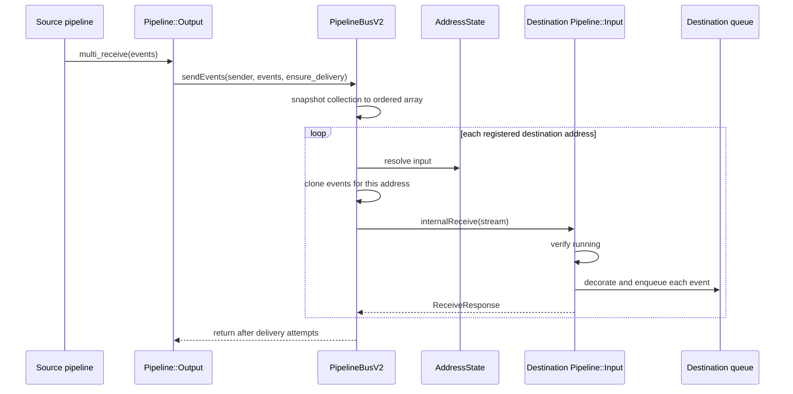
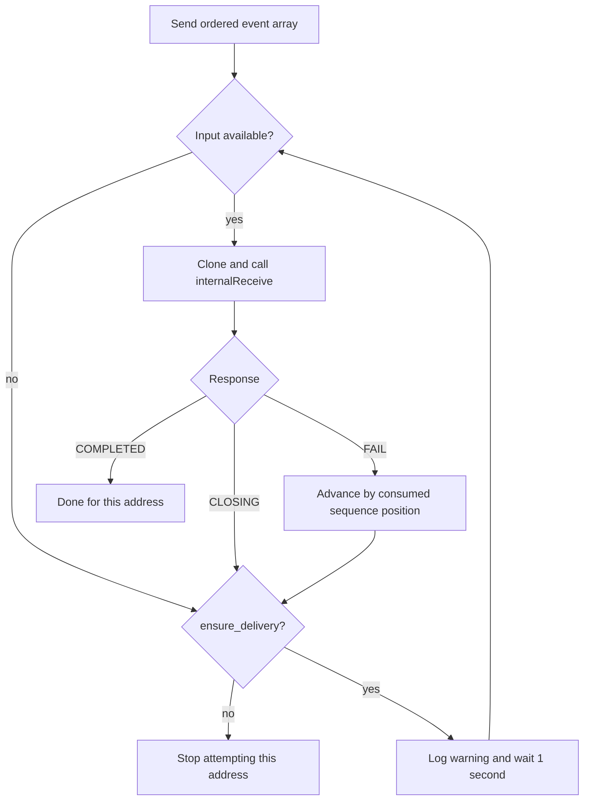
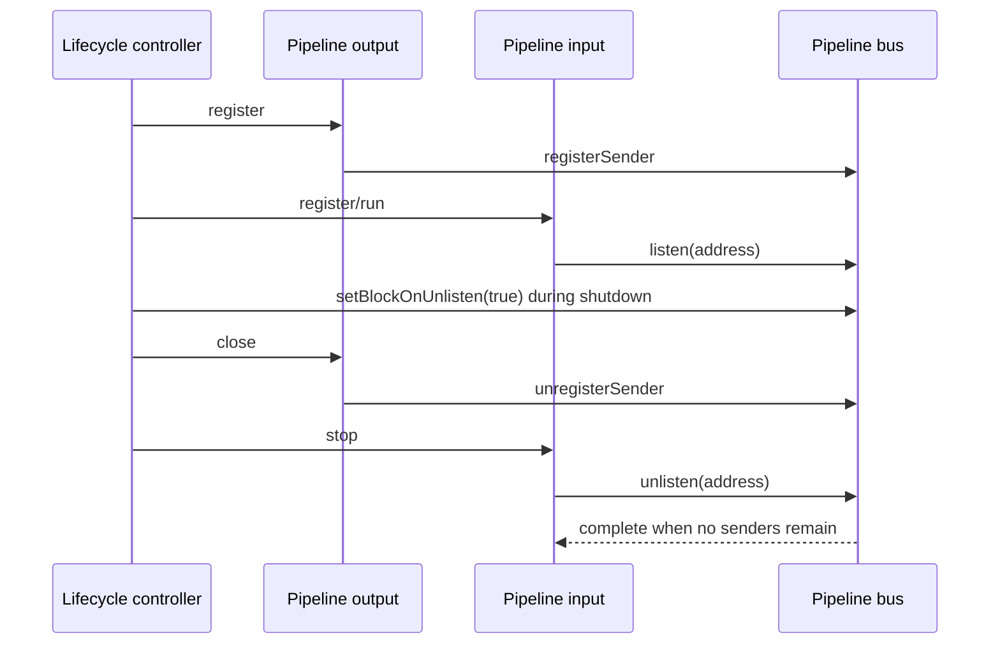
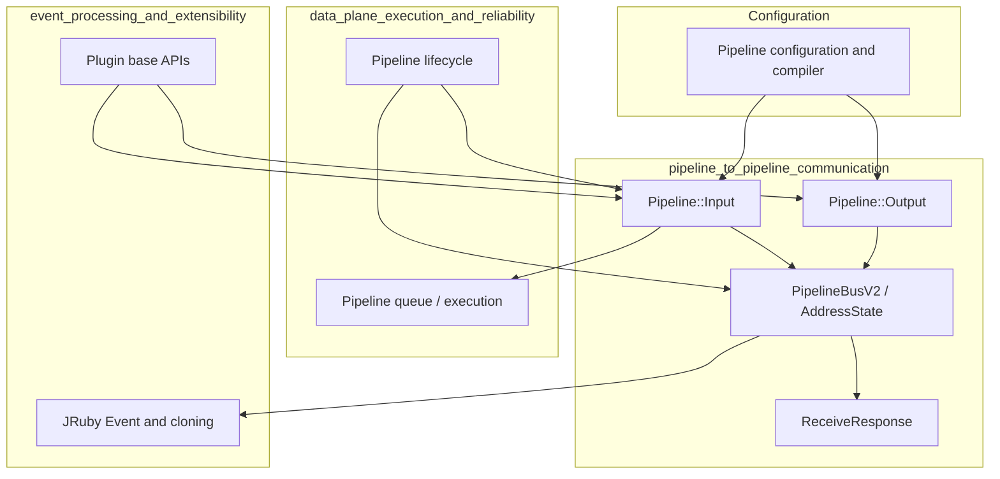

# Pipeline-to-pipeline communication

Pipeline-to-pipeline communication is Logstash's in-process transport between one pipeline's `pipeline` output and another pipeline's `pipeline` input. The Ruby plugins provide the configuration and queue boundary; the Java pipeline bus maintains address registrations, routes events, and coordinates delivery during shutdown.

This module is part of [data plane execution and reliability](data_plane_execution_and_reliability.md). It consumes the event model described in [event processing and extensibility](event_processing_and_extensibility.md), while pipeline instances and their plugins are assembled by the [pipeline language and compilation](pipeline_language_and_compilation.md) and [runtime foundation and configuration](runtime_foundation_and_configuration.md) modules.

## Scope and role in Logstash

The transport is deliberately local to a Logstash process. It does not open a socket, serialize events, or provide cross-process communication. A configured address is a logical rendezvous point shared by pipeline plugins through the execution context's `pipeline_bus`.



For external Logstash instances, use the separate network-oriented [Logstash-to-Logstash communication documentation](https://www.elastic.co/guide/en/logstash/current/ls-to-ls.html), not this module.

## Architecture

### Main components

| Component | Responsibility |
| --- | --- |
| `Pipeline::Output` | Declares `send_to`, registers itself for each address, and forwards event batches. |
| `Pipeline::Input` | Declares one `address`, claims it, decorates received events, and appends them to its pipeline queue. |
| `PipelineBus` | Stable API for registration, sending, listening, unlistening, and shutdown mode. `create` returns `PipelineBusV2`. |
| `PipelineBusV2` | Thread-safe implementation; caches sender-to-address views and owns the address-state mapping. |
| `AddressState` | Mutable state for one address: one input listener plus a concurrent set of outputs. |
| `AbstractPipelineBus` | Shared send/retry algorithm, including event cloning and partial-batch recovery. |
| `PipelineInput` / `PipelineOutput` | Java contracts used by the Ruby plugins at the bus boundary. |
| `ReceiveResponse` | Reports `COMPLETED`, `CLOSING`, or `FAIL`, with the failed sequence position and cause when applicable. |



### Address state and registration

`AddressStateMapping` is the canonical `String -> AddressState` map. It uses `ConcurrentHashMap.compute` to make each address mutation atomic. Empty states are removed immediately, preventing stale registrations from accumulating.

Each sender also has a cached set of read-only address views. This lets `sendEvents` resolve its destinations without scanning every address. The views expose state for routing but do not permit callers to mutate the mapping.

An address has these invariants:

* At most one input can listen at a time. A second, different input causes `listen` to return `false`.
* Any number of outputs can register for the same address.
* Sender registration and listener registration can occur in either order.
* The address remains present while it has an input or at least one output, and is pruned when both are absent.
* The output's configured address list is treated as a set for state registration, even if the iterable contains duplicates.



## Event data flow

The output calls `multi_receive`; the bus snapshots the collection into an array to guarantee stable ordering across retries. For every destination address, `AbstractPipelineBus` creates a fresh stream of `rubyClone` events. The destination input decorates each event and appends it to its queue.



The same source event is therefore not shared mutably between destination pipelines. A destination failure does not cause already-completed events in that destination to be replayed when the input reports a sequence position; the next attempt skips the successfully consumed prefix.

## Delivery and failure semantics

`ensure_delivery` defaults to `true` in the Ruby output plugin.

* With `ensure_delivery: true`, an unavailable input, a `CLOSING` response, or a failed receive causes an indefinite retry with a one-second delay.
* With `ensure_delivery: false`, the bus makes one attempt per address and returns after that attempt; it does not retry a failed or unavailable destination.
* When the input fails after consuming part of the stream, `ReceiveResponse.failedAt(position, cause)` identifies the number of events already accepted. The retry starts at the cumulative failed position.
* If the input is stopping before it consumes the stream, it returns `CLOSING` and no sequence position is available; the retry repeats the full batch when delivery is required.
* An empty event collection is a no-op.
* Sending from an output that is not registered raises `IllegalStateException`.



The input runs a lightweight wait loop because the bus invokes `internalReceive` directly; queueing is the handoff that lets normal pipeline execution consume the events. Queue interruption, queue runtime errors, and I/O errors are converted into failed receive responses and logged at debug level by the input.

## Lifecycle and shutdown

### Input lifecycle

1. `register` creates an atomic running flag, obtains the shared bus, and calls `listen(self, address)`.
2. A duplicate address claim raises a configuration error, enforcing global address uniqueness within the process.
3. `run` stores the pipeline queue, marks the input running, and waits until stopped.
4. `stop` first calls `unlisten`, then clears the running flag. The ordering allows already-in-flight upstream sends to reach the input before it rejects new work.

### Output lifecycle

1. `register` obtains the bus, records `send_to` in metrics, and registers the output for all configured addresses.
2. `multi_receive` delegates the complete batch and delivery policy to the bus.
3. `close` unregisters the sender from its addresses.

During normal operation `unlisten` is non-blocking. At shutdown, lifecycle coordination can call `setBlockOnUnlisten(true)`. In that mode the input waits until no outputs remain attached to the address, allowing a senders-first shutdown order. Address mutations notify the current input so a blocked unlisten can resume promptly.



## Concurrency and consistency

The bus contract requires all operations to be thread-safe. `PipelineBusV2` uses concurrent maps, concurrent output sets, a volatile shutdown flag, and synchronized input assignment/removal. The input reference is volatile so senders see listener changes promptly.

The sender-to-address cache is updated when a sender registers or unregisters. A send operation uses the cached read-only destination set and a stable event array; each destination is processed independently in iteration order. This provides deterministic retry boundaries without imposing a global lock across pipelines.

One operational consequence is important: `ensure_delivery` can block the output worker indefinitely while a destination remains unavailable. This is intentional delivery/back-pressure behavior and should be considered when designing pipeline dependency graphs.

## Dependencies and boundaries



This module owns routing and handoff semantics. It does not own pipeline configuration parsing, compilation, queue implementation, event internals, or lifecycle convergence; those concerns are documented in the linked modules.

## Configuration surface

The built-in plugins expose the following settings:

```text
input {
  pipeline {
    address => "normalized-events"
  }
}

output {
  pipeline {
    send_to => ["normalized-events"]
    ensure_delivery => true
  }
}
```

`address` is required and singular on the input. `send_to` is required and list-valued on the output. Multiple outputs may target one input, and one output may fan out to multiple input addresses. Refer to the repository's [multiple pipeline configuration reference](https://www.elastic.co/guide/en/logstash/current/multiple-pipelines.html) for deployment-level pipeline definitions.

## Testing and maintenance notes

`PipelineBusTest` exercises the `PipelineBus.Testable` hooks and verifies registration, pruning, multiple senders, duplicate listener protection, delivery, and partial failure retry. When changing this module, preserve tests for:

* one-listener address exclusivity;
* sender registration before and after listener registration;
* address pruning only after both sides detach;
* cloning and stable order across retries;
* non-blocking versus blocking unlisten;
* queue failures that report a consumed sequence position.

The `Testable` interface intentionally exposes read-only address state and shutdown mode only for tests; it is not part of the public application API.

