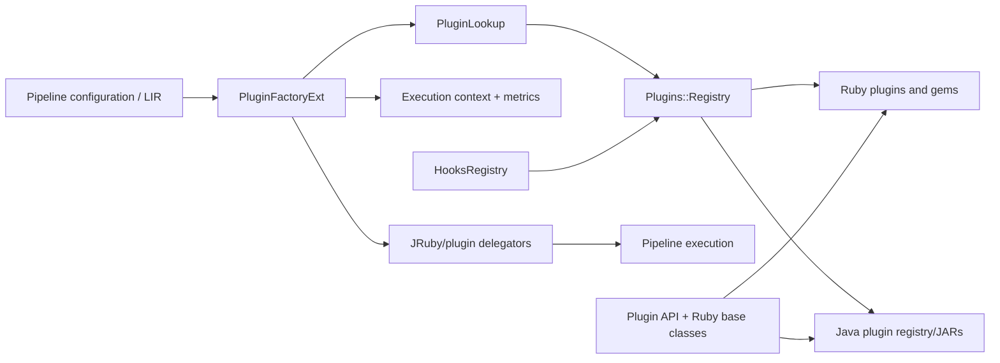
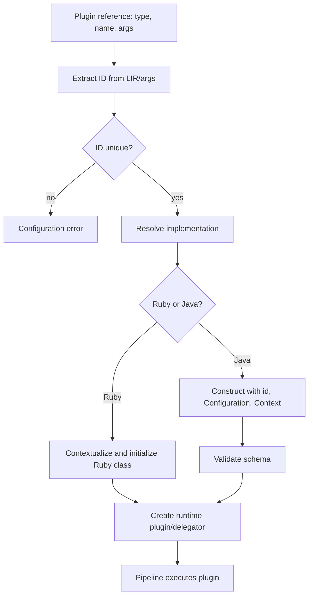

# Plugin API and Registry

The `plugin_api_and_registry` module is Logstash’s extensibility boundary. It defines contracts and lifecycle for Ruby and Java inputs, filters, outputs, and codecs; discovers installed implementations; validates configuration; and creates runtime wrappers used by the pipeline compiler.

## Architecture overview

The module is bilingual: Ruby is the compatibility and plugin-loading surface, while Java plugins use typed schemas and Java-native execution. JRuby delegators make both implementations available to compiled pipelines.

## Sub-modules

- [Plugin contracts and base classes](plugin_api_and_registry_plugin_contracts_and_base_classes.md) — shared Java API, Ruby lifecycle classes, configuration, codecs, event factories, metrics, and execution context.
- [Plugin registry and discovery](plugin_api_and_registry_plugin_registry.md) — gem/JAR discovery, hooks, aliases, legacy lazy loading, concurrent state, and universal plugins.
- [Java plugin factory and bridge](plugin_api_and_registry_java_plugin_factory.md) — language resolution, ID generation, validation, context injection, Java construction, and delegators.

## End-to-end behavior

## System relationships

The factory consumes pipeline IR and supplies plugin instances to compiled execution; see [pipeline_ir_and_compilation_jruby_plugin_bridge.md](pipeline_ir_and_compilation_jruby_plugin_bridge.md). Plugins operate on the event model documented in [event_model_and_jruby_interop.md](event_model_and_jruby_interop.md). Their metrics and lifecycle reporting connect to the wider observability subsystem; plugin installation and packaging belong to the plugin-manager module.

## Design considerations

- Plugin IDs scope metrics and prevent ambiguous pipeline construction.
- Concurrent registry structures support lookups from multiple pipelines.
- Java configuration is schema-driven; Ruby configuration remains compatible with `config` declarations.
- Type-specific bases preserve input stop signaling, filter decoration, output concurrency, and codec batch encoding.
- Hooks and universal plugins register behavior and settings without being ordinary event processors.
