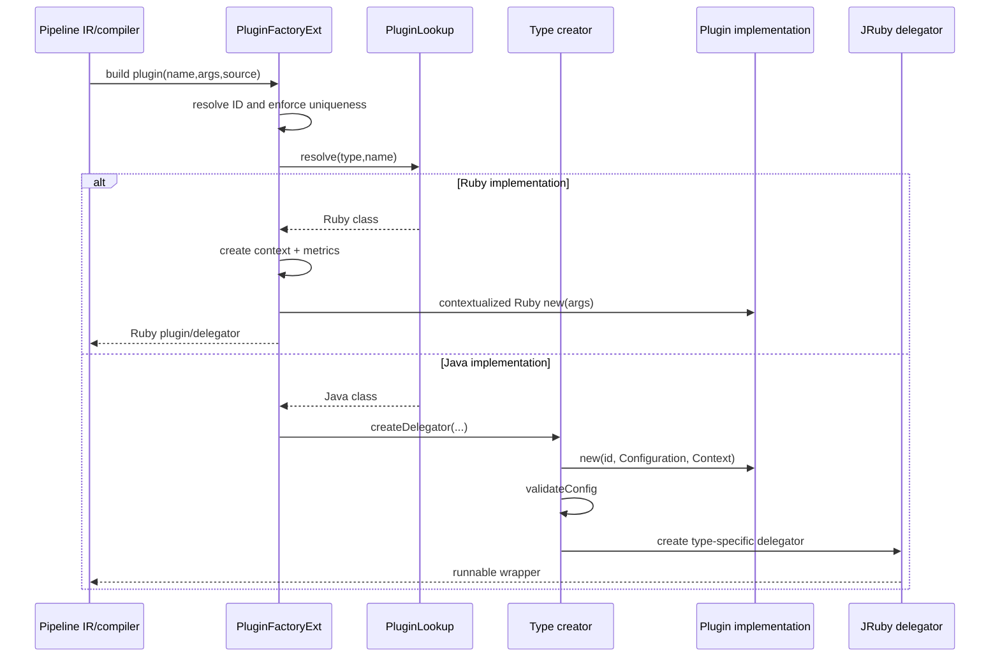

# Java Plugin Factory and Ruby/JRuby Bridge

The Java factory turns a parsed plugin reference into a runnable Ruby or Java plugin instance. It resolves the implementation, assigns a unique ID, creates execution and metric context, validates Java configuration, and wraps Java implementations in delegators understood by the JRuby pipeline.

## Main components

| Component | Responsibility |
| --- | --- |
| `PluginLookup` | Resolves Java classes first, then Ruby registry classes; reports implementation language and plugin type. |
| `PluginFactoryExt` | Orchestrates IDs, lookup, metrics, execution context, Ruby construction, and Java creator dispatch. |
| `AbstractPluginCreator` | Invokes the Java constructor `(String, Configuration, Context)` and validates configuration. |
| Type creators | Build input, filter, output, and codec-specific delegators. |
| `ContextualizerExt` | Injects execution context before Ruby initialization. |
| `PluginUtil` | Rejects unknown settings and missing required schema entries. |

## Construction flow

The factory extracts an explicit ID from LIR source metadata or plugin arguments. If absent, it generates a UUID; codecs may generate an ID when no source is available. IDs are expanded using configuration variables and rejected if duplicated in the current factory.

For Ruby plugins, the factory creates an execution context, injects it through `ContextualizerExt`, and constructs the appropriate Ruby delegator. For Java plugins, arguments are converted to Java values, the type-specific creator constructs the Java object, and a delegator is returned.

## Plugin type mapping

`PluginLookup.PluginType` defines INPUT, FILTER, OUTPUT, and CODEC, including Ruby namespaces, metric namespaces, and Java API interfaces. The creators attach type-specific behavior: pipeline-aware input/output wrappers, filter metrics and IDs, and a Ruby-consumable Java codec wrapper.

## Context and configuration safety

`ContextualizerExt` synchronizes module prepending, stores execution context on the plugin, and invokes Ruby `new` so existing test doubles remain compatible. Java constructors must have the exact three-argument signature. Configuration validation occurs after construction, so the plugin schema is authoritative.

## Related documentation

- [pipeline_ir_and_compilation_jruby_plugin_bridge.md](pipeline_ir_and_compilation_jruby_plugin_bridge.md) — compiler-side delegators and runtime integration.
- [pipeline_ir_and_compilation.md](pipeline_ir_and_compilation.md) — overall pipeline compilation.
- [plugin_api_and_registry_plugin_contracts_and_base_classes.md](plugin_api_and_registry_plugin_contracts_and_base_classes.md) — lifecycle contracts.
