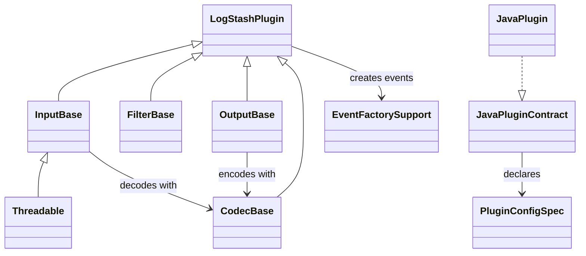

# Plugin API, Contracts, and Base Classes

This sub-module defines the contracts shared by Logstash plugins and the Ruby base classes that implement the lifecycle expected by the pipeline runtime. It supports both Java plugins, through `co.elastic.logstash.api.Plugin`, and Ruby plugins, through `LogStash::Plugin` and its input, filter, output, and codec subclasses.

## Responsibilities

| Component | Responsibility |
| --- | --- |
| `Plugin` | Java plugin identity (`getName`, `getId`) and declarative configuration schema (`configSchema`). |
| `PluginHelper` | Reusable configuration specifications and merge helpers for common input, filter, and output settings. |
| `LogStash::Plugin` | Ruby plugin parameters, generated IDs, metrics, metadata, logging, execution context, and shutdown hook. |
| Input/Filter/Output bases | Type-specific lifecycle and event-processing APIs. |
| Codec base | Decode/encode APIs, synchronous batch encoding, callbacks, cloning, and flushing. |
| `Threadable` | Opt-in input parallelism through a configured thread count. |
| `BasicEventFactory` | Creates `LogStash::Event` instances; targeted factories place payloads under a configured field. |

## Plugin contract

Java plugins expose a schema before construction is accepted. Each plugin must provide a stable ID; codecs generally generate their own UUID while inputs, filters, and outputs receive the configured ID. The plugin name comes from `@LogstashPlugin` when present, otherwise from the Java class name.

`PluginUtil` validates the schema at construction time: unknown keys and missing required keys become configuration errors.

## Ruby lifecycle

`LogStash::Plugin#initialize` deep-clones parameters, ensures an ID exists, and initializes logging. Subclasses call `config_init`, then expose their operational hooks:

- Inputs implement `register`, run externally, and may override `stop`; `do_stop` makes `stop?` observable.
- Filters implement `register` and `filter`; `multi_filter` skips cancelled events and collects newly emitted events.
- Outputs implement `register` and `receive`; `multi_receive` either uses encoded batches or calls `receive` per event.
- Codecs implement `decode` and either `encode_sync`/`multi_encode` or the callback-based `encode` path.

## Component relationships

IDs scope per-plugin metrics and must be unique within a pipeline. Inputs and outputs propagate metric namespace and execution context to their codec. Filters decorate matching events and measure slow processing. Metric collection may be disabled per plugin, selecting a null metric implementation.

## Related documentation

- [event_model_and_jruby_interop.md](event_model_and_jruby_interop.md) — event representation and Java/Ruby conversion.

Metrics and execution reporting are consumed by the wider observability subsystem.
