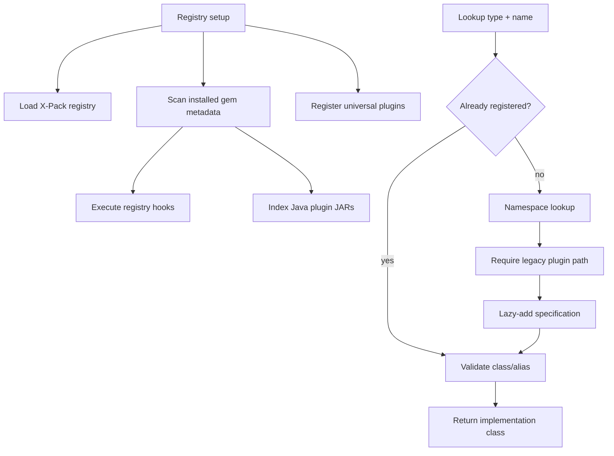

# Plugin Registry and Discovery

The registry maps a Logstash plugin type and name to an implementation class. It bridges installed Ruby gems, Java plugin JARs, built-ins, X-Pack registrations, aliases, and pipeline lookup requests.

## Registry state

`LogStash::Plugins::Registry` maintains concurrent plugin specifications and Java-plugin paths, a `HooksRegistry` for universal-plugin emitters and callbacks, and an alias registry for compatibility names. `PluginSpecification` stores type, name, and class. `UniversalPluginSpecification` additionally instantiates a universal plugin and invokes its hook/settings registration during setup.

## Startup and lazy discovery

`setup!` loads X-Pack when applicable, built-ins and installed plugin gems, then universal plugins. Gem metadata under `logstash_plugin` identifies Logstash plugins. A plugin may provide `logstash_registry.rb`; that hook registers it. Legacy plugins remain lazy: lookup checks the map, searches the expected namespace, and requires `logstash/<type>s/<name>` if needed.

Java metadata must contain exactly one appropriately named JAR. Depending on `pipeline.plugin_classloaders`, the registry stores the Java class directly or loads it with a dedicated `PluginClassLoader`.

Ruby classes must inherit from `LogStash::Plugin`, expose `config_name`, and match the requested name. Java classes are matched through the Java plugin registry. Aliases are resolved and the resulting class is cached. `lookup_pipeline_plugin` translates lookup failures into `PluginLoadingError`.

## Hooks registry

`HooksRegistryExt` is a JRuby-facing concurrent store. Emitters map to dispatchers; hooks map to callback lists. Registering either side synchronizes existing callbacks by invoking `add_listener` on the dispatcher. Copy-on-write callback lists permit registration while pipelines are active.

## Related documentation

- [plugin_api_and_registry_java_plugin_factory.md](plugin_api_and_registry_java_plugin_factory.md) — class resolution, construction, validation, and delegators.

Plugin installation and packaging are outside this module’s runtime registry boundary and belong to the plugin-manager area of the wider system.
